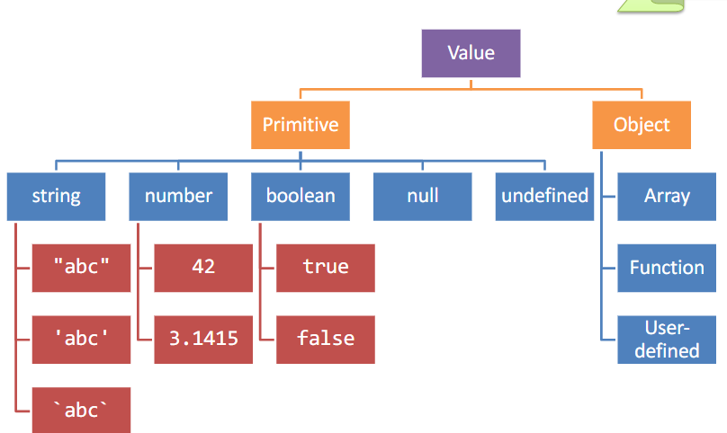
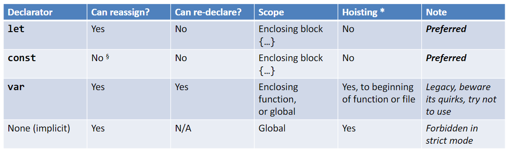
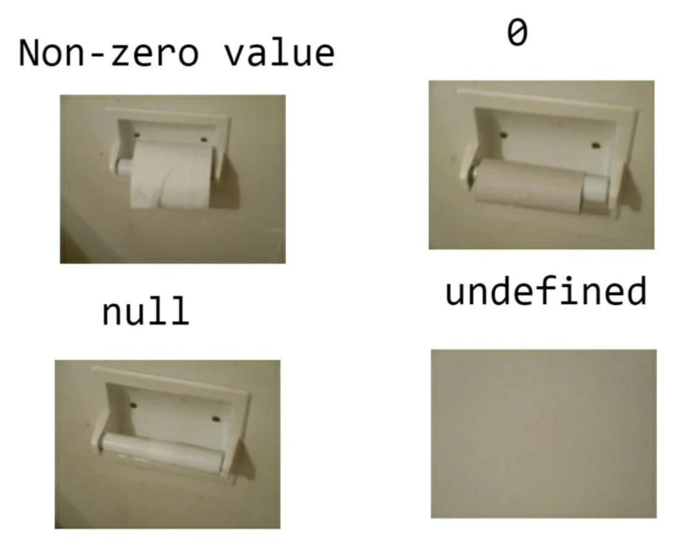
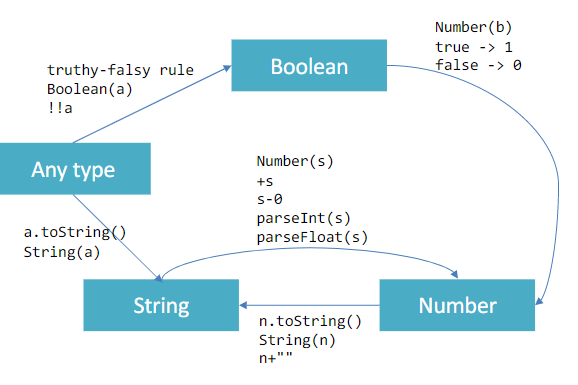

# Javascript

Javascript è un linguaggio di programmazione utilizzato ampiamente in ambito web. Nasce nel 1995 e la sua versione standardizzata prende il nome di **ECMAscript**. Il nome è stata una semplice scelta di marketing, in quanto era molto in voga l'utilizzo di java, anche se non vi ha niente a che vedere.

I principali engine di javascript sono:

- _V8 (Chrome V8)_ di Google, used in Chrome/Chromium, Node.js and Microsoft Edge
- _SpiderMonkey_ di Mozilla Foundation, Used in Firefox/Gecko
- _ChakraCore_ di Microsoft, it was used in Edge
- _JavaScriptCore_ di Apple, used in Safari

Il linguaggio è retrocompatibile: ogni volta che qualcosa viene definitivo come valido JS, questo non subirà cambi futuri che ne causeranno la rottura. Non è però _forwards-compatibile_, in quanto nuove aggiunte al linguaggio non funzioneranno con versioni passate del linguaggio.

Transpiling consente di convertire le nuove versioni di JS in versioni più vecchie, in modo da poter essere utilizzate in browser più vecchi.

Polyfilling consiste nel definire funzioni e metodi che riempono l'assenza di feature implementate nelle versioni più recenti.

## Struttura lessicale

Un file è un programma javascript, ciascuno dei quali viene caricato indipendentemente e comunicano tra loro attraverso uno stato globale, per tale motivo si è pensato di risolvere parzialmente mediante l'introduzione di moduli.

Javascript non è un linguaggio compilato, per tale motivo è necessario eseguire il parsing per poi eseguire dall'alto verso il basso.

E' presente una libreria standard con a disposizione delle API addizionali.

I codici javascript sono scritti in unicode e supportano caratteri non latini per nomi e stringhe.

Il linguaggio è case-sensitive, i commenti sono scritti mediante `//` o `/* */`.

i `;` non sono necessari e vengono aggiunte dal linguaggio a seconda delle necessità, per tale motivo è necessario fare  attenzione per non generare comportamenti scorretti.

E' buona prassi utilizzare la **strict mode**, introdotta in _ES5_, che consente di risolvere alcune funzionalità pericolose del linguaggio. Per abilitarla è sufficiente inserire all'inizio del file:

```js
"use strict";
```

## Variabili

In javascript le variabili non sono tipizzate, per tale motivo non vi è associato alcun tipo, che invece è sempre associato ai valori.

{width=350px}

A differenza di altri linguaggi, javascript consente l'utilizzo di variabili non definite che prendono il valore `undefined`.

Queste sono dei pure riferimenti a dei valori. La stessa variabile potrebbe far riferimento a valori differenti e di tipologia differente.

La dichiarazione può avvenire attraverso tre parole chiave:

- `let`, modalità standard con la visibilità di blocco
- `const`, valore costante
- `var`, modalità deprecata con la visibilità di funzione

Hoisting = “lifting up” la definizione di (non l'inizializzazione!) al top dello scope corrente (ad esempio file o funzione)

:::caution
Non è mai consigliato utilizzare `var` per la creazione delle variabili.
:::

{width=350px}

### boolean

I valori booleani sono `true` e `false`. alcuni possono essere convertiti e sono:

- come `false`: `0`, `-0`, `NaN`, `null`, `undefined`, `""`
- come `true`: `non-zero-value`, `"false"`, `[]`, `{}`

La comparazione viene eseguita mediante due operatori:

- `==` che effettua una comparazione non-strict, ovvero converte i tipi prima di effettuare la comparazione.
- `===` che effettua una comparazione strict, ovvero **non converte** i tipi prima di effettuare la comparazione.

### number

I numeri non vengono distinti tra interi e decimali, ma vengono gestiti come unico tipo di dato numerico. La conversione viene adoperata automaticamente a seconda delle necessità.

### Valori speciali

Alcuni valori speciali presenti sono:

- `null` che indica un valore vuoto
- `undefined`
- `NaN`, not a number.

{wdith=350px}

### Comparazioni

Gli oggetti non possono essere direttamente confrontati, mentre con le stringhe è consentito in quanto sono considerate un tipo primitivo.

### Conversione automatica

JS tries to apply type conversions 
between primitive types, before 
applying operators
•Some language constructs may 
be used to “force” the desired 
conversions
•Using == applies conversions
•Using === prevents conversion

{width=350px}

## Oggetti
<!-- lezione 2 - 2023/03/02 -->

La prima grande differenza rispetto ad altri linguaggi risiede nella mancanza delle classi in senso proprio, in quanto un oggetto  può esistere **senza fare alcun riferimento** ad una classe.

Gli oggetti sono di natura dinamica e possono aggiungere, eliminare e ridefinire proprietà e metodi in qualsiasi momento. Questi sono sempre di tipo `public` in quanto non esiste alcun modo per definire la visibilità.

Un esempio di oggetto è il seguente:

```js
let point = { x: 2, y: 5 };
let book = {
	author : "Enrico",
	title : "Learning JS",
	for: "students",
	pages: 520,
};
```

:::definition
Un oggetto è una collezione non ordinata di valori, a cui viene associato un nome denominato **chiave** a ciascun valore che viene contenuto.
:::

:::note
In javascript, per come questo funziona, non ci sono in realtà reali distinzioni tra proprietà e metodi, in quanto entrambi sono dei valori associati ad una chiave.
:::

### Proprietà

Le proprietà sono identificate da stringhe uniche per ciascun attributo dell'oggetto. Vengono create quando questo viene inizializzato e possono essere aggiunte mediante assegnamento o rimosse (`delete`) successivamente.

I valori possono essere di qualsiasi tipo (senza necessità di essere specificato) e vengono salvati all'interno dell'oggetto. Possono essere di tipo primitivo oppure array, altri oggetti ecc...

:::caution
Nel caso in cui si inserisca come proprietà un altro oggetto, non si sta creando una copia dell'oggetto, ma si sta creando un riferimento all'oggetto stesso.
:::

Per accedere alle proprietà è sufficiente utilizzare `[]` oppure l'operatore `.` specificando la stringa chiave secondo la sintassi `{[prop]:value}`, come mostrato di seguito:

```js
person["telephone"] = "123456789";
person.telephone = "987654321";
```

Quando una proprietà non è presente al momento dell'assegnamento, questa viene creata.

:::tip
Le `[]` possono contenere espressione di natura più complessa come risultati di somme, concatenazioni, ecc...
:::

:::tip
Scrivere `book["title"]` è equivalente a `book.title`.
:::

#### Access Errors

Se si prova ad accedere ad una proprietà che non è definita ritornerà `undefined` e non verrà sollevata alcuna eccezione.

```js
let surname = undefined;

if (book){ 
	if (book.author){ 
		surname = book.author.surname; 
	}
}
```

Un pattern comune per la valutazione degli attributi prevede:

```js
surname = book && book.author && book.author.surname;
```

:::caution
`Undefined` è _falsy_, dunque possiamo utilizzarlo come ramo di falso.
:::

#### Iterare  sulle proprietà

Per iterare sulle proprietà di un oggetto è possibile utilizzare `for..in`:

```js
for( let a in {x: 0, y:3}) {
	console.log(a);
}
```

stampa a schermo:

```text
x
y
```

mentre nel caso di un oggetto:

```js
let book = {
	author : "Enrico",
	pages: 340,
	chapterPages: [90,50,60,140],
};

for (const prop in book)
	console.log(`${prop} = ${book[prop]}`);
```

stampa a schermo:

```text
author = Enrico
pages = 340
chapterPages = 90,50,60,140
```

:::note
E' stato utilizzato const invece di let in quanto la variabile non viene riutilizzata ma rigenerata ogni volta, per cui dichiararla costante serve solo a evitare errori marginali.
:::

Tutte le proprietà di un oggetto possono essere recuperate sotto forma di array utilizzando `Object.keys()`:

```js
let keys = Object.keys(book);
```

### Copiare oggetti

Per copiare un oggetto è possibile utilizzare la funzione `Object.assign(target, source)`:

```js
let book = {
	author : "Enrico",
	pages: 340,
	chapterPages: [90,50,60,140],
};

let book2 = Object.assign({}, book);
```

:::caution
Se venisse utilizzato  `let book2 = book;` si avrebbe una copia del riferimento, quindi se modifico `book2` modifico anche `book`.
:::

E' possibile utilizzare l'operatore spread `...` per copiare un oggetto:

```js
let book2 = {...book};
```

### Verificare la presenza di una proprietà

Per controllare se una proprietà è presente all'interno di un oggetto è possibile utilizzare `in`:

```js
let book = {
	author : "Enrico",
	pages: 340,
	chapterPages: [90,50,60,140],
};

console.log("author" in book); // true
console.log("title" in book); // false
```

### Creazione degli oggetti

Gli oggetti possono essere creati in diversi modi:

By object literal:  const point = {x:2, y:5} ;
-By object literal (empty object): const point = {} ;
-By constructor:  const point = new Object() ;
-By object static method create:
const point = Object.create({x:2,y:5}) ;
-Using a constructor function
Applicazioni Web I - Web Applications I - 2022/2023
Preferred

### Funzioni

Le funzioni sono uno degli elementi chiavi di JS. Permettono di delimitare un blocco di codice con una visibilità privata ed accettano parametri e ritornano un solo valore (che può essere un oggetto).

Le funzioni sono esse stesse degli oggetti e possono essere assegnate a delle variabili o passate come argomento o valore di ritorno.

Possono essere dichiarate in 3 modi differenti:

```js
function fun(){
	//code
}
```

```js
function fun(a,b,c){
	//code
}
```

```js
const fun = function(a,b,c){
	//code
}
```

```js
const fun = (a,b,c) => {
	//code
}
```

I parametri sono specificati con la lista di nomi separati da virgola. I parametri possono essere di qualsiasi tipo, anche se non è necessario specificare il tipo.

E' possibile avere un numero variabile di parametri:

```js
function fun(...args){
	//code
}
```

:::caution
In questo caso si parla di operatore **rest** e non di _spread_.
:::

#### Valore di ritorno

Una funzione può ritornare un valore utilizzando l'istruzione `return`:

```js
function fun(a,b,c){
	return a+b+c;
}
```

E' molto importante sottolineare come le arrow function abbiamno un valore di ritorno implicito e non è necessario utilizzare `return`:

```js
const fun = () => { return ['hello', 5] ; }
const [ str, num ] = fun() ;
console.log(str) ;
```

#### Funzioni annidate

Le funzioni possono essere aggiunte in modo annidato (ovvero una dentro un'altra):

```js
function fun(a,b,c){
	function fun2(a,b,c){
		//code
	}
	//code
}
```

Anche se spesso è preferibile utilizzare una arrow function per evitare la confusione del codice:

```js
function fun(a,b){

	const square = (x) => x*x;

}
```

#### Closure

Con closure si fa riferimento a un nome dato a una feature di JS che permette di accedere alle variabili definite all'interno di una funzione anche se questa è terminata.

```js
function fun(a,b){
	let c = a+b;
	return function(){
		return c;
	}
}

let f = fun(2,3); // ritorno la funzione interna
console.log(f()); // 5
```

#### Invocazione immediata

E' possibile invocare immediatamente una funzione appena stata definita:

```js
(function fun(a,b){
	console.log(a+b);
})(2,3);
```

:::tip
Il vantaggio consiste nel poter nascondere le variabili all'interno della funzione.
:::

#### Costruttore

Permette di definire un tipo di oggetto, inizia sempre con una lettera maiuscola e viene utilizzato con `new`:

```js

// non si trova all'interno di una  classe in quanto le classi non esistono!
function Car(make, model, year) {
	this.make = make;
	this.model = model;
	this.year = year;
	this.isNew = ()=>(year>2000);
}

let mycar = new Car('Eagle', 'Talon TSi', 1993);
```


## Date

Le date sono oggetti che rappresentano un istante nel tempo. Per creare una data si utilizza il costruttore `Date()`:

```js
let d = new Date();
```

:::tip
Viene suggerito l'utilizzo di Day.js per gestire le date.
:::

## Callbacks

Con callback facciamo riferimento a funzioni che vengono passate in altre come argomento, le quali verranno invocate da quest'ultime.

```js
function fun(a,b, callback){
	callback(a+b);
}
```

Le callback possono essere sincrone o asincrone in base al loro comportamento; una funzione asincrona è una funzione che viene eseguita contemporaneamente al codice, non fermandolo fino a quando non termina.

Un esempio di callback sincrona è la funzione filter, la quale permette di filtrare il codice in base a un criterio:

```js
const market = [
	{ name: 'GOOG', var: -3.2 },
	{ name: 'AMZN', var:  2.2 },
	{ name: 'MSFT', var: -1.8 }
];

const bad = market.filter(stock => stock.var < 0);
// [ { name: 'GOOG', var: -3.2 }, { name: 'MSFT', var: -1.8 } ]

const good = market.filter(stock => stock.var > 0);
// [ { name: 'AMZN', var: 2.2 } ]
```

## Programmazione Funzionale

La programmazione funzionale è un paradigma di programmazione che si basa sul concetto di funzione matematica. In questo paradigma le funzioni sono considerate come valori e possono essere passate come argomento o ritornate come valore.

:::tip
Non è il paradigma di programmazione più usato in JS, ma è molto utile per la programmazione asincrona.
:::

Lo stile è maggiormente di tipo dichiarativo piuttosto che imperativo e permette di aggiungere leggibilità al codice.

```js
// strategia funzionale
new_array = array.filter ( filter_function ) ;
```

```js
//strategia imperativa
new_array = [] ;
for (const el in list)
	if ( filter_function(el) )
		new_array.push(el) ;
```

Alcune features che sono consentite grazie alla programmazione funzionale sono:

- le funzione sono "cittadini di prima classe", nel senso che è possibile combinarle facilmente
- sono disponibili funzioni di ordine superiore, ovvero funzioni che accettano altre funzioni come argomento
- è possibile combinare facilmente le funzioni
- call chaining, ovvero è possibile concatenare la chiamate e il ritorno delle funzioni

### Iterazione sugli array

Le funzioni di ordine superiore sono molto utili per iterare sugli array, in particolare le funzioni `map`, `filter` e `reduce`.

#### forEach

Il `forEach` è una funzione che permette di iterare sugli elementi di un array, ma non ritorna un nuovo array:

```js
const letters = [..."Hello world"] ;
let uppercase = "" ;

letters.forEach(letter => {
	uppercase += letter.toUpperCase();
}); 

console.log(uppercase); // HELLO WORLD
```

#### every

La funzione `every` permette di verificare se tutti gli elementi di un array soddisfano una condizione:

```js
const numbers = [1, 2, 3, 4, 5];

const allPositive = numbers.every(number => number > 0);
// true
```

#### some

La funzione `some` permette di verificare se almeno un elemento di un array soddisfa una condizione:

```js
const numbers = [1, 2, 3, 4, 5];

const somePositive = numbers.some(number => number > 0);
// true
```

#### map

La funzione `map` permette di iterare sugli elementi di un array e ritornare un nuovo array:

```js
const numbers = [1, 2, 3, 4, 5];

const doubled = numbers.map(number => number * 2);
// [2, 4, 6, 8, 10]
```

:::caution
E' importante notare che la funzione `map` non modifica l'array originale, ma ritorna un nuovo array.
:::

#### filter

La funzione `filter` permette di filtrare gli elementi di un array in base a una condizione:

```js
const numbers = [1, 2, 3, 4, 5]; const even = numbers.filter(number => number % 2 === 0);
// [2, 4]
```

#### reduce

La funzione `reduce` permette di ridurre un array ad un singolo valore, utilizzando una funzione che accetta due argomenti: il primo è il risultato parziale, il secondo è l'elemento corrente dell'array:

```js
const numbers = [1, 2, 3, 4, 5];

const sum = numbers.reduce((partial, number) => partial + number, 0);
// 15
```

