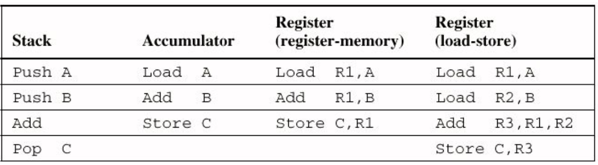

# Instruction Set
<!-- lezione4: 06-10-2022 -->

L'instruction set Architecture (ISA) è come il computer è visto da un programmatore e dal compilatore. Ci sono molte alternative per un designer ISA, che possono essere valutati in base a vari criteri:

- performance del processore
- complessità del processore
- complessità del compilatore
- dimensione del codice
- consume energetico
- ecc

Le CPU sono spesso classificate in accordo al loro tipo di memoria interna:

- **stack**: unicamente dalla memoria
- **accumulatori**: dalla memoria e da un accumulatore, il secondo risulta sempre la destinazione
- **registri**
  - register-memory (utilizzo di registro e memoria)
  - register-register (unicamente mediante registri)
  - memory-memory

{width=450px}

## GPR Machines

Attualmente tutti i processori utilizzano General Purpose Register senza accedere direttamente alla memoria. Non hanno dunque dei ruoli specifici, anche se arm in alcuni casi fa eccezione. Questo è un favore perché risultano più veloci rispetto alla lettura in memoria ed è più semplice per il compilatore per gestire le variabili.

## Memory Addresses

Esistono due tipi di memorizzazione in accordo all'andianess:

- **big endian**: il byte con l'indirizzo più piccolo viene salvato nella posizione più significativa. L'indirizzo del dato è quello del most significant byte.
- **little endian**: il byte con l'indirizzo più piccolo viene salvato nella posizione meno significativa. L'indirizzo del dato è quello del least significant byte.

Dunque se leggiamo un dato nel modo sbagliato avremo i dati invertiti.

I dati possono essere salvati in modo:

- **allineato**: le letture allineate rappresentano una limitazione per l'accesso in memoria (nel nostro caso sarà sempre allineato)
- **non allineato**: è il caso di intel x86, dove le istruzioni possono avere lunghezza differente, causando overhead sia per le performance sia per l'hardware

La memoria può essere acceduta in tre differenti modi:

- **registro**: `ADD R4, R3`
- **immediato**: `ADD R4, #3`
- **displacement**: `ADD R4, 100(R1)`
- **indiretto**: `ADD R4, (R1)`
- **indexed**: `ADD R3, (R1+R2)`
- **diretto (o assoluto)**: `ADD R1, (1001)`
- **memory inderect**: `ADD R1, @(R3)`
- **autoincrement**: `ADD R1, (R2)+`
- **autodecrement**: `ADD R1, -(R2)`
- **scaled**: `ADD R1, 100(R2)[R3]`

Scegliere una metodologià piuttosto che un'altra può portare a ridurre il numero di istruzioni o aumentare la complessità dell'architettura CPU o aumentare l'average CPI. Quello più diffuso è sicuramente con displacement. La dimensione dell'indirizzo in modalità displacement dovrebbe essere tra 12 e 16 bit mentre la dimensione per la immediate field dovrebbe essere tra 8 e 16 bit.

## Control Flow Instruction

Le istruzioni di controllo possono essere divise in quattro categorie:

- conditional branch
- jumps
- procedure calls
- procedure returns

Gli indirizzi di destinazione sono normalmente specificati come displacement rispetto al valore corrente del program counter. In questo modo:

- riduciamo il numero di bit, in quanto l'istruzione target è spesso molto vicina da quella sorgente
- il codice diviene indipendente dalla posizione

Le chiamate a procedure e i salti indiretti mediante registri consentono di scrivere codice che include salti che non sono conosciuti a tempo di compilazione e di implementare case o switch statements. Supporta le librerie condivise dinamicamente e le funzioni virtuali (chiamare differenti funzioni in base al tipo di dato)

Nel caso di utilizzo di procedure, alcune informazioni devono essere salvate:

- il return address
- i registri utilizzati
  - caller saving
  - callee saving

:::tip
**Riassumendo**: Poche istruzioni sono realmente indispensabili come load, store, add subtract, move register-register, and, shift compare equal, compare not equal, branch, jump, call e return. Branch displacements relativo al program counter dovrebbe essere di almeno 8 bit, mentre register-indirect e PC-relative addressing possono essere utilizzati nelle chiamate alle procedure e ritorno.
:::

## Tipo e dimensione degli operandi

Gli operandi supportati sono:

- **char**: 1 byte
- **half word**: 2 byte
- **word**: 4 byte
- **double word**: 8 byte
- **single-precision floating point**: 4 byte
- **double-precision floating point**: 8 byte

## Instructions Set Characteristics

L'encoding dell'instruction set dipende dalle istruzioni che compongono il set e dai metodi di indirizzamento supportati. Quando un gran numero di metodi di indirizzamento sono supportati, un indirizzo specificato in un campo è utilizzato per specificare l'addressing modo e il registro che potrebbe essere coinvolto. Quando il numero di è invece basso, possono essere encodati insieme all'opcode.

Il designer dove far attenzione a problemi di conflitto dovuti alla dimensione del codice o alla dimensione dell'instruction set, il numero di metodi di indirizzamento e il numero di registro, oltre alla complessità di fetch e decoding hardware.

Ormai sono poche le persone che sviluppano direttamente in assembly, in quanto ormai i programmi odierni fanno utilizzo di compilatori largamente ottimizzati. Si pongono allora alcuni problemi relativi alla allocazione delle variabili all'interno dei registri, fase cruciale in fase di ottimizzazione da parte di un compilatore. E' possibile ottimizzare il tempo di accesso alle variabili allocandole all'interno dei registri solo se queste sono salvate nello stack o sono variabili globali in memoria. Non è pertanto possibile per le variabili nello heap, a causa di problemi di allineamento.

Le raccomandazioni sono di avere almeno 16 registri ed essere semplici e ortogonali.
