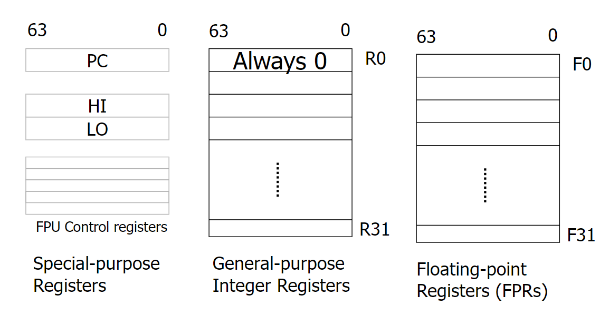
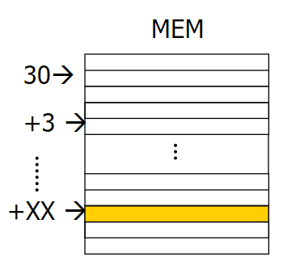

# MIPS64
<!-- LEZIONE 4: 04-10-2022 -->

Il MIPS prende il nome da _**M**icroprocessor without **I**nterlocked **P**ipeline **S**tages_, e fa parte della famiglia di processori RISC. Il primo processore è stato inventato nel 1985 a cui si sono susseguiti ulteriori versioni. Quello che si è scoperto è che dimunendo la complessità di ogni passaggio si rendeva più veloce il funzionamento, dunque rimuovendo il sistema di interlock.

Questo tipo di processori quando eseguono un operazione in memoria si limitano a fare "solamente questo". Hanno un simple load-store instruction set. Sono pensati per l'efficienza delle pipeline, in particolare con una lunghezza di istruzioni prefissata e pensate per applicazioni a basso consumo energetico (a differenza dei processori SISC). Il misc per tanto potrebbe risultare più compatto in quanto ogni istruzione fa più operazioni, ma a costo di una maggiore complessità.

I registri sono a 64 bit e il registro 0 è sempre `0` (non `R0`). Questo consente di utilizzare metodi di indirizzamento alternativi rispetto a quelli già visti.

{width=450px}

I tipi di dato utilizzabili sono i classici:

- byte
- half word
- words
- double words
- 32-bit single precision floating point
- 64 bit double precision floating point

## Metodi di indirizzamento

### Indirizzamento immediato

Viene utilizzato 16 bit di immediate field. Il primo registro è quello destinazione, mentre il secondo e terzo campo sono gli operandi. 

### Indirizzamento con displacement

LD R1, 30(R2) // carica il valore di R2 + 30 in R1

R2 = XX

R1 <- MEM[30 + R2]

{width=400px}

- registro indiretto
- indirizzamento assoluto

## Formato delle istruzioni

Una istruzione CPU  è un single 32 bit aligned word. Include un opcode di 6 bit iniziali. Le istruzioni sono in 3 formati:

- immediato
- registro
- salto (jump)

### Immediato

Il primo tipo è quello immediato, caratterizzato da:

- **opcode**: 6 bit di opcode
- **Rs**: 5 bit di indirizzo sorgente _(source register)_
- **Rt**: 5 bit di indirizzo destinazione _(target register)_
- **Immediate**: 16 bit signed immediate utilizzati per gli operandi logici, aritmetici, signed operands, load/store address byte offsets, istruzioni di displacemnte rispetto a PC.

### Registro

Il secondo tipo è quello registro, caratterizzato da:

- **opcode**: 6 bit di opcode
- **Rd**: 5 bit di indirizzo destinazione
- **Rs**: 5 bit di indirizzo sorgente
- **Rt**: 5 bit di indirizzo di indirizzo target
- **Sa**: 5 bit di shift amount, utile per fare shift a sinistra e a destra
- **Function**: 6 bit di funzione utilizzato per indicare le funzioni

### Salto

Il terzo tipo è quello salto, caratterizzato da:

- **opcode**: 6 bit di opcode
- **offset**: Indice a 26 bit spostato a sinistra di due bit per fornire i 28 bit di ordine inferiore dell'indirizzo di destinazione del salto

## Instruction Set

le istruzioni sono raggruppato per il loro funzionamento:

- Load and store
- operazioni ALU
- branches e salti
- floating point
- miscellanee

:::note
**Nota**: le istruzioni sono lunghe 32 bit.
:::

### Load and store

I processori MIPS utilizzano un architettura di caricamento e salvataggio, attraverso le quali avviene l'accesso alla memoria principale.

- **LB**: Carica un byte da memoria in un registro. `LB R1, 28(R8)`
- **LD**: Carica una doppia parola da memoria in un registro `LD R1, 28(R8)`
- **LBU**: Carica un byte senza segno da memoria in un registro `LBU R1, 28(R8)`
- **L.S**: Carica un floating point single precision in un registro `L.S F4, 46(R5)`.
- **L.D**: Carica un floating point double precision in un registro `L.D F4, 46(R5)`
- **SD**: memorizza un double `SD R1, 28(R8)`
- **SW**: salvo una word `SW R1, 28(R8)`
- **SH**: salvo la half word più significativa `SH R1, 28(R8)`
- **SB**: salvo gli 8 bit meno significativi `SB R1, 28(R8)`
- stessa cosa con i reali

Ovviamente avviene l'estensione dei valori ripetendo il bit più significativo. Nel floating point il primo bit è il segno. Attenzione: per L.S abbiamo il risultato nella parte più significativa.

### Operazioni ALU

Tutte le operazioni vengono eseguiti con operandi memorizzati nei registri. Le istruzioni possono essere di tipo immediato, con due operandi, shift, moltiplicazione, divisione, ecc. oltre ad aritmetica in complemento a due come somma, sottrazione, moltiplicazione, divisione.

#### ADD

- **DADDU**: dobule add unsigned `DADDU R1, R2, R3`
- **DADDUI**: double add unsigned immediate `DADDUI R1, R2, 74`
- **LUI**: load upper immediate `LUI R1, 0X47`

### Branch e jump

- J Unconditional Jump `J name`
- JAL Jump and Link `JAL name`
- JALR Jump and Link Register `JALR R4`
- JR Jump Register
- BEQZ Branch Equal Zero
- BNE Branch Not Equal
- MOVZ Conditional Move if Zero
- NOP No Operation (nella realtà è uno shift a sinistra di 0 bit di R0 in R0)
