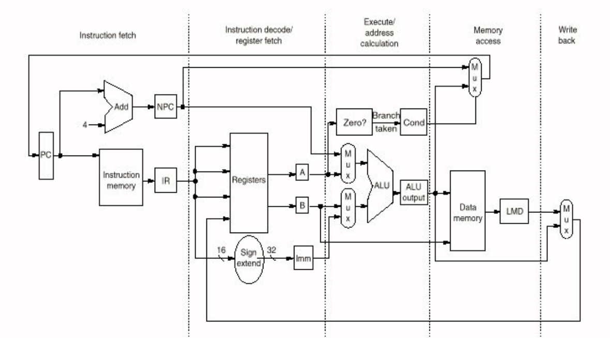
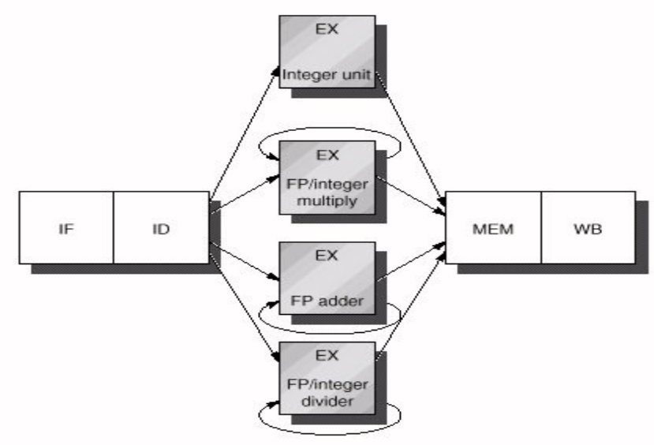
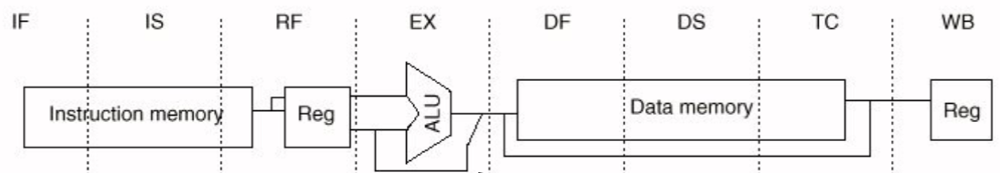

# Pipeline

La _pipeline_ è un implementazione che consente di eseguire più istruzioni in modo sovrapposto durante l'esecuzione. In questo modo, differenti unità (chiamate pipe stages o segmenti) sono eseguite in _parallelo_.

Il **throughput** individua _il numero di istruzioni che vengono processate per unità di tempo_. Tutte gli stage sono sincronizzate e il tempo per eseguire uno step è chiamato _machine cycle_, e normalmente corrisponde a un ciclo di clock. La lunghezza del _machine cycle_ è determinata dallo stage più lento. 

Il CPI (clock Cycles Per Instruction) esprime il numero di cicli di clock per istruzione.

Una pipeline ideale è caratterizzata da tutti gli stage perfettamente bilanciati, il cui throughput è:

$$
\text{throughput}_{pipelined} = \text{throughput}_{unpipelined} * n
$$

con $n$ pari al numero di _stage_.

## Versione senza pipeline

Prendiamo come esempio una implementazione senza pipeline. L'esecuzione di ogni istruzione potrebbe essere composta al più da **5 cicli di clock**:

1. **fetch** _(IF)_
2. **decode/register fetch** _(ID)_
3. **execution** _(EX)_
4. **Memory access** _(MEM)_
5. **Write back** _(WB)_

{width=400px}

Tutte le istruzioni richiedono 5 clock cycle ad esclusione delle **branch** (salti condizionali) a cui ne bastano **4**.

Potrebbero essere fatte alcune ottimizzazioni per ridurre il CPI medio: 

- si potrebbe completare le istruzioni ALU durante il ciclo di _MEM_.
- le risorse hardware potrebbero essere ottimizzato per eliminare duplicazioni.
- Si potrebbe prendere in considerazione un'architettura single clock alternativa, ad esempio che esegue una istruzione per ogni ciclo di clock.
 
E' infine necessario l'utilizzo di un _single control unit_ per produrre i segnali necessari al _datapath_.

## Versione pipelined

Un esempio di una versione _pipelined_ prevede l'avvio di una nuova istruzione per ogni clock cycle.  Inoltre, differenti risorse lavorano mediante differenti istruzioni contemporaneamente. 

Per ciascun ciclo di clock, ogni risorsa può essere utilizzata per solo una richiesta, comportando la necessità di separare le istruzioni e la memoria dati, oltre a individuare due momenti distinti in cui il _register file_ è utilizzato in lettura, nello stadio di _ID_, e per scrittura in _WB_.

Il _Program Counter_ deve essere cambiato nello stadio di _IF_ (facendo attenzione nei casi dei salti) e si rende necessaria l'introduzione di **pipeline register**, ovvero registri intermedi per le operazioni della pipeline.

:::note
Si da per scontato che i dati necessari siano già stati caricati in cache.
:::

La _pipeline_ consente di aumentare il throughput del processore senza dover rendere più veloce le singole istruzioni, che al contrario subiscono un leggero rallentamento dovuto all'overhead per il controllo della pipeline. La lunghezza della pipeline è limitata dalla necessità di bilanciare gli stati e dal overhead.

## Pipeline hazards

Gli **hazards** sono situazioni che possono far si che un istruzione non venga eseguita come dovrebbe.

Esistono tre tipi di hazard:

- **structural hazards**: la causa sono relative a un conflitto tra le risorse.
- **data hazards**: un istruzione dipende dall'esecuzione di una istruzione precedente.
- **control hazards**: relative a salti condizionali e altre istruzioni che cambiano il program counter.

A causa di tali problematiche è necessario introdurre gli **stalli**, ovvero operazioni in cui si richiede al processore di fermarsi per non causare problemi, per uno o più cicli di clock. Questo fa in modo che le istruzioni che verranno dopo una certa istruzione non vengano eseguite, mentre quelle indietro finiscano di essere elaborate.

:::tip
Gli stalli causano dunque l'introduzione di una sorta di "bolla" all'interno della pipeline.
:::

### Structural hazards

Gli **structural hazards** possono avvenire quando una unità della _pipeline_ non è in grado si eseguire una certa operazione che era stata pianificata per quel ciclo.

Alcuni esempi potrebbero essere:

- una unità non è in grado di terminare un il suo task in un ciclo di clock.
- La pipeline ha un solo register-file write port, ma non ci sono cicli in cui due register writers sono richiesti.
- La pipeline fa riferimento a un single-port memory, e ci sono cicli in cui differenti istruzioni vorrebbero accedere alla memoria contemporaneamente.

Purtroppo, l'unica soluzione è inevitabilmente il miglioramento dell'hardware o l'acquisto di nuove componenti.

### Data hazards

I **data hazards** sono problemi relativi alle dipendenze dei dati che vengono elaborati alterando, ad esempio, l'ordine di lettura e scrittura degli operandi e causando risultati sbagliati o non deterministici. Inoltre, se avvenisse un interruzione durante l'esecuzione di una porzione di codice critica la correttezza potrebbe essere ripristinata, ma causando quello che potrebbe essere un comportamento non deterministico.

Per risolvere questi problemi si potrebbe:

- implementare uno stallo per i dati richiesti, utilizzandoli solo quando sono disponibili.
- implementare un meccanismo di forwarding.

#### Forwarding
<!-- lezione7: 11-10-2022 -->

Un hardware dedicato all'interno del _datapath_ si occupa di rilevare quando un precedente operazione alu dovrebbe essere scritta nel registro che corrisponde al sorgente della operazione ALU. In questo caso, l'hardware selezione il risultato come input piuttosto che il valore nel registro. Deve, inoltre, essere in grado di fare il forwarding dei dati da ogni istruzione iniziata in precedenza e allo stesso modo di non fare forwarding se l'istruzione che segue è in stallo oppure è stata eseguita una interruzione.

Si hanno dunque data hazard quando vi è dipendenza tra le istruzioni e sono abbastanza vicine da essere sovrapposte a causa della pipeline. Questo generalmente avviene per operandi che sono sia registri che memoria, in particolare se la memoria subisce _load_ e _store_ non nello stesso stage o se l'esecuzione procede mentre un istruzione è in attesa di risoluzione di una cache miss.

Un esempio può essere il seguente:

```assembly
; istruzioni	 1 2 3 4 5 6 7 8
LD  R1, 0(R2)	 F D E M W			-> 5
SUB R4, R1, R5     F D s E M W		-> 2
ADD R6, R1, Ry       F s D E M W	-> 1
```

#### Implementazione del controllo

Il controllo avviene nella fase di decodifica, e richiede di individuare un possibile data hazard relativa a una istruzione in fase di ID. Se venisse rilevata, due strade sono possibili:

- attivazione del forwarding
- l'istruzione viene posta in stallo prima di entrare nello stage in cui gli operandi non sono disponibili

#### Load interlock detection

Quando una istruzione di load va in fase di esecuzione e un'altra istruzione sta cercando di accedere al dato carico in fase di decode, dovranno essere eseguiti dei controlli per verificare se gli operandi fanno match,  e nel caso rilevare il data hazard e come risultato l'unità di controllo deve inserire nella pipeline uno stallo per prevenire le istruzioni di fetch e decode di avanzare.

| opcode di ID/EX | opcode di IF/ID  | match? |
|-----------------|------------------|------------------------------|
| Load            | register-register alu              | ID/EX.IR[rt] == IF/ID.IR[rs] |
| Load            | register-register alu              | ID/EX.IR[rt] == IF/ID.IR[rt] |
| Load            | load, store, ALU immediate, branch | ID/EX.IR[rt] == IF/ID.IR[rs] |


#### Introdurre stalli e forwarding

Data una istruzione attualmente in stage di decodifica, introdurre uno stallo in fase di esecuzione è possibile:

- forzando tutti zeri nella pipeline ID/EX register (corrisponde a una nop)
- forzando IF/ID register a contenere il valore corrente
- Fermare il program counter

Invece, l'introduzione di un forwarding può essere implementato:

- dal data memory output del ALU
- verso l'input della ALU, data memory inputs, o zero detection unit

Inoltre, deve necessariamente eseguire le comparazioni tra il destination field del IR contenuto nel EX/MEM e MEM/WB registers con il source fiel del IR contenuto nel IF/IDm ID/EX, EX/MEM registers.

### Control hazards

Sono dovuti a salti (condizionali o meno) che possono cambiare il _program counter_ dopo che l'istruzione ha già eseguito il _fetch_. Nel caso in cui siano condizionali, la decisione di come varia il program counter dipende da quale branch verrà eseguito. Nella implementazione MIPS, il PC è scritto con il target address (se è preso) alla fine della fase di decode.

Una possibile soluzione si basa sull'utilizzo di stalli appena l'istruzione di branch viene individuata (in fase di decode) e decidere anticipatamente se il salto avverrà o meno e calcolare in anticipo il nuovo valore del program counter.

Un esempio senza ottimizzazione:

```assembly
; istruzioni	 1 2 3 4 5 6 7 8
nez  R1, cont    F D E M W		
1				   F D
2                    F

:
1					   F D E M W
2
```

Con l'ottimizzazione:

```assembly
; istruzioni	 1 2 3 4 5 6 7 8
nez  R1, cont    F D E M W		
1				   F 
2                

:
1					 F D E M W
2
```

Il costo è l'aumento di hardware e fare attenzione ai registri che sono legate alle istruzioni di salto in modo che siano corretti.

Per evitare problemi può essere necessario introdurre stalli per avere consistenti i valori nei registri, riprendendo l'esempio di prima:

```assembly
; istruzioni	 1 2 3 4 5 6 7 8
addi R1, R1, 1   F D E M W
nez  R1, cont      F s D E M W		
1				     s F 
2                

:
1					   F D E M W
2
```

Ci sono varie tecniche per ridurre la degradazione delle performance dovute ai salti:

- freezing the pipeline
- predict untaken
- predict taken 
- delayed branch

La prima alternativa, **freezing the pipeline**, è quella già proposta che prevede che la pipeline sia posta in stallo (o svuotata) appena l'istruzione di branch è rilevata e fino a quando non si conosce dove saltare. E' la soluzione più semplice da implementare.

La **predict untaken** assume che il branch non venga preso e evita qualsiasi cambio di stato della pipeline fino a quando il branch non ha compuuto la decisione. Inoltre, annulla le operazioni eseguite se invece il branch viene preso. Lo stesso approccio può essere utilizzato nel **predict taken** se si è a conoscenza del il target address prima del risultato del branch. In questi casi il compilatore utilizza delle ottimizzazioni interne per aumentare le probabilità da parte del processore di fare la giusta previsione (ad esempio realizzando strutture for più semplici da valutare).

Il **delayed branch** si basa sull'idea di riempire gli slot dopo l'istruzione di branch, denominati branch.delay slot, con istruzioni che devono essere eseguite indipendentemente dall'esito del branch. E' compito del compilatore eseguire aggiungere le istruzioni corrette e non esegue nulla in particolare quando l'istruzione di branch è decodificata. A volte però non è semplice trovare le istruzioni di delayed slot, per cui negli ultimi anni è meno adottata.

## Multicycle operations
<!-- lezione8: 13-10-2022 -->

Fino ad ora abbiamo lavorato con istruzioni che richiedono un colpo di clock per essere eseguite. In questo capitolo vedremo come gestire istruzioni che richiedono più cicli di clock per essere eseguite. 

### Floating Point operations

Le operazioni sui numeri floating point è più complicato rispetto agli interi. Per questo motivo, per riuscire a svolgere tali operazioni ini un solo ciclo di clock il designer sarebbe costretto:

- utilizzare un clock lento
- rendere complesse le unità (aggiungendo molta logica)

Nessuna di queste due è però realmente fattibile, per cui si cerca di scomporre l'operazione in più fasi che vengono eseguite in una sorta di pipeline. Otteniamo quindi una versione che paralelizza le diverse attività. Tutte le unità convergono nella fase di mem per poi concludere nella fase di write back. E' solo la fase di execute che risulta parallelizzata.

{width=400px}

Si vede necessario definire:

- **latenza**: il numero di cicli che devono essere eseguiti per concludere l'istruzione e produrre un risultato che possa essere riutilizzato
- **initiation interval** (intervallo di inizializzazione): il numero di cicli che devono passare tra due operazioni dello stesso tipo sulla stessa unità

### Multi-cycle Hazards

Questo crea però come problema quello di una comparsa più frequente degli hazard.

#### Structural hazards (multi-cycle)

A causa della dell'impossibilità di utilizzare una pipeline per l'unità di divisione, molte istruzioni potrebbero necessitarne allo stesso tempo. Inoltre, è possibile ottenere risultati dalle diverse unità operazionali nello stesso tempo _(non è realmente possibile)_.

:::warning
Il simulatore funziona in modo leggermente diverso, per cui alcuni casi potrebbero comportarsi diversamente.
:::

La soluzione è quello di utilizzare ulteriori _write ports_ (però molto costosa) oppure forzare uno structural hazard:

- le istruzioni sono poste in stallo nella fase di decode
- le istruzioni sono messe in stallo prima della fase di MEM o WB

#### Data hazards (multi-cycle)

A causa di un più unga latenza nelle operazioni, gli stalli per i **data hazards** possono fermare una pipeline per un quantitativo di tempo maggiore.

Inoltre, nuovi tipi di data hazards sono possibili a causa dei tempi maggiori per raggiungere la write back.

La soluzione è quello di controllare, prima di entrare in fase di esecuzione, se l'istruzione andrà a scrivere su un registro che è già in fase di esecuzione.

:::tip
Non sempre ci si ferma in fase di decodifica, può succedere che si fermi anche in fase di execute.
:::

:::tip
Si utilizza la `S` per gli stalli strutturali ed `s` per gli stalli dovuti a data hazards.
:::


### MIPS R4000 Pipeline

Il MIPS R4000 è un processore a 64 bit introdotto il 1991, con istruzioni simili al MIPS64. Utilizzava una pipeline a 8 stage per risolvere i problemi di cache dovuti agli accessi e una frequenza di clock più elevata. L'accesso alla memoria erano stati dunque divisi in più passi. Le pipeline più lunghe prendono spesso il nome di **superpipelines**.

{width=400px}

Alcune caratteristiche sono:

- maggior forwarding
- load delay slot aumentato, di 2 cicli
- branch delay slod aumentato, di 3 cicli

L'unità floating poin è composta di 3 unità funzionali: divider, multiplier, adder. Era composta da 8 stage differenti:

- A adder Mantissa ADD stage
- D divider divide
- E multiplier exception test
- M multiplier multiplier I
- N multiplier multiplier II
- R adder rounding
- S adder operand shift
- U unpack numbers

## Instruction level Parallelism
<!-- Lezione9: 14-10-2022 -->

Esistono due approcci per l'Instruction level parallelism:

- Dynamic approach:
- Static approach:


Più frequenti soprattuto nel mercato desktop e server, ma anche inccluso in prodotti come:

- intel core seriees
- ..

L'approccio statico è meno frequente, ma prevalente in quello che è il mercato embedded.

### Basic Block

Un basic block è una sequenza di istruzioni senza alcun branch-in, ad esclusione dell'ingresso, e senza branch-out, ad esclusione dell'uscita.

Il compilatore potrebbe rischedulare le istruzioni per ottimizzare il codice, ad esempio:

```text
a = b + c
d = e - f
```

Assumendo che la load abbia una latenza di 1 clock cycle, un codice che implementa questo funzionamento sono:

```assembly
LD  Rb, b
LD  Rc, c
ADD Ra, Rb, Rc
SD  Ra, Va
LD  Re, e
LD  Rf, f
SUB Rd, Re, Rf
SD  Rd, Vd
```

```text
LD Rb, b 	IF ID EX MEM WB
LD Rc, c 	   IF ID EX MEM WB
ADD Ra, Rb, Rc    IF ID st EX MEM WB
SD Ra, Va            IF st ID EX MEM WB
LD Re, e 				   IF ID EX MEM WB
LD Rf, f                      IF ID EX MEM WB
SUB Rd, Re, Rf                   IF ID st EX MEM WB
SD Rd, Vd                           IF st ID EX MEM WB
```

Sono necessari 14 clock. Si potrebbe cambiare l'ordine delle operazioni ottenendo:

```text
LD Rb, b 	IF ID EX MEM WB
LD Rc, c       IF ID EX MEM WB
LD Re, e 	      IF ID EX MEM WB
ADD Ra, Rb, Rc 		 IF ID EX MEM WB
LD Rf, f 				IF ID EX MEM WB
SD Ra, Va 				   IF ID EX MEM WB
SUB Rd, Re, Rf 				  IF ID EX MEM WB
SD Rd, Vd 						 IF ID EX MEM WB
```

In questo modo ottimizzato sono invece necessari solo 12 cicli di clock.

Per il MIPS le i basic block sono solitamente lunghi tra le 4 e le 7 istruzioni. Dal momento che le istruzioni potrebbero dipendere da altre, il parallelismo dei basic block è limitato, per tale motivo si utilizzano ulteriori tecnic di parallelizzazione come ad esempio quelle sui cicli.

### Loop level parallelism

Prendendo come esempio il seguente codice:

```c
for (i=0; i < 1000; i++)
	x[i] = x[i] + y[i];
```

Ogni iterazione del ciclo è indipendente dalle altre, quindi è possibile eseguire le istruzioni in parallelo. Esistono due modalità per fare ciò:

- loop unrolling (statico o dinamico)
- SIMD

#### Loop unrolling

Il loop unrolling è una tecnica che consiste nel duplicare il codice all'interno del ciclo, in modo da eseguire più istruzioni in parallelo.

```c
// originale
for (i=0;i<N;i++ ) {
	body
}
```

```c
// unrolled
for (i=0;i<N/4;i++ ){
	body
	body
	body
	body
}
```
Nell'esempio di prima otterremo:

```c
or (i=0;i<N;i=i+4 ){
	x[i] = x[i]+ y[i];
	x[i+1] = x[i+1]+ y[i+1];
	x[i+2] = x[i+2]+ y[i+2];
	x[i+3] = x[i+3]+ y[i+3];
}
```

I vantaggi sono che riusciamo a ridurre il numero di controlli che vengono effettuate e aumentiamo le chance che il compilatore elimini gli stalli. Lo svantaggio è l'aumento della dimensione del codice.


#### SIMD

Le single instruction stream possono essere portate a multiple data streams (SIMD) adoperando vector processors, istruzioni vettoriali che lavorano su un set di dati (rispettoa d dati scalari), l'utilizzo di Graphics Processing Units e l'utilizzo di differenti unità funzionali per eseguire task simili in parallelo lavorando su multipli dati.

### Dipendenze

Abbiamo 3 tipi di dipendenze di dato:

- dipendenze di dati
- dipendenze di nome
- dipendenze di controllo

#### Dipendenze di dati

Si dice che c'è una dipendenza di dati se una istruzione i dipende da una istruzione j con i che deve produrre un risultato che viene utilizzato da j oppure se l'istruzione j dipende da una istruzione k che è a sua volta dipendente da i.

Un esempio è mostrato di seguito:

```assembly
Loop: 	L.D F0, 0(R1)
ADD.D 	F4, F0, F2
S.D 	F4, 0(R1)
```

La seconda istruzione utilizza come sorgente il prodotto della prima, mentre la terza ugualmente riscrive nel medesimo registro causando delle dipendenze tra i dati.

##### Dipendenze e hazard

Le dipendenze sono proprietà del programma, mentre gli hazards sono proprietà della pipeline. Gli stalli dipendono dal programma e dalla pipeline.

##### Dipendenze di memoria

Rilevare le dipendenze che riguardano i registri è semplice, ma se sono prese in considerazione celle di memoria potrebbe essere molto più complicato in quanto l'accesso alla medesima cella potrebbe essere molto complicato. Se viene utilizzata una strategia statica, il compile deve adottare un approccio conservativo assumendo che ogni istruzione di load faccia riferimento alla stessa cella o a una precedentemente salvata. Questo tipo di dipendenze possono essere rilevate solo a runtime.

#### Dipendenze di nome

Le dipendenze di nome avvengono quando due istruzioni fanno riferimento allo stesso registro o alla stessa locazione di memoria (nome) ma non c'è un flusso di dati associato al nome. Ci sono due tipi di dipendenze di nome tra una istruzione i e un istruzione j:

- **antidependence**: istruzione j scrive un registro o una locazione di memoria che l'struzione i deve leggere, ed i viene eseguita prima.
- **output dependence**: entrambe le istruzioni i e j scrivono nello stesso registro o porzione di memoria.

```assembly
Loop: L.D F0, 0(R1)
	  ADD.D F4, F0, F2
	  S.D F4, 0(R1)
	  L.D F0, -8(R1)
	  ADD.D F4, F0, F2
	  S.D F4, -8(R1)
	  L.D F0, -16(R1)
	  ...
```

tra la riga 2 e la 4 c'è antidependence, mentre tra la 1 e la 4 c'è output dependence.

##### Register renaming

Strategia secondo cui si cerca di identificare i casi in cui la dipendenza dei dati possa non esistere utilizzando un ulteriore registro.

- dinamico
- statico

```assembly
DIV.D F0, F2, F4
ADD.D F6, F0, F8
S.D F6, 0(R1)
SUB.D F8, F10, F14
MUL.D F6, F10, F8
```

Potrebbe essere risolto nel seguente modo:

```assembly
DIV.D 	F0, F2, F4
ADD.D 	F6, F0, F8
S.D 	F6, 0(R1)
SUB.D 	T, F10, F14
MUL.D 	F6, F10, T
```

e inoltre:

```assembly
DIV.D 	F0, F2, F4
ADD.D 	S, F0, F8
S.D	 	F6, 0(R1)
SUB.D 	F8, F10, F14
MUL.D 	S, F10, F8
```

##### RAW hazards

Read after write hazards, corrispondono a una dipendenza di dati reale.

##### WAW hazards

Sono possibili se le istruzioni scrivono in uno o più stae o 
<!-- fare meglio -->

##### WAR hazards
...


#### Dipendenza di controllo

Dipendenze che avvengono quando un istruzione dipende da un branch. Ad esempio:

```c
if p1 {
	S1;
}
j
if p2 {
	S2;
}
```

S1 è dipendente da p1, ed S2 è dipendnente da p2.

<!-- salta tra le slide accenando ->

<!-- riguarda le slide intorno a 44 -->

##### Data flow

Bisogna fare attenzione nel caso in cui avvengano modifiche che alterano il flusso di dati ed è fondamentale evitarlo.


## Exceptions and Interrupts
<!-- Lezione10: 18-10-2022 -->

Le eccezzioni sono eventi interni che modificano la normale esecuzione del programma. Nel caso invece di eccezzioni dovute a effetti esterni si parla di interruzioni.

Le cause di eccezzioni sono varie:

- I/O device request
- Operating system call by a user program
- Tracing instruction execution
- Breakpoint (programmer-requested interrupt)
- Integer arithmetic overflow or underflow
- FP arithmetic anomaly
- Page fault
- Misaligned memory accesses
- Memory-protection violation
- Undefined instruction
- Hardware malfunction
- Power failure.

Le eccezioni si classificano in:

- sincrone e non sincrone
- Richieste dall'utente o coerced (forzate)
- mascherabili e non mascherabili
- in mezzo all'istruzione o tra due istruzioni
- con ritorno o senza ritorno

La maggior parte dei dispositivi sono catalogati come restartable machines, ovvero dato una eccezione è in grado di ripartire da dove si era bloccata.

Quando avviene una eccezione, la pipeline deve eseguire i seguenti step:

- forzare una trap instrcution nella pipeline nella prossima fase di fetch
- finchè non viene presa la trap, deve essere disabilitate tutte le scritture per le istruzioni che stanno causando la eccezione e per tutte le istruzioni nella pipeline.
- Quando la procedura di gestione dell'eccezione prende il controlo, salva immediatamente il Program Counter dell'istruzione che ha causato l'eccezione.

Una volta terminata la gesitone, una istruzione speciale fa tornare la macchina all'origine dell'eccezione e ricarica il PC originale facendo ripartire lo stream di istruzioni.

### Interrupt Protocol in 80x86

1. Arriva un'eccezione da un dispositivo esterno
2. la CPU rileva l'interruzione
3. La CPU legge un numero dal databus di tipo N
4. La CPU salva il valore del processor status word (PSW) e dell'indirizzo di ritorno (Code Segnemnt and Instruction Pointer registers) nello stack
5. La CPU resetta l'interrupt flag disabilitando le interruzioni esterne e il trap mode
6. Utilizzando N come indice, il processore legge dalla Interrupt Vector Table l'indirizzo in cui saltare
7. La CPU salta alla Interrupt Service Routine

### Interrupt  Protocol in ARM

1. Arriva un'eccezione da un dispositivo esterno
2. La CPU rileva l'interruzione
3. La CPU esegue il push del current stack frame composto da 8 registri incluso Program Counter e il Processor Status Register e R0-R3 all'interno dello stack
4. La CPU aggiorna i flag del processore
5. La CPU salta all'indirizzo dato dall'interruzuone di tipo N, in tale posizione verrà messo il salto alla attuale Interrupt Service Routine

### Precise exceptions

Un processore può gestire le eccezioni in modo preciso e in modo non preciso. Quando avviene una istruzione che rilascia eccezione tutte le precedenti devono essere completate, mentre quelle che seguono vengono rieseguite dall'inizio. Ripartire dopo una eccezione potrebbe essere molto complicato se non gestite in modo preciso, per questo  è necessario nella maggior parte delle architetture (perlomeno per le istruzioni intere). Questo ha però un costo in termina di performance.

### Imprecise exceptions

Garantire eccezioni precise è più complicato con le multiple cycle instructions. Un esempio è mostrato di seguito:

```assembly
DIV.D F0, F2, F4
ADD.D F10, F10, F8
SUB.D F12, F12, F14
```

L'istruzione ADD.D e SUB.D sono completate prima di DIV.D (out-of-order completion). Se dovesse essere rilasciata una eccezione da parte di SUB.D, questa sarebbe gestita in modo impreciso.

La soluzione implementabili sono vari:

- utilizzare anche le eccezioni non precise
- fornire una versione operativa veloce e imprecisa ed eventualmente una versione precisa ma più lenta
- forzare l'unità FP a determinare se una istruzione causerà una eccezione, e nel caso procedere con le priossime istruzioni solo quando le precendenti sono completate senza problemi.
- Bufferizzare i risultati di ogni eccezione fino a quando una istruzione non è stata completata senza problemi.

### MIPS: possibile sorgenti di eccezione

|Pipeline stage | Cause of exception |
|---------------|--------------------|
| IF | Page fault on instruction fetch, Misaligned memory access, Memory-protection violation |
| ID | Undefined or illegal opcode |
| EX | Arithmetic exception|
| MEM | Page fault on data fetch, Misaligned memory access, Memory-protection violation|
| WB | None|

### Eccezioni contemporanee

Immaginiamo di avere una eccezione nella MEM di LD e nella EX di DADD:

```assembly
LD   IF ID EX MEM WB
DADD IF ID EX MEM WB
```

Potrebbe avvenire una data page fault exception nella fase di MEM per LD e una eccezione di tipo aritmetico nello stage EX per DADD. La price eccezione viene processata e, se la causa dovesse essere rimossa, la seconda eccezione viene gestita.

Esistono però dei casi in cui le due eccezioni possono avvenire in ordine inverso a quelli a cui fanno riferimento:

```assembly
LD IF ID EX MEM WB
DADD IF ID EX MEM WB
```

La soluzione potrebbe essere:

- aggiungere un flag di status per ogni istruzione della pipeline
- se avviene una eccezione, viene settato il flag di stato
- se il flag di stato è settato, l'istruzione non esegue operazioni di scrittura
- Quando una istruzione raggiunge l'ultimo stage, e il flag di stato è settato, viene rilasciata una eccezione

### Instruction set complications

Quando una istruzione è garantito che finisca è detta **committed**. Alcune macchine hanno istruzioni che possono cambiare stato prima di essere _committed_. Se una di queste istruzioni venisse abortita a causa di una eccezione, lascerebbe la macchina in uno stato alterando e rendendo nuovamente di difficile implementazione le eccezioni precise.

Instructions implicitly updating condition codes possono creare complicazioni:

- possono causare data hazards
- richiedono di essere salvati e ripristinati in caso di eccezione
- rendono più difficoltoso per il compilatore riempire il possibili delay slot tra le istruzioni di scritture per i condition codes e i branch.

Le istruzioni complesse sono difficili da implementare nella pipeline, forzando ad avere la stessa lunghezza. Per questo motivo a volte i problemi sono risolti inserendo nella pipeline microistruzioni che implementano ciascuna istruzione.

