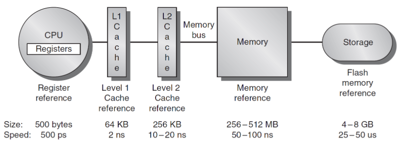
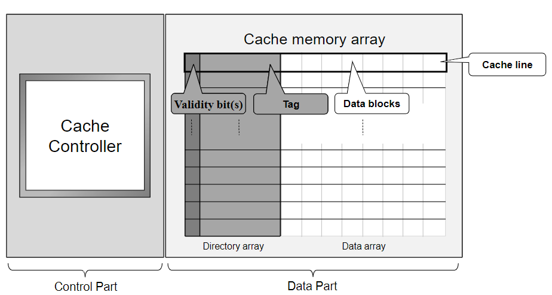
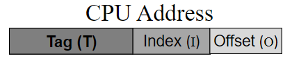
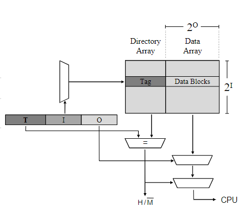
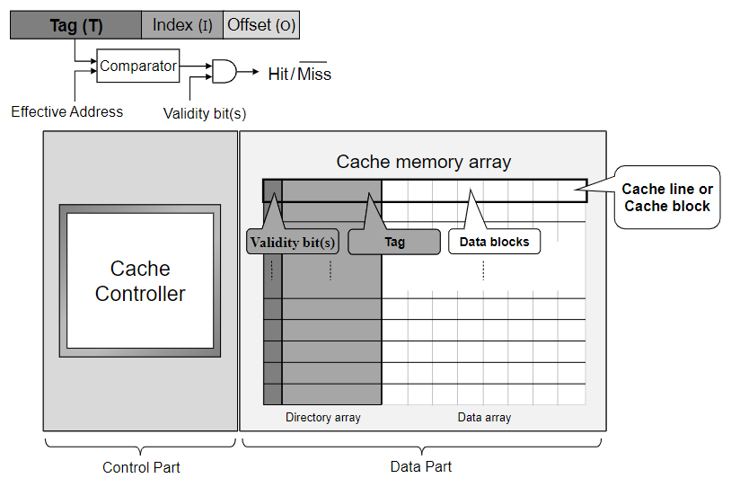
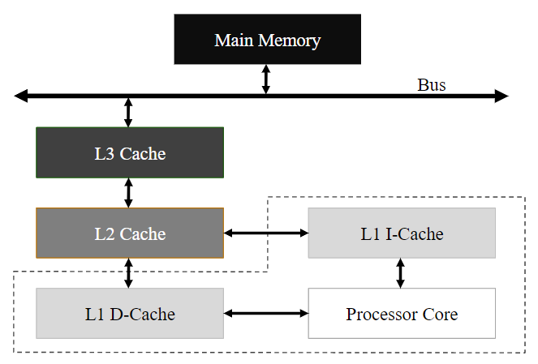
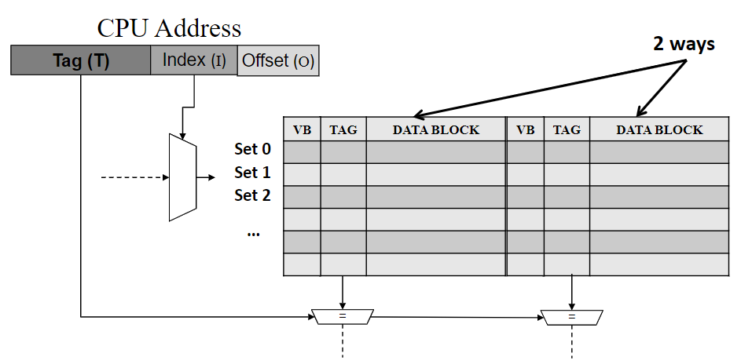
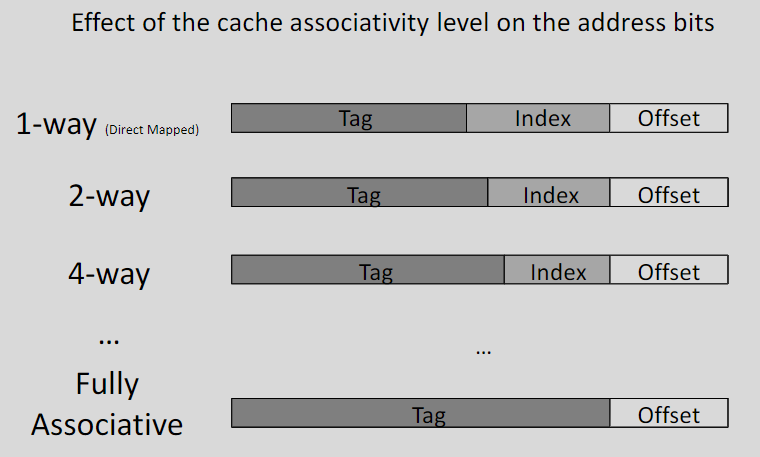
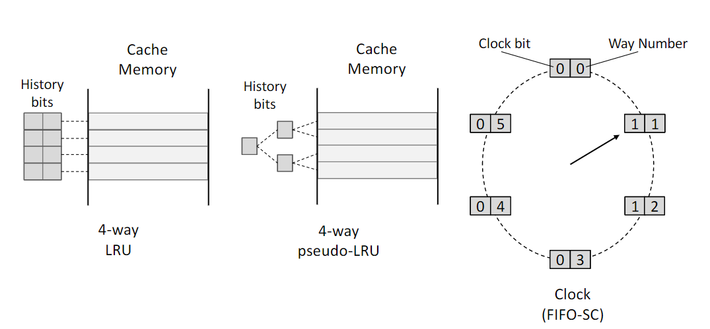
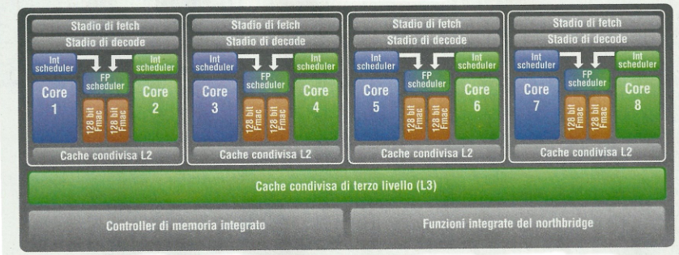

# Cache
<!-- continuo lezione10 -->

Le prestazioni delle memorie cache sono molto più veloci rispetto alle memorie, sia hard disk che ram. 

{width=400px}

Le cache funzionano secondo due principi:

- **principio di località temporale**: se a un tempo t il processore accede a una cella di memoria, è molto probabile che sarà necessario accedere nuovamente a quella cella in un tempo $$t + \delta t$$
- **principio di località spaziale**: se a un tempo t il processore accede a una cella di memoria, è molto probabile che sarà necessario accedere nuovamente a celle di memoria vicine a quella cella.

Dunque se un blocco intero viene caricato in memoria cache a t0, è molto probabile che a un certo tempo $$\delta t$$ il programma troverà in cache tutte le word necessarie.

E' necessario definire alcuni elementi:

- **h**: cache hit ratio
- **C**: cache access time
- **M**: memory access time quando il dato non è in cache
  
Il tempo di accesso alla memoria medio sarà:

$$t_{access} = h * C + (1 - h) * M$$

Normalmente i valori per `h` sono nell'ordine di 0.9. L'equazione non è però accurata in quanto prende in considerazione solo un tipo di cache.

## Organizzazione

La cache si divide in una parte di data e una parte di controllo. La parte di data a sua volta e divisa in un directory array un data array., in cui ogni entry è una cache line caratterizzatà da un bit di validità, un tag e un blocco di dati.

{width=400px}

Ogni cache line può contenere un blocco di memoria con a sua volta più word. A ciascuna è associato un tag field che indica il blocco di memoria presente in quel momento. Inoltre, la cache contiene la logica ricevere gli indirizzi prodotti dal processore, controllare al suo interno per vedere se è presente e nel caso caricare il blocco.

Un data block può avere una dimensione differente e in numero differente all'interno di una cache line.

Il tag è una parte dell'indirizzo dove la linea di cache si trova in memoria, non è necessario salvare 32 bit dell'indirizzo.

I bit di validità invece indicano se il blocco è presente o meno. Il numero di bit di validità può avere più bit pari al numero di data block presenti.

Si parla di **cache hit** quando la richiesta di data, che viene ricevuta dalla cache, è presente all'interno della cache. Si parla di **cache miss** quando la richiesta di data non è presente all'interno della cache.

## Trovare un blocco in cache
<!-- lezione11: 20-10-2022 -->

Ogni blocco di memoria e data block è pari a un byte, per cui se ho una memoria di 1024 byte avrò 1024 cache line, in quanto ogni cache ha un data block. Quando un dato della memoria deve essere indirizzato è composto da:

- **tag**: indica il blocco di memoria
- **index**: indica la cache line
- **offset**: indica la word all'interno del blocco

{width=200px}

Per individuare un blocco in cache è sufficiente un multiplexer (decoder) che opera sull'indirizzo:

{width=400px}

Nel caso di 1024 byte saranno sufficienti 10 bit per l'index, 3 bit per l'offset e 19 bit per il tag.

Dunque il diagramma totale appare come segue:

{width=400px}

La cache è normalmente situata ta il CPU e il bus  (oppure tra la memoria principale e il bus, ma non conviene). Ogni volta che il processore effettua un accesso in memoria allora la cache interpreta l'indirizzo e controlla se la word è già in cache o meno.

{width=400px}

Nel caso di un cache hit, la cache riduce il tempo di accesso alla memoria di un fattore dipendente dal ratio tra il tempo di accesso alla cache e alla memoria.

Nel caso di una miss, la cache può rispondere in due modi:

- Accede alla memoria carica il blocco mancante, successivamente risponde alla richiesta. Il tempo di accesso è maggiore rispetto a un sistema cache-free.
- Accede alla memoria e risponde immediatamente alla richiesta (load through o early restart). Questa tecnica richiede un costo maggiore in termini di hardware relativi alla cache, ma le miss hanno un impatto minore sulle performance della cache.

## Harvard Architecture

Le cache oggi giorno sono separate in cache di istruzioni e cache di dati. La cache per le istruzioni è solitamente pià semplice da gestire rispetto a quella dei dati, in quanto le istruzioni non possono essere cambiate.

Se sono utilizzate due cache, l'architettura del sistema ricade nello schema denominato "Harvard architecture", caratterizzato dall'esistenza di due memorie separate tra dati e codice (in contrasto con quella di Von Neumann).

Le caratteristiche sono:

- cache size: dimensione della cache
- block size: dimensione di un blocco di memoria
- mapping: tipo di mappatura
- replacing algorithm: algoritmo di rimpiazzamento
- meccanismo di aggiornamento della memoria

### Cache Size

La dimensione della cache è molto importante in termini di costi e performance. Man mano che la dimensione aumenta si ha un incremento dei costi, delle prestazioni di sistema ma una riduzione della velocità della cache. Le dimensioni solitamente variano da qualche kB a qualche MB.

### Mapping

Il meccanismo attraverso cui una linea viene associata ad un blocco di memoria è detto mapping. E' importante assicurarsi che la verifica di presenza di un dato per un certo indirizzo sia sufficientemente veloce.

Il tipo di mappatura è detto modello di assocatività, e può essere:

- direct mapped: numero del blocco di memoria modulo totale dei blocchi in cache
- set associative: numero del blocco modulo totale dei blocchi in cache diviso livello di associatività. Permette di salvare ogni elemento della memoria in due linee della memoria (utile quando abbiamo elementi che vengono chiamati molto più spesso in modo da salvarli). Garantisce che i dati più utilizzati possono essere ritrovati in cache.
- Fully associative: ogni linea della memoria può essere salvata in qualsiasi posizione della cache. Salva l'indirizzo completo (tag scompare)

#### Direct Mapping

Ciascun blocco di memoria è associato staticamento a un set `k` in cache utilizzando l'espressione:

$$ k = index \ mod \ n $$

dove `n` è il numero di linee nella cache. Il calcolo di `k` può essere fatto semplicemente prendendo i bit meno significativi dell'index.

Il vantagigo è che può essere implementato semplicemente in hardware, lo svantaggio è che se il programma accede frequentemente a due blocchi corrispondenti alla stessa cache line, avviene una miss a ciascun accesso in memoria.

#### Set associative Mapping

Per calcolare dove scrivere il valore è necessario trovare il numero di set:

$$s = N / W$$

Dove N è il numero di cache lines e W il numero di word lines.

Un blocco è associato a un set k mediante:

$$ k= i \ mod \ s$$

Il blocco `i` può essere inserito in una qualsiasi delle W linee del set k. Una cache set associative con W linee in ogni set è detta cache a W-linee. Solitamente W a un valore di 2 o 4.

{width=400px}

#### Fully Associative Mapping

Ciascun blocco della memoria principale può essere messo in un blocco qualsiasi della cache. Il vantaggio è una maggiore flessibilità nello scegliere un blocco, ma a costo di una maggiore complessità hardware nella ricerca.

{width=400px}

## Algoritmo di rimpiazzamento

Per sostituire le chace line deve essere utilizzato un algoritmo che individui quale rimuovere. Le scelte possibili sono:

- LRU: least recently used, la più utilizzata che scegli il rimpinzamento in base a quale sia stata la meno utilizzata recentemente.
- FIFO: first in first out, è la più semplice e scegli la prima che è stata utilizzata.
- LFU: least frequetly used, teoricamente la più efficace, sceglie quale rimpiazzare prendendo quella meno utilizzata.
- random: viene scelto casualmente quale cella utilizzare.

{width=400px}

Esiste anche il pLRU che è un approssimazinoe efficiente di LRU. L'età di ciascuna via della cache è mantenuta in un albero binario, di cui ogni nodo rappresenta una "history bit". Quando avviene un accesso, viene fatto il toggle dei bit corrispondenti incontrati.

Nel caso FIFO viene utilizzato l'algoritmo **second chance**: ogni elemento ha un bit di utilizzo. Quando viene utilizzato un nodo viene posto a `1` il bit, dandogli una seconda "chance", perchè essendo appena stato letto potrebbe essere ancora utile. In modo sequenziale vengono controllati tutti i nodi, fino a quando non viene trovato uno di valore `0`, che viene rimosso. Se un nodo viene trovato con il bit a `1` viene posto a `0` e si continua a cercare. Se tutti i nodi sono stati utilizzati ha un comportamento FIFO.

## Memory Update

Quando avviene una operazione di scrittura su un dato presente in cache, è necessario aggiornare anche il dato presente in memoria principale. Per fare ciò esistono due soluzioni:

- write back
- write through

### Write Back

Per ogni cache block, un flag denominato **dirty bit**, indica se il blocco è stato cambiato o meno da quando è stato caricato in cache. La scrittura in memoria principale avviene solo quando il blocco viene sostituito dalla cache ed è settato il dirty bit.

gli svantaggi di questo approccio sono:

- sostituzione più lenta in quanto a volte è necessario copiare in memoria principale il blocco.
- In un sistema multiprocessore ci potrebbero essere incosistenze tra le cache dei vari processori
- Potrebbe non essere possibile ripristinare il dato in memoria dopo un system failure.

### Write Through

Ogni volta che la CPU effettua una operazione di scrittura, questo viene scritto sia in cache che in memoria principale. La conseguente perdita di efficienza è limitata dal fatto che le operazioni di scrittura sono solitamente molto meno numerose di quelle di lettura.

## Cache Coherence

La coerenza tra le cache è uno dei problemi priincipali tra i sistemi multiprocessore con memoria condivisa, in cui ogni processore ha una propria cache. Lo stesso tipo di problema si verifica se è presente un DMA controller.

Per risolvere questo problema viene introdotto il **validity bit** per ogni cache line. Se è disabilitato, allora non è stato effettuato nessun accesso al blocco e deve dare una miss. All'avvio tutti i validity bit sono disabilitati.

Può essere conveniente utilizzare più bit di cache avere più livelli di cache:

- L1: primo livello, piccolo e veloce
- L2: secondo livello, lento ma capiente
- L3: terzo livello, molto lento ma molto capiente

Un esempio è AMD Sambezi, facente parte della AMD fusion family. Include 8 core con ciascuno una cache di livello 1. Ciascuna coppia di processori ha un secondo livello da 2 o 4 Mbytes e infine i core dello stesso device condividono un terzo livello di cache da 8 mbytes.

{width=400px}

## Esempio

Immaginiamo di avere una memoria cache con le seguenti caratteristiche:

- 64 kbyte di dimensione
- direct mapping
- 4byte blocks
- 32 bit di indirizzo

Determina la struttura della cache (numero di line, dimensione del tag field).

Ogni blocco è di 4 byte, quindi se ho $2^32$ byte avrò 2^30 blocchi. Se la cache ha 64 kbyte, avrò 2^16 blocchi quindi la cache ha 2^14 linee. Il tag è composto da 30 bit, ma 14 fanno riferimento alla linea e dunque solo 16 sono per il tag field.

La dimensione totale della cache è dunque:

$$2^14 * (32+16) = 2^14 *48 = 768 kbit = 96kByte$$

