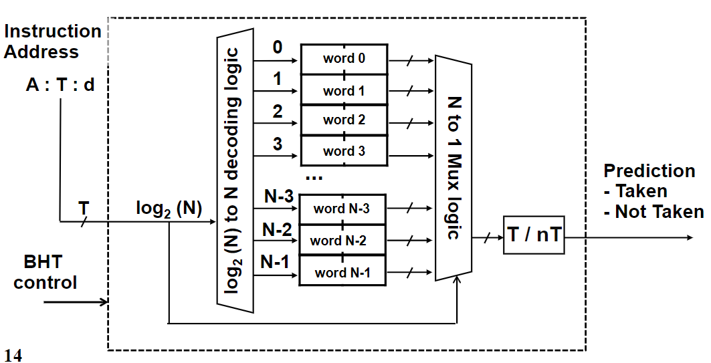
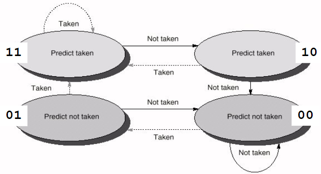
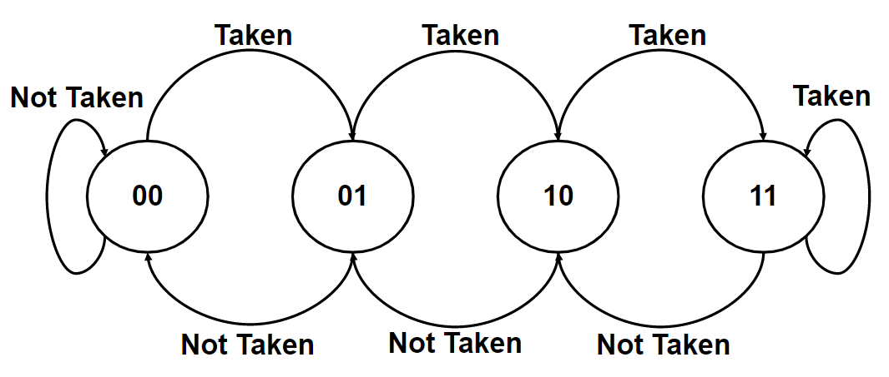
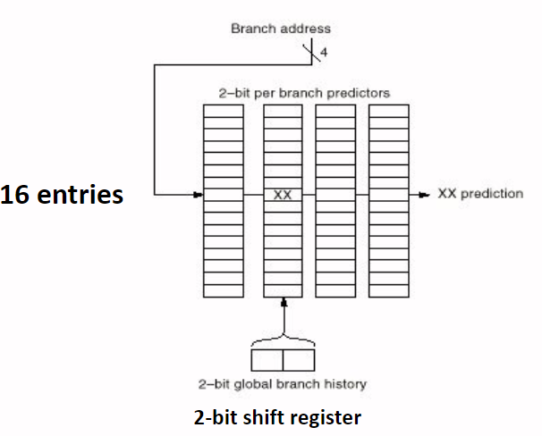
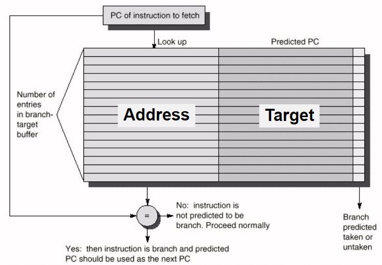
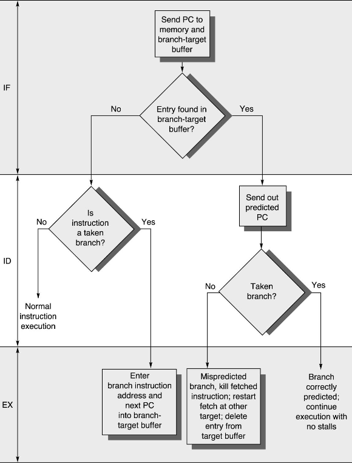
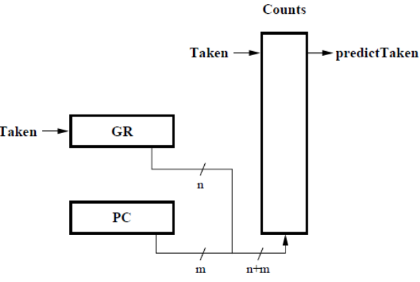
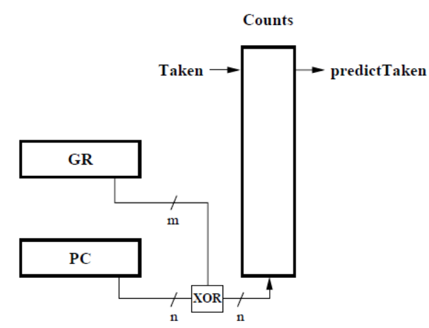
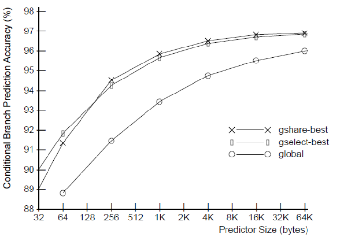

# Branch Prediction Techniques
<!-- lezione12: 21-10-2022 -->

I salti possono potenzialmente impattare in modo molto rilevante sulle prestazioni delle pipeline.. Per questo motivo è possibile ridurre la perdita di performance andando a eseguire delle predizioni su quello che sarà il risultato del salto.

Lo scopo è quello di eseguire correttamente il forecasting branches, riducendo le chance che il controllo dipenda da cause di stallo. Possiamo categorizzare gli schemi in due gruppi:

- static techniques: sono gestite dal compilatore come risultato di una analisi preliminare del codice.
- dynamic techniques: sono implementate in hardware in base al comportamento del codice.

L'accuratezza della predizione non aumenta in modo significativo da un aumento della dimensione del buffer o del numero dei bit utilizzati per la predizione.

## Static brancch prediction

Può essere utile in combinazioni con altre tecniche statiche come l'ééenabling delayed branches** e il **rescheduling to avoid data hazards**.

Il compilatore può prevedere il comportamento in modo differenti:

- predire sempre i branch come presi
- predire in base al branch direction (se siamo all'interno di un ciclo)
- predire in base alle informazioni di profiling dalle prime esecuzioni.

Nei programmi per SPEC92 il 34% delle predizioni basate su _branch sempre presi_ erano errate, con un rate molto variabile da 9% al 59%. Altre tecniche potrebbero avere un comportamento migliore nel caso medio, ma sono ancora con alte variazioni da programma a programma.

Nel caso di predizioni basate su branch direction si ha che i forward branches solotimanete sono poco presi mentre i backwar branches sono molto spesso presi (come ad esempio in un ciclo).

Il profiling è una tecnica che può essere utilizzata per prevedere una sequenza tipica di input che riceve il programma ed eseguire il programma un numero limitato di volte utilizzando tale input, eseguendo una statistica in base al comportamento dei branch.

## Dynamic branch prediction

Gli schemi dinamici sono implementati in hardware, e utilizzano gli indirizzi delle instruzioni branch per attivare meccanismi differenti di predizioni. Possono essere implementati seguendo tecniche differenti:

- branch history table
- twho level prediction shcemes
- branch-target buffer
- _altri_

### Branch history table

E' il metodo più semplice di predizione dinamica. La **branch History Table** (BHT) è una piccola memoria indicizzata dalla più piccola porzione di indirizzo dell'istruzione di branch. Ciascuna entry ha uno o più bit che registrano se il branch è stato preso o meno l'ultima volta che è stato eseguito.

Ogni volta che viene decodificata una istruzione di branch, viene eseguito un accesso alla BTH utilizzando la porzione di indirizzo per l'indice. La predizione viene salvata nella tabella utilizzata, e il nuovo program counter viene calcolato in accordo a tale predizione. Quando il risultato di un branch è noto, la tabella viene aggiornata.

{width=400px}

L'efficacia dipende dal metodo utilizzato, ma soffre del problema di aliasing (una linea della tabella potrebbe far riferimento a un altro salto e non quello che sto eseguendo) e dell'acuratezza della predizione.

Nei processori MIPS, la voalutazione della condizione del branch viene eseguita quando viene identificata l'istruzione di branch, per tale motivo non porta nessun reale vantaggio.

Se prendiamo un esempio di un loop che è preso 9 volta di seguito e poi al decimo deve uscire. Se ipotizziamo che la entry non è condivisa con altri branch, la predizione utilizzando una BHT di 1bt, verrà sbagliata solo la prima e l'ultima iterazione con un successo del 80%, minore del fatto che venga assunto che venga sempre preso (90%).

## Two bit prediction schemes

Gli schemi predittivi a 2 bit permettono una capacità di predizione più elevata. Per ogni branch vengono mantenuti due bit, la predizione è cambiata solo dopo due miss.

{width=400px}

:::warning
**Attenzione**: Non si comporta come un contatore
:::

### n-bit prediction schemes

Gli schemi predittivi a n-bit permettono una capacità di predizione ancora più elevata, e rappresenta un caso più generale di quella precedente. Il counter, che si comporta effettivamente come un contatore, è aumentato di uno ogni volta che il branch viene preso e decrementato in caso contrario. Quando il counter è maggiore di metà del suo valore massimo, il branch viene predetto come preso, altrimenti come non preso.

Alcuni esperimenti hanno mostrato come ci sia un vantaggio con n>2.

Viene inoltre denominata **bimodal branch prediction**.

{width=400px}

## Performance impact of branches

Le performance dei branch vengono impattate da alcuni fattori:

- accuratezza della precisione
- costo del branch (penalità per predizione errata)
- branch frequency (minore per programmi in floating point)

## Correlating Predictors

IN questo tipo di predittori, la storia dei salti precedenti influenza la scelta attuale di predizione.. Questo approccio, denominato anche two--level predictors, è dunque basato sulla dipendenza tra i risultati degli ultimi branch.

### (m, n) predictors

Utilizzano il comportamento degli ultimi m branch per scegliere da 2^m branch predictors, ciascuno ad n-bit. 

L'hardware necessario per implementare lo schema è molto semplice:

- la storia dei più recenti m branches è registrato in uno shift register ad m-bit, dove ciascun bit registra se un salto è stato preso o meno.
- Il branch prediction buffer è indicizzato utilizzando una concatenazione di bit low order del branch addres con m low order history bits.

### (1,1) predictor

In questo caso abbiamo `m=1` ed `n=1`. Ciascun branch è associato con $2^m$ predictors di n bits:

- uno riporta la predizione nel caso il branch precedente è stato preso
- uno riporta la predizione nel caso il branch precedente non è stato preso

### (2,2) predictor

Un alto esempio potrebbe essere con `m=2` ed `n=2`, con la seguente costruzione:

{width=400px}

Come si vede è sufficiente uno shift register con due bit.

## Branch-target buffer

Peer ridurre il numero di effetti sul controllo delle dipendenze richieste da sapere appena possibile, come l'informazione che il branch sia preso o meno e il numovo valore del _program counter_ (se il branch è assuto di essere prese), vengono risolti attraverso l'introduzione del branch-target buffer (o cache).

Ciascuna entry del branch-target buffer contiene l'**indirizzo** del branch considerato e il **target** value da caricare nel program counter.

Utilizzando un branch-target buffer, il program counter è caricato con il numovo valore alla fine dello stage di fetch, prima ancora che la branch instruction sia decodificata.

Questa tecnica è molto buona, ma ha però un costo molto elevato.

{width=400px}

{width=400px}

Se viene utilizzato un meccanismo con di predizione a 2-bit, è possibile combinare un branch-target buffer con un branch prediction buffer.

<!-- slide 34 e 35 -->

## gselect 

La tabella di predizioni mediante saturated counter è acceduta concatenando il branches global history (GR) con il branch address (PC).

{width=400px}

## gshare

La tabella di predizione è ottenuta effettuando lo XOR tra il branches global history (GR) e il branch address (PC).

{width=400px}

Incredibilmente funziona meglio del gselect.

{width=400px}