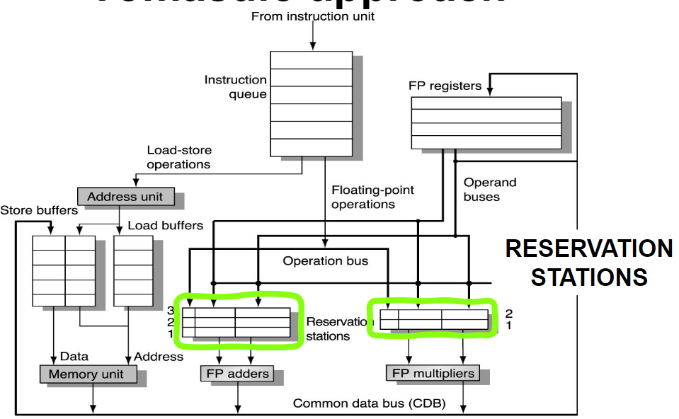
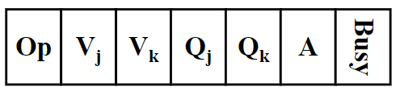

# Dynamic scheduling Techniques
<!-- lezione14: 27-10-2022 -->

Lo scheduling dinamico consente di identificare le dipendenze che sono sconosciute a tempo di compilazione. Semplifica il lavoro del compilatore e permette al processore di tollerare ritardi non predicibili. Inoltre, permette di eseguire lo stesso codice su differenti processori.

```mips
DIV.D F0, F2, F4
ADD.D F10, F0, F8
SUB.D F12, F8, F14
```

La pipeline ha uno stallo dopo la `DIV.D` a causa della dipendenza tra `DIV.D` e `ADD.D`. La `SUB.D` si pone in pausa a sua volta, anche se in realtà non vi è nessuna dipendenza con le istruzioni precedenti. Potremmo riuscire ad aumentare le prestazioni rimuovendo la necessità di eseguire le operazioni in ordine.

## Esecuzione fuori ordine

L'esecuzione fuori ordine prevede l'esecuzione di istruzioni che non sono state ancora eseguite. Questo può però comportare problemi, in particolare intruducendo:

- WAR hazards: write after read
- WAW hazards: write after write
- esecuzione imprecisa


Se l'esecuzione out-of-order è concessa, potrebbe diventare impossibile riuscire a fare una gestione precisa delle eccezioni. Questo potrebbe comportare che quando una eccezione è rilasciata, una istruzione precedente o successiva all'eccezione ha ancora da essere completata. In entrambi i casi potrebbe essere difficoltoso far ripartire il programma.

## Splitting ID-Stage

Per consentire l'esecuzione fuori ordine, è necessario dividere l'ID-Stage in due parti:

- issue: decode instruction, controlla gli hazard strutturali
- read operands: aspetta fino a quando non ci sono data hazards, solo dopo legge gli operandi

La fase di issue legge l'struzione da un registro o da una coda (sceitta nella fase di fetch). Solo dopo si dovrà attendere per gli operandi e solo a quel punto entrare in fase di esecuzione.

Le istruzioni possono essere messe in stato di stallo o bypassare durante le fasi di lettura degli operandi, per questo motivo potrebbe entrare in una fase di esecuzione out of order

## EX stage

Se il processore include più unità funzionali, molte istruzioni possono essere eseguite in parallelo. Anche in questo dcaso le istruzioni potrebbero bypassare durante le fasi di esecuzione, per questo motivo possono uscire dalla esecuzione out-of-order.

## Hardware Schemes for dynamic scheduling 

Alcune strategie hardware potrebbero essere applicate per risolvere i problemi di scheduling dinamico. In particolare:

- scoreboarding
- Tomasulo's algorithm

### Tomasulo's algorithm

Roberto Tomasulo è stato architetto del processore IBM 360/91, le sue idee sono state pubblicate in un paper del 1967. Le stesse idee vennero poi riutilizzate per il primo processore superscalare costruito.

Le principali idee sono:

- tracciare la disponibilità degli operandi
- introduzione del _register renaming_

{width=400px}

#### Reservation stations

Le **reservation stations** sono la novità chiave nell'approccio di Tomasulo, hanno diverse funzioni:

- **bufferizzano gli operandi** delle istruzioni in attesa di eseguire; gli operandi vengono memorizzati nella stazione non appenacome sono disponibili
- implementano la logica di emissione
- identificano univocamente un'istruzione nel pipeline: le istruzioni in attesa designano ilstazione di prenotazione che fornirà loro un operando di ingresso.

Ciascuna reservation station relativa a un'unità funzionale controlla quando una istruzione può iniziare l'esecuzione in quella unità.

#### Register renaming

Ogni volta che viene impartita una istruzione, il registro specifica che gli operandi pendenti sono rinominato ai nomi delle reservation station in carica di calcolarli.

Questo implementa una strategia di register renaming, in grado di eliminare gli hazard WAW e WAR.

#### Common Data Bus (CDB)

I risultati sono passati direttamente alle altre unità funzionali, piuttosto che andare nei registri. Tutti i risultati dalle unità funzionali e dalla memoria sono inviati sul Common Data Bus, il quale:

- goes everywhere (except to the load buffer) ??
- allows all units waiting for an operand to load it simultaneously when it is available.

#### Instruction execution steps

Le istruzioni vengono eseguite in 3 fasi:

- Issue
- Execute
- Write result

Possono avere una lunghezza differente.

##### 

Quando una istruzione viene presa dalla coda (strategia FIFO), se non sono disponibili reservation station allora avviene uno structural hazard e l'istruzione è posta in stallo fino a quando una reservation station non diventa disponibile. Se invece è disponibile una reservation station, vi viene inviata l'istruzione con gli operandi se sono disponibili, altrimenti si attende anche la loro disponibilità.

##### Execute

Quando un operando appare sul CDB, viene letto dal reservation unit e appena tutti gli operandi dell'istruzione sono disponibili nella reservation unit, l'istruzione può essere eseguita. In questo moto sono eliminate le RAW hazards.

L'e istruzioni di load e store eseguite in due step:

- appena il base register è disponibile, l'effective addres è calcolato e scritto nel buffer della load/store
- Nel caso dellla load è eseguita appena la memoria è dispnibile mentre per la store si attende che gli operandi che devono essere scritti siano disponibili e l'esecuzione avviene appena la memoria è disponibile.

Per evitare di modificare il comportamento delle eccezione, nessuna istruzione è autorizzata a inziare l'esecuzione fino a quando tutti i branch precedenti non sono stati completati. Per questo motivo la **speculazione** potrebbe essere implementata per migliorare questo meccanismo.

##### Write result

Quando il risultato dell'istruzione è disponibile, viene immediatamente scritto nel CDB, dove i registri e le unità funzionali attendono. 

In questo step le istruzioni di step scrivono in memoria.

#### Instruction identifiers

ciascuna reservation station è associata a un identificiatore. Questo identifica anche gli operandi necessari per l'istruzione, è in questo modo che quest'ultima li riconosce.

Gli identifiers hanno anche il compito di implementare funzionare come virtual register che possono essere utilizzati per implementare il register renaming.

#### Reservation station fields

Ogni reservation station ha i seguenti campi:

- Op: operazione da eseugire
- Vj: valore del operando sorgente j
- Vk: valore del operando sorgente k
- Qj: reservation station che produrrà un operando sorgente j
- Qk: reservation station che produrrà un operando sorgente k
- A: utilizzato dal buffer della load/store per memorizzare prima il campo immediato e poi l'effective address
- Busy: status della reservation station

{width=100px}

#### Register file

Ogni elemento in un register file contiene un campo Qi. Questo, contiene il numero della reservation station che continene l'istruzione il cui risultato dovrebbe essere salvato in un registro. Se il Qi è null, neon è attualmente attiva nessuna istruzione che sta calcolando un risultato per quel registro.

In questo modo la hazard detection logic è distribuita e gli stalli per WAW e WAR sono eliminati. Si ha però come contro una alta complessità hardware (includendo un buffer associativo per ogni reservation station) e il CDB potrebbe essere un bottleneck.

#### Loop handling

Il loop unrolling non è necessario in questa architettura, in quanto possono essere eseguite normalmente in parallelo.