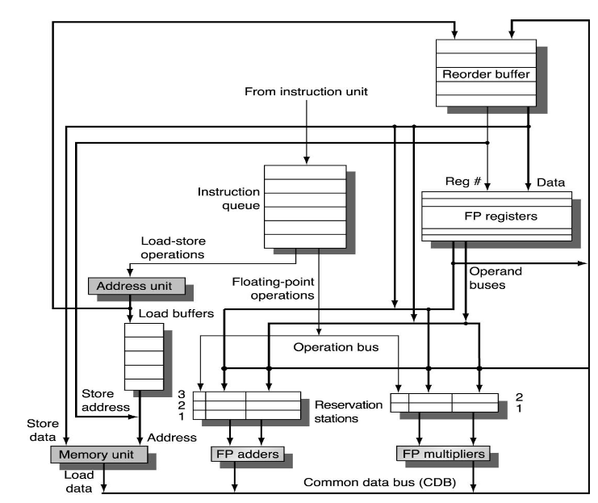

# Speculation
<!-- Lezione15: 18-10-2022 -->

La speculazione basata su hardware è una tecnica per ridurre l'effetto delle dipendenze di controllo in un processore che implementa il dynamic scheduling.

Se un processore supporta la branch prediction con dynamic scheduling, le istruzioni di fetch ed issue sono eseguite come se la predizione fosse sempre corretta.

Se un processore supporta questo tipo di speculazione, le esegue sempre.

Le idee sono principalmente tre

- dynamic branch prediction
- dynamic scheduling
- speculation

In questo modo il processore implementa una deta flow execution, dove le operazioni sono eseguiti appena sono disponiibli gli operandi.

## architettura

Viene adottata l'architettura di Tomasulo, che viene però estesa per supportare la speculazione. 

La fase di execute si separa nuovamente:

- il calcolo dei risultati
- l'aggiornamento del file register e della memoria, che viene eseguita quando una istruzione non è più speculativa (instruction commit).

A tal fine viene introdotto il **ReOrder Buffer** (ROB), una struttura dati che ccontine i risultati delle istruzioni che non hanno ancora effettuato il commit. Si preoccupa di fornire ulteriori virtual register e integra lo store buffer presente nell'architettura originale di Tomasulo.

Con la speculazione, i dati potrebbero essere letti dal ROB se le istruzioni non hanno ancora eseguito commit oppure dal register file in caso contrario.

Ogni entry della ROB ha quaddro campi:

- **Instruction type**: branch, store, or register
- **Destination**: register number, or memory address
- **Value**: contains the value when the instruction has completed but still didn't commit
- **Ready**: indicates whether the instruction completed its execution

{width=400px}

## Instruction Execution Steps

L'esecuzione delle istruzioni avviene in quattro fasi:

- Issue
- Execution
- Write result
- Commit

### Issue

Una istruzione viene estratta dalla coda delle istruzioni se è disponibile una empty reservation station e un slot libero nel reorder buffer, in caso contrario l'istruzione viene posta in stallo.

Gli operandi delle istruzioni se presenti nel register file o nel reorder buffer, sono inviati alla riservetion station.

Il numero della entry del reorder buffer dell'istruzione viene vineata alla reservetion station per indicare l'istruzione.

### Execution

L'istruzione è eseguita appena sono disponibili tutti gli operandi, in modo da evitare hazard di tipo RAW. Gli operando sono presi, se possibile, dal CDB appena una istruzione la produce.

La lunghezza di questo step varia in base al tipo di istruzione _(ad esempio 2 per le load, 1 per operazioni intere, variabile per FP)_.

### Write result

Scirveremo nel command data bus appena il dato è libero e verrà inviato al reorder buffer.

Tutte le reservation station aspetteranno per il risultato prima di leggerlo, e ciasucna entry verrà poi segnata come disponibile.

### Commit

Il reorder buffer viene ordinato in base all'ordine originale. Appena una istruzione raggiunge la testa del buffer:

- se è un branch non predetto correttamente, il buffer viene ripulito e l'esecuzione riparte con la corretta istruzione che segue
-  se invece il branch è stato predetto correttamente, il risultato viene scritto nel registro o in memoria (nella store).

In entrambi i casi, l'entry del reorder buffer viene marchiata come libera.

Il reorder buffer è implementato come una **circular buffer**.

## WAW e WAR hazard

In seguito alle precedenti implementazioni, gli hazard WAW e WAR non possono più avvenire in quanto il dynamic renaming è implementato e l'aggiornamento della memoria avviene in ordine.

### RAW hazard

I raw hazards sono evitati in quanto avvieune un enforcing del program order mentre i calcoli dell'effectevive address e la load wrt avvengono prima delle istruzioni di store (????).

Inoltre, una load non entra nel secondo step se qualche entry della ROB è occupata da una store che ha una destination field che è uguale della field che sta facendo la load.

## istruzione di Store

Le istruzioni di store scrivono in memoria solamente quando è stato eseguito il commit. Per questo motivo, gi operandi in input sono richiesti al momento della commit piuttosto che nello stage di scrittura dei risultati. Questo significa che il ROB deve avere un ulteriore campo che specifica da dove gli operandi in input dovranno essere presi per ogni istruzione di store.

## Exception Handling

Le eccezzioni non sono eseguite appena vengono rilasciate, ma piuttosto quando sono aggiunte al reoder buffer. 

Quando una istruzione effettua il commit, la possibile eccezione viene eseguita, e le istruzioni successive vengono eliminate dal buffer. 

Se l'istruzione viene eliminata dal buffer, l'esecuzione viene ignorata. Per questo motivo la precise exception handingl è supportata completamente.

## Speculative expensive events

Quando avviene un evento costoso in termini di tempo (second-level cache miss, TLB miss) nel caso speculativo, alcuni processori aspettano per la sua esecuzione fino a quando l'evento non è più speculativo, invece gli eventi poco costosi sono normalmente eseguite in modo speculativo.

