# Arm

Arm è un architettura RISC che ha preso gran parte del segmento di processori in ambito mobile ed embedded.

L'architettura ARM si divide in:

- ARM architecture embedded in System on chip (SoC)
- Arm operationg Systems
- ARM compile - support - debug tools

{width=300px}

La toolchain di sviluppo arm è illustrata nella seguente immagine:

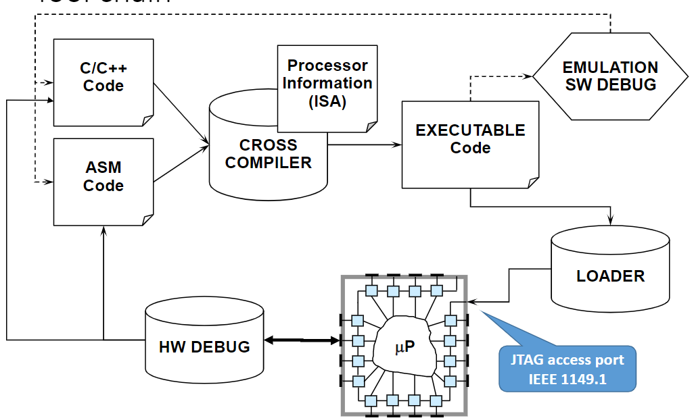{width=300px}

L'architettura generica di un processore arm è il seguente:

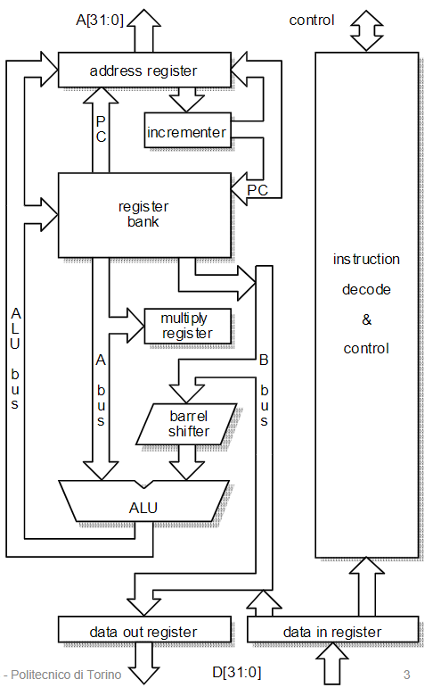{width=300px}

Il barrel shifter consente di eseguire gli shift in modo automatico del secondo registro di una operazione senza utilizzare una istruzione apposita.

## Data Processing

### Istruzioni reg-reg

Quando viene eseguita una istruzione da registro a registro:

- due operandi vengono letti dai registri `Rn` ed `Rm`
- un operando potrebbe essere _"ruotato"_ (0x00000A => 0x000A00)
- la _ALU_ genera il risultato
- il risultato viene scritto nel registro `Rd`
- la prossima istruzione viene recuperata dalla memoria
- il Program Counter viene aggiornato

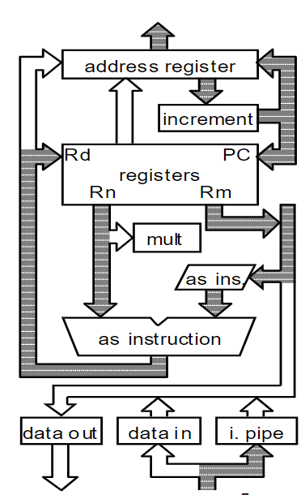{300px}

### Istruzioni reg-imm

Quando viene eseguita una istruzione registro-immediato:

- un operando viene letto dal registro `Rn`, l'altro è immediato
- un operando potrebbe essere _"routato"_
- la _ALU_ genera il risultato
- il risultato viene scritto nel registro `Rd`
- la prossima istruzione viene recuperata dalla memoria
- il Program Counter viene aggiornato

## Data Transfer Instructions

Le istruzioni di trasferimento dati richiedono due cicli di esecuzione nello stage di esecuzione. Nel primo viene calcolato l'indirizzo utilizzando un registro e un immediato, mentre nel secondo avviene  un accesso in memoria nel quale viene trascritto il dato.


## Branch instructions

Prima viene calcolato l'indirizzo target, aggiungendo un immediato (shiftato di due posizioni) al program counter, dopo la pipeline viene svuotata e riempita nuovamente.

## branch and link instructions

In questo caso, un clock aggiuntivo è necessario in quanto è necessario salvare l'indirizzo di ritorno in `r14`.


## ARM Cortex M3

L'architettura del cortex M3 è rappresentata di seguito:

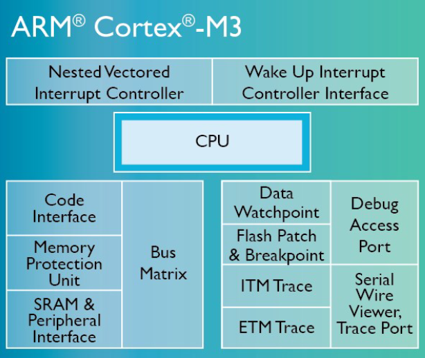{width=400px}

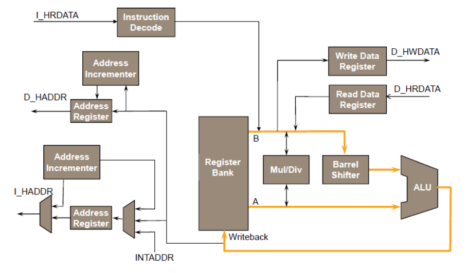{width=400px}

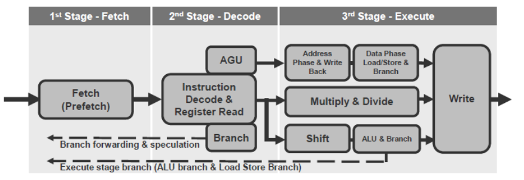{width=400px}

I salti sono un problema in quanto richiedono 3 cicli per essere completati. Nel caso peggiore, il salto indiretto viene preso e avviene sempre che la pipeline viene svuotate e riempita. Inoltre, non è supportatoto il delayed branch mechanism.

Quando leggiamo della memoria perdiamo un ciclo di clock.

  

## Programmer View

Sono messi a disposizione:

- 18 registri a 32 bit 
- handling delle interuzzioni efficiente
- power managemnet enable idle mode 
- efficient debug and development support features
- grande support del sistema (user/supervisor)
- realizzato per essere completamente programmabile in C

L'instruction set thumb (processori con `T` nell'acronimo) sono a 16 bit, sono meno potenti e in numero minore.

Thumb2 venne aggiunto da ARM nel 2003 come suoerset di Thumb (garantendo retrocombabilità) e include nuove istruzioni a 16 bit e alcune a 32 bit. E' più veloce della prima versione ma riesce a mantenere la dimensione del codice molto compatta.

## Bus

Il AMBA bus system prevede 3 bus:

- AHB: Advanced High Performance Bus
- ASB: Advanced System Bus
- APB: Advanced Peripheral Bus

## Memory map

La memoria è mappata in 4gb (derivanti dai 32 bit di indirizzi) e la bus matrix viene acceduta mediante i bus AHB e PPB.

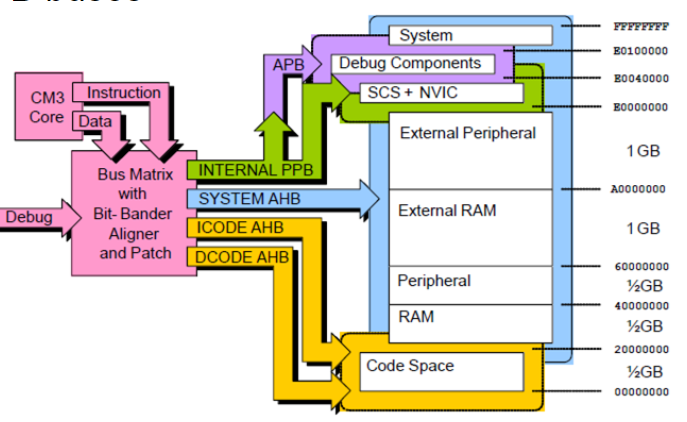{width=400px}

 {width=400px}

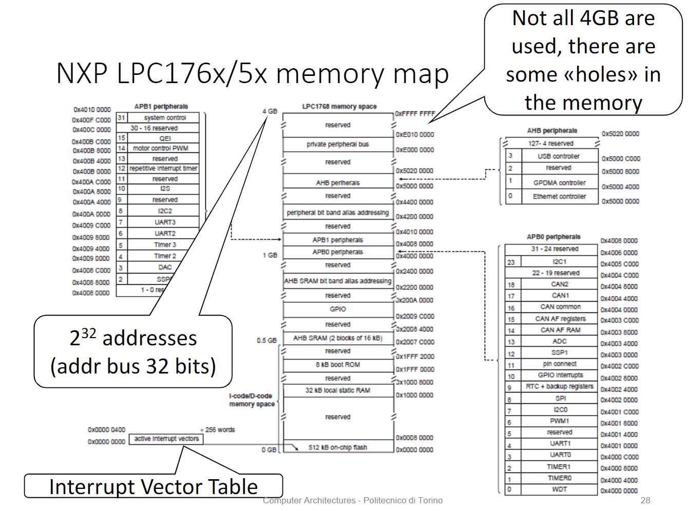{width=400px}

## Exception

Le eccezioni sono le seguenti:

- Reset
- NMI
- Faults
  - hard fault
  - memory manage
  - bus galut
  - usage fault
- SVCall
- Debug Monitor
- PendSV
- SysTick Interrupt
- External Interrupt

## Interrupt

E' supportata una interruzione non mascherabile INTNMI. Insieme al processore è presente un Nested Vectored Interrupt Controller (NVIC) che supporta fino a 240 interrruzioni esterne.

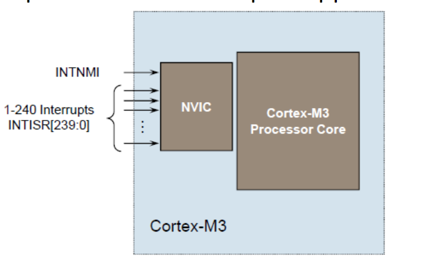{width=400px}

## Clock distribution

I sistemi come come arm v7-M hanno bisogno di due clock:

- uno ad alta frequenza per la CPU e le componenti veloci
- uno a bassa frequenza per i core periferici che necessitano di meno performance o che operano a velocità limitate. 

Il clock della CPU (CCLK) e il clock periferico (PCLK) ricevono il clock input da un PLL (Phase Lock Loop), VPB (VLSI Peripheral Bus) Divider o da un clock esterno.

## Power management

Dal punto di vista energetico sono supportate più modalità di sleep:

- sleep now
- sleep on exit
- deep sleep

## Istruzioni

Il cortex M3 supporta il clock in tutte le modalità, anche da una fonte esterna. E' inoltre presente un Wake-UP Interrupt Controller (WIC), overo una fonte esterna di wake-up che permette al processore di spegnersi completamente. Effective with State-Retention / Power Gating (SRPG) methodology.

Le istruzioni sono a 32 (o 16) bit e possono essere eseguite in modo condizionale. E' presente una architettura di load/store, con la caratteristica che le istruzioni di processazione di dati avvengono solo su registri. Il formato utilizzato prevede 3 operandi e combina ALU e shifter. L'accesso alla memoria avviene con istruioni dotate di auto-indexing.

L'instruction set può essere esteso attraverso dei coprocessori.

In particolare il cortex M3 prevede l'utilizzo di 18 registri a 32 bit che supportano come tipi di dato il byte (8 bit), halfword (16 bit) e word (32 bit).

Il program ounter è il registro `r15`. Quando il processore è eseguito in ARM state tutte le istruzioni sono lunghe 32 bit e sono allineate a word. Per questo motivo, il PC value è salvato nei bit `[31:2]` con i bit `[1:0]` pari a `0`.

A differenza di molti altri processori come 80x86, ARM consente la scrittura diretta del Program Counter attraverso il registro `R15`.

### Link register (R14)

Il link register è il registro `r14`, che viene utilizzato per memorizzare l'indirizzo di ritorno quando il branch con operazioni link vengono eseguite, calcolate a partire dal `PC`.

Per ritornare da un linked branch è sufficiente eseguire `MOV r15, r14` oppure `MOV pc, lr`.


### Stack pointer (R13)

Il registro `r13` viene uitlizzato come stack pointer e viene aggiornato automaticamente, in particolare a tempo di boot viene recuperato dal Interrupt Vector Table oppure si aggiorna quando il programma esegue una istruzione stack oriented.

### Program Status register (R12)

Il Program Status Register è suddiviso in 3 registri:

- Application Program Status Register (APSR)
- Execution Program Status Register (EPSR)
- Interrupt Program Status Register (IPSR)

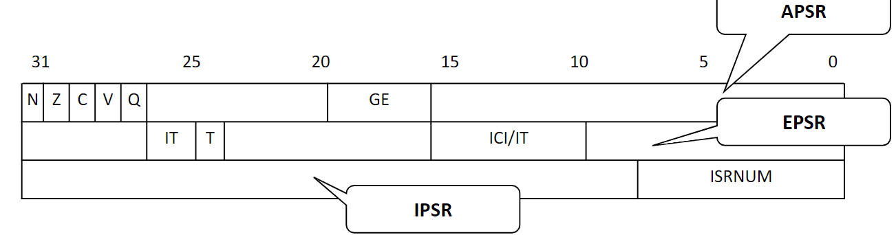{width=400px}

I flag di stato sono:

- N: **N**egative
- Z: **Z**ero
- C: **C**arry
- V: o**V**erflow
- Q: Saturation

### Esecuzione condizionale

La maggior parte delle set instruction permette ai branch di essere eseguite in modo condizionale.

Riutilizzando il condition evaluation hardware, ARM incrementa il modo significativo il numero di istruzioni. tutte le istruzioni contengono un campo condizionale che determina se la cpu le eseguirà o meno. Le istruzioni non eseguite richiedono un ciclo, in quanto necessitano di completare il ciclo per consentire il corretto fetching e decoding delle prossime istruzioni.

Questo permette di rimuovere la necessità di molti branch, che causano lo stallo delle pipeline (3 cicli per il refill). Ciò comporta un _very dense in-line code_ e la penalità di non eseguire le istruzioni condizionali è compensata dal fatto che non è necessario eseguire il branch.

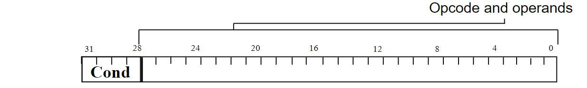{width=400px}

Codice | Significato
-------|------------------------------------------
`EQ`   | Equal
`NE`   | Not equal
`CS`   | Carry set (identical to HS), il carry vale `1`
`HS`   | Unsigned higher or same (identical to CS)
`CC`   | Carry clear (identico a LO), il carry vale `0`
`LO`   | Unsigned lower (identical to CC)
`MI`   | Minus or negative result
`PL`   | Positive or zero result
`VS`   | Overflow
`VC`   | No overflow
`HI`   | Unsigned higher
`LS`   | Unsigned lower or same
`GE`   | Signed greater than or equal
`LT`   | Signed less than
`GT`   | Signed greater than
`LE`   | Signed less than or equal
`AL`   | Always (this is the default


To execute an instruction conditionally, simply 
postfix it with the appropriate condition:
•For example an add instruction takes the form:
• ADD r0,r1,r2 ; r0 = r1 + r2 (ADDAL)
•To execute this only if the zero flag is set:
• ADDEQ r0,r1,r2 ; If zero flag set then...
; ... r0 = r1 + r2
•By default, data processing operations do not affect 
the condition flags (apart from the comparisons 
where this is the only effect). 

To cause the condition flags to be updated, the S bit of the instruction needs to be set by postfixing the instruction (and any condition code) with an **S**.
ADDS r0,r1,r2 ; r0 = r1 + r2 
; ... and set flags

:::warning
Molto importante!
:::

## Operazioni aritmetiche

### Moltiplicazione

Moltiplicazione con risultato su 32 bit:

```asm
MUL <Rd>, <Rn>, <Rm>
```

Moltiplicazione con risultato **unsigned** su 64 bit:

```asm
UMULL <Rd1>, <Rd2>, <Rn>, <Rm>
```

Moltiplicazione con risultato **signed** su 64 bit:

```asm
SMULL <Rd1>, <Rd2>, <Rn>, <Rm>
```

:::note
**Nota**: Non ci sono differenze tra signed ed unsigned su 32 bit
:::

:::warning
**Attenzione**: tutti gli operandi devono essere registri.
:::

## Moltiplicazione con accumulazione

- ```MLA <Rd>, <Rn>, <Rm>, <Ra>```
	Rd = Rn * Rm + Ra
- ```MLS <Rd>, <Rn>, <Rm>, <Ra>```
	Rd = Rn * Rm – Ra
- ```UMLAL <Rd1>, <Rd2>, <Rn>, <Rm>```
	Rd1,Rd2 = Rn * Rm + Rd1,Rd2
- ```SMLAL <Rd1>, <Rd2>, <Rn>, <Rm>```
	uguale a `UMLAL`, ma con valori con segno


## Divisione

### Divisione senza segno (unsigned)

```asm
UDIV <Rd>, <Rn>, <Rm>
```

### Divisione con segno (signed)

```asm
SDIV <Rd>, <Rn>, <Rm>
```

- If Rn is not exactly divisible by Rm, the result is rounded toward zero.
- UDIV and SDIV do not change the flags (the suffix ‘S’ can not be added)


## Shift

### Logical Shift Left (LSL)

```asm
LSL <Rd>, <Rn>, <op2>
```

{width=400px}

### Logical Shift Right (LSR)

Lo shift avviene come ci aspettiamo, inserendo nel bit più significativo degli zeri e spostando il meno significativo nel carry.

```asm
LSR <Rd>, <Rn>, <op2>
```

{width=400px}

### Arithmetic Shift Right (ASR)

```asm
ASR <Rd>, <Rn>, <op2>
```

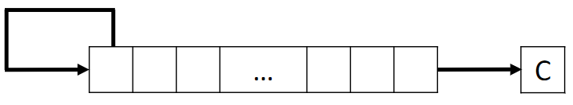{width=400px}

## Rotazioni

Le istruzioni di rotazione operano nel seguente modo:

### Rotate Right (ROR)

```asm
ROR <Rd>, <Rn>, <op2>
```

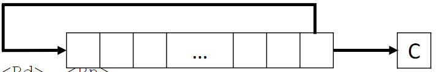{width=400px}

### Rotate Right with Extend (RRX)

```asm
RRX <Rd>, <Rn>
```

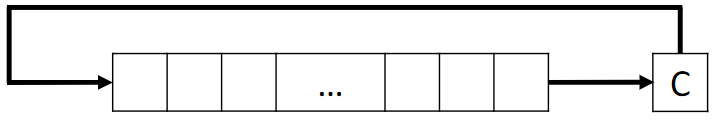{width=400px}
