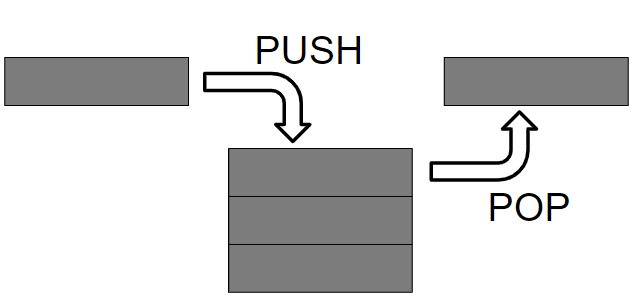
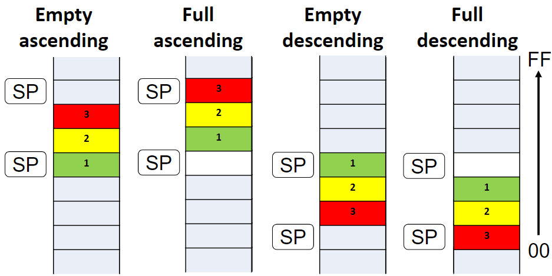
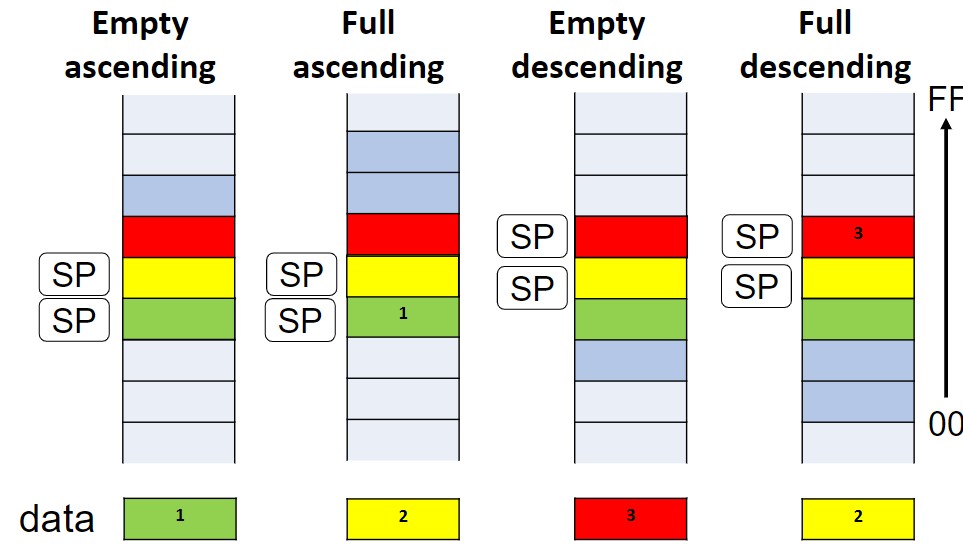
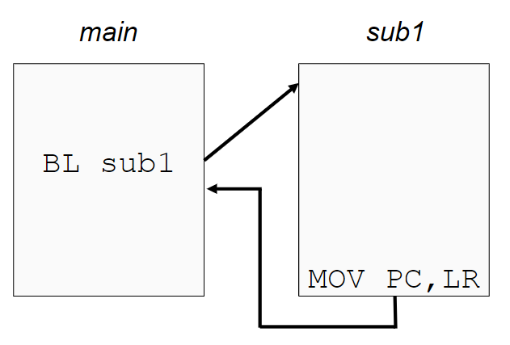
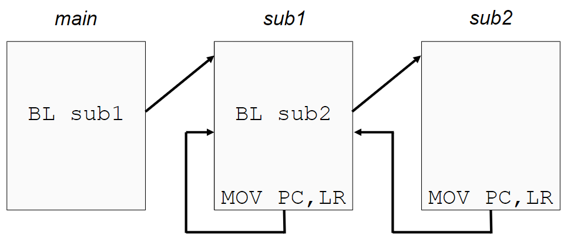
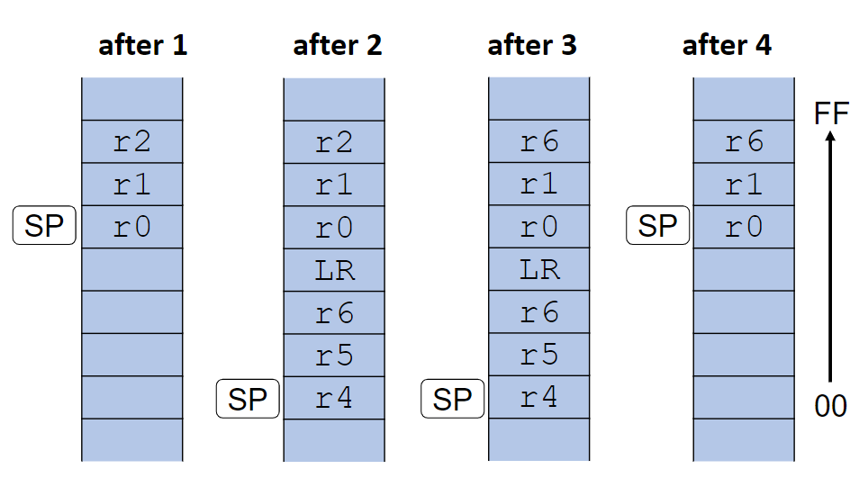
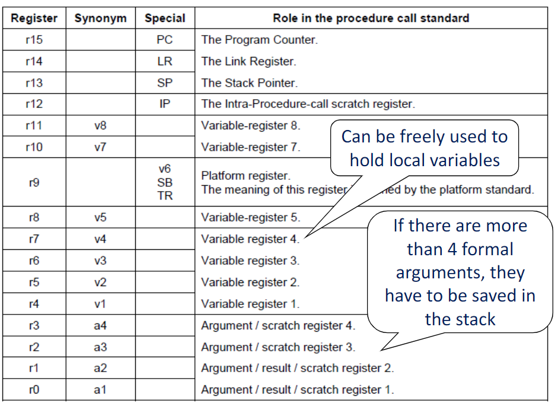

# Stack e subroutines
<!-- lezione24: -->

Lo stack ha una organizzazione di tipo _Last In - Fist out_, ovvero **LIFO**. I dati sono sempre _inseriti_ (scritti) ed _estratti_ (letti) dal top della pila. Lo **stack pointer** contiene l'indirizzo del top dello stack.

{width=400px}

Lo _stack pointer_ viene aggiornato dopo ogni push e può essere di due tipi:

- **discendente**: l'indirizzo del top della pila diminuisce dopo ogni push
- **ascendente**: l'indirizzo del top della pila aumenta dopo ogni push

Mentre il contenuto del top dello stack può essere anch'esso di due tipi:

- **empty stack**: lo stack pointer punta all'entry dove il nuovo dato dovrà essere inserito
- **full stack**: lo stack pointer punta all'ultimo elemento inserito

{width=400px}

:::note
**Nota**: il nostro stack è _full descending_.
:::

{width=400px}

## LDM e STM

Le istruzioni di **LDM** e **STM** sono usate per caricare e salvare più registri contemporaneamente.

```asm
LDM{xx}/STM{xx} <Rn>{!}, <regList>
```

Dove i parametri sono i seguenti:

- `Rn` è il base register
- `xx` specifica il metodo di indirizzamento, come e quando rn viene aggiornato durante l'istruzione
  - con `!`: `Rn` viene settato al nuovo valore
  - senza `!`: `Rn` viene impostato al valore iniziale
- `regList`: lista di registri

Una lista di registri possono essere:

- **consecutivi**: indicati separati dal valore inziale e finale mediante una dash
- non **consecutivi**: registri separati con una `,`

Esempi:

```asm
{r0-r4, r10, LR}
```

Indicano `r0`, `r1` `r2` , `r3`, `r4`, `r10`, `r14`.

:::error
**Importante**: `SP` può non apparire nella lista mentre `PC` può essere presente solo con `LDM` e solamente in assenza di `LR`.
:::

### Ordine

L'ordine con cui vengono scritti i registri non è importante, questi sono automaticamente ordinati in ordine crescente:

- il registro èiù basso è salvato/caricato dal pià basso indirizzo
- il registro più alto è salvato/caricato dal pià alto indirizzo

Esempio: `{r8, r1, r3-r5, r14}` indica `r1, r3, r4, r5, r8, r14`.

### Metodi di indirizzamento

I metodi di indirizzamento possibili sono due:

- `IA`: increment after (default)
    1. L'indirizzo a cui eseguire l'accesso è indicato nel base register
    2. Il base register è incrementato di 1 word (4 byte)
    3. Se non ci sono registri nella lista, torna al punto uno
- `DB`: decrement before
    1. Il base register è decrementato di 1 word (4 byte)
    2. L'indirizzo a cui eseguire l'accesso in memoria è indicato nel base register
    3. Se non ci sono registri nella lista, torna al punto 1

### PUSH e POP

Le istruzioni di PUSH e POP facilitano l'utilizzo di un full descending stack:

- `PUSH <regList>` ha il medesimo significato di `STMDB SP!, <regList>`
- `POP <regList>` ha il medesimo significato di `LDMIA SP!, <regList>`

## Subroutines

Una subroutine viene chiamata con `BL <label>` e `BLX <Rn>`, in particolare viene scritto l'indirizzo della prossima istruzione in LR e il valore di label o Rn in `PC`.

Una procedura **reentrant** finisce con un branch all'indirizzo salvato in `LR`. 

E' possibile, facoltativamente, inziare e terminare una subroutine con le direttive `PRC/FUNCTION` e `ENDP/ENDFUNC`.

{width=400px}

Questo funzionamento genera però problemi nel caso in cui siano presenti delle chiamate annidate, in quanto il valore in `LR` viene **sovrascritte** non rendendo possibile per sub1 tornarne al main.

{width=400px}

### Chiamate annidate a subroutines

Invece di cambiare il valore di `LR` quando avvengono delle chiamate annidate, la nuova chiamata potrebbe cambiare il valore utilizzato nel registro della procedura precedente.

Tutte le subroutine dovrebbero salvare `LR` e gli altri registri utilizzati come prima istruzione e ripristinarli come ultima istruzione: 

```asm
PUSH {regList, LR}
// ...
POP  {regList, PC}
```

### Passaggio di parametri

E' possibile passare alle funzioni dei parametri, in particolare sono possibili tre approcci:

- tramite **registro**
- tramite **referenza**, ad esempio un indirzzo salvato in un registro
- tramite lo **stack**

#### Referenza

```asm
     MOV r0, #0x34
     MOV r1, #0xA3
     LDR r3, =mySpace
     STMIA r3, {r0, r1}
     BL sub2
     LDR r2, [r3]
     ; r2 contains the result

sub2 PROC
     PUSH {r2, r4, r5, LR}
     LDMIA r3, {r4, r5}
     CMP r4, r5
     SUBHS r2, r4, r5
     SUBLO r2, r5, r4
     STR r2, [r3]
     POP {r2, r4, r5, PC}
     ENDP
```

#### Stack

```asm
MOV r0, #0x34
MOV r1, #0xA3
PUSH {r0, r1, r2}
BL sub3
POP {r0, r1, r2}
; r2 contains the result
...
stop B stop
...

sub3 PROC
PUSH {r6, r4, r5, LR}
LDR r4, [sp, #16]
LDR r5, [sp, #20]
CMP r4, r5
SUBHS r6, r4, r5
SUBLO r6, r5, r4
STR r6, [sp, #24]
POP {r6, r4, r5, PC}
ENDP
```

{width=400px}

## ABI
<!-- lezione25: 24-11-2022 -->

Un Application Binary Interface è un interfaccia che si pone tra due program binary modules (spesso una libreria e un programma eseguito da un utente).

Un aspetto comune di un ABI sono le **calling convention**, che determinano come i dati sono trasmessi in input oppure letti in output dalle _computational routines_.

{width=450px}

I primi 4 registri r0-r3 (a1-a4) sono utilizzati come argomenti per le subroutine e il valore di ritorno di da una funzione. Una subroutine deve sempre preservare il contenuto dei registri `r4-r8`, `r10`, `r11` e `SP`.

Lo standard base proeede du passare gli arcomenti nei core registers (r0-r3) e nello stack. Per le subroutine che richiedono un piccolo numero di parametri, solo i registri sono utilizzati, riducendo in modo significativo l'overhead delle chiamate.

Come già detto lo stack è _full-descending_, con il current extent dello stack mantenuto nel registro`SP` (`R13`).

E' possibile creare delle variabili locali nello stack nello stesso modo in cui salviamo i dati, semplicemnte sottraendo il numero di byte richiesti da ciascuna variabile dallo _stack pointer_.