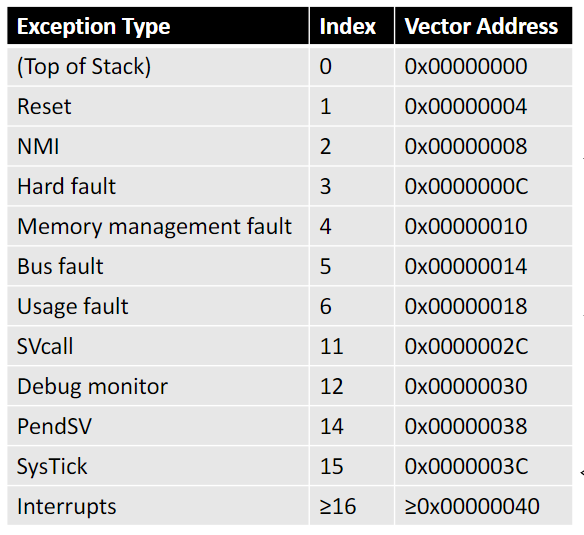
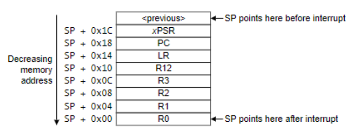
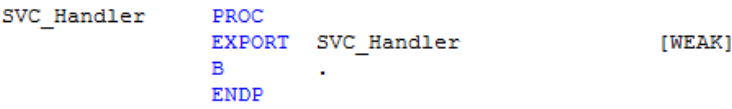
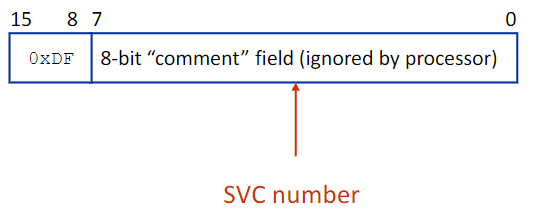
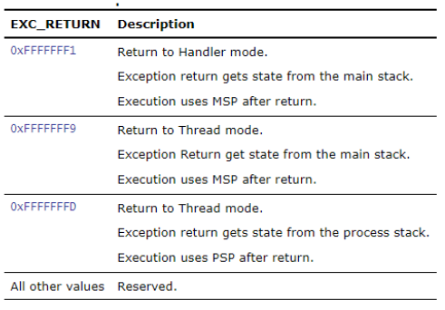

# Supervisor Calls (SVC)

I termini di _eccezioni_ e _interruzioni_ sono spesso confusi:

- **eccezione**: soloitamente fa riferimento a un evento interno della CPU come un floating point overflow, MMU fault, trap _(solitamente quindi fa riferimento al sw)_.
- **Interrupt**: fa riferimento a un evento esterno di U/O come I/O device request e reset _(solitamente quindi fa riferimento al hw)_.

Nelle architetture arm le istruzioni ASM che rilasciano interruzioni software sono le **SVC**.

:::note
Non abbiamo in ARM istruzioni per la gestione di numeri reali.
:::

- Reset
- NMI
- Faults
	- Hard Fault
	- Memory Management
	- Bus Fault
	- Usage Fault
- SVCall
- Debug Monitor
- PendSV
- SysTick Interrupt
- External Interrupt

La interrupt vector Table (IVT) è una tabella che permette di determinare quali procedure gestiscono ciascuna eccezione.

{width=200px}

Una **Undefined Instruction** (UDF) è una istruzione non definita, che potrebbe essere voluto.

**SysTick** è una eccezione che viene rilasciata dal timer di sistema quando viene raggiunto lo zero. In un sistema operativo, il processore può utilizzare queste eccezioni come system tick.

:::attention
**Attenzione**: E' necessario sapere bene per l'esame come funziona SVC.
:::

## Stato delle eccezioni

Le eccezioni possono trovarsi in 3 differenti stati:

- **inattiva**: l'eccezione non è attiva o pendente
- **attiva**: l'eccezione è attualmente in servizio dal processore ma non è stata completata
- **pending**: l'eccezione è in attesa di essere servita dal processore

Quando una eccezione viene eseguita, il processore salva le informazioni nello stack corrente. Qeusta operazione è denominata **stacking** e la struttura di 8 parole è chiamata **stack frame**.

{width=200px}

Gli handler di default sono dichiarati come _weak symbols_ per consentire all'application writer di installare i propri handler semplicemente implementando una funzione con il il nome corretto. Se avviene una interruzione di cui non è stato definito un handler dall'application writer allora viene eseguito quello di default. Il default interrupt handler sono tipicamente implementati come loop infiniti. Se una funzione termina con un handler di default, è prima necessario determinare quale interrupt è in esecuzione.

{width=400px}

## Supervisor Calls Syntax

Le supervisor calls sono normalmente utilizzate per fare richieste di poerazioni privilegiato o accedere a risorse di sistema da un sistema operativo. Come gli ARM cores precedenti è presente una istruzione `SVC` _(Formalmente `SWI`)_ che genera una supervisor call. 

La chiamata viene fatta nel seguente modo:

```asm
{label} SVC immediate
```

L'istruzione SVC ha un numero al suo interno denominato **SVC number**. Questo viene utilizzato per indicare chi sta chiamando la richiesta ed è un numero intero su 8 bit da 0 a 255.

{width=400px}

Sui core ARM precedenti dovevi estrarre il numero SVC dall'istruzione utilizzando l'indirizzo di ritorno nel collegamento register e gli altri argomenti SVC erano già disponibili da R0 a R3.

Sul Cortex-M3, il core salva i registri degli argomenti nello stack sull'iniziale
voce di eccezione. Qualsiasi valore restituito deve essere restituito al chiamante mediante modifica
i valori del registro impilati. Per fare ciò, deve essere presente un breve pezzo di codice assembly
implementato come inizio del gestore SVC. Per identificare in quale stack sono stati salvati i registri per estrarre il numero SVC dall'istruzione.

## Exception return

Il processore salva un **EXC_RETURN** value nel `LR` una volta che l'eccezione comincia. Questo meccanismo di eccezione si basa sul valore determinato quando il processore ha completato l'exception handler. I bit [31:4] di un sono sempre `0xFFFFFF`.

{width=400px}

Quando il processore carica nel PC un valore che fa il match con il pattern di una *EXC_RETURN* riconosce che l'operazione non è un normale branch e, invece, che l'eccezione è stata completata. Per questo motivo, se se comincia ritorna una sequenza.

I bit [3:0] Del *ECX_RETURN* indicano il modo in cui il processore deve ritornare al chiamante.

## Processor Specific Configuration

L'istruzione che segue consente di abilitare l'aggiornamento di registri per utilizzo spaciale quando si ha un livello privilegiato:

```asm
MSR {cond} spec_reg, Rn
```

I valori sono i seguenti:

- `cond`: è un condition code opzionale
- `Rn`: specifica il registro sorgente
- ``spec_reg``: è uno dei seguenti registri `PSR`, `IPSR`, `EPSR`, `IEPSR`, `IAPSR`, `EAPSR`, `PSR`, 
`MSP`, `PSP`, `PRIMASK`, `BASEPRI`, `BASEPRI_MAX`, `FAULTMASK`, `CONTROL`


## Processor Modes

Esistono due modalità operative:

- **thread mode**: on reset o dopo una eccezione
- **handler mode**: quando avviene una eccezione

Esistono anche due livelli di accesso:

- **user level**: accesso limitato alle risorse
- **privleged level**: acesso a tutte le risorse

L'handler mode è sempre privilegiato.

## Control Register

Il **control register** utilizza i seguenti bit:

- **CONTROL**[2], solo su cortex-M4 e cortex-M7, se vale 0 allora FPU non è attiva altrimenti si
- **CONTROL**[1]:
  - se vale `0` in handler mode allora MSP è selezionato (non sono possibili alternate stack per l'handelr mode). 
  - Se vale `0` in thread mode allora il default stack pointer `MSB` verrà utilizzato
  - se vale `1` in thread mode allora l'alternate stack pointer `PSP` verrà utilizzato
- **CONTROL**[0]: non presente in cortex-M0, se vale `0` allora il processore è in thread mode in uno stato privilegiato, se vale `1` allora è in handler mode e in stato utente

A tempo di reset dopo le inizializzazioni è possibile impostare il processore in _user mode_.

```asm
MOV R0, #3
MSR CONTROL, R0
```

Questa istruzione porta il sistema in uno stato non privilegiato e thread mode, utilizzando il Process Stack Pointer (PSP). A causa dell'ingresso in una procedura di handling il sistema si sta muovendo a uno stato privilegiato e in handler mode, utilizzando il master stack pointer (MSP).

Un esempio:

**STACK segment**

```asm
Stack_Size EQU     0x00000200
AREA    STACK, NOINIT, READWRITE, ALIGN=3
SPACE   Stack_Size/2
Stack_Process SPACE   Stack_Size/2
__initial_sp
```

**CALLER**

```asm
MOV R0, #3
MSR CONTROL, R0
LDR SP, =Stack_Process
SVC 0x10
```

**HANDLER**

```asm
STMFD SP!, {R0-R12, LR}
MRS R1, PSP
LDR R0, [R1, #24]
LDR R0, [R0,#-4]
BIC R0, #0xFF000000
LSR R0, #16
LDMFD SP!, {R0-R12, LR}
BX LR
```