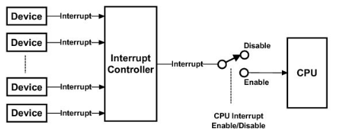
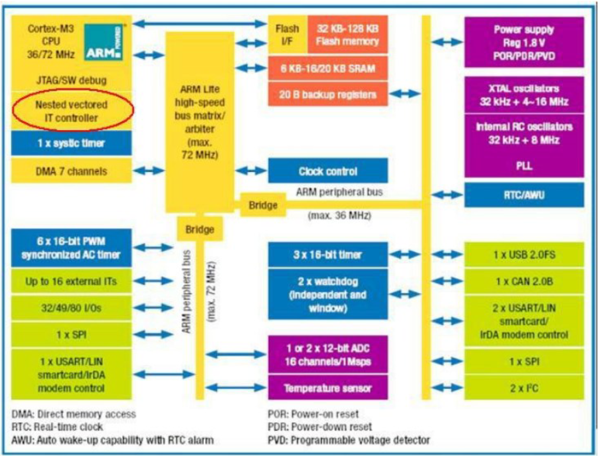

# Interrupt controller

Per gestire le periferiche sono possibili due approcci:

- polling
- interrupt

Le categorie di eventi di sistema possono essere:

- eventi poco frequenti ma importanti
- I/O synchronization
- periodic interrupts
- data acquisition samples ADC

## Polling

Il polling è un approccio in cui il processore controlla periodicamente lo stato di un dispositivo. Il polling è un approccio semplice ma inefficiente. Il polling è un approccio in cui il processore controlla periodicamente lo stato di un dispositivo. Il polling è un approccio semplice ma inefficiente.

Per determinare se è disponibile o meno si controlla lo status register _(best practice)_ oppure verificando i data registers.

Spesso viene implementato direttamente in software mediante l'utilizzo di un ciclo che esegue una sequenza di check in modo più o meno frequente.

:::tip
Le caratteristiche principali sono:

- la maggior parte del tempo è spesa in un ciclo software (infecciente energetica)
- facili da implementare
- alta latenza
- difficile gestione delle richiesta annidate (low performance)
:::

## Interrupt

Le periferiche possono comunicare direttamente con la CPU mediante le interruzioni, implementate in hardware. In questo modo è possibile entrare in uno stato di sospensione (idle) e il sistema si _risveglia_ quando un evento di sistema si verifica.

Quando viene ricevuta una richiesta, la cpu ha bisogno di riconoscere la sorgente in modo da eseguire il corretto handler. 

L'architettura attualmente presa in esame prevede l'implementazione di una gestione vettorizzata delle interruzioni meditante l'utilizzo della **IVT** (Interrupt Vector Table).

La CPU collabora con i dispositivi esterni mediante l'**interrupt controller**.

Per configurare la modalità interrupt è necessario a tempo di boot inizializzare le strutture dati come conters, pointers ed eventualmente specificare un flag che consente di abilitare le interrupt (semafori). Inoltre, è necessario configurare l'interrupt controller abilitando le sorgenti e impostando la priorità di ogni sorgente. Questo dovrà essere fatto in ogni routine di servizion per le interruzioni.

Anche a runtime è necessario un acknowledge pulendo i flag che indicano le interruzioni attive, che può essere effettuato in parti differenti della routine.

E' necessario mantenere il contenuto di R4-R8, R10-R11 (ABI APAPCS) e comunnicando attraverso variabili globali condivise.

## Controller

Un interrupt controller è un dispositivo che viene utilizzato per combinare diverse sorgenti di interruzioni in una o più linee della cpu, consentendo di gestire più livelli di priorità che possono essere assegnati agli interrupt outputs. 

Consente la gestione dei segnali di interruzione ricevuti da più dispositivi combinandoli in un solo interrupt output.

{width=200px}

### NVIC

L'interrupt vettoriale annidato Il controller (NVIC) è parte integrante
parte del Cortex-M3.

- Lo stretto accoppiamento con la CPU consente interruzioni basse latente ed efficiente elaborazione del ritardo in arrivo delle interruzioni
- gestisce 35 possibili interruzioni esterne

{width=400px}


#### Priorità - `NVIC_SetPriority`

Per impostare la priorità abbiamo a disposizione la funzione `NVIC_SetPriority()`.

```c
void NVIC_SetPriority(IRQn_Type IRQn, uint32_t priority);
```

Un valore minore di priorità significa una priorità superiore.