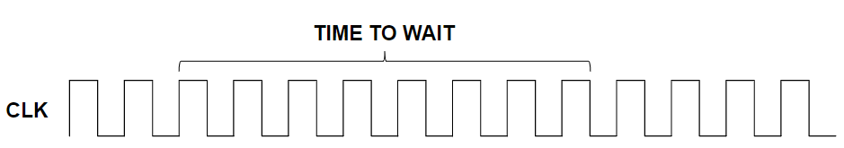
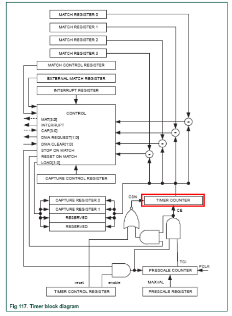

# Timer

<!-- lezione: 2022 --->

Un sistema potrebbe richiedere di aspettare per un periodo di tempo o eseguire operazioni a periodi regolari. Queste funzionalità potrebbero richiedere il supporto di periferiche denominate **timer**.

Il timer ha dunque lo scopo di consentire al programmatore di sincronizzare, basandosi sul conteggio, il sistema.

Solitamente quando un procedura di conteggio raggiunge la fine, il sistema regisce in qualche modo:

- tipicamente mediante un interrupt handler
- potrebbe entrare in una situazione di risparmio energetico da parte della cpu-

## Funzionamento

I timer sono dotati di un clock signal dedicato, attraverso il quale il timer incrementa il suo contatore.Hanno dei registri che possono essere programmati con un numero di clock cycle da contare.

{width=400px}

Un timer potrebbe seguire differenti modalità di funzionamento:

- **decreasing count**: si interrompe quando il contatore raggiunge 0
- **increasing count**: si interrompe quando il contatore raggiunge un valore massimo

$$ \text{time}[s] = \text{count} * \text{Clock\_Period}[s] $$
$$ \text{count} = \text{time}[s] / \text{Clock\_Period}[s] $$
$$ \text{count} = \text{time}[s] * \text{frequency}[1/s] $$

Se il tempo di attesa è troppo alto, potrebbe non rientrare all'interno del timer del registro. Per risolvere tale problema vengono, a seconda dei casi, adoperate soluzioni sia hardware che software:

- hw: cascade of counter
- hw: prescaler
- sw: handler software count of hw events

## LPC1768

Normalmente i SoC implementano più timer:

- standard timers: programmati dall'utente per implementare intervalli regolari e ritardi
- operating system timers: utilizzati dal sistema operativo per gestire i processi
- extra timers: danno al sistema operativo funzionalità specifiche come ripetitive interrupt timer e PWM

### Standard timers

Lo stanrd timer/counter è realizzato in modo da contare i cicli del pheriperical clock (PCLK) o di un clock esterno. Inoltre, può generare facoltativamente interruzioni o eseguire altre azioni per valori specifici del timer in base a 4 match registers.

Prevede 4 capture inputs per trap the timer value quando avviene una transizione del segale, generando opzionalmente una interruzione.

:::note
timer 0 e 1 sono di default.
:::

{width=400px}

#### Match registers

Sono presenti **4** registri a **32 bit** che permettono:

- **operazioni continue** con un interrupt opzionale su match
- **fermare** il timer su match con un interrupt opzionale
- **resettare** il timer su match con un interrupt opzionale
- generazione di una **unique interrupt**, l'ISR deve capire quale dei 4 match registers ha generato l'interrupt (leggendo il registro IR).

#### Capture registers

Una transizione può essere registrata da un pin configurato per caricare un dei capture registers. Con il valore del timer counter e opzionalmente genera un interrupt.

#### External match output

Quando un match register (MR3:0) è uguale a un timer counter (TC) questo output può essere toggled, andare basso, andare alto o non fare niente.

<!-- slide mancanti -->

## Utilità

### Accensione

Per accendere il timer 2 è necessario:

- aprire il file `system_LPC17xx.c` contenuto nella cartella `lib_SoC_board`
- andare dalle tab in basso nel `configuration wizard`
- cercare la voce `PCTIM2` e metterla a `1`

### Abilitazione

Per abilitare il timer 2 è necessario utilizzare la funzione `enable_timer(x);`, con `x` numero intero del timer da abilitare.
