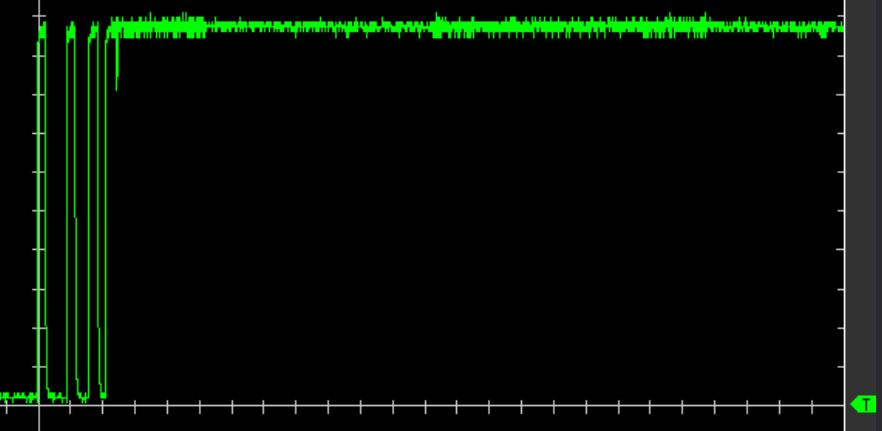
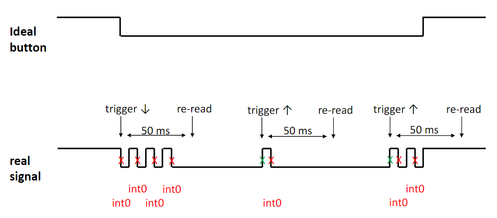
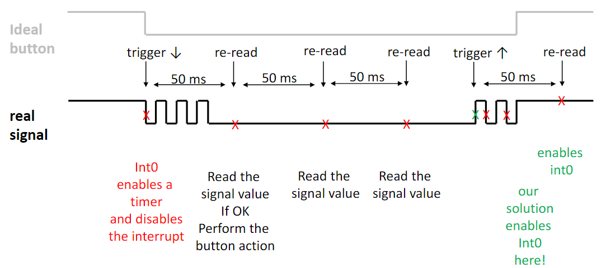
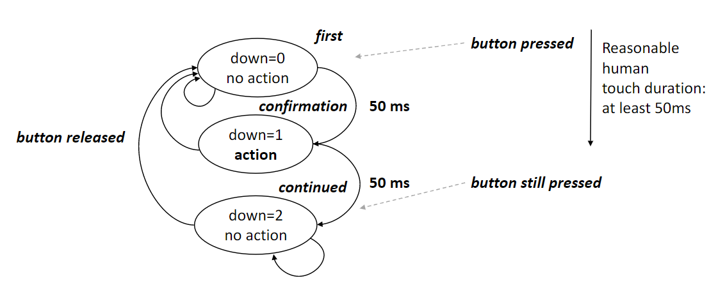

# Switch bouncing
<!-- lez31: -->

Quando un pulsante viene premuto oppure viene invertito un toggle switch, due parti metalliche si uniscono e apparentemente il contatto è immediato. Questo non è completamente corretto in quando all'interno degli switch esistono parti che si muovono.

Quando un pulsante viene premuto, prima avviene il contatto con l'altra parte metallica in un piccolo intervallo di microsecondi. Successivamente esegue un ulteriore contatto leggermente più più lungo e così via, solo alla fine gli switch sono completamente chiusi. Lo switch sta dunque rimbalzando tra "in contatto" e "non in contatto".

Solitamente il SoC lavora più velocemente del bouncing e per tale motivo l'hardware pensa che il pulsante venga premuto più volte.

{width=450px}

## Soluzione software

UN modo comune per risolvere lo switch bouncing è di rileggere il valore del pin dopo 50ms dal primo bounce. Per il pulsanti si preferisce utilizzare le interruzione (più efficiente energicamente in quanto si può entrare in power down mode), se non è disponibile viene utilizzato il polling (un timer può essere utilizzata pr svegliare il sistema a tempi regolari).

L'implementazione blocking delay non è consigliata, in particolare utilizzare for/while/do-while con blocchi vuoti è considerato profondamente errato.

Se il pin di interrupt mode è settato, questo potrebbe non essere direttamente leggibile. Per tale motivo, per poter leggere il valore del pulsante è necessario disabilitare lei interruzioni e accettare di leggere l'input value.

Quello che succede:

{width=450px}


Quello che vogliamo ottenere:

{width=450px}

Quanto detto può essere schematizzato nella seguente macchina a stati:

{width=450px}

## Repetitive Interrupt Timer (RIT)

Il RIT è un timer che consente di generare interruzioni a specifici intervalli, senza utilizzare lo standard timer.

```c
// RIT/IRQ_RIT.c
uint32_t init_RIT ( uint32_t RITInterval ){
	LPC_SC->PCLKSEL1  &= ~(3<<26);
	LPC_SC->PCLKSEL1  |=  (1<<26); //RIT Clock = CCLK 
	...
	lib_RIT.c
	RIT_cnt = 50ms * 100MHz
	RIT_cnt = 5.000.000 = 0x4C4B40
	...
}
```

:::error
**Nota bene**: il RIT di default è spento.
:::

:::tip
Experiment switch bouncing with your board and try to mitigate Key 
bouncing: they must use the external interrupt functionalities
Advanced -> Joystick: implement a «timer controlled polling strategy» 
also able to mitigate debouncing
Quite Advanced -> can you manage the pressur of many buttons or the 
contemporary use of buttons and Joystick?
Super-Advanced -> implement button and joystick debouncing by using 
the RIT only.
:::