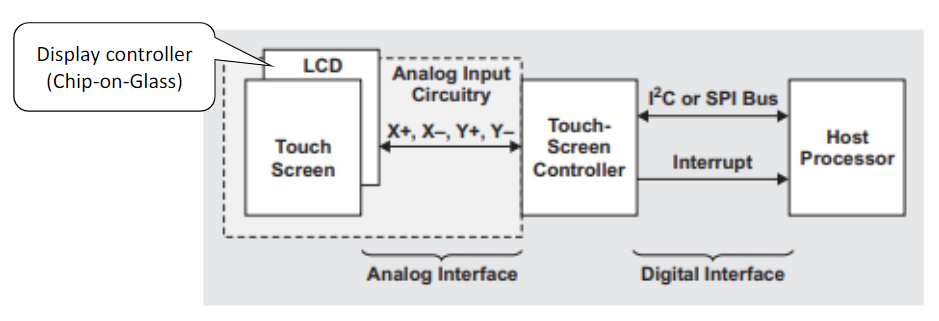
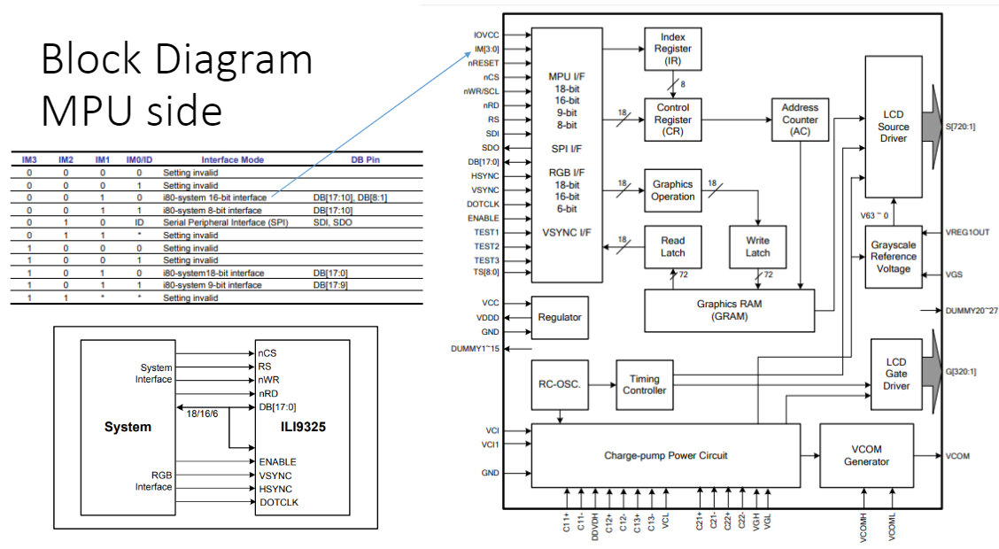
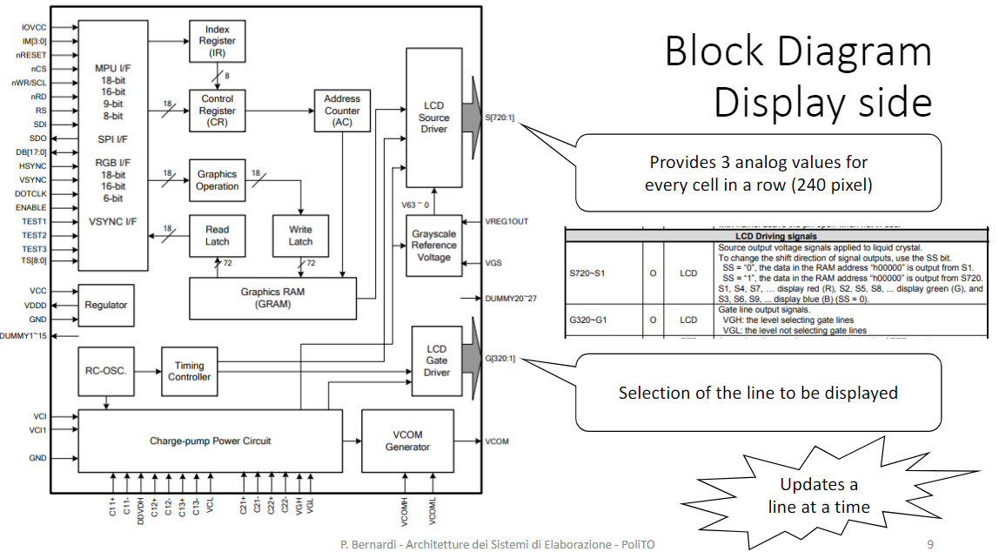
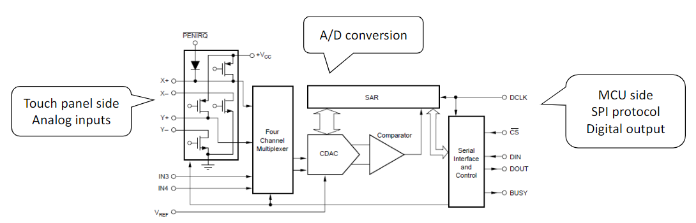
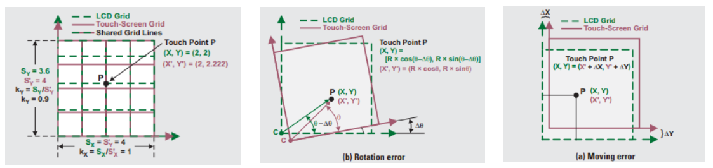
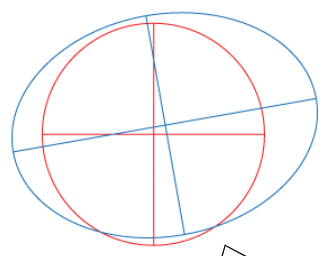

# Touch Display
<!-- lezione32: 2022-12-15 -->

Esistono vari tipi di display, in particolare quella che andremo a vedere è un display dotato di touchscreen. Le due componenti sono in realtà indipendenti e vengono gestite da due interfacce differenti.

{width=400px}

Le tipologie sono:

- LCD: liquid crystal display
- TFT LCD: thin film transistror liquid crystal display
- IPS LCD: in-plane switching liquid crystal display
- LED-backlit LCD: LCD con retroilluminazione a LED

Allo stesso modo anche le tecnologie relative al touchscreen sono diverse:

- resistivo
- capacitivo
- infrarossi
- surface acustic wave
- near field imagining
- light pens

:::note
**Nota**: Lo schermo che viene utilizzato è capacitivo e di tipo TFT LCD.
:::

## Display controller - ILI9325

- Single chip solution for a TFT LCD display
- 240RGBx320-dot resolution capable with real 262,144 display color
- Incorporates 720-channel source driver and 320-channel gate driver
- Internal 172,800 bytes graphic RAM
- High-speed RAM burst write function
- System interfaces
- i80 system interface with 8-/ 9-/16-/18-bit bus width
- Serial Peripheral Interface (SPI)
- RGB interface with 6-/16-/18-bit bus width (VSYNC, HSYNC, DOTCLK, ENABLE, DB[17:0])
- VSYNC interface (System interface + VSYNC)

:::danger
**Attenzione**: Non bisogna oltrepassare i 32kHz di frequenza di clock per il display.
:::

{width=400px}

{width=400px}

## Touch Screen Controller - ADS7843

- 4-wire touch screen interface
- ratiometric conversion
- single supply: 2.7v to 5v
- up to 125kHz conversion rate
- serial interface
- programmable 8- or 12-bit resolution
- 2 auxiliary analog inputs
- full power-down control

{width=400px}

Il display e il touch non sono perfettamente allineati e per tale motivo alla prima accensione deve essere calibrato. 

{width=400px}

Quando il dito viene tracciato dal display questo appare come un cerchio, ma in realtà il touch panel potrebbe salvare le coordinate come un ellisse. Tale problema può essere causato da alcune trsformazioni come: traslazione, rotazione e scalatura.

{width=250px}

