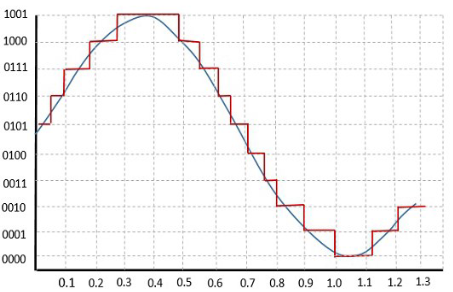
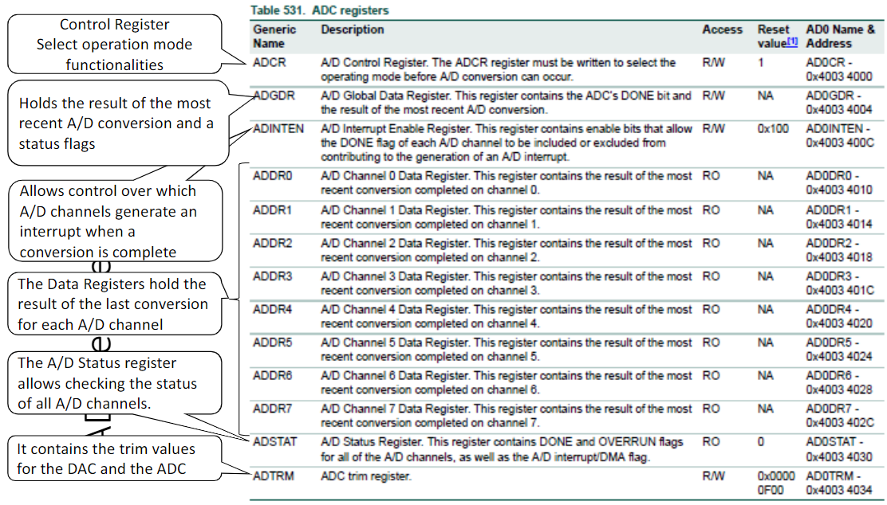
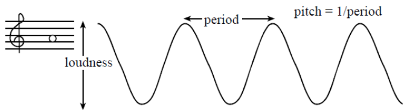

# Analog input and output

Spesso si rende necessaria la lettura di dati analogici mediante dei microcontrollori e microprocessori.

La digitalizzazione di un segnale analogico richiede la rappresentazione dei dati più vicini possibili a quelli analogici. In particolare si può utilizzare un sampling che sceglie alcuni puni del segnnale e li unisce per stabilizzare il valore. Questo processo è chiamato **Time and Amplitude Quantization**.

## ADC

La **time quantification** è ottenuta campionando il segnale analogico ad intervalli discreti. Questi sono solitamente spaziati nel tempo in intervalli denominati **intervalli di campionamento** (sampling intervals).

{width=400px}

La discretizazzione avviene in livello di quantizzazione, in cui lo spacing tra due campioni adiacenti è denominato **step-size** o **quantum**.

La risoluzione di un A/D converter (ADC) è specificato in bit e determina quanti punti differente in output può generare il convertitore ($2^n$).

### LPC1768 12-bit Analog to Digital Converter

E' un 12-bit ADC on-chip nel dispositivo LPC1768, dotato di 8 input channels multiplexed. Utilizza 2 valori di riferimento denominati **VREFN** (Ground voltage) to **VREFP** (typically 3 V). 

Il conversion rate è di 200kHz.

E' disponibile il powe-down mode e alcuni utilizzi più avanzati vedono l'utilizzo del burst conversion mode per singoli o multipli output e la conversione, opzional, sul transistro di un pin o su un segnale di Timer Match.

La frequenza del clock di input ha al massimo **13MHz** e la conversione richiede **65 cicli di clock**.

{width=450px}

Nella scheda il convertitore lo troviamo connesso al potenziometro mediante il piedino 31 della porta 1, ovvero `P1.31`. Come voltaggio di riferimento abbiamo 3.3V.

## DAC

In modo simile a quanto visto con i ADC, i DAC sono dispositivi che trasformano un segnale digitale in un segnale analogico. Il range è da 0 a 3.3V mentre la risoluzione dipende dal numero di bit del DAC. Data una precisione su n bit, i livelli sono $2^n$.

### LPC1768 10-bit Digital to Analog Converter

E' un DAC su 10bit all'interno del dispositivo LPC1768. Nel dettaglio ha una precisione di 1024 livelli con valori che variano da 0V a 3.3V, con un update reate massimo di 1MHz.

Sulla schede è presente uno speaker connesso sul pin `P0.26` ed è abilitato del **JP2 SPK**.

#### 10bit Sinusoidal table

Il suono può essere ottenuto fornendo ripetutamente un segnale sinusoidale campionato. Il volume e il petch vengono controllati dall'ampiezza e dalla frequenza. 

{width=300px}

## funzioni

### Init - `ADC_init()`

La funzione `ADC_init()` inizializza il convertitore ADC. 

