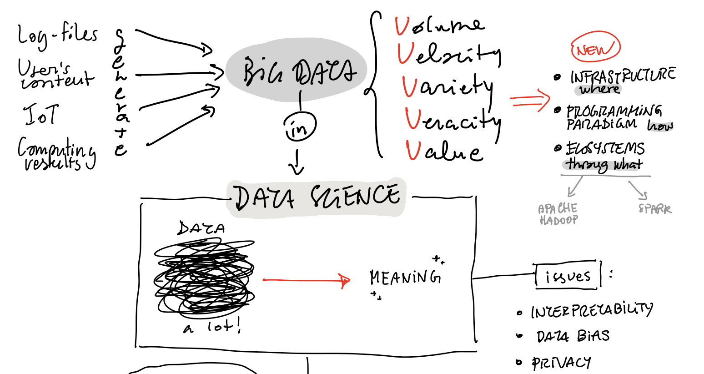
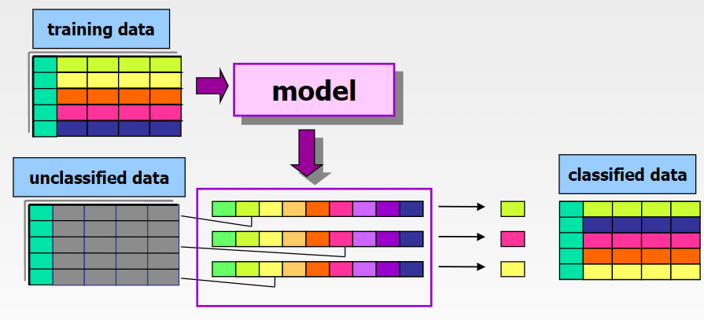
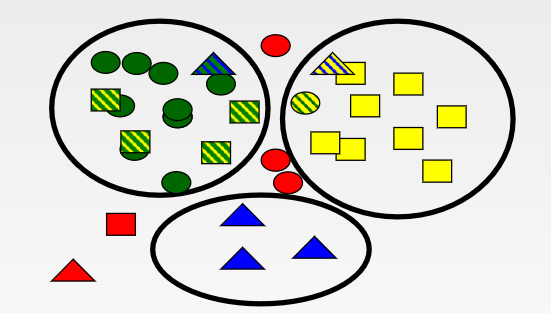

# Introduzione
<!-- Lezione 1 - 2022/09/28 -->

I **big data** sono dati la cui dimensione (grandi volumi di dati che scalano nel tempo), diversità (eterogenei e di diverso tipo) e complessità (sia temporale che spaziale) richiedono nuove architetture, tecniche, algoritmi e analitica che li gestiscano e che possano estrarre valore e conoscenza da essi (mediante viste personalizzate in base al target).

La maggior parte delle applicazioni utilizzano dato di tipo eterogeneo, raccolti in un _data center_ organizzato in modo da raccogliere flussi di dato diverso da fonti diverse e poterli elaborare. Il risultato non è uguale per tutti gli utenti in quanto potrebbe essere personalizzato.

I dati sono generati da:

- utenti, mediante social media ecc
- health and scientific computing
- log files
- internet of things

Il volume deve scalare del tempo e deve essere di grande dimensione, con un flusso che deve essere in continua crescita. Per fare ciò è necessario avere architetture, algoritmi e tecniche che consentono di analizzare e processare questi volumi di dati.

L'obbiettivo finale è quello di creare un nuovo valore al dato, in modo da offrire servizi più personalizzati per gli utenti migliorando l'esperienza.

## Le V del Big Data

I big data sono caratterizzati da quelle che vengono definite "Le 5 V", ovvero:

- **Volume**: il dato deve essere di grande dimensione, con un flusso che deve essere in continua crescita. Se il volume diminuisce, cala anche la nostra capacità predittiva (es diminuzione aerei per il covid).
- **Velocity**: la velocità di raccolta deve essere molto alto, con hardware e software in grado di gestire tale flusso. I dati di tipo streaming hanno bisogno di restituire il dato nel minor tempo possibile, con il near real time ovvero il minor tempo possibile (a seconda delle operazioni da svolgere sopra). I dati possono essere crowdsourceing (dispositivo invia dati che vengono raccolti) mentre mappe sono dati più statici.
- **Variety**: i dati che utilizziamo hanno formati e strutture differenti.
- **Veracity**: accuratezza, il dato deve essere di buona qualità in quanto se è scarsa non è possibile adoperarlo per le analisi. Va monitorato costantemente e verificato.
- **Value**: deve essere creato un valore aggiunto, trasformando il dato in un vantaggio business.

## Data Science

E' necessario utilizzare dei nuovi paradigmi di programmazione e nuove tecnologie, per tale motivo nasce la **Data Science**, ovvero un insieme di tecniche che consentono di estrarre conoscenza da grossi volumi di dati, mediante tecniche di statistica, machine learning ecc. Tale soluzione combina approcci tipici in modo da modellare una cosa che ha più sfaccettature.

{width=350px}

La data science prevede 4 fasi:

1. Generazione: I dati vengono generati in modi differenti
   1. Registrazione passiva: dati strutturati come transazioni, vendite
   2. Generazione attiva: dati non strutturati o semi strutturati (testi, immagini, video)
   3. Produzione automatica: dati dipendenti dal contesto (sensori)
2. Acquisizione:
   1. Raccolta: pull-based(web-crawler) o push-based (video sorveglianza o click stream)
   2. Trasmissione: trasferimento verso un data center mediante collegamenti veloci
   3. Pre-elaborazione: integrazione, pulizia, eliminazione delle ridondanze
3. Memorizzazione:
   1. Infrastruttura di memorizzazione
   2. Gestione dei dati
   3. Modelli di programmazione
4. Analisi: L'obbiettivo è una descrizione analitica dei dataset, un analisi predittiva e prescrittiva. I metodi utilizzati sono vari e includo analisi statistica, machine learning, data mining, text mining, pattern mining, analisi associativa, classificazione e regressione, clustering.

## Machine learning and data mining

Le tecniche di Machine learning and data mining cercano di estrarre conoscenza dai dati di tipo implicito, ovvero non nota ma potenzialmente utile. Modellano il contesto tramite i dati includendo conoscenza con lo scopo di individuare relazioni tra i dati.

l'estrazione è di tipo automatico.

I modelli sono di tipo data driven.

Un esempio di utilizzo è il profiling: quando cerchiamo un prodotto compaiono quelli correlati che vengono estratti analizzando gli acquasti fatti nel tempo individuando le correlazioni tra i prodotti. Un altro esempio è il click-stream, ovvero le occorrenze di pagine che sono state visitate insieme.

Un altro caso sono i dati che vengono resi disponibili sui social (genere, nazionalità, data di nascita) che vengono unite a informazioni più dinamiche che vengono condivise dagli utenti, in modo da capire le preferenze.

Le tecniche utilizzate sono **general purpose**, ovvero possono essere utilizzate per scopi diversi.

## Knowledge Discovery Process

Il processo di knowledge discovery è un processo iterativo che prevede:

- **Selection**
- **Preprocessing**
- **Transformation**: modellare il data set in uno spazio diverso.
- **Machine learning / data mining**
- **Interpretation**: si interpretano i risultati eseguendo degli esperimenti.

Solitamente non viene svolto su tutti i dati, ma prima su un campione rappresentativo di quello di partenza in modo da identificare la pipeline corretta.

Il data scientist modella l'applicazione dai dati.

## Preprocessing

Nel preoprocessing si esegue il data cleaning, ovvero quella operazione che si occupa di:

- rimuovere e ridurre i dati rumorosi (dato di qualità scarsa)
- identificare e rimuovere gli outlier (evento raro)
- risolvere le inconsistenze in caso siano presenti più sorgenti

Inoltre viene effettuato il data integration:

- riunire i dati estratti da sorgenti differenti
- integrare i metadati
- identificare e risolvere i conflitti tra i dati
- gestire le ridondanze

I dati ottenuti dal mondo reale sono "sporchi", è dunque necessario eseguire delle operazioni preliminari per ottenere dei dati di buona qualità che deve essere identificata prima di eseguire gli esperimenti.

Il preprocessing prende molto tempo, circa il 80-90% del tempo totale. E' importante capire le sorgenti dei dati, catalogarli e capire da dove arrivano.

## Tipologie di algoritmi

### Regole di associazione

Tecniche che consentono di estrarre le informazioni frequenti da un database transazionale.

:::note
Nasce negli anni 90, commissionato per la prima volta dal Wallmart per ridurre il tempo della spesa per i propri clienti.
:::

### Classificazione

identifica le correlazioni frequenti tra gli oggetti di dato. Si può usare in qualsiasi tipo di dato, di fatto è general purpose. Consente la predizione di una etichetta di classe ovvero un database che contiene dei dati e la categoria di appartenenza. Un esempio è una collezione di immagini a cui ognuna è identificata da una classe. Questo dataset può essere usato per fare training che genera mediante machine learning un modello.

Inoltre, definisce un modello interpretabile per un dato fenomeno.

La classificazione è di tipo supervised, in quanto è presente una conoscenza a priori che viene utilizzata per l'addestramento.

{width=350px}

### Clustering

E' una tecnica unsupervised, in quanto non sono necessari dei dati a priori. Vengono identificati dei gruppi di oggetti di dato simili tra loro. E' la tecnica che divide un insieme di dati in sottogruppi omogenei. Il risultato non è ideale ma fa una prima divisione.

{width=350px}

### Altre tecniche di data mining

Altre tecniche sono:

- Sequence mining:
- Time series and geospatial data: concetto di tempo e spazio.
- Regression: statistica, servono per fare la predizione di un valore reale (piuttosto che la categoria).
- Outlier detection: utilizzo di tecniche specifiche o di clustering

## Il processo del data science

- What question are you answering?
- What is the right scope of the project?
- What data will you use?
- What techniques are you going to try?
- How will you evaluate your result?
- What maintenance will be required?

In un progetto sono necessarie figure diverse:

- esperto dei dati: caratteristiche, distribuzione, come vengono modellati
- tecniche utilizzate
- visualizzazione dei dati
- esperto di dominio, ovvero la conoscenza del dominio dell'applicazione
- esperto di business: valuta se genera un valore aggiunto economico

## Alcuni problemi

E' importante gestire i dati nel modo giusto attraverso un processo di analisi trasparente. Spesso i dati sono accurati ma richiedono degli approfondimenti ovvero "open issue" ovvero l'impatto sociale che questi possono avere. I modelli generati dalle reti neurali sono della black box, ovvero non è possibile vedere come è stato eseguito l'apprendimento dall'utente finale.

I modelli possono essere biased perché i dati analizzati nei training avevano delle informazioni parziali.

<!-- lezione 2 - 2022-09-19 -->

