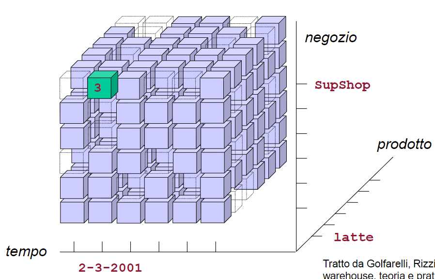
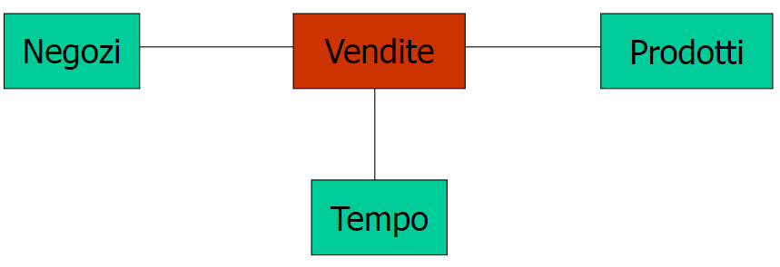
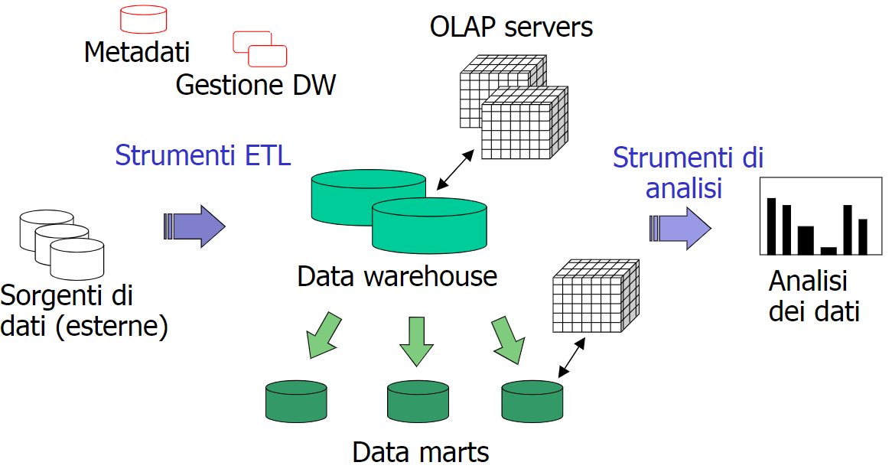
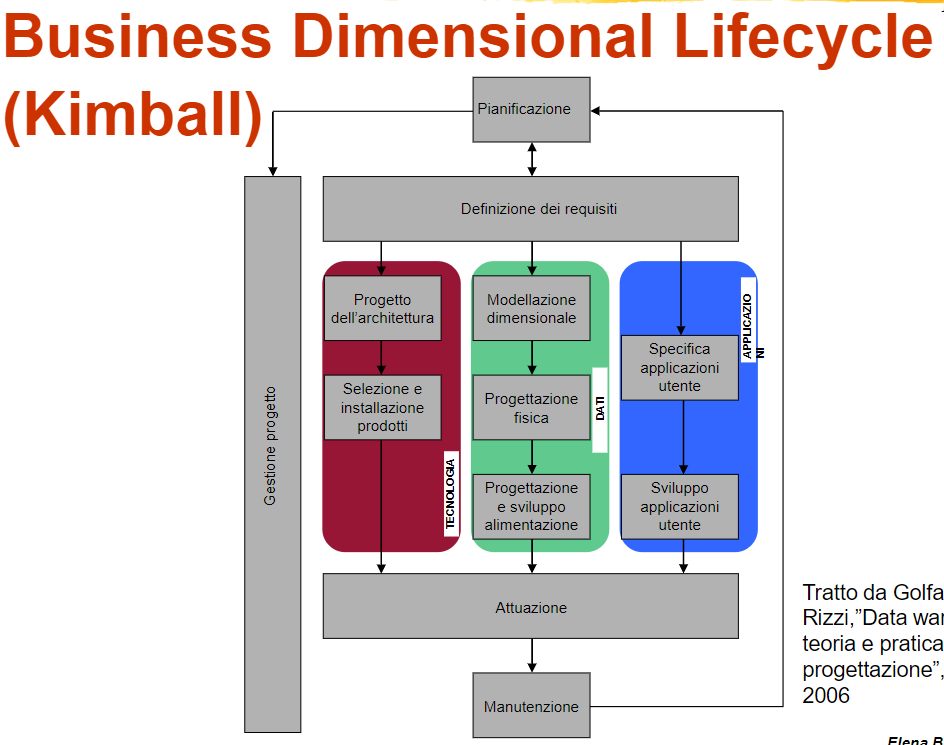

# Data Warehouse

Un sistema di data warehouse è un sistema di gestione dei dati per fornire supporto alla scelta delle decisioni per migliorare la gestione ordinaria delle attività. Queste basi di dati costituiscono una miniera di informazioni utili che permettono di analizzare lo stato dell'azienda e prendere decisioni in modo migliore e più rapido.

Un esempio di utilizzo vede la previsione della domanda per un prodotto, a partire daallo storico e della variabilità dei fattori che influenzano la domanda. In questo modo si può prevedere la domanda futura e quindi la quantità di prodotto da produrre. Un altro esempio può essere per individuare nell'azienda le criticità e capire come assegnare i premi al personale.

L'obbiettivo è trasformare i dati utilizzati quotidianamente per trasformarli in informazioni fruibili per avere delle informazioni (aggregazione dei dati) fornendole a diversi livelli di dettaglio e per applicazioni di analisi.

La base di dati è tenuta separatamente dalle basi di dati operative dell'azienda in quanto sono elaborati per scopi completamente differenti.

I dati devono essere:

- orientati
- integrati e consistenti
- dipendenti dal tempo e non volatili

Dunque la separazione dei dati hanno benefici in termini di prestazioni per l'esecuzione di ricerche complesse e sfruttando metodi di accesso diversi a livello fisico, e in termini di gestione dei dati per il loro consolidamento, qualità e gestione della mancanza.

## Struttura e analisi dei dati

I dati sono rappresentati mediante un **ipercubo**, ovvero con 3 o più dimensioni. Sono presenti più misure attraverso le quali si può eseguire le analisi dei dati. Un esempio può essere sugli assi dimensionali con prodotto, negozio, tempo oppure misure come quantità venduta, importo della vendita ecc...

:::note
Ogni cubo contenuto rappresenta un evento.
:::

{width=350px}

La rappresentazione contiene misure (valori numerici) e dimensioni di analisi (valori categorici).

> Data warehouse per l’analisi delle vendite di una catena di supermercati

{width=350px}

- _dimensione_ tempo: 2 anni x 365 giorni
- _dimensione_ negozio: 300 negozi
- _dimensione_ prodotto: 30.000 prodotti, di cui 3.000 venduti ogni giorno in ogni negozio
- _numero di righe della tabella dei fatti_: 730 x 300 x 3000 = 657 milioni
- spazio occupato dalla tabella dei fatti 21GB

Esistono tool per l'analisi dei dati:

- **presentazione**:
- **ricerca di motivazioni**:

## Architetture per data warehouse

i metadati sono informazioni che descrivono gli oggetti.

Il data warehouse fornisce una visione della azienda, ccon tempi di progettazione solitamente molto lungo.

Il data mart invece rappresenta una visione di un'area specifica dell'azienda, con tempi di progettazione più brevi e di conseguenza dei tempi di ritorno dell'investimento più breve.

I server per i data warehouse son utilizzzati per ..., possiamo utilizzare modelli di tipo relaionale esteso attraverso un modello relazionale esteso in cui andiamo a rimuoGvere alcuni vincoli come la rinuncia alla normalizzazione. Possono essere:

- **ROLAP**
- **MOLAP**: multidimensional OLAP, i dati sono rappresentati in forma matriciale proprietaria con dati che sono sparsi e richiedono compressione.
- **HOLAP**: tecnologie ibride che memorizzano i dati mediante un modello relazionale esteso e utilizzano un modello multidimensionale per la navigazione e 

### ETL

Con ETL () si fa riferimento al processo di preparazione dei dati da introdurre nel data warehouse, le operazioni che vengono compiute sono:

- estraazione: oacquisizione de dati dalle sorgenti 
- trasformazione
- caricamento

Con pulitura si intende le operazioni volte al miglioramento della qualità dei dati.

### Livelli

Le architetture possono essere a due o tre livelli.

A due livelli abbiamo mentre a 3 livelli abbiamo una staging area utilizzata per memorizzare la prima elaborazione eseguita sul dato.

La staging area ha solo dati transitori e non ha le stesse dimensioni delle sorgenti.

## Progettazione

I data warehouse sono presenti ormai da molto tempo, ma nonostante ciò molte azienda ancora non ne fanno uso, per tale motivo quando decidono di implementarlo si pongono alcuni fattori di rischio:

- elevate aspettative degli utenti nell'utilizzare data warehouse come soluzione di problemi aziendali.
- processi OLTP di partenza, ad esempio dati incompleti o inaffidabili con processi aziendali non integrati e ottimizzati
- gestione "politica" del progetto, collaborazione con i detentori delle informazioni e accettazione del sistema da parte degli utenti finali.

:::note
La qualità del dato inferisce sulla 
:::

La progettazione può avvenire con due approcci:

- **top-down**: si parte da un'analisi dei dati e si progetta il data warehouse
- **bottom-up**: si identifica uno o più settori aziendali da indirizzare e si realizzano i data mart per ciascuno di essi. Il punto di partenza viene realizzato conu

La manutenzione comprende il tempo di sviluppare un applicativo in più sui dati che sono stati opportunamente elaborati.

### Progettazione dimensionale

Le sorgenti di dato possono essere eterogenee e sistemi relazionali, caratterizzabili mediante una modellazione logica, testuale o ER a seconda dei casi. Nel caso in cui non siano relazionali è possibile avere una collezione di dati.

Una prima operazione da eseguire è la riconciliazione, in modo da avere una visione globale delle fonti.

La progettazione concettuale è necessario avere i requisiti dell'utente (quindi le specifiche) che devono essere analizzati in modo da ottenere lo schema di fatto, ovvero il dimensional fact model. Questo contiene le dimensioni di analisi, le misure e le gerarchie. 

Segue la progettazione logica che prevede il carico di lavoro ovvero sapere quale è il volume di dati necessari per le query. Il carico di lavoro diventa importante in numero e caratterizzazione. L'output è llo schema l'ogico ovvero l'insieme delle tabelle.

Segue infine la progettazione dell'alimentazione con architetture a 2 o 3 livelli.

Ultimo è la progettazione fisica, ovvero definire delle strutture fisiche accessorie.

## Analisi dei requisiti

Necessario raccogliere le informazioni relative alle esigenze di analisi dei dati che dovranno essere soddisfatte dal data mart. I vincoli realizzativi dovuti ai sistemi informativi esistenti.

Con requisiti applicativi si intende caratterizzare i fatti che vogliamo rappresentare, e dunque caratterizzare la parte di azienda che vogliamo modellare
