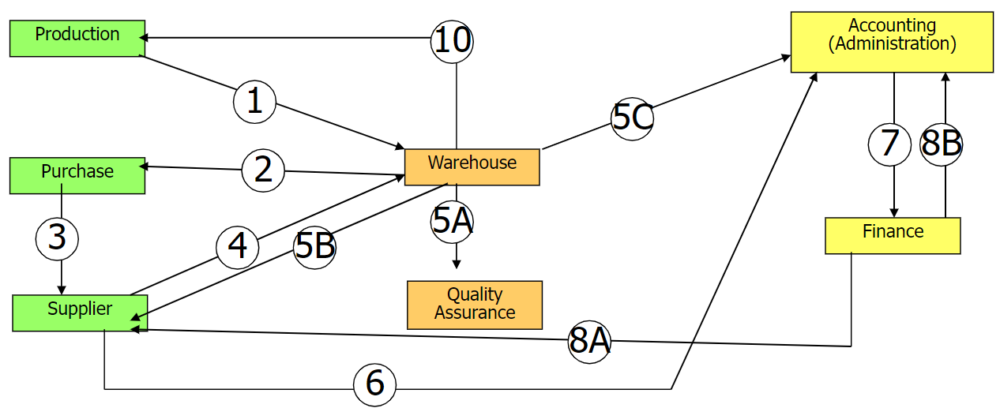

# Introduction

An information system is organization of people (a company) with a business process that is a sequence of activities.

Some organizational unites are:

- production: requires the raw materials needed for the production plans from the warehouse
- warehouse:
- purchase office:
- supplier:
- quality assurance: monitors the efficiency and quality of suppliers by producing statistics for the management
- accounting: check the orders, receive the delivery receipt from the warehouse, asks
- finance department:
- manager.

{width=350px}

Therefore we can say that an information system is needed to trasfer information, document, informatins, monitor the process. More the people and locations are involved  the more an information system is required.

Business logic heavily influence the computer logics, as an example a business rule could be to pay in about 60 days.

