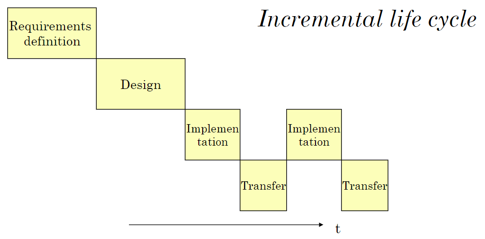
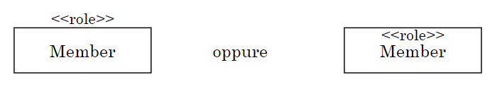

# Modelli
<!-- lezione 1 - 2023/02/27 -->

Con **ingegneria del software** si fa riferimento a un processo che richiede un approccio sistematico diviso in più fasi come _sviluppo_, _operazione_ (messa in funzione), _manutenzione_ e infine _ritiro_ (obsolescenza o rifacimento) di un prodotto software.

Un altra definizione vede l'applicazione di _principi scientifici_ in modo da trasformare un problema in una soluzione funzionante alla quale segue la manutenzione fino al termine del suo ciclo di vita.

Ogni software ha un proprio ciclo di vita che comincia quando il prodotto viene concepito e termina quando questo non è più disponibile per l'uso. Ciascuna fase prevede un set di input, un set di output e un numero di attività da svolgere.

Ogni prodotto di qualità richiede lo sviluppo attraverso un processo che trova le sue fondamenta in pratiche e principi dell'ingegneria del software. **La qualità del prodotto dipende dalla qualità del processo**.

Lo sviluppo può avvenire con più metodologie, alcuni esempi sono:

- **Waterfall**: incrementale o evolutivo
- **Unified**
- **Support activities**

A questi seguono alcune metodologie più recenti, che verranno analizzate prossimamente, come:

- **Agile development**
- **SCRUM**
- **Continuous integration**
- **Continuous delivery**

I modelli sono alla base dello sviluppo, in quanto consentono di comprendere in modo più accurato le soluzioni proposte. Ne esistono di varie tipologie.

on cicli di vita di un software si intende l'insieme delle fasi a cui questo viene sottoposto durante il proprio sviluppo, ciascuna delle quali è a sua volta divisa in più attività. Ogni fase parte da una serie di input restituendo una serie di output.

## Waterfall

La tecnica più semplice implementata prende il nome di **Waterfall**, cascata in inglese, ed è una delle prime utilizzate e ancora ampiamente diffusa, nonostante i vari problemi dei quale soffre. Il nome deriva dalla natura dell'approccio utilizzato che si suddivide in fasi successive:

1. **Definizione dei requisiti**: descrizione generale in termini business dei vincoli e delle funzionalità principali.
2. **Progettazione**: viene definita l'architettura e come gli elementi interagiscono tra loro con i collegamenti necessari e le decisioni relative al _make-or-buy_, ovvero se deve  essere sviluppato internamente o delegato (a terzi).
3. **Implementazione**: progetto di dettaglio, sviluppo e testing.
4. **Trasferimento**: invio del software al committente.
5. **Operazione**

Un primo problema risiede nella scarsa elasticità: i requisiti vengono congelati nella prima fase, di definizione dei requisiti, senza poter essere modificati successivamente. Ciò causa una forte rigidità.

{width=350px}

### Incrementale

Una prima estensione del modello waterfall è di tipo incrementale, dove l'implementazione e il rilascio sono considerate delle **porzioni ridotte** piuttosto che un unico passaggio, introducendo delle fasi intermedie necessari per realizzare un prodotto non finito da fornire al committente. Solo alla fine delle diverse fasi di implementazione viene effettuato un trasferimento.

:::caution
Questo potrebbe causare un aumento dei costi.
:::

{width=350px}

### Evolutivo

La modalità evolutiva permette l'evoluzione del sistema in tutto e per tutto, i requisiti sono parzialmente compresi ma si cerca di rendere tutto modificabile. In questo modo ogni versione che viene rilasciata è un prototipo.

Le fasi vengono ripetute nel corso del tempo, rendendosi utile quando i requisiti iniziali sono scarsi o non stabili. Permette agli utenti un funzionamento iniziale, a cui seguono ulteriori versioni come prototipi.

{width=350px}

### Prototyping

Il prototyping è una tecnica di sviluppo che consiste in una implementazione parziale del sistema in modo che i clienti, gli utenti e gli sviluppatori possano imparare di più riguardo i problemi e le relative soluzioni.

Gli approcci possono essere di due tipi:

- **Usa e getta** _(throwaway)_: può essere utilizzato per validare l'interfaccia utente, verificare se una particolare architettura soddisfa i requisiti e validare un particolare algoritmo.
- **Evolutivo**: Va avanti passo dopo passo fino a quando non sono soddisfatte tutte le richieste per il prodotto finale. Di fatto il prodotto finale è l'evoluzione del prototipo passo dopo passo, con la conseguenza che il passaggio non sarà molto rapido.

## Unified Process

La  strategia **Unified Process** combina gli approcci incrementali ed evolutivi dividendosi in 4 fasi:

- **Inception**: viene effettuato _business modeling_, ovvero si sviluppa mediante una modellazione dei requisiti tra persone con specializzazione differenti. Si vede necessario definire un business case, l'individuazione degli elementi chiave, ris, assessment, pianificazione preliminare e stima dei costi.
- **Elaboration**: analisi dettagliata dei requisiti, progettazione dell'architettura e validazione tramite prototipi oltre alla realizzazione del piano di sviluppo.
- **Construction**: implementazione supportata da diagrammi UML dettagliati.
- **Transition**: distribuzione.

Un tipo di attività non coincide con la fase specifica, anche se può essere quella più importante.

:::note
Fa utilizzo dei diagrammi _UML_.
:::

{width=350px}

Il _business modeling_ descrive il contesto in cui un sistema software deve operare e le relazioni con gli altri sottosistemi da un punto di vista business. E il ponte tra l'analisi business e l'analisi software.

### Support activities

Le attività di supporto si dividono in:

- **Project management**: pianificazione, staffing, monitoring, controllo e leading.
- **Version control e configurazione della gestione**: definisce gli elementi del sistema, controllando le release e i cambiamenti.
- **Verification**: si preoccupa di controllare se il prodotto viene sviluppato correttamente. _Stiamo facendo il prodotto correttamente?_
- **Validation**: verifica che il prodotto soddisfi le richieste del cliente. _Stiamo facendo il prodotto giusto?_
- **Quality assurance**: verifica che gli standard e le procedure stabiliti vengano seguite.

## Modelli Concettuali

Un modello è una rappresentazione astratta e rigorosa di un sistema reale, permettendo all'utente di considerare le proprietà importanti di un sistema.

Nell'ambito dello sviluppo del software esiste il concetto del modello operazionale/operativo, in quanto il modello potrebbe essere direttamente mappato nel software, dunque un modello potrebbe essere direttamente il codice implementato oppure a partire dal modello può essere generato il codice _(model driven development)_.

## UML

Con _UML_ si fa riferimento al _Unified Modeling Language_, formato da un elevato numero di modelli di linguaggio. Non è una metodologia globale.

Uno standard è il OMG.

I diagrammi si dividono prevalentemente in _strutturali_ (class models, object models) oppure _comportamentali_ (casi d'uso, modelli di attività, modelli di stato e modelli di sequenza).

::note
La differenza tra linguaggio e notazione è che il linguaggio è un insieme di regole sintattiche e semantica, mentre la notazione è un insieme di simboli che rappresentano un linguaggio.
:::

### Class Models

Il sistema preso in considerazione è formato da un insieme di oggetti i quali fanno riferimento a delle classi. Tra gli oggetti sono presenti dei link  chiamati **relazioni** tra classi. Le classi a loro volta possono avere _proprietà_ denominate **attributi**.

Un object model è una realizzazione particolare di una class model in quanto mostra le relazioni tra gli oggetti per motivi illustrativi.

Alcuni esempi sono:

- **Class model**: dal punto di vista di implementazione tecnica
- **Domain model**: dal punto di vista concettuale e business ad alto livello
- **Information model**: dal punto di vista dei dati 

alcuni aspetti rilevanti sono:

- Relazioni: associative, composizione, inheritance, ricorsive
- Attributi normali e associativi
- Espressioni navigazionali
- Attributi necessari e relazioni necessarie
- Attributi derivati e relazioni derivate
- Invarianti e regole di validazione

Un esempio potrebbe essere il seguente:

> Nelle università sono presenti professori e studenti, con i primi che insegnano corsi e studenti che vi sono iscritti.

{width=350px}

Un corso è insegnato da un solo professore, mentre gli studenti possono essere iscritti a più corsi. Inoltre, un professore può insegnare da 1 a 3 corsi, mentre i corsi sono sono tenuti da un solo docente. Gli studenti hanno da 10 a 50 corsi, ma ogni corso può avere n studenti.

{width=350px}

{width=350px}

Il modello è valido? In realtà no, perchè abbiamo indicato un minimo di 10 corsi per studente.

{width=350px}

#### Classi

Il simbolo di una classe pul contenere attributi e metodi. 

{width=350px}

Attributi e metodi possono avere indicatori di visibilità:

- **+**: public
- **-**: private
- **#**: protected
- **~**: package

#### Molteplicità

La molteplicità indica il numero di istanze di una classe che possono essere associate ad un'altra classe.

La molteplicità definisce implicitamente regole di validazione.

{width=350px}

:::tip
La molteplicità di default è __*__.
:::

#### Vincoli

I vincoli sono delle condizioni che si applicano sulle relazioni tra classi.

> Un corso è insegnato da un professore, ciascuno dei quali insegna da 1 a 3 corsi. Gli studenti sono immatricolati in un numero di corsi, il cui minimo è 10 e il massimo è 50.

{width=350px}

#### Composizione

La composizione viene indicata con un rombo pieno. Indica che un oggetto è composto da altri oggetti.

Quando un contenitore viene eliminato, tutti i suoi componenti vengono automaticamente rimossi a loro volta.

In questo esempio, una orderLine fa parte di un ordine.

{width=350px}

Un oggetto può far parte di un solo contenitore per volta, ma può essere indicato come figlio di entrambi.

{width=250px}

#### Aggregazione

Con il rombo vuoto si fa riferimento all'aggregazione. Indica che un oggetto è aggregato ad un altro oggetto.

Quando un aggregazione viene eliminata non vengono eliminati i suoi componenti.

{width=250px}

#### Association class

Con classe associativa si fa riferimento a un collegamento...

{width=350px}

#### Ereditarietà

L'**ereditarietà** viene indicata con una **freccia a punta vuota**. Indica che una classe è una specializzazione di un'altra classe, ereditandone gli attributi e consentendo l'aggiunta di nuovi.

> Un veicolo ha un proprietario che può essere una persona o una compagnia e può essere una macchina o una moto. Veicolo e Proprietario sono classi astratte, ovvero non possono essere inizializzate ma sono utile per consentire l'ereditarietà degli attributi.

{width=350px}

:::caution
Una classe astratta è di fatto uno stereotipo di classe.
:::

<!-- lezione 2 - 2023-03-01 -->

### Attributi associativi

Gli attributi associativi sono dei riferimenti verso altri oggetti utilizzati per i costruttori navigazionali (ovvero che ci si sposta tra classi).

> Un dipartimento può contenere più impiegati, per tale motivo l'attributo `employees` si trova su `Department` e `Projects`, in modo da ottenere tutti gli impiegati di un dipartimento mediante `D.employees` e gli impiegati di un progetto mediante `P.employees`.

attributo  | tipo
-----------|-----------------------------
Department | String name
Project    | String name
Employee   | String name, String position

{width=350px}

se aggiungiamo le cardinalità:

{width=350px}

## Alberi e grafi

Gli alberi e i grafi si differenziano ...

Gli oggetti sono dello stipo, ovvero dei nodi, i quali contengono dei nodi distinti.

> Un esempio è un attributo String nome e invariante nodi.nome distinct

Un albero è tale che un nodo ha solo un nodo che si trova sopra di lui, dunque ogni nodo è figlio di un solo nodo.

Alcune rappresentazioni di alberi e grafi sono secondo i vari modelli sono:

{width=350px}

:::tip
Un invariante è un vincolo sullo stato che deve essere soddisfatto da ogni istanza della classe quando non sia in atto una variazione ad opera di un metodo o operazione.
:::

## Sequenze

Una sequenza può avere un numero arbitrario di nodi superiori strettamente a uno, in quanto non è possibile che un nodo non abbia nè un successore ne un predecessore (nodo isolato).

Ogni nodo ha un nume distinto.

> Nel esempio n1 precede n2 e n2 segue n1

{width=350px}

Con le `[]` indichiamo il numero di successori di un nodo.

:::tip
La regola generale di validità di un nodo diviene `nodo.s] == 1 and/or [nodo.p] ==1`, in modo da avere la garanzia che almeno un successore o un predecessero sia presente.
:::

## Nodi vicini

I nodi vicini sono due nodi che hanno un nodo comune. Non è possibile che un nodo non abbia vicini (nodo isolato).

> Si considerino i nodi ciascuno con nomi vicini.

{width=350px}

Per ogni nodo dicino è possibile indicare la distanza, ovvero dato n1 vicino a n2 è possibile fare n1-n2(2) indica una distanza di 2 tra n1 ed n2.

## Interpretazione di una class model

A partire da un modello grafico è possibile avere una rappresentazione mediante un linguaggio, in modo automatico o meno.

Dal punto di vista "informativo", un class model non serve solamente per definire dei programmi ma anche per definire un database. Questo è rilevante in quanto cesistono delle tecnichce che consentono di considerare dei ... ma è anche possibile definire dei modelli di classi che si riferiscono al database ma che consentono all'utente di trattare il database sotto forma di un programma, in mdo dunque più semplice.

Un framework molto utilizzato è **hibernate**, il quale consente di mappare classi java a tabelle di un database dunque data types in sql data types e fornire un linguaggio orientato agli oggetti per le query.

## Operazioni sulle entità

Una entità è un oggetto, mentre una classe viene definita classe di entità.

## Esperissioni naivigazionali

Le esperession navigazionali permettono di ottenere oggetti singolo i o collezzioni di oggeti a partidre da uno di partenza, seguendo lgia ttributi associativi(mpliciti o splciti definiiti nel modello.

invarianti, regole di validazione, pre-condizioni e post-condizioni.

## OCL

OCL è un linguaggio formale UML utilizzato per definire vincoli aggiuntivi agli oggetti relativi a un modello di classe. Non sono presenti side-effect.

## Espressioni navigazionali

> Dato un impiegato `e` si ottengano:
>
> - i suoi progetti: `e.projects`
> - i dipartimenti dei suoi progetti: `e.projects.department`

## Filtri

I filtri vengono specificati tra `()`

## Invarianti

Gli invarianti sono condizioni che valogno sempre.

Il nome della classe con l'iniziale minuscola significa ogni elemento della
classe e ha quindi valenza di quantificatore universale.

Per specificare un invariante sugli attributi associativi è sufficiente utilizzare l'operatore `def` o specificare la molteplicità dell'attributo sottolineata.

## Regole di validazione

Una regola di validazione consente di verificare che una richiesta venga rispettata.

## ordered

Specificando `{ordered}` definiamo che il set deve essere ordinato.

## operazioni

Le operazioni sono definite in modo dichiarativo: i vincoli si esprimono mediante una pre-condizione e il risultato mediante una post-condizione

```text
with Department department  // scelta del dipartimento
pre: [department.employees] < 10   // vincolo sulla scelta
post: new Employee e, e.department == department.
```

<!-- lezione 3 - 2023-02-06 -->

## Model driven development

Dati i requisiti funzionali di un'applicazione, si ricava il _domain model_ (classi e relazioni UML) con attributi e regole (invarianti). Vengono poi modellate le attività degli utenti con use cases UML e infine i casi d'uso rappresentano i task ai quali sono associate precondizioni per i vincoli e postcondizioni per gli effetti.

> The library contains books: book attributes include id, title, authors,  publisher. Books are added by librarians (staff).
>Members are the persons entitled to get books on loan. Members are enrolled 
>by librarians: the enrollment date and the librarian who made the 
>enrollment must be recorded. Member attributes include name, address, 
>email. A personal id is provided by the enrollment procedure.
>A librarian has a name and an id.
>To borrow a book, members must open a loan. First, they get a list of books 
>by specifying subject and authors, then they choose an item from the list. The 
>loan is opened if the book is available and the number of open loans of the 
>member does not exceed the limit (6). The duration of the loan is 14 days. 
>Members cannot borrow additional books if they have some loans overdue.
>When a member returns a book, the system closes the loan associated with 
>the book id. 
>A loan has two dates: the end date and the due date. The end date is set 
>when the loan is closed.
>An ongoing (past) loan has the end date undefined (defined).
>When a loan is one week overdue, the system sends a reminder to the 
>borrower of the book.
>The major states of a loan are ongoing, past, overdue.
>Members can update personal information such as address and email.
>Librarians can make inquiries on ongoing and past loans. 
>Functional requirements:
>Librarian add books, enroll members and make inquiries. 
>Members borrow books, return books, and update personal information. 
>The system sends reminders to borrowers.

### Regole

Le regole possono essere espresse mediante vincoli o costrizioni.

Le regole potrebbero essere espresse mediante invarianti o precondizioni.

Riprendendo l'esempio della biblioteca:

> The loan is opened if the book is available and the number of open loans of the 
> member does not exceed the limit (6). The duration of the loan is 14 days. 
> Members cannot borrow additional books if they have some loans overdue.
> When a loan is one week overdue, the system sends a reminder to the 
> borrower of the book.
> Terms to be clarified: loan, ongoing loan, past loan, overdue loan.

### Domain model

attributi associativi: attributi che valgono tra due classi.

{width=350px}

Nell'esempio di sopra la relazione tra Librarian e Members prende il nome di `members` da parte del Librarian e `librarian` da parte del Member.

### Stereotipi

Uno stereotipo è un tipo di classe che può essere associato ad una classe. Questi possono essere raggruppati in un profilo UML.

{width=350px}

Nella figura di sopra role vuole indicare che la classe Member rappresenta persone con un determinato ruolo.

### Attributi necessari

Gli attributi necessari sono sottolineati all'interno del diagramma delle classi.

### Attributi derivati

Un attributo derivato è ottenuto, quando necessario, da un attributo ordinario oppure da un attributo derivato.

### casi d'uso

Gli use cases contengono descrizioni delle iterazioni tra l'utente e il server, con la possibilità di raggrupparli in subjects.

Dati gli attributi necessari, si pul specificare `post: new Classname` per indicare che è stato aggiunto un nuovo oggetto con tutti gli attributi informativi necessari valorizzati e relativi collegamenti. E' anche possibile effettuare la **post esplicita**, la quale indica l'esecuzione del caso d'uso: si usa il nome del ruolo con l'iniziale minuscola.

:::definition
Si definisce subjects un insieme di use cases che rappresentano un insieme di iterazioni tra l'utente e il server.
:::

:::note
`Def` significa `defined` e indica che l'attributo è definito, mentre il `==` indica che è un assegnamento dichiarativo.
:::

:::tip
Un subject può contenere a sua volta altri subjects.
:::

#### Relazioni tra use cases

Le relazioni che si pongono tra casi d'uso possono essere:

- **extend**: il comportamento di A può essere esteso con il comportamento di B (B estende A).
- **include**: il comportamento di X può essere incluso nel comportamento di Y (Y include X).

{width=350px}

## Esercizi

### Esercizio 1

> L'utente di una banca può ordinare un bonifico scegliendo il conto corrente di
> cui è intestatario (1) e indicando il beneficiario (nome), il codice IBAN del
> conto del beneficiario, l'importo (<= 5000,00 euro) e la causale. Se il saldo del
> conto è >= importo, il sistema genera un bonifico pendente (togliendo
> l'importo dal saldo). Un conto corrente può avere vari intestatari (utenti) e un
> utente può essere intestatario di vari conti. Un conto ha un codice IBAN e un
> saldo >=0. Un utente ha vari attributi tra i quali il nome.
> Un utente può revocare un bonifico pendente e il sistema aggiunge l'importo
> al saldo del conto. Il bonifico risulta revocato.
> Alle 18.00 il sistema esegue tutti i bonifici pendenti; il loro stato è eseguito.
> (1) Si esprima il vincolo con un invariante.
> Si definiscano il modello informativo e i casi d'uso relativi ai bonifici.

Utente: ordinaBonifico
post: new Bonifico b, b.conto.saldo == b.conto.saldo' - b.importo.

Note:
Durante l'esecuzione del caso d'uso l'utente definisce gli attributi informativi
del bonifico (beneficiario, iban, importo, causale) e il conto di appoggio.
La post-condizione indica la variazione che si ha nel sistema informativo dopo
T'esecuzione del caso d'us0. L'effetto è duplice: nel sistema è presente un nuovo
bonifico (indicato con il termine b) e il saldo del conto del bonifico è diminuito
dell'importo del bonifico.
saldo'indica il valore precedente (operatore) del saldo.
L'attività fallisce se gli invarianti non sono rispettati, quindi se lutente non è
intestatario del conto del bonifico o se il saldo è negativo.

Utente: revocaBonifico
with bonifico, bonifico in utente.bonifici (stato == pendente)
post: bonifico.stato == revocato and bonifico.conto.saldo ==
bonifico.conto.saldo'+ bonifico.importo.
La clausola with introduce una scelta fatta dall'utente; 1la scelta riguarda
uno dei suoi bonifici pendenti.

System: esegueBonifici at 18.00
post: bonifici (stato' == pendente).stato == eseguito.
Per tuttii bonifici pendenti lo stato diventa eseguito (mancano i dettagli
dell'esecuzione dei bonifici).
bonifici (stato' == pendente).stato == eseguito
indica una variazione multipla (su tutti i bonifici pendenti).

