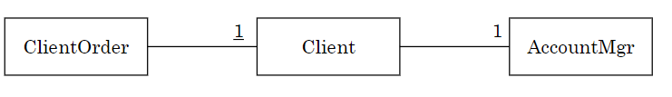
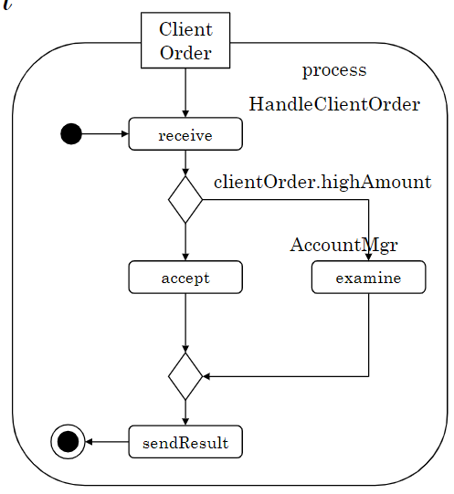

# Processi

Un processo è una serie di azioni o task eseguite in ordine in modo da ottenere o creare qualcosa.

In un contesto business, un processo (BP) è una è un insieme di passaggi nel tempo e nello spazio strutturato e ordinato.

Un'attività è un flow chart con vari dtpi di nodi:

- action nodes: corrispondono ai task (unità di lavoro) e possono essere automatici o umani.
- control nodes
- object nodes: si occupa di mostrare i dati.

:::note
Nei modelli solitamente le attività sono sinonimi dei processi.
:::

La determininazione degli esecutori dei task umani non è trattata nello standard, mentre negli esempi i task umani sono accompagnati daa ruoli degli esecutori.

I processi sono gestiti da un processi  engine, con il compito di istanziare ed eseguire i processi.

## Control Flow

...

Un esempio di processo può essere ottenuto nel caso seguente: 

> l processo HandleClientOrder permette ad un fornitore di trattare gli 
> ordini provenienti dai clienti.
> Quando il fornitore riceve un ordine da un cliente, il process engine genera 
> un'istanza del processo e le passa come parametro di input l'ordine del 
> cliente.
> Un ordine ha una descrizione e un importo.
> Se l’importo è <= 1000 €, l’ordine è accettato automaticamente altrimenti è 
> valutato dall’account manager associato al cliente. 
> L’ordine ha uno stato che può essere accepted o rejected.
> Il processo informa il cliente dello stato dell’ordine.
> Nel sistema informativo del processo sono registrati i clienti e gli account 
> manager (staff). Le relazioni con un cliente sono gestite da un accountMgr 
> che può trattare vari clienti.

{width=350px}

Per rappresentare un diagramma di una attività si può fare come segue:

{width=350px}

### Post condizioni

