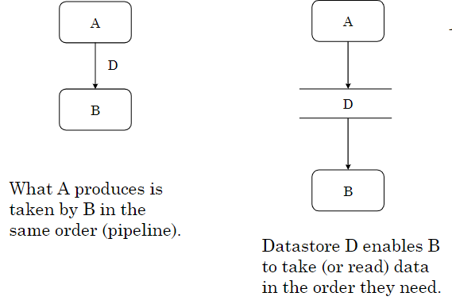

# Processi

Un processo è una serie di azioni o task eseguite in ordine in modo da ottenere o creare qualcosa.

In un contesto business, un processo (BP) è una è un insieme di passaggi nel tempo e nello spazio strutturato e ordinato.

Un'attività è un flow chart con vari dtpi di nodi:

- action nodes: corrispondono ai task (unità di lavoro) e possono essere automatici o umani.
- control nodes
- object nodes: si occupa di mostrare i dati.

:::note
Nei modelli solitamente le attività sono sinonimi dei processi.
:::

La determinazione degli esecutori dei task umani non è trattata nello standard, mentre negli esempi i task umani sono accompagnati daa ruoli degli esecutori.

I processi sono gestiti da un processi  engine, con il compito di istanziare ed eseguire i processi.


## Control Flow

...

Un esempio di processo può essere ottenuto nel caso seguente: 

> l processo HandleClientOrder permette ad un fornitore di trattare gli 
> ordini provenienti dai clienti.
> Quando il fornitore riceve un ordine da un cliente, il process engine genera 
> un'istanza del processo e le passa come parametro di input l'ordine del 
> cliente.
> Un ordine ha una descrizione e un importo.
> Se l’importo è <= 1000 €, l’ordine è accettato automaticamente altrimenti è 
> valutato dall’account manager associato al cliente. 
> L’ordine ha uno stato che può essere accepted o rejected.
> Il processo informa il cliente dello stato dell’ordine.
> Nel sistema informativo del processo sono registrati i clienti e gli account 
> manager (staff). Le relazioni con un cliente sono gestite da un accountMgr 
> che può trattare vari clienti.

{width=350px}

Per rappresentare un diagramma di una attività si può fare come segue:

{width=350px}

Nel grafico distinguiamo:

- **cerchio pieno**: nodo iniziale
- **cerchio pieno con cerchio esterno**: nodo finale
- **rombo**: nodo di decisione/merge

### Post condizioni

Le post condizioni sono le condizioni che devono essere soddisfatte per poter proseguire con l'esecuzione del processo.

```text
receive: this.clientOrder == clientOrder;
// copia il parametro nel riferimento locale
accept: clientOrder.state == accepted.
examine: clientOrder.state def.
```

un esempio è la situazione in cui si vuole verificare che un pagamento sia stato effettuato e l'ordine completato, in tal caso l'ordine può essere considerato concluso:

{width=350px}

la **fork** consente di dividere il flusso di controllo in due o più percorsi paralleli, mentre la **join** consente di riunire i percorsi paralleli in un unico flusso di controllo.

## Data flow

il processo è rappresentato come una rete di attività che producono un output da un input (requisiti funzionali).

Una **attività** trasforma un input in un output, può essere semplice o composto. La sua etichetta è tale da essere un verbo seguito da un oggetto. E' indicato con un rettangolo con gli angolo smussati con all'interno il nome.

Una **dataflow** è un percorso o un condotto attraverso il quale le informazioni sono trasmesse da una parte all'altra. E' indicato con una freccia e una etichetta.

Un **datastore** è un contenitore temporaneo di dati. Permette agli elementi di essere recuperati in ordine differente rispetto a quello in cui sono stati inseriti. E' indicato da due barre e nel mezzo l'etichetta.

Un **attore** esterno permette di consumare dataflow esterni. E' indicato da un rettangolo con all'interno l'etichetta.

{width=350px}

Due attori esterni non possono essere collegati direttamente, ma devono passare per un datastore, stessa cosa per i datastore.

### Singleton Process

Un processo è detto singleton quando ha un'unica istanza in grado di trattare tutte le richieste dell'utente.

#### topdown

...

<!-- passa a slide 175 -->

### struttura

Un _dataflow diagram_ (DFD) ha un nome e contiene attori esterni, attività, datastore e dataflow.

Non tutti i collegamenti sono leciti, in particolare sono vietati:

- attore → attore
- attore → datastore
- datastore → datastore
- datastore → attore

:::tip
In breve, attori e datastore sono collegati soltanto ad attività.
:::

E' possibile inserire vincoli sulle etichette, ad esempio:

```text
//un datastore ha i dataflow entranti e uscenti privi di etichette
datastore.dataflows.type == null; datastore. dataflows.state == null.
```

