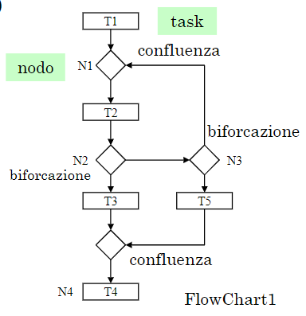
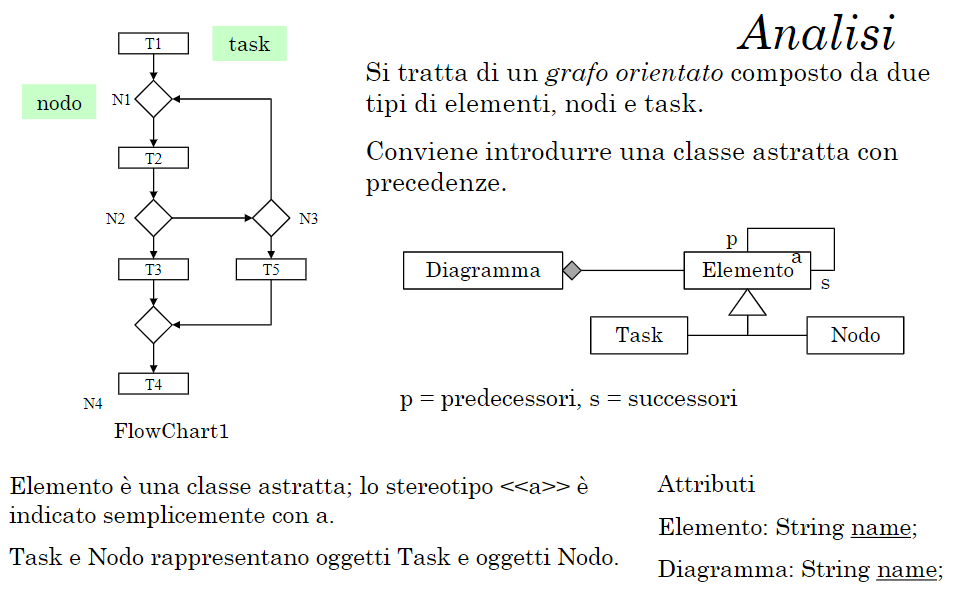

# Strutture

Le strutture permettono di definire ad alto livello la struttura delle notazioni grafiche.

Mediante le regole di **validazione** è possibile definire se un modello (struttura) è valido rispetto ai requisiti o meno.

## Struttura (semplificata) di un activity diagram

Un diagramma ha un diagramma e contiene elementi di due tipi: **nodi** e **task**. Ogni elemento ha un nome e sono collegati mediante link orientati.

I task possono essere di input o di output.

{width=350px}

:::note
Flowchart1 è il nome del diagramma, mentre T1 è il task iniziale.
:::

Prendiamo il seguente esempio:

{width=350px}

:::note
Nodo e task possono non essere completamente disgiunti, ma possono essere usati in modo misto.
:::

:::node
Nell'esempio `a` è uno stereotipo nonostante non sia stato specificato con `<< >>`. Questo è stato fatto in quanto l'elemento non rientrava nel grafico.
:::

