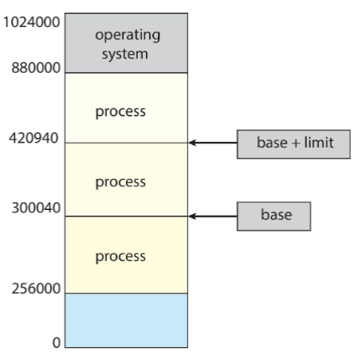
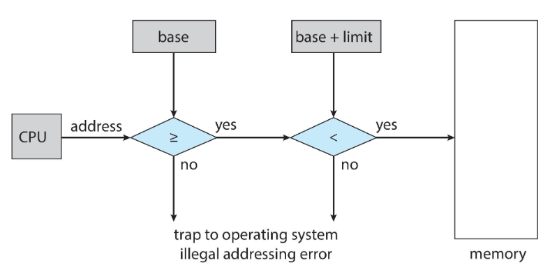
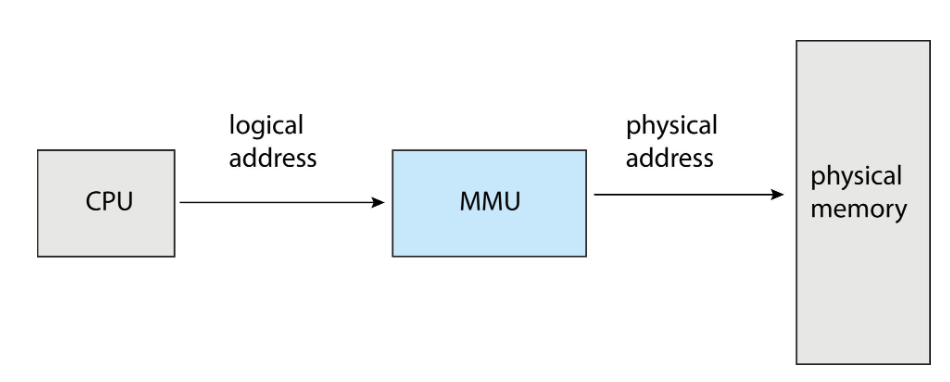

# Memory Management

Lo studio della gestione della memoria permette di capire come questa sia organizzata dal punto di vista hardware mediante varie tecniche. Si prenderà ad esempio un Intel Pentium in quanto supporta sia la segmentazione che la paginazione segmentata.

## Introduzione

Ogni programma prima di essere eseguito deve essere caricato dalla memoria di massa (hard disk) in memoria principale (RAM) in modo da riservarne memoria per il processo. Solo dopo ciò il programma può essere eseguito.

Per far si che il programma funzioni, ogni dato utilizzato deve essere direttamente accessibile dalla memoria, che può richiedere tempistiche differenti a seconda della posizione:

- in un registro il tempo di accesso è di circa un clock (o meno).
- nella memoria principale possono essere richiesti più cicli di clock in quanto il dato potrebbe non essere disponibile e causare uno stallo.
- in cache, situata tra la memoria principale e i registri

## Protection

La **protection** consente di limitare lo spazio di indirizzamento disponibile per un dato processo, in modo che questi non possano accedere reciprocamente alla memoria che gli viene riservata.

Un primo modo per implementare tale limitazione è mediante l'utilizzo di due registri denominati **base register** (indirizzo fisico minore) e **limit register** (dimensione del range), i quali stabiliscono i limiti in termini di indirizzi logici indirizzabili dal processo.

{width=250px}

{width=350px}

Con address binding si fa riferimento all'operazione di sistema che assegna a un indirizzo di memoria un programma o un processo a tempo di esecuzione.

Gli stage più importanti del ciclo di vita di un programma sono:

- **Compile time**: la fase in cui il codice sorgente di un programma viene converito in codice macchina, ovvero un file eseguibile che può essere eseguito sul sistema.
- **Load time**: dopo la creazione dell'eseguibile, questo viene caricato in memoria ed eseguito.
- **Run time**: durante l'esecuzione il processo viene mosso da una segmento di memoria verso un altro segmento di memoria.

L'operazione di binding consiste nell'associare un indirizzo logico in un indirizzo fisico.

## Memory Management Unit

Lo scopo della MMU è quello di porsi come intermediaro tra la CPU e la memoria fisica.

{width=350px}

## Allocazione contigua

...

## Variable partition

...

