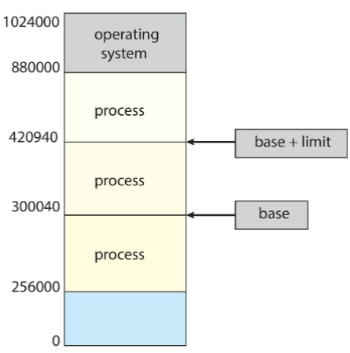

# Memory Management

Lo studio della gestione della memoria permette di capire come questa sia organizzata dal punto di vista hardware mediante varie tecniche. Si prenderà ad esempio un Intel Pentium in quanto supporta sia la segmentazione che la paginazione segmentata.

## Introduzione

Ogni programma prima di essere eseguito deve essere caricato dalla memoria di massa (hard disk) in memoria principale (RAM) in modo da riservarne memoria per il processo. Solo dopo ciò il programma può essere eseguito.

Per far si che il programma funzioni, ogni dato utilizzato deve essere direttamente accessibile dalla memoria, che può richiedere tempistiche differenti a seconda della posizione:

- in un registro il tempo di accesso è di circa un clock (o meno).
- nella memoria principale possono essere richiesti più cicli di clock in quanto il dato potrebbe non essere disponibile e causare uno stallo.
- in cache, situata tra la memoria principale e i registri

## Protection

La **protection** consente di limitare lo spazio di indirizzamento disponibile per un dato processo, in modo che questo non possa accedere alla memoria riservate per gli altri processi.

Un primo modo per implementare tale limitazione è mediante l'utilizzo di due registri denominati **base register** (indirizzo fisico minore) e **limit register** (dimensione del range), i quali stabiliscono i limiti in termini di indirizzi logici indirizzabili dal processo.

{width=250px}

{width=350px}

Solitamente i programmi si trovano su disco sotto forma di file eseguibile, che per essere eseguiti devono essere caricati dalla memoria. Dopo tale operazione, tipicamente il compilatore associa tali indirizzi simbolici a indirizzi ricollocabili (relocatable addresses) a cui segue l'**address binding** l'operazione di sistema che assegna a un indirizzo di memoria un programma o un processo a tempo di esecuzione.

:::note
Solitamente i sistemi consentono ai processi utente di essere caricati in qualsiasi parte della memoria fisica, ad esempio all'indirizzo `0x0000`.
:::

Gli stage più importanti del ciclo di vita di un programma, che caratterizzano i diversi momenti in cui è possibile compiere il binding, sono:

- **Compile time**: la fase in cui il codice sorgente di un programma viene convertito in codice macchina, ovvero un file eseguibile che può essere eseguito sul sistema. Se la locazione di memoria è conosciuta a priori, verrà generato del _codice assoluto_ che dovrà essere ricompilato se la locazione di partenza cambia.
- **Load time**: dopo la creazione dell'eseguibile, questo viene caricato in memoria quando eseguito. Se la locazione di memoria è conosciuta a tempo di compilazione, il compilatore genera del _codice ricollocabile_. In questo caso, il binding finale è rinviato al momento in cui il programma viene caricato in memoria.
- **Run time**: momento di esecuzione del programma, nel quale questo interagisce con il sistema operativo e altri processi per eseguire le proprie funzioni. Se il processo può essere spostato durante la sua esecuzione da un segmento a un altro, allora il binding è rinviato a run time.

L'operazione di binding consiste nell'associare un indirizzo logico in un indirizzo fisico.

## Memoria virtuale

Gli indirizzi che utilizza e genera la CPU non sono indirizzi fisici, ovvero facenti riferimento alla memoria fisica, bensì logici (virtuali) e a loro volta associati ad indirizzi fisici.

Il motivo per cui avviene la separazione tra indirizzi logici e fisici è ottenere la possibilità di avere uno spazio di memoria contiguo (virtualmente) per un processo senza che ciò sia necessariamente vero a livello fisico.

Distinguiamo per questo motivo lo spazio di indirizzamento logico da quello fisico generati da un programma.

La gestione della memoria virtuale avviene ad opera di un componente hardware denominato **MMU**.

:::caution
Eseguire il binding a tempo di compilazione o di caricamento causa la realizzazione di indirizzi logici e fisici uguali.
:::

### Memory Management Unit

Lo scopo della MMU è quello di porsi come intermediario tra la CPU e la memoria fisica: la CPU utilizza unicamente indirizzi logici che vengono poi convertiti in fisici per il corretto funzionamento.

{width=350px}

Una prima implementazione prevede l'utilizzo del **relocation register**, un registro il cui valore viene sommato rispetto a quanto indicato nell'indirizzo logico della CPU per individuare il registro fisico.

Per migliorare le prestazioni di un processo si può tenere conto di alcuni fattori relativi al caricamento dinamico (dynamic loading):

- Non serve caricare interamente il programma per l'esecuzione
- le routine non vengono caricate fino a quando non vengono chiamate, in questo modo quelle mai utilizzate non verranno mai caricate
- tutte le routine sono tenute sul disco in formato ricaricabile (relocatable)
- non è necessario supporto speciale da parte del sistema operativo

### Linking dinamico

Nel linking statico, le librerie di sistema e il codice del programma vengono uniti dal caricatore all'interno del binario del programma. Questo però può causare un inutile aumento in termini di dimensione del file eseguibile, in quanto librerie comuni a più programmi vengono ripetute.

Per evitare tale problematica è stato introdotto il linking dinamico, grazie al quale il caricamento delle librerie (shared libraries) di sistema avviene a tempo di esecuzione in modo da condividere le stesse librerie tra i processi. Per fare ciò si utilizza una piccola porzione di codice denominata **stub** situata appropriatamente nella routine della libreria. Questa viene automaticamente sostiutia con l'indirizzo della routine e la esegue.

Il sistema operativo controlla se la routine è nella memoria del processo, in caso contrario la aggiunge.

## Allocazione contigua

La memoria principale deve andare incontro alle necessità del sistema operativo e dei processi utente, per questo motivo è solitamente divisa in due partizioni:

- Partizione del sistema operativo, nella parte bassa o alta della memoria
- Partizione relativa ai processi in memoria allo stesso tempo

Nella allocazione contigua della memoria, ciascun processo è contenuto all'interno di una singola sezione di memoria che è continua con quella del processo che segue.

{width=350px}

Il _relocation registers_ viene utilizzato per proteggere i processi utente tra loro e dal cambiamento del codice del sistema operato o dei dati. Il base register contiene il valore dell'indirizzo fisico più picolo, mentre il limit registrer contine il range degli indirizzi logici entro cui ciascun indirizzo deve stare.

La MMU si occupa di mappare indirizzi logici dinamicamente.

{width=350px}

## Partizionamento variabile

Quando un processo arriva necessita di memoria, per questo motivo il sistema cerca per un "buco" che sia abbastanza grande da contenere il processo. In tal modo si pone il problema della allocazione dinamica, che può utilizzare più filosofie per eseguire l'allocazione:

- **First fit**: il primo buco che trova è quello utilizzato
- **Best fit**: il buco più piccolo che trova è quello utilizzato
- **Worst fit**: il buco più grande che trova è quello utilizzato

:::note
Solitamente il _first fit_ e il _best fit_ sono più efficienti rispetto al _worst fit_ in termini di velocità e utilizzo di memoria.
:::

> Given six memory partitions of 300 KB, 600 KB, 350 KB, 200 KB, 750 KB, and 125 KB (in order), how would the first-fit, best-fit, and worst-fit algorithms place processes of size 115 KB, 500 KB, 358KB, 200KB, and 375KB (in order)?

First Fit: 115KB >> 300 KB partition, 500 KB >> 600 KB partition, 358 KB >> 750 KB
partition, 200 KB >> 350 KB partition, 375 KB >> 392 KB partition.

## Frammentazione

Quando un processo viene caricato e rimosso dalla memoria, questo lascia delle più o meno piccole porzioni di memoria libere causando il fenomeno che prende il nome di **frammentazione**.

