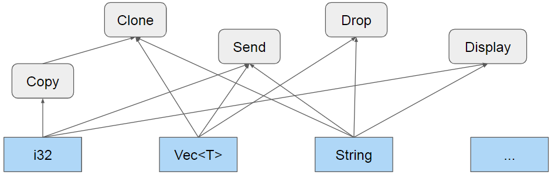
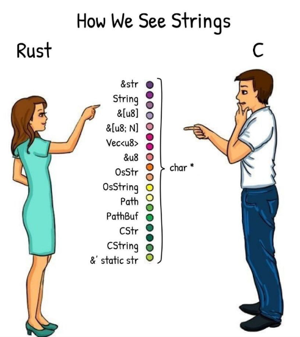

# Introduzione
<!-- Lezione 2 savino - 2023-03-01 -->

Il _C_ è stato e per alcune cose è tutt'ora il linguaggio per eccellenza della programmazione a basso livello. Quando fu inventato, grazie ai compilatori, si poté finalmente aggiungere un livello di astrazione al proprio codice rispetto all'assembler, che richiedeva una conoscenza puntuale dell'architettura, finanche dei registri, comunque garantendo le prestazioni ed il controllo sull'hardware a basso livello.

Tuttavia, nel tempo le esigenze dei programmatori sono cambiate, dovuto al fatto che la complessità dei programmi da creare è cresciuta notevolmente nei decenni.

Rust è un linguaggio il cui sviluppo inizia intorno al 2010 (nel 2011 riesce per la prima volta a compilare se stesso) con lo scopo di aggiudicarsi come linguaggio di programmazione moderno per lo sviluppo a basso livello, sostituendosi al C++/C. Offre supporto nativo per il testing e la gestione di librerie di terze parti, due ambiti dove in C++ la tua miglior speranza è scaricare un `.h` ed un `.c` da internet nella speranza che siano corretti e che siano compatibili con il tuo sistema.

Seppur definito linguaggio ad oggetti, Rust non cade precisamente in questa definizione.
Una più corretta nomenclatura per Rust sarebbe infatti un linguaggio a tipi, dato che implementa anche di base un ricchissimo sistema di tipizzazione.
Tuttavia, per lo stile di programmazione che generalmente si usa, Rust è impropriamente definibile un linguaggio ad oggetti.

La principale evoluzione di Rust rispetto al C++ sta nella sua catena di compilazione. Se infatti essa è appoggiata ad LLVM, che è la stessa catena di compilazione di C++ e quindi ci garantisce fortissimi livelli di ottimizzazione, Rust aggiunge a tale catena un pezzo piuttosto singolare che lo rende un linguaggio unico nel suo genere, vale a dire il _Borrow Checker_.

Il **Borrow Checker** è il meccanismo nativo che _Rust_ offre come soluzione ai problemi di validità e possesso della memoria. Questo si assicura che in ogni istante di esecuzione del mio processo le mie variabili e la memoria da loro utilizzata sia valida e abbia uno ed un solo proprietario . Questo meccanismo è imposto in fase di compilazione, quindi se queste due condizioni non sono assolutamente verificabili, la compilazione fallirà. Ad esempio:

```C++
void foo(void){
    Dummy *ptr = (Dummy *) malloc(sizeof(Dummy));
    ptr->a = 2048;
    free(ptr);
    ptr->a = 1024; // ?
    free(ptr); // ????
}
```

Prendiamo un esempio di _C++_ in cui sono presenti tutti i classici meccanismi di uso della memoria dinamica: allocazione, accesso, liberazione. Abbiamo deliberatamente inserito due errori di programmazione. Il primo è l'accesso a una zona di memoria ormai liberata: qui il programma potrebbe non arrestarsi, in altre parole il comportamento non è definito. Tuttavia abbiamo la certezza di incappare in un errore fatale, o `SEGFAULT`, chiamando la funzione `free` due volte di seguito sullo stesso puntatore.

Questo codice, di cui è facile verificare la correttezza anche per un programmatore non esperto, passerà comunque la compilazione in C++, forse generando al più un avviso.
In Rust un codice equivalente non sarebbe stato compilabile. Rust offre anche la possibilità di tracciare altri tipi di errori in fase di compilazione, come l'underflow o l'overflow.

Per via di questo suo stringente controllo di validità, Rust è tra i linguaggi più stabili esistenti ad oggi, se non il più stabile in assoluto. Tuttavia questo stringente controllo lo rende anche uno dei linguaggi con la curva più ripida in assoluto.

Filosoficamente parlando, Rust è diametralmente opposto a _C_ e _C++_: in questi due linguaggi il programmatore ha la totale libertà di fare qualunque cosa voglia, ma puo' eventualmente cedere parte di questa libertà per ottenere garanzie di correttezza. In Rust si parte invece dalla situazione con meno libertà in assoluto e volta per volta se ne richiede quel tanto che basta per poter ottenere una funzionalità, fermo restando il controllo del compilatore.

Come già detto, installando Rust andremo a installare in realtà non solo `rustc`, che è il compilatore di Rust, ma anche `cargo`, che offre varie funzionalità tra cui la gestione dei panchi, lancio di suite di test, esecuzione dei programmi per monitorare le prestazioni.

Rust obbliga, oltre a una correttezza formale del codice, anche una certa forma nella composizione dei suoi progetti.

Per creare un progetto in Rust abbiamo due modi:
il primo è il comando da CLI `cargo new <project_name>`, che andrà a creare una cartella con nome `<project-name>` e inizializzerà la sua struttura ad albero in un certo modo;
La seconda è, a cartella già create e trovandoci all'interno di essa, il comando `cargo init`, e il progetto prenderà il nome della cartella dentro cui ci si trova.

Che si utilizzi `init` o `new`, varie cose verranno create all'interno della cartella di progetto.

Oltre alle sottocartelle necessarie allo sviluppo ( ad esempio in Rust tutto il sorgente va **necessariamente** all'interno di `<project_name>/src`) ed una repository git, troveremo un file `Cargo.toml` che andrà a descrivere il progetto.

```toml
[package]
name = "projectname"
version = "0.1.0"
edition = "2021"

[dependencies]
```

:::tip
E' fortemente suggerito l'utilizzo del [sito](https://dhghomon.github.io/easy_rust/Chapter_1.html):

```text
https://dhghomon.github.io/easy_rust/Chapter_1.html
```
:::

## Introduzione alla programmazione

In questo capitolo sono affrontate alcune basi inerenti alla programmazione Rust oltre che ai concetti basilari per il suo corretto utilizzo.

### Variabili e tipi

Una variabile lega un valore a un nome. Ogni qual volta una variabile viene realizzata senza alcuna specificazione, la variabile verrà realizzata come non mutabile. Di fatto Rust favorisce l'immutabilità in quanto di base una variabile può essere legata a un solo valore per tutta la sua esistenza, consentendo la modifica solo se specificato.

Per dichiarare una variabile si utilizza la parola chiave `let` seguita dal nome della variabile e dal valore da legare, ad esempio:

```rust
let a = 5;
```

Per fare in modo che una variabile diventi mutabile, ovvero con la possibilità di cambiare:

```rust
let mut a = 5;
```

:::caution
Forzare il cambiamento di una variabile causa un errore di compilazione, ad esempio:

```rust
let a = 5;
a = 6; // ERRORE!
```
:::

Le variabili quando vengono create non richiedono la specifica del tipo di dato da contenere, ma il compilatore è in grado di dedurre il tipo di dato da contenere. Ad esempio:

```rust
let a = 5; // i32
let b = 6.0; // f64
let c = 'c'; // char
```

Nonostante ciò è possibile specificare il tipo di dato da contenere, ad esempio:

```rust
let a: i32 = 5;
let b: f64 = 6.0;
let c: char = 'c';
```

In rust non tutte le espressioni producono un valore, a differenza del C, un esempio è l'assegnazione di una variabile che nel Rust produce `()` ovvero il corrispettivo del `void` in C.

:::note
E' possibile utilizzare gli `_` all'interno degli interi per separare visivamente le cifre, senza causare alcuna variazione nella variabile.

```rust
let a = 1_000_000;
```
:::

### Print

Per stampare a schermo, si utilizza la funzione `println!()`.

```rust
println!("Hello, world!");
```

E' possibile stampare una variabile senza doverne specificare il tipo:

```rust
let a = 5;
println!("a = {}", a);
```

:::note
Il `!` alla fine della funzione `println!()` indica che la funzione è una macro, ovvero un pezzo di codice che viene sostituito prima della compilazione. Le macro sono molto potenti e permettono di scrivere codice molto conciso, ma possono anche rendere il codice meno leggibile.
:::

### Tipi e tratti

Con tratti si fa riferimento alla possibilità di avere tipi differenti che implementano le stesse funzionalità, un esempio potrebbe essere la possibilità di stampare a schermo o copiare il contenuto di una variabile. Per agevolare ciò, poiché tipi diversi possono implementare tratti comuni, Rust introduce circa 20 tratti predefiniti che il compilatore associa a un particolare significato, permettendo al programmatore di aggiungerne a piacere ed estenderne il comportamento.

{width=350px}

I tipi elementari sono:

- **Numeri interi con segno**: `i8`, `i16`, `i32`, `i64`, `i128`, `isize`
- **Numerici interi senza segno**: `u8`, `u16`, `u32`, `u64`, `u128`, `usize`
- **In virgola mobile (IEEE 754)**: `f32`, `f64`
- **Logici**: bool
- **Caratteri** _(32 bit, Unicode Scalar Value)_: char, essendo caratteri unicode è possibile utilizzare emoji o caratteri più complessi.
- **Unit**: `()` rappresenta una tupla di 0 elementi, () indica sia il tipo che il suo unico possibile valore _(Corrisponde al tipo `void` in C/C++)_

:::note
Il linguaggio consente il ritorno di un valore `void`, esattamente come se fosse un valore.
:::

:::tip
Con `isize` e `usize` verrà utilizzato automaticamente il tipo di dato più adatto per la macchina su cui si sta eseguendo il programma, quindi `i32` o  `u32` su una macchina a 32bit.
:::

### Tuple

Una _tupla_ è un set di dati **non omogeneo** (eterogeneo) che contiene dunque tipi di dati differenti senza la necessità di utilizzare sovrastruttura, perdendo però i vantaggi delle strutture (campo con nome specifico a cui viene associato a un valore).

Per accedere al contenuto di una tupla è possibile utilizzare il `.` seguito dal numero di indice.

```rust
let t: (i32, bool) = (123, false); 	// t è una tupla formata da un intero 
                                   	// e da un booleano
let mut u = (3.14, 2.71);          	// u è una tupla riassegnabile formata
                                   	// da due double
let i = t.0;    				   	// i contiene il valore 123
u.1 = 0.0;   						// adesso u contiene (3.14, 0.0)       
```

### Puntatori

Rust offre vari modi per rappresentare indirizzi di memoria:

- riferimenti, condivisi e mutabili
- box
- puntatori nativi, costanti e mutabili

A differenza del C/C++, l'uso dei puntatori è semplificato e non viene utilizzato a meno della programmazione di tipo **unsafe**. Grazie al compilatore, vi sono molte garanzie fornite dal linguaggio che verifica il possesso e il tempo di vita delle variabili, oltre a far avvenire accessi sempre leciti.

#### Riferimenti

Un riferimento è un puntatore che non può essere `null` e che non può essere modificato. Un riferimento è definito con il simbolo `&` e può essere utilizzato per accedere al contenuto di una variabile senza doverla copiare.

L'espressione `let r1 = &v;`, con v un qualsiasi valore o espressione, definisce ed inizializza il riferimento `r1`. Per accere al contenuto di `v` è sufficiente utilizzare `*r1`. In questo moto la variabile `r1` prende in prestito _(borrow)_ il valore v e potrà accedervi in sola lettura. Un riferimento viene rappresentato internamente come un blocco di memoria contenente l'indirizzo di memoria in cui il valore è memorizzato. Il valore originale **non sarà modificabile** fino a quando almeno un riferimento è in uso.

L'espressione `let r2 = &mut v;` definisce ed inizializza il riferimento mutabile r2, in questo modo prende in prestito in modo esclusivo il valore v e permette di modificarlo.

Sebbene possano apparire simili ai puntatori in C, questi non possono essere mai nulli ne contenere l'indirizzo di un valore che è stato già rilasciato o non inizializzato.

Questi implementano una logica di tipo _single writer, multiple reader_, impedendo la modifica di una variabile a cui si ha un riferimento mediante il modulo _borrow checker_ del compilatore.


```rust
fn main(){
	let mut i = 32;
	let ri = &i;

	i = 5; // errore, non è possibile modificare una variabile a cui si ha un riferimento
	println!("i = {}", ri);
}
```

:::error
Non è possibile modificare una variabile a cui si ha un riferimento.
:::

Mentre in C++ è lecito costruire solo riferimenti a variabili e non al risultato di un'espessione temporanea, in rust diventa possibile in quanto questo costituisce un alias alla variabile a cui è stato inizializzato.

```rust
fn main(){
	let mut i = 32;
	let ri  = mut &i;
	let ri2 = mut &i;	// errore non è possibile avere più di un riferimento
						// alla stessa variabile

	println!("i = {}", ri);
}
```

:::tip
La differenza tra _puntatore_ e _riferimento_ è che il secondo non può essere `null`.
:::

:::caution
Multiple reader, single writer. Tale meccanismo è implementato sotto ogni aspetto del linguaggio.
:::

#### Box
<!-- lezione 3 - 2023/03/06 -->
Alla fine del ciclo di vita termina anche l'occupazione dell'heap.

:::note
In Rust il tipo di ritorno è specificato dopo la freccia `->`, e non dunque all'inizio della definizione.
:::

#### Puntatori nativi

Rust definisce anche i tipi dei puntatori nativi come *const T* e *mut T* per un qualsiasi tipo T.

:::tip
In questa dispensa e nel corso non sarà mai necessario e richiesto l'utilizzo di tale tipologia di puntatore.
:::

### Array

Un array è una sequenza di oggetti omogenei disposti consecutivamente nello stack. Gli array esistono in due modalità, una statica e una dinamica. Un array ha una dimensione definita all'atto della sua creazione ed è immutabile.

A differenza del C, esistono i controlli di _bounding_ in modo da non consentire l'accesso a posizioni non valide.

La creazione degli array avviene mediante la sintassi `let nome_array: [tipo; dimensione] = [valore1, valore2, ...]`.

```rust
let a: [i32; 5] = [1, 2, 3, 4, 5]; // a è un array di 5 interi
let b = [0; 5];                    // b è un array di 5 interi inizializzati a 0
                                   // NOTARE il ; per distinguere le notazioni 
let l = b.len();                   // l vale 5
let e = a[3];                      // e vale 4                           
```

In questo modo la modalità di compilazione cambia, in quanto questo ha modo di sapere in fase di compilazione se stiamo gestendo il vettore nel modo corretto.

### Slice

Dato un pool iniziale di elementi, può essere utile utilizzarne solo una porzione dello stesso; solitamente nei linguaggi questo viene ottenuto tramite l'utilizzo di due ulteriori indici (soluzione non sicura) ma sarebbe più facile prendere un riferimento al vettore che definisco solamente in un range preciso.

Una slice è un modo per accedere a un vettore con un riferimento creato appositamente per accedere agli elementi.

```rust
let a = [ 1, 2, 3, 4 ];
let s1: &[i32] = &a;  //s1 contiene i valori 1, 2, 3, 4
let s2 = &a[0..2];    // s2 contiene i valori 1, 2
let s3 = &a[2..];     // s3 contiene i valori 3, 4
```

Di base una slice è immutabile, ma inserendo la parola chiave `mut` si può ottenere una slice mutabile.

### Vec<T>

Un vec è una sequenza ridimensionabile di elementi di tipo T, allocati sullo heap.

### Stringhe

Le stringhe vengono caricate sullo stack e per tale motivo non sono aumentabili in termini di dimensione.

Le costanti di tipo stringa sono raffiugrati con `"`.

E' possibile creare un oggetto String con le seguenti istruzioni:

```rust
let s0 = String::new(); //crea una stringa vuota
let s1 = String::from(“some text”); //crea una stringa inizializzata
let s2 = “some text”.to_string(); //equivalente al precedente
```

{width=350px}

## Funzioni

Le funzioni vengono definite con la parola chiave `fn` seguita dal nome della funzione, dai parametri e dal tipo di ritorno.

```rust
fn print_number(x: i32) {
	println!("x is: {}", x);
}
```

Non è necessario specificarlo, ma nel caso è possibile specificare che una funzione abbia un ritorno `vuoto` mediante:

```rust
fn print_number(x: i32) -> () {
	println!("x is: {}", x);
}
```

### Loop

E' possibile come in altri linguaggi utilizzare i loop.

#### loop

Il loop è un ciclo infinito.

```rust
loop {
	println!("again!");
}
```

Esiste la possibiltà di specificare delle etichette ai cicli in modo da specificare quale ciclo interrompere.

```rust
'outer: loop {
	println!("Entered the outer loop");

	'inner: loop {
		println!("Entered the inner loop");

		break 'outer;
	}

	println!("This point will never be reached");
}
```

#### while

Il while è un ciclo che si ripete finché la condizione è vera.

```rust
let mut x = 5;
let mut done = false;

while !done {
	x += x - 3;

	println!("{}", x);

	if x % 5 == 0 {
		done = true;
	}
}
```

:::note
Il contatore deve essere mutabile per fare in modo che il compilatore non dia errore.
:::

#### for

Il for è un ciclo che itera su un range di valori.

```rust
for x in 0..10 {
	println!("{}", x);
}
```

In particolare esiste la possibilità di iterare su un range di valori:

```rust
for x in 0..10 {
	println!("{}", x);
}
```

E' possibile utilizzarlo per scorrere un insieme di item di un enumeratore:

```rust
for (i,n) in names.iter().enumerate() { //stampa indici e nomi
        println!("names[{}]: {}", i, n);
}
```

:::caution
`enumerate()` è un metodo di `iter()`, non di _names_!
:::

### Selezione

#### Match

Il match è un costrutto che permette di eseguire un'azione in base al valore di una variabile.

```rust
let s = match item { 
    0 => "zero",               			// valore singolo
    10 ..= 20 => "tra dieci e venti",   // intervallo inclusivo
    40 | 80 => "quaranta o ottanta",    // alternativa
    _ =>  "altro",          			// qualunque cosa
}
```

Con `_` si fa riferimento al caso di default. 

:::danger
E' cruciale inserire il caso di default quando non viene valutato tutto il set di casi possibili altrimenti il compilatore darà errore. Un esempio in cui non restituisce l'errore è quello con booleani e i case `0` e `1` che sono sufficienti per valutare tutti i casi.
:::

## I/O

Il crate `std::io` contiene le funzioni per l'input/output oltre a quelle per la definizione delle strutture dati per accedere ai flussi standard di ingresso e uscita.

Questo tipo di operazioni, per definizione, possono fallire: di conseguenza tutti i metodi offerti restituiscono un oggetto di tipo Result <T, Error> che incapsula, alternativamente, il valore atteso, se l'operazione ha avuto successo, o un oggetto di tipo Error in caso di fallimento.

Per garantire la correttezza del programma occorre gestire esplicitamente un eventuale errore, verificando il contenuto del valore ritornato tramite il metodo `is_ok()`.

Il metodo `unwrap` permette di ottenere il valore atteso, se l'operazione ha avuto successo, oppure di terminare il programma con un messaggio di errore.

```rust
use std::io;

fn main() {
	println!("Inserisci un numero intero: ");

	let mut input = String::new();
	io::stdin().read_line(&mut input).unwrap();

	let n: i32 = input.trim().parse().unwrap();

	println!("Il numero inserito è {}", n);
}
```

:::note
In questo caso utilizziamo una refernce a `input` per ottenere il possesso del valore.
:::

## Convenzioni sui nomi

La comunità degli sviluppatori Rust ha elaborato una serire di regole sul formato dei nomi delle diverse entità de llinguaggio.

I nomi sono necessariamente in fomrato UpperCamelCase per tutti i costrutti legati al sistema dei tipi (struct, enum, tratti, ...). Si utilizza invece snake_case per le funzioni e le variabili.