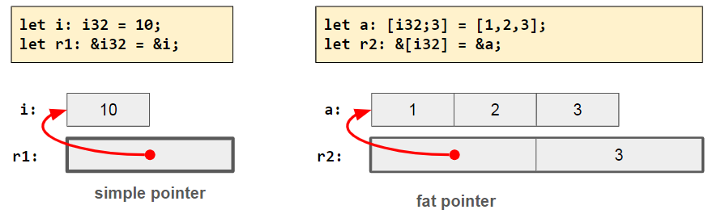
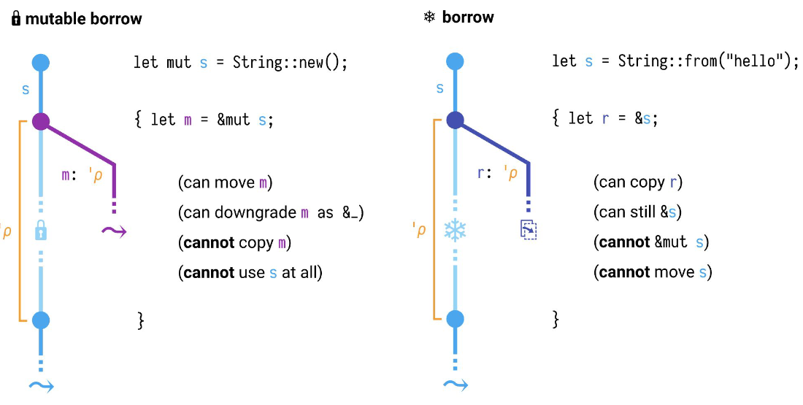
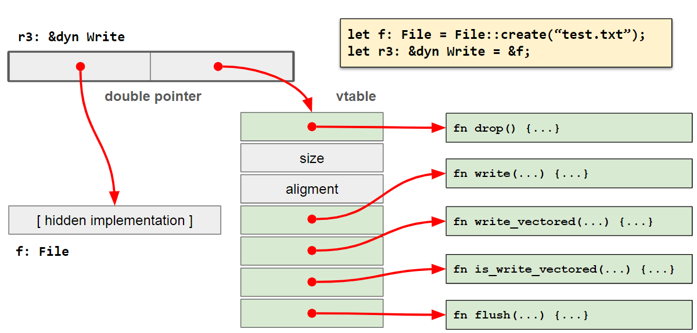
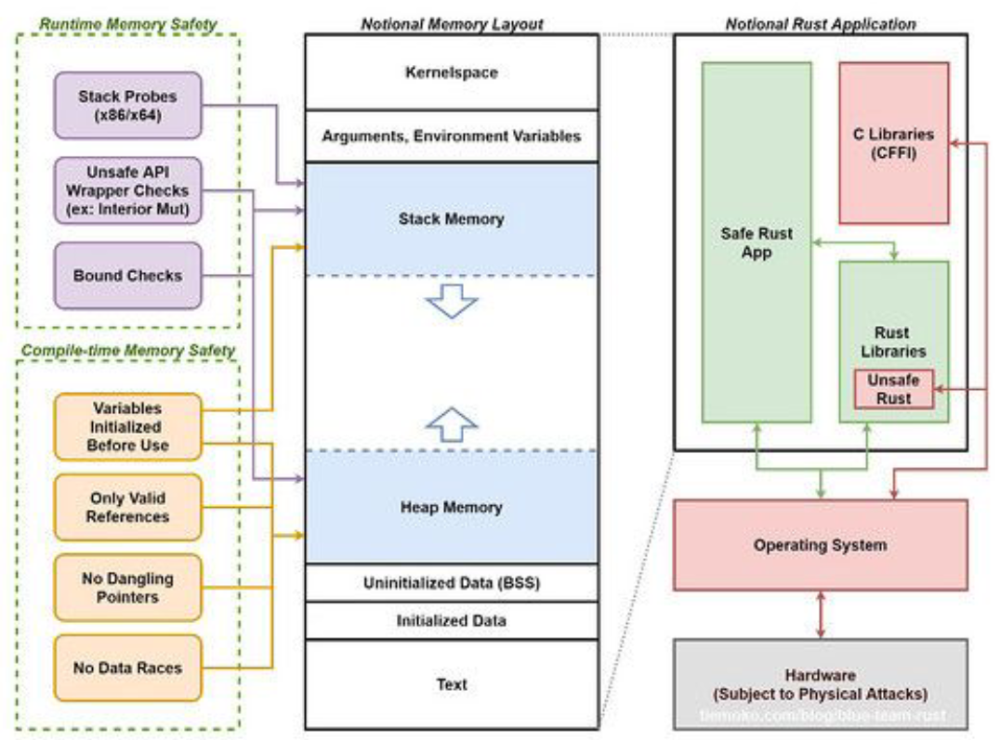

# Possesso

In rust ogni valore introdotto nel programma è posseduto da **una ed una sola** variabile alla volta. Questo viene fatto in quanto, non essendo _presente un garbage collector_ (come il java) consente di evitare la situazioni di scrittori multipli.

Lo scope è associato a un tratto specifico denominato `Drop` che viene eseguito quando la variabile esce dallo scope. Tale funzione va a chiamare la pulizia dell'heap.

```rust
fn main() {
	let s = "hello"; // s è in scope
	println!("{}", s);
} // s esce da scope e viene rilasciato
```

Possedere un valore significa essere responsabile del suo rilascio, liberando la memoria allocata se contiene una risorsa.

Quando avviene una assegnazione si prende i dati della sorgente e li diamo alla destinazione in modo che la sorgente non li possieda più. Questo ha due conseguenze:

- **efficiente** in termini di tempo di esecuzione
- il primo diventi **vuoto** 

E' responsabilità del programmatore eseguire i controlli e non del compilatore.

## Movimento

Gli accessi in lettura alla variabile origineranno degli errori di compilazioni, in quanto stiamo provando a leggere qualcosa che probabilmente non è ciò che i ci aspettiamo. Gli accessi in scritture sulla variabile originale avranno successo e ne riabiliteranno la lettura.

Un esempio è il codice seguente:

```rust
let mut s1 = “hello”.to_string();
println!(“s1: {}”, s1);  
   
let s2 = s1;
println!(“s2: {}”, s2);
//s1 non è più accessibile
```

:::note
Ma il movimento viene per tutto?
:::

il movimento di un parametro è **definitivo**, l'unico modo per evitarlo è ritornare qualcosa in modo da evitarlo, ma solitamente non serve.

## Copia

Alcuni tipi, tra cui quelli numerici, sono definiti copiabili attraverso l'implementazione del tratto `Copy`. Quando un valore viene assegnato a un'altra variabile o situato come argomento in una funzione, il valore originale rimane accessibile in lettura. questo è possibile quando il valore contenuto non costituisce una risorsa che richiede ulteriori azioni di rilascio.

## Clonazione

I tipi che implementano il tratto `Clone` possono essere duplicati invocando il metodo `clone()` che, a differenza della copia e del movimento, comporta una copia in profondità dei valori. Di conseguenza il costo di tale operazione può essere molto elevato.

## Comparazione con C e C++

In C l'operazione di base è la copia, mentre il moviemento è una opzione (contrariamente al Rust).

## Riferimenti
<!-- lezione 2023-03-07 -->

Un **Riferimento** è un puntatore in _sola lettura_ a un blocco di memoria, la quale è posseduta da un'altra variabile.

```rust
let point = (1.0, 0.0);     //point possiede il valore
let reference = &point;     //reference PUÒ accedere al valore in lettura
                            //finché esiste point
println!(“({}, {})”, reference.0, reference.1);
```

:::note
Il protocollo rai fa si che quando sposto la memoria questa viene eliminata.
:::

Un riferimento prende a prestito l'indirizzo di memoria a cui esiste il valore. Fino a quando questo è accessibile, **non è possibile modificare** il valore ne tramite riferimento ne tramite la variabile che possiede il valore.

I riferimenti sono implementati diversamente in base al tipo puntato:

- **puntatori semplici**: se il compilatore conosce la dimensione del dato puntato
- **puntatore + dimensione** _(fat pointer)_: se la dimensione del dato è sono nota in fase di esecuzione.
- **puntatore doppio**: se il tipo di dato puntato è noto solo per l'insieme  di tratti che implementa.

{width=350px}

### Riferimenti mutabili

E' possibile creare ulteriori riferimenti a partire dal dato originale o da altri riferimenti ad esso, con la limitazione che è possibile estrarre **un solo** riferimento mutabile per volta, mediante la sintassi:

```rust
let r = &mut s;
```

{width=350px}

:::note
Utile quando si affronterà il multithreading.
:::

{width=350px}

Il borrow checker garantisce che tutti gli accessi di un riferimento avvengano solo in un intervallo di tempo compreso in quelle in cui il dato esiste, in modo da impedire il fenomeno del _dangling pointer_.

...

:::tip
Un riassunto delle regole è il seguente:

- **una sola** variabile può possedere un dato
- può esistere **un solo** riferimento mutabile per volta
- tutti i riferimenti devono avere una durata inferiore alla variabile che li possiede
:::


## Slice

Una slice è una vista di una sequenza contigua di elementi la cui lunghezza  **non** è nota in fase di compilazione, ma è disponibile durante l'esecuzione.

## Vantaggi

Alcuni vantaggi forniti dal concetto di possesso sono:

- molteplici garanzie di correttezza negli accessi in memoria e del rilascio delle risorse senza aver bisogno di un garbage collector.
- Non esiste il concetto di riferimento nullo e, di conseguenza, non c'è il rischio di deferenziarlo.
- Evita errori di _buffer overflow_ e buffer underflow.
- Immutabilità, programma diventa deterministico in quanto l'assenza di garbage collector impedisce comportamenti non deterministici.

:::note
Buffer overflow si differenzia dell'errore di segmentazione perchè il buffer overflow è un errore di accesso alla memoria, mentre l'errore di segmentazione è un errore di accesso alla memoria virtuale. (???)
:::

{width=400px}

La marcatura è necessaria in quanto il codice sorgente deve essere marchiato come readonly in modo da non renderlo modificabile mentre è in esecuzione.

Per la parte di compilazione, quella gialla, garantiamo che lo stack e heap non ci siano le cose che sono elencate nel box giallo con tutti inizializzato e gestito nel modo corretto.
