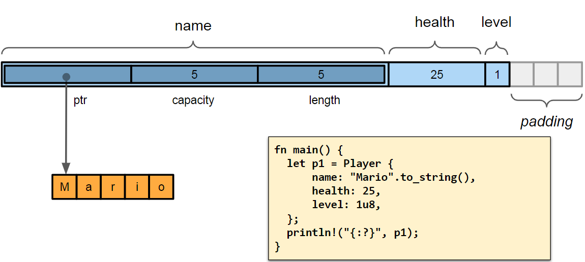
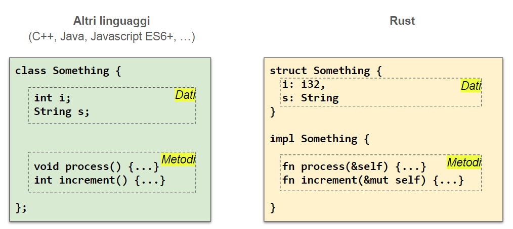
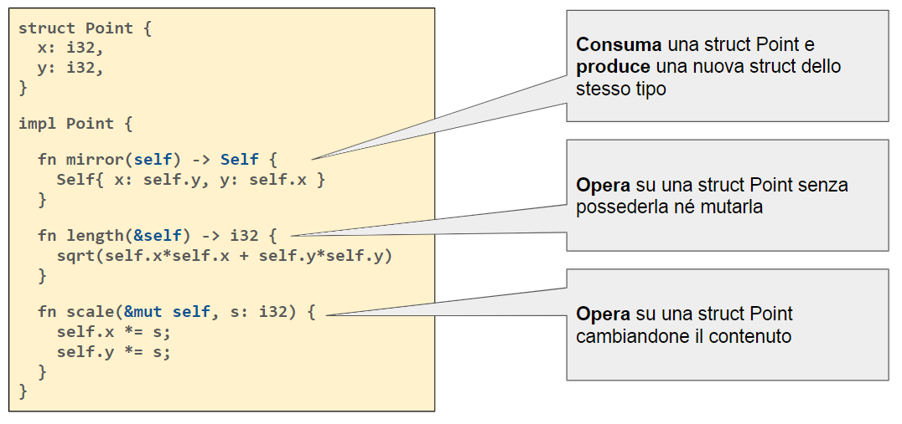
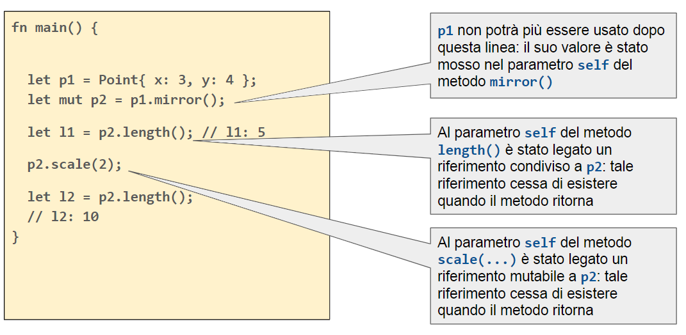
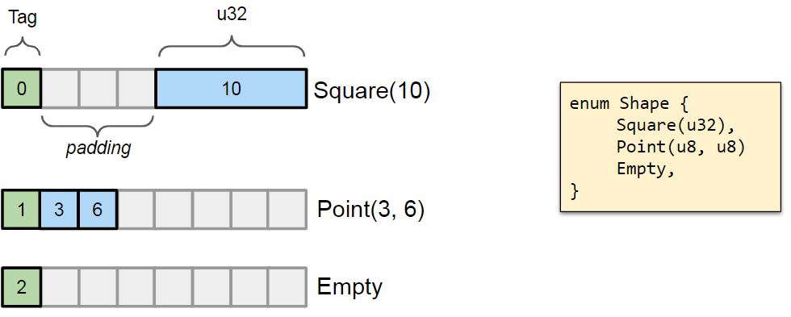

# Tipi composti
<!-- 2023-03-08 -->

In Rust, come in altri linguaggi di programmazione come il C, permette la definizione e utilizzo di dati composti che permettono di raggruppare insieme dati di tipo diverso.

Una premessa fondamentale è l'assenza in Rust delle classi, che sono sostituite da `struct` e `enum`. La principale differenza è la mancanza della possibilità di effettuare l'ereditarietà, che è sostituita da un meccanismo di composizione.

## Struct

In _C_ e _C++_ il costrutto `struct` permette di creare un nuovo tipo che contiene un gruppo di campi la cui accessibilità è aperta a tutti (pubblica). Analogamente avviene in Rust, dove la `struct` è un tipo di dato composto che contiene un gruppo di campi, ognuno dei quali può essere di tipo diverso. In Rust, tuttavia, la visibilità dei campi è di default privata, mentre in _C_ e _C++_ è pubblica.

Grazie all'utilizzo delle struct è possibile mantenere unite informazioni tra loro eterogenee associando a ciascun valore un nome.

```rust
struct Player {
    name: String,  // nickname
    health: i32,   // stato di salute (in punti vita)
    level: u8,     // livello corrente
}
```

Le informazioni sono poste in memoria consecutivamente, mentre nome e tipo sono indicati dal programmatore.

Per le `struct` si utilizza la convenzione _lowerCamelCase_ (prima lettera minuscola), mentre per i campi (come per variabili, funzioni e metodi) si utilizza la convenzione *snake_case*.

:::caution
Anche le tuple possono essere utilizzate per mantenere dati di tipo eterogeneo, ma senza la possibilità di associarvi una chiave di identificazione.
:::

### Inizializzazione

Per inizializzare una variabile di tipo `struct` si utilizza la sintassi:

```rust
let p = Player {
	name: "Mario".to_string(),
	health: 100,
	level: 1,
};
```

### Accesso ai campi

Per accedere ai campi di una `struct` si utilizza il punto `.`:

```rust
println!("{} ha {} punti vita", p.name, p.health);
```

### Copia con modifica

E' possibile copiare una struct da una già esistente modificando uno o più campi:

```rust
// p è un player
let p1 = Player {name: "Paolo".to_string(), ..p};
```

### Struct simili a tuple

E' possibile creare una `struct` che contiene un gruppo di campi di tipo diverso, ma senza associare un nome ad ogni campo. In questo modo si stanzia come una tupla con l'aggiunta del nome della struct.

```rust
struct Playground (String, u32, u32);
struct Empty;   // non viene allocata memoria per questo tipo di valore

let mut f = Playground( "football".to_string(), 90, 45 );
let e = Empty;
```

### Rappresentazione in memoria

{width=350px}

La disposizione in memoria dei singoli campi è conseguenza di vincoli e ottimizzazioni e può essere controllata attraverso opportuni meccanismi:

- ogni singolo campo (in base al tipo) richiede che l'indirizzo a cui viene collocato sia multiplo di una potenza di 2 (allineamento).
- `std::mem::align_of_val(...)`
- l'allineamento e la disposizione di una struct è controllata attraverso l'attributo `#[repr(...)]`

:::tip
La funzione `std::mem::align_of_val(...)` restituisce l'allineamento richiesto per un particolare valore, mentre `std::mem::size_of_val(...)` restituisce la dimensione del dato.
:::

### Visibilità

Le `struct` e i relativi campi possono essere preceduti da un modificatore di visibilità, il quale impatta sulla possibilità di accesso al contenuto da parte di codice presente in moduli diversi da quello in cui è definito.

- `pub` indica che il tipo è visibile all'esterno del modulo in cui è definito.

Questo permette di implementare il meccanismo di _incapsulamento_ (information hiding).

La definizione dei metodi associati a una `struct` avviene separatamente mediante un blocco di tipo `impl`.

:::caution
Di default i campi sono sempre considerati privati.
:::

### Metodi

Come preannunciato, la definizione dei metodi avviene separata dalla definizione della `struct` mediante un blocco di tipo `impl`.

{width=350px}

I metodi sono funzioni legate ad un'istanza di un dato tipo, manifestato sia a livello sintattico che semantico.

Dal punto di vista sintattico, un temtodo viene invocato a partire da un'istanza del tipo a cui è legato mediante la notazione `instance.method(...)`. Semanticamente, il codice del metodo ha accesso al contenuto (pubblico e privato) del ricevitore attraverso la parola chiave `self`. I metodo legati a una `struct` vengono implementati sotto forma di funzioni con un parametro ulteriore (`self`, `&self`, `&mut self`) il cui tipo è vincolato alla struct per la quale sono definiti.

Il primo parametro di un metodo definisce il livello di accesso che il codice del metodo ha il suo ricevitore:

- `self` indica che il ricevitore viene passato **per movimento**, consumando il contenuto della variabile. Rappresenta una forma contratta della notazione `self: Self`.
- `&self` indica che il ricevitore viene passato **per riferimento condiviso**, in quanto si può accedere il lettura ma non in scrittura. Rappresenta una forma contratta della notazione `self: &Self`.
- `&mut self` indica che il ricevitore viene passato **per riferimento esclusivo**, in quanto vi è la possibilità di scrittura. Rappresenta una forma contratta della notazione `self: &mut Self`.

:::danger
Se presente, il parametro `self` deve essere specificato come **primo parametro**, mentre al momento della chiamata questo verrà ricavato implicitamente dal valore che compare a sinistra del `.` che precede il nome del metodo.
:::

{width=350px}

{width=350px}

#### Costruttori

In Rust non esiste il concetto di distruttore, in quanto qualunque modulo che abbia visibilità di una `struct` e dei suoi campi può crearne un'stanza indicando il valore di ciascun attributo. Per evitare duplicazione di codice e favorire l'incapsulamento, le implementazioni introducono metodi statici per l'inizializzazione delle istanze.

:::definition
Si definisce come metodo `new` di una `struct` il metodo statico che restituisce un'istanza della `struct` inizializzata con i valori passati come argomenti.
:::

```rust
struct Player {
	name: String,
	health: u32,
}

impl Player {
	pub fn new(name: String, health: u32) -> Self {
		Player { name, health }
	}
}
```

:::caution
Rust non supporta l'overloading delle funzioni, per tale motivo ciascun metodo `new` deve avere un nome diverso.
:::

:::danger
I metodi `new` non devono necessariamente avere tale nome, ma è una convenzione molto diffusa.
:::

#### Distruttori

I distruttori sono utilizzati in C++ per rilasciare le risorse allocate dinamicamente. Ciò abilita un approccio denominato _RAII_ (Resource Acquisition Is Initialization), in cui le risorse vengono allocate nel costruttore e rilasciate nel distruttore. Questo viene chiamato automaticamente quando una variabile locale esce dallo scope.

Il paradigma _RAI_ consiste nel incapsulare le risorse in una struttura in cui il costruttore acquisisce le risorse e stabilisce eventuali invarianti, oppure lancia un'eccezione se non può essere fatto. Il distruttore rilascia invece le risorse, senza **mai** lanciare eccezioni. In questo contesto è la semantica del movimento che garantisce il corretto trasferimento delle risorse mantenendo la sicurezza de rilascio.

In Rust il rilascio delle risorse è gestito attraverso il tratto `Drop`, costituito dalla sola funzione:

```rust
drop(&mut self)->()
```

Il compilatore riconosce la presenza di questo tratto nei tipi definiti dall'utente e provvederà a chiamare la funzione che lo costituisce quando le variabili di quel tipo escono dallo scope.

```rust
struct Player {
	name: String,
	health: u32,
}

impl Drop for Player {
	fn drop(&mut self) {
		println!("{} is dead", self.name);
	}
}
```

:::caution
Il paradigma _RAII_ è mutato dal C** ed è un modo per gestire automaticamente l'acquisizione e il rilascio delle risorse.
:::

:::danger
Il tratto `Drop` è **mutuamente esclusivo** con il tratto `Copy`, in quanto il compilatore non può garantire che la funzione `drop` non modifichi il contenuto della variabile.
:::

#### Metodi statici

In Rust è possibile implementare metodi statici, ovvero non legati a una specifica istanze, ma che possono operare su tutte le istanze relative a una particolare struttura.

Per fare ciò è sufficiente non indicare come parametro ne `self` ne un suo derivato. In questo modo è possibile realizzare funzioni per la costruzioni di istanze, metodi per la conversione di tipi o accesso a funzionalità statiche.

## Enum

`enum` è definito come tipo **somma**, l'insieme dei valori che pul contenere è l'unione dei valori delle singole alternative. Per contro, `struct` è di tipo prodotto in quanto l0insieme dei valori che può contenere è il prodotto cartesiano degli insiemi legati ai singoli campi.

{width=350px}

Non essendo presente la possibilità di effettuare l'ereditarietà di strutture in Rust, è possibile utilizzare gli `enum` per rappresentare una gerarchia di tipi.

```rust
enum Shape {
	Circle { x: f64, y: f64, radius: f64 },
	Rectangle { x: f64, y: f64, width: f64, height: f64 },
	Square { x: f64, y: f64, side: f64 },
}
```

in combinazione con l'utilizzo di match è possibile definire dei metodi per le singole alternative:

```rust
impl Shape {
	fn area(&self) -> f64 {
		match *self {
			Shape::Circle { radius, .. } => std::f64::consts::PI * radius * radius,
			Shape::Rectangle { width, height, .. } => width * height,
			Shape::Square { side, .. } => side * side,
		}
	}
}
```

