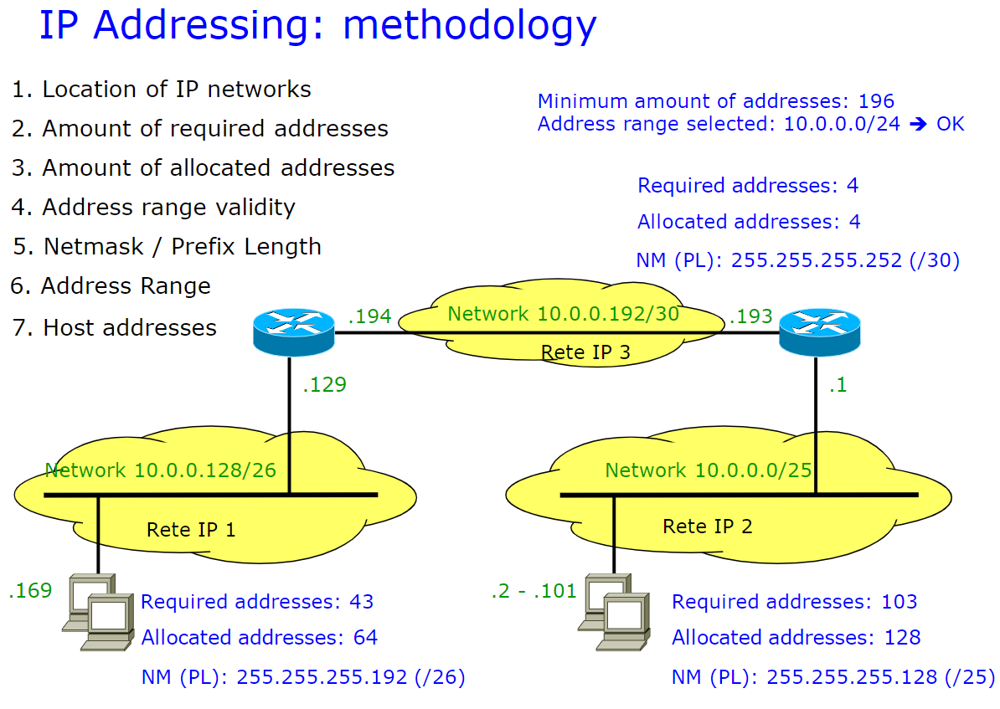

# IPv4 Summary
<!-- lezione1: -->

In ogni sottorete tutti i dispositivi che ne fanno parte avranno lo stesso indirizzo ip.

## Indirizzi speciali

- tutti i bit a 1: indirizzo di broadcast, non può essere assegnato
- `127.x.x.x`: indirizzo di loopback, è una  classe di indirizzi e servono a identificare l'host stesso e per tale motivo vengono solitamente utilizzate a scopo di debug.

Spesso oggi giorno non è consentito l'invio di messaggi in broadcast per motivi di sicurezza.

## Indirizzamento IP con classi

Le rappresentazioni possono essere classes (a classe) o classness (senza l'utilizzo di classi). In particolare esistono di tre tipologie:

- **A**: prevede i primi 8 bit per l'indirizzo di rete, i rimanenti sono per identificare i dispositivi. Il totale degli indirizzi è 2^7 per la rete e 2^24 per i dispositivi. Si possono avere 128 networks.
- **B**: 2 bit per la classe, 14 bit per la rete e 16 bit per i dispositivi. Si possono avere 16384 networks.
- **C**: 3 bit per la classe, 21 bit per la rete e 8 bit per gli host.

Basta guardare il primo bit per capire se era una classe A o B o C.

**Nota**:I bit di riconoscimento servono per sapere quali bit individuano la rete e quali gli host.

## Indirizzamento IP senza classi (CIDR)

Il sistema _**C**lassless **I**nter**D**omain **R**outing_ permette di indirizzare la porzione più precisa di indirizzi tra rete e e dispositivi. La porzione di rete è dunque di lunghezza arbitraria. Il formato con cui può essere rappresentato un indirizzo è il seguente: `networkID + prefix length` oppure `netmask`.

Il prefix length, specificato con `/x`, è il numero di bit  di network.

La netmask è identificata da una serie di bit posti a `1` che determinano quali bit identificano la rete, attraverso un and bit a bit.

_Esempio:_

```text
200.23.16.0/23                # prefix length
200.23.16.0 255.255.255.254.0 # netmask
```

L'indirizzo viene espresso attraverso gruppi di 8 bit, rappresentanti in modo decimale puntato (4 gruppi in quanto 32 bit totali). Ogni raggruppamento avrà un valore da 0 a 255.

Non tutti i valori sono permessi possibili, il più piccolo è 252. Questo è dovuto al fatto che abbiamo l'indirizzo dell'intera sottorete e l'indirizzo del inter broadcast che non possono essere utilizzati nell'assegnazione.

Un modo per sapere se un indirizzo è scritto in modo corretto è prendere il prefix length `/x` e controllare che ci l'ultimo numero puntato sia multiplo di 2^(32-x).

_Esempi:_

```text
130.192.1.4/30  =>  4%(2^32-30) = 4%4  = 0 si!
130.192.1.16/30 => 16%(2^32-30) = 16%4 = 0 si!
130.192.1.16/29 => 16%(2^32-29) = 16%8 = 0 si!

130.192.1.1/30 => 1%(2^32-30) = 1%4  != 0 no!
130.192.1.1/29 => 1%(2^32-29) = 1%8  != 0 no!
130.192.1.1/28 => 1%(2^32-28) = 1%16 != 0 no!
```

Per il ragionamento di sopra appare evidente che un indirizzo che termina con `.1` non sarà mai un indirizzo corretto, in quanto ritornerà sempre un resto.

## IP routing

Il routing degli host avviene attraverso la routing table, caratterizzata da due colonne che identificano:

- **destinazione** (indirizzi ip)
- **interfaccia** (eth0...)

Quando viene inviato un pacchetto, si cerca un match all'interno della tabella per identificare dove inviare un pacchetto IP. Se è presente più di un match, viene considerato quello con il prefisso più lungo.

_nota: i router sono identificati solitamente con un cerchio con dentro una x._

Di seguito è mostrato un esempio di routing:

{width=500px}

Sono presenti in totale 7 sottoreti, di cui 3 reti locali e 4 reti punto punto. Tutta la sottorete ha come indirizzo quello raffigurato in alto a sinistra. Gli indirizzi di ciascuna di queste sono come segue:

{width=500px}

Scriviamo la routing table del router identificando le reti direttamente connesse e raggiungibili. Prendiamo come riferimento **R1**:

| Destination    | Next        | Type   |
|----------------|-------------|--------|
| 130.192.3.0/30 | 130.192.3.1 | direct |
| 130.192.3.4/30 | 130.192.3.5 | direct |
| 130.192.2.0/24 | 130.192.2.1 | direct |
| 80.105.10.0/30 | 80.105.10.1 | direct |
| 80.105.10.0/30 | 80.105.10.1 | direct |
| 130.192.0.0/24 | 130.192.3.2 | static |
| 130.192.3.8/30 | 130.192.3.2 | static |
| 130.192.1.6/24 | 130.192.3.2 | static |

<!-- lezione2: -->
## IP addressing methodology

{width=500px}  

La metodologia da adoperare è la seguente:

1. Localizzare le reti IP, _in questo caso 3_.
2. Individuare il numero di indirizzi richiesti, _in questo caso nel router in alto a destra è sufficiente `/30` perché ne sono richiesti 4 ($2^2$), `/26` a sinistra ($2^6$) e `/25` in basso a destra ($2^7$)_.
3. Quanti indirizzi posso allocare.
4. Il range di validità degli indirizzi,_in questo caso `/26`, `/25` e `/30` dunque mi basterebbe o tutti e 3, o due `/25` o infine un solo `/24`_

_Nota: in basso a sinistra sono richiesti 43 indirizzi per 40 dispositivi. Ciò è dovuto al fatto che oltre ai 40 richiesti serve l'indirizzo di rete, l'indirizzo di broadcast e l'indirizzo del router._

Per riuscire a trovare le sottoreti, si prosegue in ordine dal maggiore (decimale minore):

```text
# tutta la rete
10.0.0.0/24

# subnet2 (/25), 32-25 = 7 => 2^7 = 128 indirizzi
# range: 0-127
10.0.0.0/25
10.0.0.127 <- ultimo

# subnet3 (/26), 32-26 = 6 => 2^6 = 64 indirizzi
# range: 128-191
10.0.0.128/26
10.0.0.191 <- ultimo

#subnet4 (/30), punto punto
10.0.0.192/30
```
<!-- fine Capitolo1 -->