# IPv4 Summary

<!-- lezione1: -->

In questo capitolo viene fatto un ripasso generico su quanto visto nei corsi precedenti relativo al **IPv4**, con particolare riferimento a _Reti Informatiche_ (o equivalenti).

## Terminologia per l'indirizzamento

Gli indirizzi _IP_ in **IPv4** hanno una lunghezza pari a **32 bit** e vengono utilizzati per identificare le interfacce per router e host. Questi sono composti da due parti:

- **network part**: sono i bit più alti, identificano la rete in cui un host si trova.
- **host part**: sono i bit più bassi, identificano l'host all'interno della rete.

Un insieme di dispositivi con interfacce IP identificano una _IP Network_, caratterizzata dalla medesima network part, a cui tutti i dispositivi sono connessi al medesimo _physical network_ (link layer).

## Indirizzi speciali

In IPv4, oltre ai _"classici"_ indirizzi, sono presenti alcuni indirizzi speciali:

- tutti i bit a `1`: indirizzo di **broadcast**, non può essere assegnato
- `127.x.x.x`: indirizzo di **loopback**, è una  classe di indirizzi e servono a identificare l'host stesso e per tale motivo vengono solitamente utilizzati per debug.

:::caution
**Ricorda**: Spesso al giorno d'oggi non è consentito l'invio di messaggi in broadcast per motivi di sicurezza.
:::

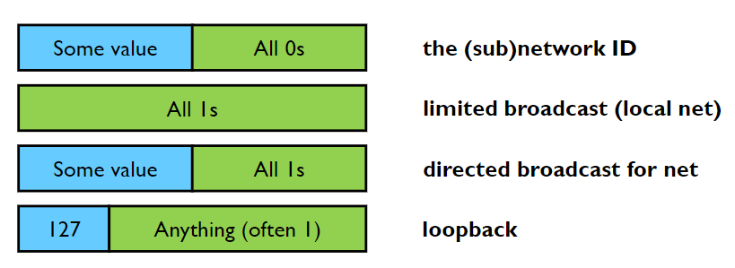{width=300px}

## Indirizzamento con classi

Le rappresentazioni possono essere **classes** (a classe) o **classless** (senza l'utilizzo di classi), in modo da sapere quali bit individuano la rete e quali gli host.

La suddivisione in classi sulle seguenti tipologie:

- **A**: il MSB identifica la classe, i 7 bit seguenti l'indirizzo di rete, i rimanenti sono per i dispositivi. Il totale degli indirizzi è $2^7$ (128) per la rete e $2^24$ per i dispositivi.
- **B**: i 2 MSB identificano la classe, i 14 bit seguenti la rete e 16 bit per i dispositivi.
- **C**: 3 bit per la classe, 21 bit per la rete e 8 bit per gli host.
- **D**: 4 bit per la classe, 28 bit per la rete e 4 bit per gli host. Questi indirizzi sono riservati per i _multicast_.

:::tip
Basta guardare i primi bit per capire la classe di un indirizzo.
:::

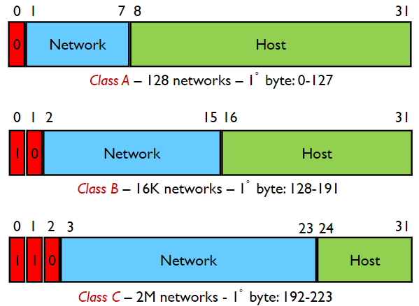{width=300px}

## Indirizzamento IP senza classi (CIDR)

Il sistema _**C**lassless **I**nter**D**omain **R**outing_ permette di indirizzare in modo più preciso tra rete e e dispositivi, rendendo la porzione di rete di lunghezza **arbitraria**. Il formato con cui può essere rappresentato un indirizzo è il seguente: `networkID + prefix length` oppure `netmask`.

Il **prefix length**, specificato con `/x`, è il numero di bit della rete.

La netmask è identificata da una serie di bit posti a `1` che determinano quali bit identificano la rete, attraverso un `and` bit a bit.

_Esempio:_

```text
200.23.16.0/23                # prefix length
200.23.16.0 255.255.255.254.0 # netmask
```

L'indirizzo viene espresso attraverso gruppi di **8 bit**, rappresentanti in modo decimale puntato (4 gruppi in quanto 32 bit totali). Ogni raggruppamento avrà un valore compreso tra 0 e 255.

In realtà **non tutti i valori sono permessi**, il più piccolo è **252**. Questo è dovuto al fatto che è sempre presente e non assegnabile l'indirizzo della sottorete _(Network ID)_ e l'indirizzo del _inter-broadcast_.

Un modo per verificare se un indirizzo è scritto in modo corretto è prendere il prefix length `/x` e controllare che l'ultimo numero puntato sia multiplo di 2^(32-x).

Esempi:

```text
130.192.1.4/30  =>  4%2^(32-30) = 4%4  = 0, si!
130.192.1.16/30 => 16%2^(32-30) = 16%4 = 0, si!
130.192.1.16/29 => 16%2^(32-29) = 16%8 = 0, si!

130.192.1.1/30 => 1%2^(32-30) = 1%4  != 0, no!
130.192.1.1/29 => 1%2^(32-29) = 1%8  != 0, no!
130.192.1.1/28 => 1%2^(32-28) = 1%16 != 0, no!
```

:::tip
**Ricorda**: prefix length e netmask sono due modi equivalenti per rappresentare un indirizzo.
:::

:::danger
Per il ragionamento di sopra appare evidente che un indirizzo che termina con `.1` **non sarà mai un indirizzo corretto**, in quanto ritornerà sempre un resto.
:::

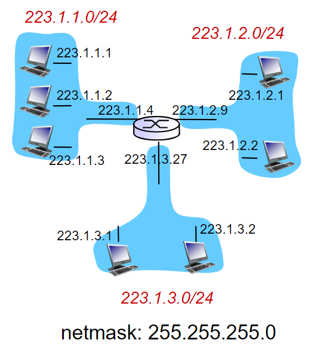{width=300px}

## IP routing

Il routing degli host avviene attraverso la **routing table**, caratterizzata da due colonne che identificano:

- **destinazione**: indirizzi ip
- **interfaccia**: etho, wlan _etc..._

Quando viene inviato un pacchetto, si cerca un match all'interno della tabella per identificare dove l'indirizzo IP di destinazione. Se è presente più di un match, viene considerato quello con il **prefisso più lungo** attraverso la tecnica del **longest prefix matching**.

:::tip
**Nota**: i router sono identificati solitamente con un cerchio con dentro una x.
:::

Di seguito è mostrato un esempio di routing:

{width=400px}

Sono presenti in totale 7 sottoreti, di cui 3 reti locali e 4 reti punto punto. Tutta la sottorete ha come indirizzo quello raffigurato in alto a sinistra. Gli indirizzi di ciascuna di queste sono come segue:

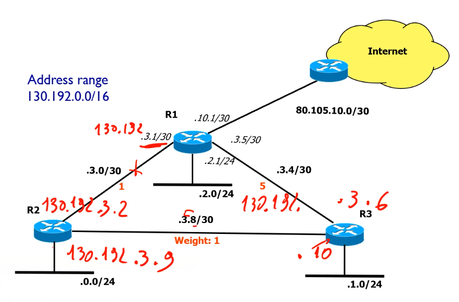{width=400px}

Scriviamo la routing table del router identificando le reti direttamente connesse e raggiungibili. Prendiamo come riferimento **R1**:

| Destination    | Next        | Type   |
| -------------- | ----------- | ------ |
| 130.192.3.0/30 | 130.192.3.1 | direct |
| 130.192.3.4/30 | 130.192.3.5 | direct |
| 130.192.2.0/24 | 130.192.2.1 | direct |
| 80.105.10.0/30 | 80.105.10.1 | direct |
| 0.0.0.0/0		 | 80.105.10.2 | static |
| 130.192.0.0/24 | 130.192.3.2 | static |
| 130.192.1.0/24 | 130.192.3.2 | static |
| 130.192.3.8/30 | 130.192.3.2 | static |

<!-- lezione2: -->

## IP addressing methodology

Presa come esempio la rete che segue, la metodologia da adoperare è la seguente:

1. Localizzare le reti IP, _in questo caso 3_.
2. Individuare il numero di indirizzi richiesti, _in questo caso nel router in alto a destra è sufficiente `/30` perché ne sono richiesti 4 ($2^2$), `/26` a sinistra ($2^6$) e `/25` in basso a destra ($2^7$)_.
3. Calcolare quanti indirizzi è possibile allocare.
4. Verificare il range di validità degli indirizzi,_in questo caso `/26`, `/25` e `/30` dunque mi basterebbe o tutti e 3, o due `/25` o infine un solo `/24`_.
5. Calcolare la netmask / prefix length.
6. Calcolare address range.
7. Calcolare gli indirizzi degli host.

{width=400px}

:::note
**Nota**: in basso a sinistra sono richiesti 43 indirizzi per 40 dispositivi. Ciò è dovuto al fatto che oltre ai 40 richiesti serve l'indirizzo di rete, l'indirizzo di broadcast e l'indirizzo del router.
:::

Per riuscire a trovare le sottoreti, si prosegue in ordine dal più grande _(ovvero il valore minore)_:

```text
# tutta la rete (/24)
10.0.0.0/24

# subnet2 (/25), 32-25 = 7 => 2^7 = 128 indirizzi
# range: 0-127
10.0.0.0/25 <- primo
10.0.0.127  <- ultimo

# subnet3 (/26), 32-26 = 6 => 2^6 = 64 indirizzi
# range: 128-191
10.0.0.128/26 <- primo
10.0.0.191    <- ultimo

#subnet4 (/30), punto punto
10.0.0.192/30
```

:::tip
Suggerimento: quando calcoli i bit per la maschera, vedi quanti zeri rimangono e fai $256 - 2^\text{n\_zeri}$.
:::

:::danger
**Ricorda**: Quando lasci lo spazio per gli indirizzi è sempre necessario riservarne 2 per l'indirizzo di rete e l'indirizzo di broadcast. Per questo motivo nelle connessioni punto punto (`/30`) devi comunque riservane 4.
:::

### Esercizi

#### Esercizio 1

> Assuming a classless addressing plan, define the netmask and the prefix length that have to be assigned to possible networks in order to contain the given number of hosts

| Numero di hosts | NetMask           | Prefix Length     | Available Addresses |
| --------------- | ----------------- | ----------------- | ------------------- |
| 2               | `255.255.255.252` | (32-2) -> `/30`   | $2^2 - 2 = 2$       |
| 27              | `255.255.255.224` | (32-5) -> `/27`   | $2^5 - 2 = 30$      |
| 5               | `255.255.255.248` | (32-3) -> `/29`   | $2^3 - 2 = 6$       |
| 100             | `255.255.255.128` | (32-7) -> `/25`   | $2^7 - 2 = 126$     |
| 10              | `255.255.255.240` | (32-4) -> `/28`   | $2^4 - 2 = 14$      |
| 300             | `255.255.254.000` | (32-9)  -> `/23`  | $2^9 - 2 = 510$     |
| 1010            | `255.255.252.000` | (32-10) -> `/22`  | $2^10 - 2 = 1022$   |
| 55              | `255.255.255.192` | (32-6) -> `/26`   | $2^6 - 2 = 62$      |
| 167             | `255.255.255.000` | (32-8) -> `/24`   | $2^8 - 2 = 254$     |
| 1540            | `255.255.248.000` | (32-11)  -> `/21` | $2^11 - 2 = 2046$   |

:::tip
**Nota**: per calcolare la netmask, si esegue $256 - 2^\text{bit}$
:::

#### Esercizio 2

> Verifica se i seguenti indirizzi sono  validi o meno.

| IP / Prefix Length pair | Valido?                          |
| ----------------------- | -------------------------------- |
| `192.168.5.0/24`        | Si, $0  \bmod 2^{(32-24)} = 0$   |
| `192.168.2.36/30`       | Si, $36 \bmod 2^{(32-30)} = 0$   |
| `192.168.2.36/29`       | No, $36 \bmod 2^{(32-29)} \ne 0$ |
| `192.168.2.32/28`       | Si, $32 \bmod 2^{(32-28)} = 0$   |
| `192.168.2.32/27`       | Si, $32 \bmod 2^{(32-27)} = 0$   |
| `192.168.3.0/23`        | No, $3 \bmod 2^{(1)} != 0$       |
| `192.168.2.0/31`        | No, `/31` non ha senso           |
| `192.168.2.0/23`        | Si, $2  \bmod 2^{(1)} \ne 0$     |
| `192.168.16.0/21`       | Si, $16 \bmod 2^3 = 0$           |
| `192.168.12.0/21`       | No, $12 \bmod 2^3 \ne 0$         |

:::tip
**Consiglio**: quando devi verificare la validità con prefix length che supera 8, significa che il controllo è da fare sul gruppo precedente (e così via), quindi puoi fare $2^{(32-x)-8}$. Stesso ragionamento quando si supera 16, 24, _ecc..._
:::

<!-- lezione3: 2022-10-05 -->

#### Esercizio 3

> Trova l'errore di configurazione nella rete indicata di seguito e spiega il motivo per cui questa non funziona come dovrebbe.

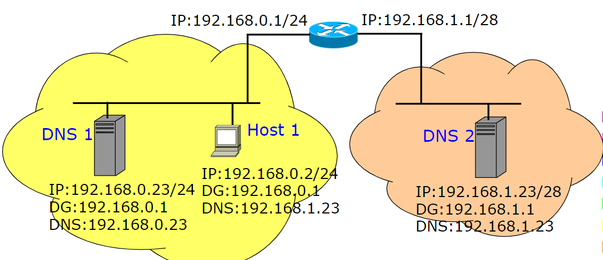{width=400px}

Il problema è relativo al fatto che il router non si trova nella medesima rete della rete arancione, in quanto essendo una `/28` il range di indirizzi vanno da `192.168.1.0` a `192.168.1.15`. In realtà quelli utilizzabili però sono da `.1` a `.14` in quanto i due rimanenti sono riservati per broadcast (`.15`) e rete (`.0`).

Le soluzioni sono due:

- utilizzare un `/27` invece del `/28` in modo da arrivare fino a `.31`, rendendo `.23` corretto
- cambiare l'indirizzo del dns, ad esempio con `192.168.1.10`

#### Esercizio 4

> Definire un piano di indirizzamento IP per la rete in figura. Considerare entrambi i tipi di indirizzamento: "tradizionale" (senza minimizzare) e una soluzione che minimizzi il numero di indirizzi IP utilizzati. si assuma di utilizzare il range 10.0.0.0/16.

{width=400px}

Partiamo evidenziando come il router a sinistra, al fine di servire 350 host, ha in realtà bisogno di 353 indirizzi: 350 host + 1 indirizzo di rete + 1 indirizzo di broadcast + 1 indirizzo del router, dunque `/23`. Stesso ragionamento è applicabile al router di destra, che ha bisogno di 123 indirizzi dunque `/25`.

Troviamo così che `10.0.0.0/23` è la rete A (sinistra). Il suo indirizzo di broadcast sarà `10.0.1.255` in quanto adoperiamo 9 bit _(quindi gli ultimi 8 bit a 1 e il primo bit del terzo gruppo a 1)_.

La sottorete C (destra) sarà identificata da `10.0.2.0/25` in quanto l'indirizzo immediatamente successivo. Il suo indirizzo di broadcast sarà `10.0.2.127`.

La sottorete B (centrale) sarà identificata da `10.0.2.128/30`, con `/30` proveniente dal fatto che è una sottorete punto punto.

Questa soluzione comporta un grosso spreco, in quanto c'è un `/25` che non viene utilizzato.

La seconda soluzione prevede l'utilizzo di più sottoreti per non sprecare indirizzi, in particolare un `/24`, `/26`, `/27`, `/28` per un totale di 256 + 64 + 32 + 16 = 368 indirizzi.

{width=400px}

#### Esercizio 5

> Definisci un albero di routing per tutti i nodi della rete mostrata di seguito.

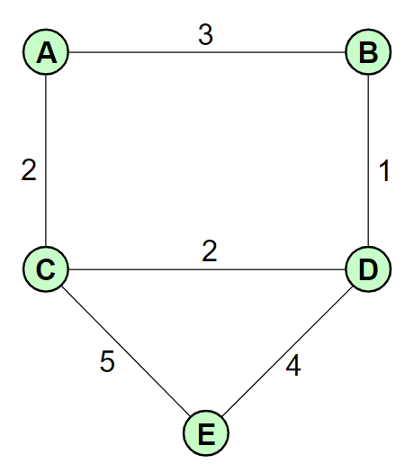{width=150px}

L'**albero di instradamento** è quello che, a partire da un router della rete, stabilisce i percorsi minimi per raggiungere tutti i nodi. Per calcolarlo si prende un router come riferimento, ad esempio **A**, ei si calcolano tutte le distanze dagli altri nodi.

| dest | next               |
| ---- | ------------------ |
| B    | 3 (ramo dx)        |
| C    | 2 (ramo inf)       |
| D    | 4 (sia dx che inf) |
| E    | 7 (ramo inf)       |

La stessa procedura dovrà essere poi eseguita per tutti i nodi rimanenti, minimizzando le distanze. A parità di distanza solitamente ci sono motivi differenti per cui si scegli un percorso piuttosto che un altro _(ad esempio router più nuovi)_.

{width=300px}

#### Esercizio 6

> Data la rete mostrata di seguito, definire la routing table di R1. La route aggregation deve essere massimizzata. Gli indirizzi ip mostrati in figura sono relativi all'interfaccia del router più vicino.

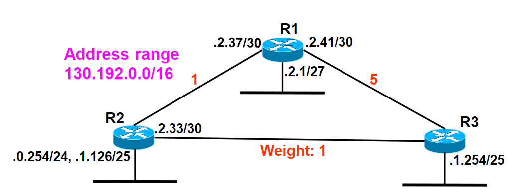{width=400px}

Cominciamo scrivendo la routing table di **R1**:

| dest                   | next hop       | Type |
| ---------------------- | -------------- | ---- |
| `130.192.2.36/30`  (A) | `130.192.2.37` | D    |
| `130.192.2.0/30`   (B) | `130.192.2.1`  | D    |
| `130.192.2.40/30`  (C) | `130.192.2.41` | D    |
| `130.192.1.126/30` (D) | `130.192.2.38` | S    |
| `130.192.0.0/24`   (E) | `130.192.2.38` | S    |
| `130.192.1.128/25` (F) | `130.192.2.38` | S    |
| `130.192.2.32/30`  (G) | `130.192.2.38` | S    |

**D** ed **F** possono essere accorpati con `130.192.1.0/24`, che a sua volta può essere aggregato con e ottenendo l'indirizzo `130.192.0.0/23` avendo il valore di broadcast pari a `130.192.1.255`, per includere anche **G** è possibile usare `130.192.0.0/22`. Dobbiamo però stare attenti a controllare come questi si rapportano con le entry statiche. In questo caso le include tutte, e non è un problema.

:::note
**Nota**: l'indirizzo `130.192.2.38` è l'indirizzo del router R2, `130.192.2.36` è l'indirizzo della sottorete (scelto prendendo il più alto multiplo di $2^{(32-30)}$ minore di `36`), mentre `130.192.2.37` è l'indirizzo dell'interfaccia di R1 per comunicare con R2.
:::

#### Esercizio 7
<!-- sarebbe esercizio 9 -->

> Realizzare un piano di indirizzamento che minimizza il numero di indirizzi necessari.

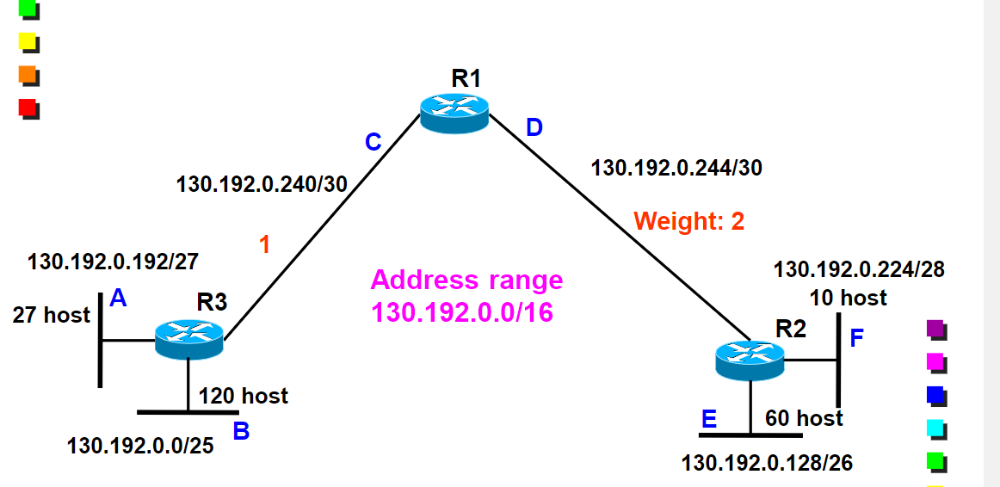{width=400px}

Troviamo la routing table di **R1**, analizzando ogni nodo a partire dai collegamenti diretti:

- Nella sottorete **A** sono presenti 27 host, per cui sono necessari 27+3 indirizzi e un prefix length di $(32-5) = 27$.
- Nella sottorete **B** sono invece necessari 120+3 indirizzi, per cui un prefix length di $(32-7) = 25$.
- Le sottorete C e D sono invece una sottoreti punto punto, per cui è necessario un prefix length di 30.
- La sottorete E ha bisogno di 60+3 indirizzi, per cui un prefix length di $(32-6) = 26$. Infine la sottorete F ha bisogno di 10+3 indirizzi, per cui un prefix length di $(32-4) = 28$.

Troviamo adesso quali sono gli indirizzi delle sottoreti, partendo da quella di dimensione maggiore (B, in quanto `/25`).

- **B**: `130.192.0.0/25`, con indirizzo di broadcast `130.192.0.127` in quanto gli ultimi 7 bit sono a 1.
- **E**: `130.192.0.128/26` con indirizzo di broadcast `130.192.0.191`
- **A**: `130.192.0.192/27`, con indirizzo di broadcast `130.192.0.223`
- **F**: `130.192.0.224/28`, con indirizzo di broadcast `130.192.0.239`
- **C**: `130.192.0.240/30`, con indirizzo di broadcast `130.192.0.243`
- **C**: `130.192.0.244/30`, con indirizzo di broadcast `130.192.0.247`

E' ora possibile calcolare gli indirizzi dei next hop, prendendo come riferimento il router più vicino:

| dest                   | Gateway         | Type |
| ---------------------- | --------------- | ---- |
| `130.192.0.240/30` (C) | `130.192.0.241` | D    |
| `130.192.0.244/30` (D) | `130.192.0.245` | D    |
| `130.192.0.192/27` (A) | `130.192.0.242` | S    |
| `130.192.0.0/25`   (B) | `130.192.0.242` | S    |
| `130.192.0.128/26` (E) | `130.192.0.246` | S    |
| `130.192.0.224/28` (F) | `130.192.0.246` | S    |

Di queste entry bisogna valutare se è possibile fare qualche aggregazione. E' possibile farlo con **E** ed **F** in quanto: avendo `/26` e `28`, possono essere racchiusi in un `/25` (quindi $2^7$) con il medesimo indirizzo di **E** (`130.192.0.128/25` è valido perché 128 % 128 = 0). La soluzione risulta comunque inefficiente perché non abbiamo ottenuto solo una entry.

:::tip
**Ricorda**: Il piano di indirizzamento si fa sempre partendo dalla sottorete più grande, ovvero l'intero minore.
:::

#### Esercizio 8

> Realizzare un piano di indirizzamento che minimizza il numero di indirizzi necessari. Utilizzare il risultato della routing table di R1.

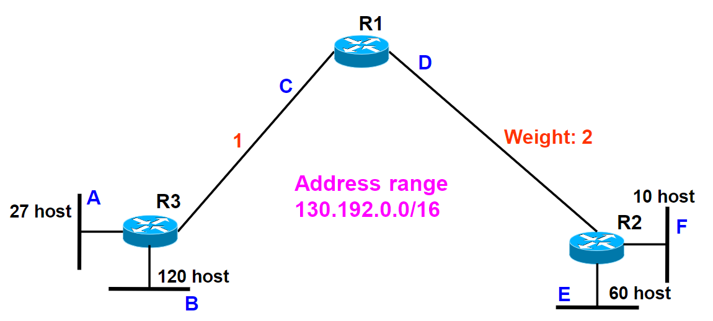{width=400px}

<!-- TODO -->

#### Esercizio 9

> Assumendo di avere interamente la cache libera, indicare il numero e il tipo di frames catturati da uno sniffer localizzato nella rete cablata dell'host A.

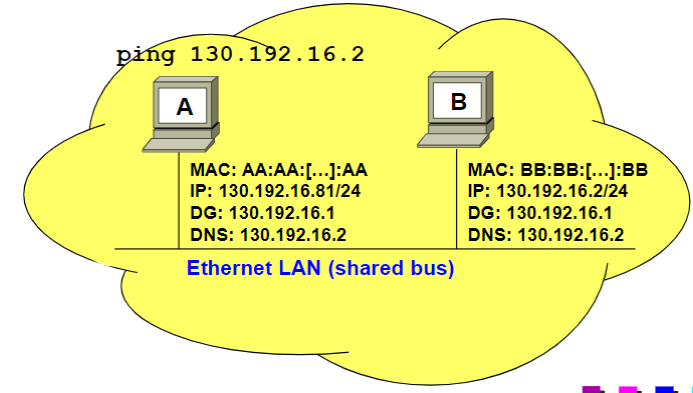{width=400px}

In una macchina Windows il ping viene eseguito 4 volte.

Bisogna innanzitutto verificare che le due macchine siano effettivamente nella stessa rete, lo si fa vedendo se hanno la stessa sottorete (in questo caso si, entrambi coerenti sulla `130.192.16.0/24`).

Scriviamo ora la tabella:

| ID  | MACS | MACD      | IPS | IPD | DESCRIZIONE        |
| --- | ---- | --------- | --- | --- | ------------------ |
| 1   | MACA | broadcast | -   | -   | ARP Request        |
| 2   | MACB | MACA      | -   | -   | ARP Response       |
| 3   | MACA | MACB      | IPA | IPB | ICMP echo request  |
| 4   | MACB | MACA      | IPB | IPA | ICMP echo response |

Il passaggio 3 e 4 sono quelli eseguiti 4 volte.

#### Esercizio 10

<!-- lezione4: 2022-10-06 -->

> Assuming that all caches are empty, indicate the number and the type of the frames captured by a sniffer located sulla rete dell'host A.

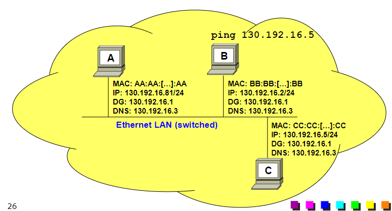{width=400px}  

L'indirizzo IP del DNS  è in realtà l'indirizzo di un host in quanto l'indirizzo della sottorete, con prefix length pari a `/23` abbiamo `130.192.16.0/23` (osservando il router). Il relativo indirizzo di broadcast viene calcolato sapendo di avere gli ultimi 9 bit a 1, quindi `130.192.17.255`, quindi l'indirizzo fornito è incluso.

La sottorete di A ha indirizzo della sottorete pari a `130.192.16.0`, è errato il prefix length in quanto viene indicato `/24` invece di `/23`.

A quando comunica per parlare con il DNS, che è all'esterno della sua sottorete, parla con il suo default gateway.

| ID  | MACS   | MACD      | IPS       | IPD       | DESCRIZIONE        |
| --- | ------ | --------- | --------- | --------- | ------------------ |
| 1   | MACA   | broadcast | -         | -         | ARP Request        |
| 2   | MACDG  | MACA      | -         | -         | ARP Response       |
| 3   | MACA   | MACDG     | IPA       | IPDNS     | DNS request        |
| 4   | MACDG  | broadcast | -         | -         | ARP request        |
| 5   | MACDNS | MACDG     | -         | -         | ARP response       |
| 6   | MACDG  | MACDNS    | IPA       | IPDNS     | DNS request        |
| 7   | MACDNS | broadcast | -         | -         | ARP request        |
| 8   | MACA   | MACDNS    | -         | -         | ARP response       |
| 9   | MACDNS | MACA      | IPDNS     | IPA       | DNS response       |
| 10  | MACA   | MACDG     | IPA       | IP google | ICMP echo request  |
| 11  | MACDG  | MACA      | IP google | IPA       | ICMP echo response |

Essendo uno shared bus tutti i pacchetti sono condivisi, solo che che chi non è interessato ai pacchetti che riceve li scarta. _Nota: DG viene utilizzato per indicare default gateway; arp è di livello 2._ Il traffico viene ottenuto prima che entri nel nodo A.

Il passaggio 10 e 11 sono quelli eseguiti 4 volte.

<!-- TODO -->

## Multicast

Il **multicast** è un concetto che sta nel mezzo tra una comunicazione _unicast_ _(1 a 1)_ e _broadcast_ _(1 a tutti)_. I pacchetti vengono indirizzati da una sorgente verso multiple destinazioni, quindi verso solo _alcuni_ host. Sono dunque presenti dei gruppi a cui degli host possono entrare o uscire. E' vantaggioso in quanto l'alternativa sarebbe mandare pacchetti uno ad uno in modo molto più lento. Nel multicast viene inviato un solo pacchetto, che viene poi instradato correttamente dal router ai destinatari utilizzando meno traffico (nel broadcast è sempre un pacchetto, ma viene poi mandato anche ai non interessati).

Il multicast è implementato in _IPv4_ attraverso l'utilizzo del protocollo aggiuntivo **IGMP**, il quale consente a un router _IPv4_ di scoprire quali gruppi multicast sono presenti in una rete ad esso direttamente connessa e permette a un host di comunicare ad altri _router_ il proprio interesse nel ricevere il traffico di un determinato gruppo multicast.

In _IPv4_ viene utilizzato poco a causa dei problemi con l'indirizzamento, ma al contrario è ampiamente utilizzato in _IPv6_ dove risulta chiave per la comunicazioni tra gruppi (videoconferenze, video broadcast ecc).

:::danger
La richiesta da parte di un host di ricevere le informazioni di un dato gruppo multicast è mandato ai **router** e non direttamente agli host.
:::

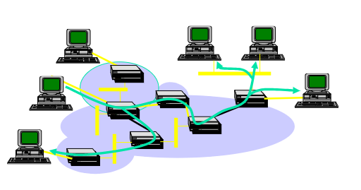{width=400px}

A ogni gruppo multicast viene associato un indirizzo _IPv4_ di classe **D** identificato dai primi bit posti a `1110`. Fanno parte del range `224.0.0.0` - `239.255.255.255` che essendo riservati è necessario acquistarne uno per utilizzarlo.

Il protocollo prevede che il _group delivery_ venga eseguito al livello 2, occupandosi di scartare i pacchetti che non sono di interesse. Nonostante ciò è comunque possibile associare un indirizzo di livello 2 a uno di livello 3 in modo che possa essere scartato successivamente. Questo avviene attraverso un mapping: L'indirizzo _MAC_ è formato da 48 bit di cui la parte alta, solitamente riservata al produttore, ha invece la costante `01-00-5E-0` che identifica la mappatura per un totale di 25 bit (l'ultimo gruppo è solo un bit), mentre la parte bassa è formata dai 23 bit meno significativi del _IP address_ (non comprendendo tutti i casi ma cercando di ridurre il numero di collisioni).

:::caution
I gruppi multicast vengono identificati da particolari indirizzi IP che non possono essere assegnati alle singole stazioni.
:::

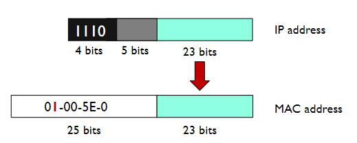{width=400px}

I router trovano i dispositivi su ciascuna _LAN_ mediante il protocollo **IGPM** (Internet Group Managment Protocol), annunciando gli host di un gruppo ai rimanenti mediante dei protocolli di routing appositi per il multicasting. Si forma così tra i router un albero di distribuzione per ogni gruppo verso tutte le _LAN_ con almeno un partecipante.

:::danger
Una stazione **è sempre raggiunta** da un pacchetto multicast relativo a un particolare gruppo anche se non vi è iscritta, in quanto in tal caso verrà scartato a livello 2. **Non è** quindi **vero** che una stazione consegna sempre a livello applicazione tutti i pacchetti multicast ricevuti.
:::

### Status

Attualmente, il multicast in IPv4 non è molto supportato in quanto non è in grado di rispondere alle esegenze comuni di _control engineering_ e _traffic engineering_.

Spesso l'utilizzo avviene in ambienti limitati, come il video broadcasting su soluzioni IP.
