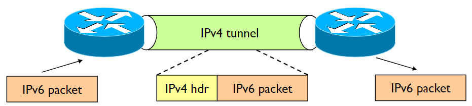

# IPv6

<!-- lezione5: 2022-10-11 -->

**IPv6** nasce per soddisfare le esigenze di un **maggior numero di indirizzi**, superando i limiti di _IPv4_. La nuova versione del protocollo risulta superiore sotto molti punti di vista, ma nonostante ciò IPv4 è ancora largamente utilizzato e non è stato completamente sostituito e anzi, al contrario, nel corso degli anni è stato ulteriormente esteso e migliorato.

Altre motivazioni che hanno portato alla nascita di IPv6 sono:

- Più **efficiente** sulle LAN
- Supporto di **Multicast** e **Anycast**
- Sicurezza
- Policy routing
- Plug and Play
- Traffic Differentiation
- Mobility
- Supporto alla Quality of Service

Riuscire a definire il protocollo IPv6 ha richiesto molto tempo, attualmente è in una fase di migrazione (utilizzando soluzioni temporanee applicate su IPv4).

:::tip
E' dunque lecito dire che ciò che ha comportato la nascita di IPv6 è l'inefficienza del piano di indirizzamento di IPv4.
:::

## Perché IPv4 non basta e soluzioni

Il protocollo IPv4 ha indirizzi di lunghezza pari a **32 bit**, con un totale di circa **4 miliardi** di indirizzi. Nonostante ciò, solo parte di questi indirizzi possono essere effettivamente utilizzati a causa dell'utilizzo di classi, multicast, _ecc..._ Inoltre, molti di questi sono utilizzati in modo gerarchico: il prefisso usato in una rete fisica non può essere usato in una differente. Infine, molti indirizzi IP risultano non utilizzati, causando un grande spreco.

Alcune delle soluzioni utilizzate per risolvere tali problemi sono:

- Introduzione di reti "su misura" mediante l'utilizzo di netmask.
- Utilizzo di indirizzi privati (intranet), ma non è abbastanza da risolvere il problema.
- _NAT_, che però annulla la connessione end to end aumentando il carico dei gateway e la relativa complessità.
- _ALG_ (Application Layer Gateway).

## Chi assegna gli indirizzi IP

Gli indirizzi _IP_ vengono assegnati da parte dell'organizzazione **IANA**, che fornisce a ciascun _Regional Internet Registry (RIR)_ un blocco di `/8` indirizzi ip:

- _AFRINIC_: Africa
- _APNIC_: East Asia, Australia and Oceania
- _ARIN_: USA, Canada and some Caribbean islands
- _LACNIC_: South America, Mexico and some Caribbean islands
- _RIPE NCC_: Europe, Middle East and Central Asia

Successivamente, le _RIR_ dividono i blocchi in blocchetti più piccoli di dimensione minore da assegnare alle _National Internet Registries (NIR)_ e alle _Local Internet Registries (LIR)_.

## Address pool status e scalabilità

Ogni singolo indirizzo _IPv4_ può essere in uno dei seguenti stati:

- far parte del pool di indirizzi **non allocati da IANA**
- far parte del pool di indirizzi **non allocati da RIR**
- assegnato a un _end user entity_ ma non annunciato dal _BGP_ _(Border Gateway Protocol)_
- assegnato e annunciato dal _BGP_

Ciò comporta dei problemi anche in termini di scalabilità, dovuti:

- **dimensione** delle **routing table**: ogni subnet network deve essere advertised.
- **Risorse** dei router **limitate**: troppe informazioni da gestire.
- **Limitazioni** dei **protocolli** di routing: spesso i router cambiano e con loro anche i protocolli (perlopiù riguarda i _router backbone_).

Sono state tentate alcune soluzioni, come:

- aggregazione di router mediante prefissi  più piccoli
- _CIDR_ (Classless Inter-Domain Routing)
- Limitazione di assegnamento di prefissi IP _"non razionali"_ e indirizzi IP (es vendita di `/8`)

Ma nonostante ciò il problema persiste, in particolare la scalabilità dei protocolli di routing risulta attualmente non risolvibile.

{width=400px}

## Notazione

E' stato scelto, attraverso un approccio scientifico e con un focus sull'efficienza, l'utilizzo di indirizzi di lunghezza pari a **128 bit**, con un totale di $2^{128}$ indirizzi.

La notazione utilizzata non è più puntata, ma utilizza gruppi di **2 byte** _(4 cifre esadecimali)_ separati dal carattere `:`.

Tale notazione può essere resa più compatta nei seguenti modi:

- è possibile rimuovere i gruppi pari a `0000` comprimendoli in `0` (o gruppi aventi degli zeri all'inizio). Esempio: da `1080:0000:0000:0007:0200:A00C:3423:A089` a `1080:0:0:0:7:200:A00C:3423:A089`.
- e' possibile omettere un gruppo di soli zeri inserendo `::` (`1080::7:200:A00C:3423:A089`), ma **solo una volta**. Questo perché in caso contrario non sarebbe possibile sapere il numero di zeri omessi.

:::danger
Se mettessimo `FEDC::0876:45FA:0562::3DAF:BB01` avremmo raffigurati 12 dei 18 byte, ma non saremmo in grado di dedurre in che modo sono distribuiti i 6 byte mancanti tra i due `::`.
:::

## Routing

Il routing _IPv6_ è stato pensato in modo da **non modificare** la struttura adoperata in _IPv4_, a eccezione della lunghezza degli indirizzi.

{width=400px}

Per dividere la parte del prefisso di rete e la parte dell'interfaccia si è deciso, per il momento, di applicare una separazione a metà con un prefisso di rete pari ad `n=64`, ma è previsto che in futuro potremmo aver bisogno di un prefisso di rete più lungo.

Il concetto di aggregazione rimane il medesimo, è infatti possibile utilizzare il _prefix length_ come già visto, ad esempio: `FEDC:0123:8700::100/40`. Non è più necessario l'utilizzo di classi.

:::note
**Nota**: il prefix length non sarà, per quanto detto precedentemente, superiore a 64. Per quanto attualmente sia fisso a 64 è comunque pensato per essere **flessibile**.
:::

:::tip
Nonostante ora sia definito solo a 64, rimane comunque vero che la flessibilità.
:::

{width=200px}

Sono però presenti alcune differenze in quanto a terminologia:

- **Link**: physical network.
- **Subnetwork**: Link, set di host con lo stesso prefisso.

Dividiamo le comunicazioni in:

- **On-link**: gli host hanno lo _stesso prefisso_, comunicano direttamente tra loro all'interno della stessa sottorete.
- **Off-link**: gli host hanno un _prefisso diverso_, comunicano attraverso un router.

A loro volta è possibile ulteriormente suddividere gli indirizzi di rete:

{width=400px}

## Multicast

L'equivalente dell'indirizzo multicast IPv4 `224.0.0.0/4` è `FF00::/8`, che si suddivide in:

- **Well-know Multicast**: `FF00::/12`, utilizzato per comunicazioni di servizio e vengono assegnati a gruppi di dispositivi, sono riservati. Un esempio è l'indirizzo di _Google_.
- **Transient**: `FF10::/12`, indirizzi transitori, assegnati dinamicamente da applicativi multicast _(corrispettivo della vecchia modalità multicast in IPv4)_.
- **Solicited-node Multicast**: `FF02:0:0:0:0:1:FF00::/104`, simile a un indirizzo IP broadcast in _ARP_.

Una caratteristica importante è la **scomparsa in IPv6 l'utilizzo del broadcast**, che in seguito alle evoluzioni ha dimostrato essere un rischio per la sicurezza.

L'indirizzo si scompone in:

- **8 bit** iniziali, identificano che è un indirizzo multicast (tutti i bit sono posti a `1`).
- **4 bit** per il **T flag**, specifica se è _well known_ (permanente) o _transient_ (non permanente), viene assegnato da _IANA_.
- **4 bit** per lo _scope_, consente ai dispositivi di definire il range dei pacchetti multicast.
- **112 bit** per il group ID.

:::danger
**Non è vero** che in _multicast_ il pacchetto viene inoltrato su tutte le porte tranne quella da cui arriva (sarebbe broadcast).
:::

:::tip
Il router manda un pacchetto _multicast_ solo sulle porte in cui è possibile raggiungere i dispositivi appartenenti al gruppo _multicast_.
:::

{width=300px}

## Unicast

Gli indirizzi **Unicast**, anche denominati _aggregatable global unicast addresses_, continuano a essere disponibili In IPv6, si suddividono in:

- `2000::/3`, **Global Unicast**
- `FE80::/10`, **Link-Local**
- `::1/128`, _Loopback_ (in IPv4 era `127.0.0.1`)
- `::/128`, _Unspecified_
- `FC00::/7`, _Unique Local_
- `::80`, _Embedded IPv4_

Sono indirizzi di tipo aggregato, utilizzati in modo equivalente agli indirizzi pubblici in IPv4. Hanno la caratteristica di essere **raggiungibili** e **indirizzabili** **globalmente**, oltre a essere _plug and play_. Attualmente sono disponibili in un range definito tra `3FFF::` e `2000::`. Questi indirizzi hanno i primi 3 bit (più significativi) posti a `001`.

:::tip
Hanno la caratteristica di essere distribuiti geograficamente in modo **gerarchico**.
:::

{width=400px}

I prefissi per il _Global Routing_ sono formalmente assegnati da _multi-level authorities_:

- **3 bit**, tipologia (`001`).
- **13 bit**, TLA ID _(Top Level Authority, grandi ISP)_
- **32 bit**, NLA ID _(Next-level Authority, organizzazioni)_
- **16 bit**, SLA ID
- **64 bit**, Interface ID

{width=400px}

### Link local/site local Addresses

I **link local/site local** sono un gruppo di indirizzi compresi tra `FE80` ed `FEBF` e vengono assegnati in **automatico** ai link quando viene acceso un router.

Gli indirizzi **Link local**, identificati nella rete `FE80::/64`, vengono assegnati quando più router devono parlare tra di loro oppure devono annunciarsi a un router vicino, oltre a consentire una configurazione automatica o quando un router non è presente. Sono normalmente assegnati automaticamente dalla stazione a partire dall'indirizzo _MAC_ della scheda di rete, a cui si pre-pende un prefisso predefinito.

Gli indirizzi **site local** sono nella rete `FEC0::/10` e sono ormai ritenuti **deprecati** perché pensati come vecchi indirizzi privati riconfigurabili, possono avere assegnati i router nelle comunicazioni (tipo stella, mesh _ecc..._). Utilizzano comunicazioni dirette e possono essere assegnati sono a indirizzi di rete.

:::tip
Quando il dispositivo si accende, dunque, prenderà in automatico un indirizzo link local dipendente dal MAC della propria scheda di rete.
:::

### Unique Local Addresses

Gli **Unique Local Addresses** _(ULA)_ possono essere utilizzati in modo simile agli indirizzi globali _unicast_, ma sono per un utilizzo privato e non per l'indirizzamento sull'internet. Sono identificati da `FFC00::/7` e vengono utilizzati dai dispositivi che non hanno necessità di connettersi ad internet o di essere raggiungibili dall'esterno. Sono indirizzi privati che possono comunicare su internet grazie ad operazioni di tunneling.

L'**ottavo** bit è il **Local (L) Flag**, che divide in:

- `FC00::/8`, se L flag è `0`, potrebbe essere assegnato in futuro
- `FD00::/8`, se L flag è `1`, l'indirizzo è assegnato localmente

Attualmente gli indirizzi `FD00::/8` sono gli unici indirizzi _ULA_ validi. Sono dunque privati e non utilizzati da altri dispositivi.

{width=300px}

Dopo i primi 8 bit, sono presenti 40 bit generati casualmente in modo da non avere collisioni con altri indirizzi.

### IPv4 Embedded Addresses

Gli **IPv4 embedded addresses** sono utilizzati per rappresentare indirizzi _IPv4_ all'interno di un indirizzo _IPv6_. Vengono utilizzati per facilitare la transizione tra i due protocolli. L'indirizzo _IPv4_ è inserito negli ultimi 32 bit (low order) mentre i primi 80 devono necessariamente essere pari a `0`, a cui seguono 16 bit dal valore di `FFFF` (sedici bit posti a `1`).

{width=300px}

### Loopback Addresses

L'indirizzo di **loopback** viene utilizzato per finalità di test e consiste nel inviare un pacchetto IPv6 a se stesso. E' identificato da `::1` (equivalente di `127.0.0.1` di _IPv4_) ed è subordinato alle medesime regole della versine precedente:

- Non può essere assegnato a un'interfaccia fisica.
- Pacchetti con un indirizzo di loopback non dovrebbero mai essere trasmessi oltre il dispositivo.
- I router non devono mai fare il forwarding di un pacchetto contenente un indirizzo di loopback.
- Il dispositivo deve fare il drop di pacchetti ricevuti da un'interfaccia se il destinatario è un indirizzo di loopback.

### Unspecified Addresses

Un indirizzo unicast non specificato è tale da contenere solo `0`. Tale indirizzo viene utilizzato come sorgente per indicare l'assenza di un indirizzo. Non può essere assegnato a un'interfaccia e viene utilizzato per il duplicate address detection in _ICMPv6_.

<!-- lezione6: 2022-10-22 -->

## Anycast Addresses

Gli indirizzi **anycast** possono essere assegnati a più di un'interfaccia (tipicamente su dispositivi differenti), dando dunque la possibilità di avere su dispositivi differenti lo stesso indirizzo _anycast_. Un pacchetto che viene inviato a un indirizzo _anycast_ viene reindirizzato all'interfaccia più vicina avente quel indirizzo. Questo permette di avere un indirizzo unico per un servizio, ma che può essere raggiunto da più dispositivi.

Inizialmente venne realizzato per il _DNS_, ma è ancora in uno stato sperimentale.

:::note
**Nota**: molto utile, ma non è ancora utilizzato.
:::

## Protocolli utilizzati

L'architettura del protocollo _IPv6_ è molto simile a quella di _IPv4_, ma presenta alcune differenze:

- **IP**: utilizzato, salvo alcune modifiche.
- **ICMP**: viene utilizzato _ICMPv6_.
- **ARP**: non più utilizzato, inglobato in _ICMPv6_.
- **IGMP**: non più utilizzato, inglobato in _ICMPv6_.

Sono invece stati aggiornati senza modifiche essenziali:

- DNS (type AAAA record)
- RIP e OSPF
- BGP e IDRP
- TCP e UDP
- Socket interface

:::warning
**Attenzione**: non è più possibile utilizzare _ARP_ E _IGMP_ per risolvere gli indirizzi _IPv6_.
:::

:::warning
Il protocollo **IGMP**, non più presente in _IPv6_, permette ad un router _IPv4_ di scoprire quali gruppi _multicast_ sono presenti in una rete ad esso direttamente connessa.
:::

## Packet Header Format

L'header è stato modificato in modo sostanziale in seguito all'introduzione di _IPv6_. Ciò è stato fatto al fine di avere un header il più snello possibile, ottenendo una lunghezza di **40 byte**.

{width=400px}

L'header utilizzato in IPv6 è invece il seguente:

{width=400px}

Osservando le immagini si può notare come alcune informazioni siano state rimosse:

- **Header Checksum**: Non è più presente. Veniva utilizzato per verificare se il dato trasmesso è corrotto, ma non è più necessario in quanto a livello _data link_ (2) vengono eseguiti già controlli di errore. Analogamente, i protocolli di livello superiore come _UDP_ e _TCP_ hanno i propri meccanismi di checksum.
- **Frammentazione**: I router IPv6 non frammentano i pacchetti a meno che non siano loro la sorgente. I pacchetti più grandi di _MTU_ vengono scartati e viene restituito alla sorgente un messaggio di errore `ICMPv6 Packet Too big`.

:::caution
**Nota**: Il checksum su _UDP_ diventa opzionale in _IPv6_.
:::

L'header può essere ulteriormente esteso attraverso il campo **next header**, che consente di puntare a un altro header con ulteriori informazioni creando una catena di header. Funzionano in modo simile al campo "protocol" di _IPv4_.

{width=400px}

Inoltre, sono presenti:

- **version**: versione del protocollo.
- **traffic class**: permette di indicare la priorità del traffico _(quality of service)_.
- **flow label**: permette di indicare il flusso di dati (nuovo campo), associando un'etichetta a un certo tipo di traffico _(label routing)_. Un esempio è il caso di un datore di lavoro che non si fida dei suoi dipendenti e vuole che tutto il loro traffico passi per un dispositivo di sicurezza che lo analizzi.
- **payload length**: lunghezza del payload.
- **hop limit**: numero di router che possono essere attraversati prima che il pacchetto venga scartato. Se il valore è `0`, il pacchetto viene scartato. Se il valore è `1`, il pacchetto viene inviato al destinatario senza essere ulteriormente inoltrato. Se il valore è `255`, il pacchetto non viene scartato mai.

Il formato del campo **next header** è il seguente:

- **next header**: indica il tipo di header successivo.
- **length**: lunghezza del header successivo.
- **extension header**: header successivo.
- **extension data**: dati dell'header successivo.

:::note
**Nota**: Header length non serve più! Viene eseguita la frammentazione attraverso il next header.
:::

{width=400px}

### Hop-by-Hop Extension Header

L'**Hop-by-Hop Extension Header** è utilizzato per andare a inserire dei campi/vincoli che servono all'hop per capire se il pacchetto deve essere scartato o meno (strumento di analisi). Se è presente, è indicato immediatamente dopo l'header IPv6. Questo header viene utilizzato per inserire dei campi opzionali. Ogni opzione ha un set di:

- **option type**: indica il tipo di opzione.
- **option length**: lunghezza dell'opzione.
- **option value**: valore dell'opzione.

{width=400px}

:::note
**Nota**: si ottiene una tripletta **TLV** (**t**ype-**l**ength-**v**alue).
:::

### Routing Extension Header

Il **Routing Extension Header** permette alla sorgente di un pacchetto di specificare il percorso di destinazione, indicando uno o più router intermedi. Viene utilizzato per il supporto alla mobilità in IPv6.

{width=350px}

### Altre estensioni

Sono possibili altri due tipi di estensioni a seconda delle necessità:

- **Fragment Extension Header**
- **Authentication and Encapsulating Security Payload Extension Headers**: utilizzato da IPsec (una suite di protocolli per la sicurezza).

#### fragmentation header

Il **Fragmentation header** viene utilizzato per la frammentazione dei pacchetti ognuno dei quali ha un proprio header IPv6 e un frammento di extension header. Il ricevente del pacchetto deve riunire i frammenti in un unico pacchetto. A differenza di IPv4, il protocollo IPv6 non frammenta un pacchetto a meno che non sia la sorgente del pacchetto.

#### Authentication and Encapsulation Header

Gli header **Authentication and Encapsulation Header** vengono utilizzati per la sicurezza, sono usati da IPsec: una suite di protocolli per l'invio in sicurezza dei pacchetti in una rete IP. _Authentication Header_ (AH) è utilizzato per l'autenticità e la integrità dei pacchetti mentre _Encapsulating Security Payload_ (ESP) è utilizzato per la cifratura, autenticazione e integrità  dei pacchetti.

## Interfacciarsi con i livelli più bassi

### Incapsulamento

La prima cosa che risulta evidente appena si approccia _IPv6_ è che lo stack _ISO/OSI_ prevede un campo in cui viene specificato il contenuto del livello superiore. Questo approccio è detto **dual stack**: creando uno nuovo stack è possibile far funzionare i dispositivi sia in _IPv4_ che in _IPv6_ (lo trattiamo come un nuovo protocollo), senza alterare il funzionamento nel protocollo precedente.

I pacchetti IPv6 sono incapsulati nel frame di _livello 2_, ad esempio per ethernet il tipo è `86DD`.

:::tip
Un dispositivo con un interfaccia IPv6 e una IPv4 può ricevere pacchetti IPv4 e IPv6, come avverrebbe normalmente.
:::

### Address mapping

Un indirizzo di un pacchetto _IPv6_ viene associato a un _MAC_ di destinazione attraverso:

- **IP unicast address**: mediante discovery procedurale (protocol based) o  _neighbor discovery_.
- **IP multicast address**: utilizza un algoritmo di mapping.

### IPv6 Multicast transmission

La trasmissione **Multicast** si basa sul **ethernet multicast**, e a differenza del _ethernet broadcast_ può essere filtrato dalla scheda di rete _(NIC)_.

Gli indirizzi multicast IPv6 vengono associati ad indirizzi MAC, in particolare è riservato l'indirizzo MAC Ethernet `33-33-xx-xx-xx-xx` per il trasporto di pacchetti _multicast IPv6_. Questo viene fatto ponendo i **4 byte** (32 bit) meno significativi dell'indirizzo _IPv6_ in un indirizzo _MAC Ethernet multicast_ `33-33`.

{width=400px}

Un esempio può essere il seguente: quando viene inviato un pacchetto all'indirizzo IP multicast `FFOC::89:AABB:CCDD`, questo viene incapsulato in un _MAC frame_ con indirizzo `33:33:AA:BB:CC:DD`.

:::note
**Nota**: abbiamo `FF` all'inizio dell'indirizzo proprio perché è multicast.
:::

## Neighbor Discovery and Address Resolution

**ICMPv6** sostituisce completamente il protocollo **ARP**. E' basato su multicast e sfrutta il **Solicited-Node Multicast Address**. A causa di come il _multicast solicited address_ è realizzato, per lo più solo un nodo viene coinvolto.

:::danger
**Attenzione**: l'inoltre dei pacchetti _IPv6_ su una _LAN_ non utilizza meccanismi di _neighbor discovery_ in quanto esiste una regola per mappare gli indirizzi _IPv6_ in indirizzi _MAC_ (4 byte meno significativi).
:::

### Solicited-Node Multicast Address

Mediante il **Solicited-Node Multicast Address**, gli indirizzi vengono automaticamente creati per ogni indirizzo _unicast_ dell'interfaccia. Tutti gli host si iscrivono e vengono mappati nel seguente modo: `FF:02::1:FF/104 | 24 ip meno significativi`, in modo da ottenere per lo più un host per gruppo.

Il _solicited-node Multicast Address_ viene utilizzato come indirizzo di destinazione in un pacchetto di _Neighbor Solicitation_.

{width=400px}

### Risoluzione di un indirizzo

La risoluzione di un indirizzo avviene attraverso **ICMP Neighbor Solicitation**: 

1. Il richiedente invia un frame al _Solicited Node Multicast Address_ contenente l'indirizzo _IPv6_ del host _target_.
2. Viene inviata dal target una risposta **ICMP Neighbor Advertisement**, attraverso la quale viene spedita indietro all'indirizzo unicast del richiedente la risposta. La mappatura tra _IPv6_ e _MAC_ address viene memorizzata nella cache dell'host (in modo equivalente alla cache _ARP_).

{width=400px}

{width=400px}

{width=400px}

A causa della mancanza degli indirizzi _broadcast_ il numero di _MAC_ aumenta molto, per questo motivo è necessario che il router sia in grado di rispondere alle richieste di risoluzione di un indirizzo.

## La transizione tra IPv4 e IPv6

La transizione da _IPv4_ a _IPv6_ sta avvenendo in modo **incrementale**, in quanto non è stato stabilito un limite entro cui forzare il passaggio ma al contrario sarà stabilito automaticamente quando sarà, nel pratico, il più utilizzato. Questo approccio trasparente e graduale mira a far prendere piede a _IPv6_ nel corso di molto tempo ma in modo **seamless** (ovvero senza cambiamenti) utilizzando approcci di tipo **dual stack**.

Questo risultato viene ottenuto attraverso tre meccanismi:

- **Address Mapping**
- **Tunneling**
- **Translation mechanisms**

Quando è nato IPv6 erano presenti poche reti **dual stack** e una forte presenza di _IPv4_ nella _backbone_ (dorsale, architettura di rete).

{width=350px}

Nel corso del tempo le infrastrutture si sono adeguate al passaggio, aumentando il numero di host con comunicazioni on-link in _IPv6_.

{width=350px}

L'obbiettivo è quello di riuscire a creare una rete maggioritaria su _IPv6_ con solo poche connessioni IPv4 (in realtà le infrastrutture per eseguire il passaggio sono già pronte).

{width=350px}

## ICMPv6

<!-- lezione6: 2022-10-12 -->

Il protocollo **ICMPv6** permette di eseguire operazioni di:

- diagnostica
- _neighbor discovery_
- _Multicast group management_
- _issue notification_

Inoltre, include alcune funzionalità che in _IPv4_ erano delegate ad **ARP** _(Address Resolution Protocol)_ e **IGMP** _(Internet Group Membership Protocol)_.

### Formato del messaggio

Il messaggio è incapsulato in pacchetti _IPv6_ con `next header = 58`, che permette di identificare il nuovo header di tipo **ICPMv6**, che avrà al più **576 byte**.

{width=400px}

| Code | Spiegazione               | tipo        |
| ---- | ------------------------- | ----------- |
| 1    | Destination Unreachable   | Errore      |
| 2    | Packet too big            | Errore      |
| 3    | Time exceeded             | Errore      |
| 4    | Parameter Problem         | Errore      |
| 128  | Echo Request              | Informativo |
| 129  | Echo Reply                | Informativo |
| 130  | Multicast Listener Query  | Informativo |
| 131  | Multicast Listener Report | Informativo |
| 132  | Multicast Listener Done   | Informativo |
| 133  | Router Solicitation       | Informativo |
| 134  | Router Advertisement      | Informativo |
| 135  | Neighbor Solicitation     | Informativo |
| 136  | Neighbor Advertisement    | Informativo |
| 137  | Redirect                  | Informativo |

#### Messaggi di errore

Analizzando più nel dettaglio i messaggi di errore:

- **Destination unreachable** _(tipo 1)_: solitamente generato dal router o firewall, nel campo "code" viene fornita la motivazione (nessuna route, scope errato, indirizzo/porta non raggiungibile).
- **Packet too big** _(tipo 2)_: IPv6 non fa più la frammentazione dei pacchetti.
- **Time exceeded** _(tipo 3)_: avviene quando il router riceve un pacchetto con `Hop Limit = 0`.
- **Parameter Problem** _(tipo 4)_: generato quando un dispositivo trova un problema con un campo del header IPv6 main o con un extension header. Un esempio è un valore non valido del campo _Next Header_.

#### Messaggi informativi

##### Echo

La richiesta di _echo_ ha tipo `128` mentre la _echo reply_ ha `129`; viene utilizzato, ad esempio, da `ping`.

{width=350px}

##### Neighbor Solicitation

{width=350px}

##### Neighbor Advertisement

E' importante evidenziare la presenza di flag aggiuntivi:

- `R` **router flag**, se `true` arriva da un router.
- `S` **solicited flag**, se arriva da un nodo che ha fatto una richiesta di risoluzione.
- `O` **override flag**, se la host cache deve essere aggiornata o meno.

  

:::note
**Nota**: non è presente un campo MAC, in quanto è dato per scontato sia presente nelle opzioni. Viene invece specificato l'ip, anche se ridondante, in quanto potrebbe essere sia un nodo che un router.
:::

<!-- lezione7: 2022-10-18 -->

### Multicast Group Management

Quando si ha un collegamento che fa affidamento al _data link layer multicasting services_, è necessario eseguire il _mapping_ di un indirizzo _multicast IPv6_ su un indirizzo _MAC_. Questo deve essere eseguito tra i link e i pacchetti inviati dai router in modo che _ICMPv6_ sappia i membri _on-link_ (ovvero gli host interessati a ricevere i pacchetti).

Inoltre consente ai protocolli di _multicast routing_ di sapere quando sono presenti membri _off-link_.

### Host Membership Discovery

La **Multicast Listener Query** è una domanda che il router manda ai suoi host per verificare se sono interessati a far parte di un gruppo _multicast_, ponendosi in attesa di una risposta. La risposta con la quale un host comunica al router tale interesse è detto **Multicast Listener Report**.

{width=400px}

- **Multicast listener query** (`type=130`): il router manda una query per capire se un host è interessato a ricevere i pacchetti _multicast_.
- **Multicast Listener Report** (`type=131`): l'host risponde al router dicendo che è interessato a ricevere i pacchetti _multicast_.
- **Multicast Listener Done** (`type=132`): l'host manda un messaggio di fine per avvisare che non è più interessato a ricevere i pacchetti _multicast_.

Il messaggio di `done` è importante, perché se un host esce da un gruppo, il router deve essere informato. Potrebbe succedere che il messaggio non venga inviato: in questo caso il router prevede dei timer, se dopo un intervallo di tempo _(maximum response delay)_ l'host non manda un messaggio di interesse verso un gruppo, allora verranno inoltrati i pacchetti _multicast_.

Adesso la gestione del _multicast_ viene rappresentato solo a livello 3 (quindi diviene compito del router e non più dello switch).

{width=400px}

## Device Configuration in IPv6

Le informazioni necessarie per eseguire la configurazione di un dispositivo sono:

- Address prefix
- Interface identifier
- Default gateway
- DNS server
- Hostname
- Domain name
- MTU (Maximum Transmission Unit)
- _..._

Molte di queste informazioni vengono recuperate automaticamente in modo da rendere gli host plug and play.

Le configurazioni possono essere:

- **Manual configuration**: configurazione manuale.
- **Stateful configuration**: tutte le informazioni recuperate mediante _DHCPv6_.
- **Stateless configuration**: generate automaticamente, con il prefisso dell'indirizzo ottenuto dal router.
- **Hybrid** (Stateless DHCP): ulteriori informazioni oltre l'indirizzo recuperate mediante _DHCPv6_.

L'identificatore dell'interfaccia _(64 bit bassi)_ può essere ottenuto in più modi:

- configurazione manuale
- ottenuto tramite _DHCPv6_
- generato automaticamente da _EUI-64 MAC address_ (privacy aware)

:::note
Ci sarà in realtà un ulteriore meccanismo che si assicura che l'indirizzo utilizzato sia unico all'interno della rete.
:::

**EUI-48 to EIU-64** (Extended Unique Identifier) estende un indirizzo _MAC_ da 48 bit a 64 bit, aggiungendo i bit `11111110` e `11111111` in posizione 1 e 2.

{width=400px}

La rete `FE80::/64` dovrebbe essere utilizzata solo per indirizzi di tipo link local (cioè per comunicare sulla stessa rete locale senza uscire sulla rete pubblica), per ottenere i 64 bit bassi di interface ID è necessario prendere il MAC address(48 bit), separare i 24 bit alti dai 24 bassi e al centro inserire 16 bit pari a `FFFE`, inoltre per convenzione il _settimo bit_ deve essere post a `1` nel caso in cui l'indirizzo mac sia stato configurato manualmente.

Dal punto di vista della tracciabilità, i 64 bit meno significativi di un indirizzo IPv6 di un'interfaccia non cambiano mai quando viene utilizzato un MAC address.

Un esempio è il seguente: `FE80::0201:06FF:FEA5:3A4C` potrebbe avere come MAC associato `00:01:06:A5:3A:4C`.

### Privacy extension Algorithm

Per quanto detto fino ad adesso, riuscire a tracciare un dispositivo non è complicato in quanto i 64 bit meno significativi dell'indirizzo IPv6 non cambiano mai quando il MAC address è utilizzato.

Per questo motivo è stato implementato il **Privacy Extensions for Stateless Address Autoconfiguration in IPv6**, in modo da consentire una configurazione automatica e non tracciabile dei dispositivi.

Il **Privacy extension Algorithm** garantisce la privacy al livello 3 (network layer), in quanto non è possibile dai 64 bit ricavare l'indirizzo. Questo consiste nel unire i 64 bit del MAC address con i 64 bit di un _random number_ (parte più significativa) dato poi in pasto a un algoritmo di _hashing_ (come _md5_) in modo da non poter ricavare il _MAC_ iniziale. Viene infine fatto una & bit a bit con 64 bit posti ad `1` ad esclusione del settimo bit più significativo che viene posto a `0` trovando un nuovo _random number_ per la prossima configurazione.

:::note
Ormai da qualche anno, non viene più utilizzato MD5. 
:::

{width=400px}

### Indirizzi

Un host potrebbe avere più di un indirizzo _IPv6_ (_default_ o _privacy aware_). Questi possono essere utilizzati per accettare o iniziare connessioni. Solo una un numero selezionato di indirizzi potrebbe essere disponibile per un user o una applicazione.

Il prefisso di un indirizzo può essere configurato manualmente, ottenuto tramite _DHCPv6_, generato automaticamente (link local) oppure ottenuto dal router.

Come faccio a capire quali sono i 64 bit alti che ha comprato il mio amministratore di rete? Dal router. In particolare sono di nostro interesse il **router prefix discovery**, **router solicitation** e il **router advertisement**.

#### Router Prefix Discovery

Attraverso la **Router/Prefix Discovery** è possibile introdurre una _"sincronia"_: se l'host non ha chiesto un messaggio potrebbe essere direttamente il router a mandare l'informazione tempestivamente senza che venga richiesta un _solecitation_.

#### Router Solicitation

Una **router solicitation** viene viene mandata solamente ai router, dunque non `all node` ma bensì `all routers` (`FF01::2`).

{width=400px}

#### Router Advertisement

Nel messaggio di advertisement sono rilevanti alcuni parametri:

- `M` flag _(Managed addres Configuration)_: se è settato a `1` significa che l'indirizzo è stato configurato tramite DHCPv6.
- `O` flag _(other configuration)_: se è settato a `1` sono presenti  altre configurazioni, ad esempio DNS server.
- `reachable time`: tempo in millisecondi che il router impiega per raggiungere un host.
- `retrans timer`: intervallo di tempo per cui ritenere l'indirizzo valido.
- `Option`: sono presenti delle opzioni, in formato generico ovvero type, length (multipli di 8) e value.

tra le opzioni c'è il prefix information option che ha sempre:

- `lifetime`: tempo di vita dell'indirizzo.
- `preferred lifetime`: periodo in cui non dovrei più utilizzarlo.
- `L`: se è utilizzato all'interno di un on-link.
- `A`: il prefisso può essere utilizzato per una configurazione automatica.
- `prefix`: il prefisso.

Link layer address option: indirizzo MAC del mio default gateway. Se il default gateway invia il messaggio perché lo inserisco? per comodità dello stack iso/osi.

### ICMP Redirect

Il **redirect** viene utilizzato per informare, all'interno di una stessa sottorete, un  host `A` che per raggiungere un determinato host `B` è più conveniente utilizzare un altro router. 

Se la comunicazione è a livello globale questo solitamente non avviene.

{width=400px}

{width=400px}

### Duplicate Address Detection (DAD)

Il **Duplicate Address Detection** (DAD) è un meccanismo che permette di verificare che un indirizzo _IPv6_ sia unico all'interno della rete.

Il funzionamento è molto semplice: l'host manda un messaggio _ICMPv6_ a tutti gli host con destinazione `all nodes` al _IPv6 Soliticted Node Multicast Address_ e al corrispondente _MAC multicast address_, con il payload contenente l'indirizzo che si vuole utilizzare. Se non vi è nessuna risposta entro 1 secondo, l'indirizzo viene considerato valido, se invece vi è risposta significa che l'indirizzo è già utilizzato in quanto un host ha risposto con un messaggio _ICMPv6_ di tipo `DAD` con il _payload_ contenente l'indirizzo da utilizzare.

### Fasi di una configurazione Stateless

La configurazione _stateless_ di un nuovo dispositivo permette il non utilizzo del protocollo DHCP per la configurazione automatica dei dispositivi. Avviene nei seguenti passaggi:

- Generazione di un indirizzo link local.
- Verifica dell'unicità dell'indirizzo _(DAD)_.
- il dispositivo si pone in ascolto di un messaggio di _router advertisement_ o manda una _solicitation_ per scoprire le informazioni sull'indirizzo privato.

Una volta scoperta la parte alta:

- si verifica se anche all'interno della sotto rete che l'indirizzo sia unico (di nuovo).
- iscrizione al corrispondente IPv6 Solicited Node Multicast Address, configurando la ricezione del multicast MAC corrispondente e inviando un ICP MUlticast Listener Report.
- La comunicazione on-link è abilitata.

Un vantaggio è quello del **renumbering**, che consente un funzionamento _plug and play_. Tramite l'advertisement vengono riconfigurati tutti i dispositivi in modo automatico. Questi rimangono in ascolto per il _Router Advertisement_ e quando arriva un messaggio con un nuovo prefisso, cambiano indirizzoGl, in modo da poterli riconfigurare in qualsiasi momento. Si identificano così indirizzi _"preferred"_ e _"deprecated"_ permettendo di cambiare _ISP_ senza aggiornare tutti gli indirizzi.

## Scoped Addresses

Un dispositivo può avere più interfacce con il medesimo indirizzo, per cui un determinato pacchetto viene mandato su un interfaccia piuttosto che un'altra in base allo **scopo** e al programma che lo ha generato (concetto di scopo). Un indirizzo _scoped_ è composto da un indirizzo IPv6 seguito da `%` e un numero che identifica l'interfaccia.

Ad esempio: `FE80::0237:00FF:FE02:A7FD%19`

:::warning
**Attenzione**: il valore dello scopo è specifico per ogni implementazione.
:::

:::danger
**Attenzione**: Questo byte di scope non viene più utilizzato perché è utile solo per il sistema operativo.
:::

## Routing Protocols

Il routing in due tisi differenzia in due tipologie:

- **On the fly routing**: è il _forwarding_, usa le _routing tables_ e permette, a fronte di un pacchetto entrante in un nodo di rete, di determinare qual è la migliore porta di uscita verso la destinazione.
- **Proactive routing**: crea le _routing tables_ in modo da individuare un percorso valido per un pacchetto, dal mittente al destinatario.

La creazione di tali tabelle di tipo manuale prende  il nome di **static routing**, in caso contrario la distribuzione delle informazioni all'interno della rete è ottenuta attraverso protocolli di routing.

Le routing table in _IPv6_ sono basate sul **longest prefix match** (come in _IPv4_), ma nonostante alcune peculiarità, _IPv4_ e _IPv6_ si comportano come due protocolli indipendenti (con routing table separate).

I protocolli di routing possono essere:

- **Integrated routing**: viene adoperato un singolo protocollo che informa i destinatari per entrambe le _protocol families_ (sia _IPv4_ che _IPv6_). Ha come vantaggio quello di non avere meccanismi di duplicazione, ma è necessaria l'implementazione di un nuovo protocollo dedicato che potrebbe comportare bug con il funzionamento delle operazioni in IPv4. Inoltre, le topologie di rete tra IPv4 ed IPv6 potrebbero essere diverse e quindi il routing potrebbe non essere ottimale.
- **ships in the night**: ogni _family address_ ha il suo protocollo di routing, con la caratteristica che tutti i protocolli sono indipendenti l'uno dall'altro. In questo modo è possibile utilizzare protocolli di routing differenti (scelti in base alla topologia o scenario). Il vantaggio è una più semplice integrazione e troubleshooting, ma comporta un inevitabile meccanismo di duplicazione.

_Esempi di routing protocol:_

Protocollo | Approccio
-----------| ------------------
Static     | Ships in the night
RIPng      | Ships in the night
EIGRP      | Ships in the night
OSPFv3     | Ships in the night (Integrated routing is possible)
IS-IS      | Integrated routing
MP-BGP     | Both (configuration-dependent); “Integrated Routing” is the most commonly deployed because of practicality: BGP process identified by AS number, which is the same for both IPv4 and IPv6.

## La transizione da IPv4 a IPv6

La transizione da _IPv4_ e _IPv6_, come già detto, è tutt'ora in corso e molto lenta. In prima battuta, quando la maggior parte delle  connessioni erano su _IPv4_ si andava a utilizzare il tunneling di _IPv6_, il cui nome deriva dal fatto che _IPv6_ veniva inserito in un header _IPv4_ per compatibilità.

{width=400px}

L'approccio iniziale è stato di tipo **dual stack** con lo scopo di supportare le funzionalità di entrambi i protocolli, ma con la limitazione di non ridurre l'utilizzo di _IPv4_ e di lasciare la responsabilità alle applicazioni di utilizzare _IPv6_ o _IPv4_. Un aspetto però negativo era la completa duplicazione di tutto lo stack di protocolli necessari (routing protocols, routing table, access list).

Un differente approccio è quello di utilizzare il **tunneling**, ovvero incapsulare un pacchetto _IPv6_ in uno _IPv4_ al fine di emulare il link diretto tra dispositivi _IPv6_ ma in una infrastruttura _IPv4_. Alcuni protocolli che implementano soluzioni di tipo tunneling sono:

- **GRE** _(Generic Routing Encapsulation)_
- **IPv6 in IPV4** _(protocollo di tipo 41)_
- setup manuale ed automatico

{width=350px}

### Host centered solutions

Una soluzione potrebbe essere di utilizzare un approccio di tipo _dual stack host_, ovvero un host che supporta sia _IPv4_ che _IPv6_. In questo modo, il _tunneling_ non è più necessario.

Per fare ciò, degli indirizzi _IPv6_ devono essere riservati per la compatibilità con _IPv4_, in particolare quelli con il prefisso `::/96`, in modo da ignorare i bit più significativi e renderlo retrocompatibile.

Le applicazioni mandano pacchetti _IPv6_ attraverso un indirizzo _IPv6_, ad esempio `::2.2.2.2` e vengono reindirizzati a `::/96` attraverso una _pseudo-interfaccia_ (che fa tunneling automaticamente). Questa dunque incapsula i pacchetti _IPv6_ in pacchetti _IPv4_ e li invia.

:::note
**Nota**: devono essere riservati `::/96` perché consente di mantenere libero i 32 bit meno significativi per _IPv4_: $ 128 - 96 = 32 $.
:::

{width=400px}

{width=400px}

#### 6over4

Il protocollo **6over4** utilizza una rete _IPv4_ per emulare una _virtual LAN_, attraverso il _broadcast multiple access data link_ e l'_IP multicasting_.

Il _neighbor_ e _router discovery_ sono abilitati in modo da consentire l'individuazione di nodi e dei router vicini.

L'indirizzo _IPv4_ è utilizzato per la generazione automatica di un _interface ID_ _IPv6_ dell'indirizzo _link local_.

:::note
**Nota**: Non è molto utilizzato a causa della poca diffusione del supporto IPv4 multicast.
:::

#### ISATAP: Intra-site Automatic Tunnel Addressing Protocol

**ISATAP** si differenzia in quanto al posto di usare il multicast, utilizza una soluzione con un prefisso di rete `0000:5EFE`. La rete _IPv4_ viene utilizzata come una _Non-Broadcast Multiple Access_ (NBMA) data link, in questo modo non è necessario il supporto per IP multicast.

L'interface ID viene derivata dall'indirizzo _IPv4_.

Utilizza il protocollo _DNS_, ma ha come limitazione che ogni indirizzo deve avere associato un _hostname_. Quindi la richiesta non parte dall'indirizzo di _IPv6_, ma dal _hostname_ (potrebbe essere un problema in alcuni casi).

Non è necessario eseguire _data-link address discovery_ in quando l'indirizzo _IPv4_ è incluso nell'indirizzo _IPv6_, in particolare negli ultimi 4 byte.

Si rende necessario fornire una _PRL_ (Potential Router List) in quanto la router discovery non è possibile. Può essere configurata manualmente oppure acquisita dal DNS.

#### Configurazione automatica

La configurazione automatica è diventata lo standard nel tempo. Vengono utilizzati indirizzi _IPv4_, indirizzi _DNS_ e il nome del dominio viene ottenuto tramite _DHCPv4_.

L'indirizzo _IPv6_ link local viene generato automaticamente, mentre l'interface ID è ottenuto dall'indirizzo _IPv4_.

Per ottenere il _Potential Router List_ si utilizza una query _DNS_, a meno che non sia fornita da _DHCPv4_.

Periodicamente viene eseguita una _router discovery_ verso tutti i router su link prefixed per l'auto-configurazione.

<!-- Lezione 8: 2022-19-10 -->

### Network center solution

Si configurano intere reti _IPv6_ all'interno di una struttura ancora _IPv4_, dovendo però rinunciare a parte delle funzionalità _IPv6_, inoltre il range di indirizzi continua a essere ridotto.

{width=400px}

#### 6to4

Attraverso il protocollo **6to4** gli indirizzi dei relay sono _embedded_ in un prefisso _IPv6_. Iniziano con `2002` e sono indirizzi pubblici (inizia con `2`).

{width=400px}

Questo protocollo non è pensato per le comunicazioni da host _IPv4_ a host _IPv6_.

{width=400px}

Un relay 6to4 deve essere necessariamente il default gateway per i router 6to4.

{width=400px}

#### Tunnel broker

In questa modalità le comunicazioni avvengono attraverso un **tunnel broker server** che si occupa di individuare i _tunnel server_ e fa da mediatore tra le configurazioni dei tunnel.

Vengono utilizzati tunnel IPv6 in IPv4 (a.k.a. proto-41).

Per eseguire la configurazione dei tunnel viene utilizzato il _Tunnel Setup Protocol_ (TSP) o il _Tunnel Information Control_ (TIC).

Questo tipo di soluzione è centralizzata.

{width=400px}

## Scalable, Carrier-grade Solutions

Le soluzioni adottate da i grandi provider prevedono ancora il supporto per i server e i client _IPv4_ in modo che possano comunicare con host _IPv6_ e host _IPv4_. Le soluzioni più utilizzate sono:

- **DS-Lite**
- **A+P (evoluzione di DS-Lite)**
- **MAP-T and MAP-E**
- **NAT64**
- **6PE (MPLS-based)**

Tutte queste soluzioni si basano sul concetto di _mapping_ di un indirizzo IP, ovvero il NAT, eseguendo un mapping tra ipv4 e ipv4. Quello che viene fatto è associare una porta a un indirizzo privato.

Prende il nome di _**LSN** il **L**arge **S**cale **N**AT_, utilizzato per gestire una grande quantità di richieste.

:::note
E' possibile avere più livelli di NAT ponendoli in cascata _(pratica piuttosto comune)_.
:::

Nonostante il grande utilizzo, non è da dimenticare il fatto che il _NAT_ comporti un _single point of failure_ e che a causa della scarsità di indirizzi possa essere difficile da implementare.

{width=300px}

E' necessario tenere a mente che nelle soluzioni proposte, anche se è previsto l'utilizzo del NAT, è comunque presente l'utilizzo di tunnel.

{width=400px}

E' importante notare la posizione del _NAT_ nei protocolli esposti sopra:

- **DS-Lite**: il _NAT_ è presente nel AFTR.
- **A+P**: il _NAT_ è post sul CPE _(Customer Provided Equipment)_.
- **NAT64**: il _NAT_ è post sul _NAT64_.

:::danger
**Attenzione**: notare dove le funzionalità di _NAT_ sono presenti.
:::

### AFTR: Address Family Transition Router

L'utilizzo del **Address Family Transition Router** _(AFTR)_ Abilita gli host _IPv4_ a comunicare con altri host _IPv4_ attraverso una rete _IPv6_ (ad esempio la connessione residenziale fornita dagli attuali provider). Ha dunque come conseguenza il poter connettere strutture _IPv6_ con una infrastruttura nel mezzo _IPv4_. Ha due tipi di funzionalità:

- sia come _NAT_, in quanto gestisce richieste di _natting_.
- parte hardware che consentono le operazioni di tunneling.

:::note
**Nota**: Viene utilizzato da DS-Lite e A+P.
:::

### DS-Lite

La soluzione **Dual-Stack Lite** è caratterizzata da _Internet Service Provider_ che utilizzano una backbone (infrastruttura di rete) _IPv6_. Questo consente di avere solo parti _IPv4_ o _IPv6_ con altre sottoreti IPv4 o IPv6. Questa soluzione, rispetto a quelle già viste, sono molto articolate e consentono di coprire tutte le casistiche.

{width=400px}

Permette di ridurre il numero di indirizzi _IPv4_ richiesti rispetto a un approccio _dual stack_ (che aveva bisogno di un indirizzo pubblico per ogni host).

La soluzione adottata da _DS-Lite_ funziona come segue: da IPv4 privato si arriva sul _home gateway_ (CPE) che effettua tunnel verso **l’AFTR** tramite una rete _IPv6_ su cui è installato un _Large Scale NAT_ (LSN), in questo modo Un unico _NAT_ gestisce tutti i clienti.

Ha però delle limitazioni:

- il cliente non ha controllo sul _NAT_.
- possono esserci problemi con i server in quanto _static mapping_ e _port forwarding_ non possono essere configurati.

Il _NAT esteso_ consente l'indirizzamento assegnato dal cliente (ovvero sovrapposto).

:::danger
Il **NAT** è posizionato sul **AFTR**.
:::

### A+P (Address plus Port)

Il vantaggio di **A+P** risiede nella possibilità per il cliente di avere sotto controllo il _NAT_. Una ulteriore caratteristica è che il range di _TCP/UDP_ è assegnato a ciascun customer (solo le porte sono utilizzate dal _NAT_ in uscita).

La soluzione _A_+P parte da un indirizzo _IPv4_ privato che arriva sul _CPE_ e viene convertito in indirizzo pubblico e solo successivamente viene effettuato il tunnel _IPv6_ verso l’_AFTR_. Quando il pacchetto esce dal tunnel è già stato trattato dal NAT e dunque può andare verso la rete pubblica.

Le features sono:

- nessun problema con la sovrapposizione degli indirizzi privati nello spazio di indirizzi dei customer.
- Le porte possono essere assegnate automaticamente al CPE utilizzando il Port Control Protocol (PCP), mentre il CPE può negoziare più porte in qualsiasi momento.
- AFTR è solo un tunnel terminator IPv4 in IPv6 (NAT44 non è più necessario in AFTR).

:::tip
**Nota**: Il concetto alla base è di spostare la complessità sulle foglie.
:::

{width=400px}

### Mapping Address and Port (MAP)

Il **Mapping Address and Port** (MAP) utilizza un approccio di tipo **stateless**. Questo sfrutta i vantaggi del _DHCP_ e del _DNS_ anche all'interno del sistema, non associando dei range di porte ma bensì dei **set**: un set si differenzia dal fatto che ci sono più porte che non sono necessariamente contigue. Inoltre, il CPE utilizza la stessa rete pubblica _IPv4_, così non da non avere limitazioni.

La soluzione si basa sul cercare di inserire all’interno del pacchetto l’informazione di stato, in modo tale da diminuire l’informazione di stato che deve essere contenuta all’interno del Border Relay. Si cerca di mappare queste informazioni negli indirizzi IPv6 del CPE che vengono utilizzati. Così facendo il Border Relay può ricostruirsi le informazioni sul indirizzo IPv6 del CPE partendo dalle informazioni che ha (e che gli vengono fornite dal pacchetto IPv4 che arriva dalla rete internet).

L'indirizzo e la porta del client _IPv4_ sono mappati in un unico indirizzo _IPv6_ (prefix routed dal CPE).

L'indirizzo del server pubblico _IPv4_ è anche questo mappato in un unico indirizzo _IPv6_ (prefix routed dal Border Relay).

Esistono due tipi di _MAP_:

- **MAP-E**: _MAP with Encapsulation_, i pacchetti _IPv4_ vengono tunnelizzati.
- **MAP-T**: _MAP with Translation_, i pacchetti _IPv4_ sono tradotti in pacchetti _IPv6_ e poi nuovamente in _IPv4_.

Quando però avviene la sostituzione di un header IPv6 con un header IPv4 è necessario fare attenzione a non perdere informazioni.

:::definition
Si definisce **set** di porte un insieme di porte non sono necessariamente contigue.
:::

### Port Set

A ogni CPE viene assegnato un indirizzo pubblico _IPv4_ un unico **PSID** (Port set Identifier) che identifica un set di porte.

Per creare un set di porte si utilizzano 16 bit, suddivisi in:

- _A_: identifica il dominio (ad esempio si assegna a un _CPE_ le porte con i bit che iniziano con 1100).
- _PSID_: identifica il set di porte (lunghezza variabile).
- _j_: insieme delle porte.

{width=350px}

:::danger
**attenzione**: non porre i primi a bit a zero perché sennò diventa una _well known port_.
:::

L'_embedded Address_ (EA) contiene i bit di PSID e parzialmente l'indirizzo _IPv4_ (che identificano univocamente il CPE).

### Mapping Rule

Le regole per il mapping sono:

- IPv6 prefix rule
- IPv4 prefix rule: prefisso IPv4 di un indirizzo IPv4 utilizzato da un determinato CPE.
- EA bits length

Inoltre, un offset PSID (valore di a) viene settato per l'intero dominio di mappatura.

Tramite queste informazioni il CPE si calcola l’indirizzo IPv6 da utilizzare nell’interfaccia esterna.

### Border Relay

L'indirizzo del _border relay_ deve essere conosciuto da tutti i _CPE_, anche se più _BR_ possono avere lo stesso indirizzo (anycasting).

Mentre nel _MAP-E_ il _BR_ termina il tunnel, nel _MAP-T_ il _BR_ è responsabile della traduzione degli indirizzi _IPv4_ verso l'esterno in quanto si occupa di sostituire l'header IPv4 con un header IPv6. Il BR prefix viene advertised sul backbone (e potrebbe essere advertised da più BR).

:::caution
**Non è vero** che viene sostituito l'indirizzo _IPv4_ con un indirizzo _IPv6_, ma viene sostituito l'header _IPv4_ con un header _IPv6_.
:::

{width=400px}

{width=400px}

## NAT64 + DNS64

Il **NAT64** è un meccanismo di transizione a _IPv6_ che facilità la comunicazione tra _IPv4_ ed _IPv6_ utilizzando il _Network Address Translation_ (NAT), che traduce indirizzi e pacchetti _IPv6_ in _IPv4_, prendendo un indirizzo/porta _Ipv4_ liberi dal _pool_ e realizzando un _NAT session entry_.

Questa  tecnica  risolve  il  problema  della  **rete  IPv6  con  host  IPv6**  che  deve  comunicare  con  la  rete  pubblica _IPv4_. In questo caso, la soluzione è il _NAT64_ che rimuove l’header _IPv6_ per inserire l’header _IPv4_ ma per farlo viene utilizzato il _DNS64_.

Il vantaggio del _MAP_ risiede nella possibilità di avere più _CPE_ e maggiormente distribuite. Questa modalità rappresenta una forma semplificata, che può vedere il suo utilizzo su rete più piccole.

Un prefisso _IPv4_ è dedicato per mappare indirizzi _IPv4_, comprensivi di _well-known_ che di _network specific_. Il DNS64 mappa un a record in AAAA utilizzando un prefix NAT64, entrambi vengono poi forniti al client. Il router NAT64 fa il advertise del prefix in una rete IPv6 per attirare il traffico verso gli host IPv4.

Il processo si divide nei seguenti passi:

1. Un host _IPv6_ esegue una query DNS di tipo _IPv6_ AAAA.
2. DNS64 inoltra la query dal DNS autoritativo verso il dominio della richiesta.
3. Il DNS autoritativo (che si trova in una rete IPv4) non può ricevere la richiesta, per questo motivo viene ripetuta per un indirizzo IPv4 (necessaria rete IPv4+IPv6 intermedia).
4. DNS64 riceve l'indirizzo IPv4 che risolve il dominio, ne esegue l'embedding in un indirizzo IPv6 con un prefix di default `64:FF9B`.
5. L'indirizzo IPv6 viene restituito al host che ha fatto la richiesta.

{width=350px}

{width=350px}

{width=350px}

Le limitazioni dovute al _NAT64 + DNS64_ sono:

- Coinvolgimento del DNS (necessità del hostname)
- Non è possibile abilitare _DNSSEC_ (ovvero la firma della risposta a un record DNS) perché DNS64 modifica i record.

:::caution
E' possibile risolvere indirizzi soltanto quando a questi sono associati dei nomi, dunque funzionerebbe con `www.example.com` ma non con `1.2.3.4`.
:::
