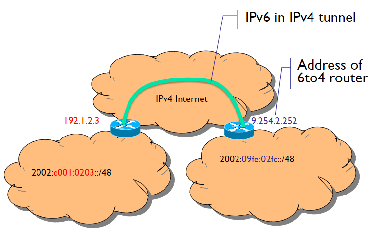

# IPv6

<!--- lezione5: 2022-10-11 -->

IPv6 nasce per soddisfare le esigenze di un **maggior numero di indirizzi**, superando i limiti di IPv4. La nuova versione del protocollo risulta, sotto molti punti di vista, superiore. Nonostante l'introduzione del protocollo,  IPv4 è ancora in uso e non è stato completamente sostituito e nel corso degli anni è stato ampiamente esteso e migliorato.

Altre motivazioni che hanno portato alla nascita di IPv6 sono:

- Più efficiente sulle LAN
- Supporto di Multicast e Anycast
- Sicurezza
- Policy routing
- Plug and Play
- Traffic Differentiation
- Mobility
- Quality of Service support

Rriuscire a definire il protocollo IPv6 ha richiesto molto tempo, attualmente è in una fase di migrazione (richiedendo soluzioni temporanea applicate su IPv4).

## Perché IPv4 non basta e soluzioni

Il protocollo IPv4 ha indirizzi di lunghezza 32 bit, con un totale di circa 4 miliardi di indirizzi. Nonostante ciò, solo parte di questi indirizzi possono essere utilizzati a causa dell'utilizzo di classi, multicast, ecc. Inoltre, molti di questi sono utilizzati in modo gerarchico: il prefisso usato in una rete fisica non può essere usato in una differente. Infine, molti di questi indirizzi IP risultano non utilizzati, causando un grande spreco.

Alcune delle soluzioni utilizzate per risolvere questi problemi sono:

- Introduzione di reti "su misura" mediante l'utilizzo di netmask.
- Indirizzi privati (intranet), ma non abbastanza da risolvere il problema.
- NAT, che però annulla la connessione end to end aumentando il carico dei gateway e la relativa complessità.
- ALG (Application Layer Gateway).

## Chi assegna indirizzi IP

Gli indirizzi IP vengono assegnati da parte dell'organizzazione **IANA**, che assegna a ciascun *Regional Internet Registry (RIR)* un blocco di `/8` indirizzi ip:

- AFRINIC: Africa
- APNIC: East Asia, Australia and Oceania
- ARIN: USA, Canada and some Caribbean islands
- LACNIC: South America, Mexico and some Caribbean islands
- RIPE NCC: Europe, Middle East and Central Asia

Successivamente, le _RIR_ dividono i blocchi in blocchi più piccoli di dimensione minore da assegnare alle _National Internet Registries (NIR)_ e alle _Local Internet Registries (LIR)_.

## Address pool status e scalabilità

Ogni singolo indirizzo IPv4 può essere in uno dei seguenti stati:

- far parte del pool di indirizzi non allocati da IANA
- far parte del pool di indirizzi non allocati da RIR
- assigned to an end user entity but unadvertised by BGP, or
- assigned and advertised in BGP

Ciò comporta dei problemi anche in termini di scalabilità, dovuti:

- dimensione delle routing table (ogni subnet network deve essere advertised)
- Risorse dei router limitate (troppe informazioni da gestire)
- Limitazioni dei protocolli di routing (spesso i router cambiano)
- Perlopiù riguarda i router backbone

Sono state tentate alcune soluzioni, come:

- aggregazione di router
- _CIDR __(Classless Inter-Domain Routing)
- Limitazione di assegnamento di prefissi IP "non razionali" e indirizzi IP (es vendita di `/8`)

Ma nonostante ciò il problema persiste, in particolare la scalabilità dei protocolli di routing risulta attualmente non risolvibile.

## Indirizzi IPv6

E' stato scelto, attraverso un approccio scientifico e con un focus sull'efficienza, l'utilizzo di indirizzi di lunghezza pari a **128 bit**, con un totale di $2^{128}$ indirizzi.

La notazione non è più puntata, ma bensì si è deciso di dividere in gruppi di **2 byte** (4 cifre esadecimali) separati dal carattere `:`. 

E' possibile compattare un indirizzo nei seguenti modi:

- è possibile rimuovere cifre pari a `0`. Esempio: da `1080:0000:0000:0000:0007:200:A00C:3423:A089` a `1080:0:0:0:7:200:A00C:3423:A089`.
- e' possibile omettere un gruppo di soli zeri inserendo `1080::7:200:A00C:3423:A089`, ma **solo una volta**. Questo perché in caso contrario non sarebbe possibile sapere il numero di zeri.

## Routing

Il routing IPv6 è stato pensato in modo da non modificare la struttura adoperata in IPv4, a eccezione della lunghezza degli indirizzi.

{width=400px}

Per dividere la parte del prefisso di rete e la parte dell'interfaccia si è deciso, per il momento, di applicare una separazione a metà con un prefisso di rete pari ad `n=64`, ma prevedendo che in futuro potremmo aver bisogno di un prefisso di rete più lungo.

Il concetto di aggregazione rimane il medesimo, è infatti possibile utilizzare il prefix length come già visto, ad esempio: `FEDC:0123:8700::100/40`. Non è necessario l'utilizzo di classi.

:::note
**Nota**: non sarà, per quanto detto precedentemente, superiore a 64.
:::

{width=200px}

I principi di assegnamento sono i medesimi dell' IPv4, con alcune differenze in termini di terminologia:

- **Link**: physical network
- **Subnetwork**: Link

Dividiamo le comunicazioni in:

- **On-link**: gli host hanno lo _stesso prefisso_, comunicano direttamente tra loro all'interno della stessa sottorete.
- **Off-link**: gli host hanno un _prefisso diverso_, comunicano attraverso un router.

A loro volta è possibile ulteriormente suddividere gli indirizzi di rete:

{width=400px}

## Multicast

L'equivalente dell'indirizzo multicast IPv4 `224.0.0.0/4` è `FF00::/8`, che si suddivide, in questo esempio, in:

- **Well-know Multicast**: `FF00::/12`, utilizzato per comunicazioni di servizio e vengono assegnati a gruppi di dispositivi, sono riservati. Un esempio è l'indirizzo di *google*.
- **Transient**: `FF10::/12`, indirizzi transitori, assegnati dinamicamente da applicativi multicast (corrispettivo della vecchia modalità multicast in IPv4).
- **Solicited-node Multicast**: `FF02:0:0:0:0:1:FF00::/104`, simile a un indirizzo IP broadcast in *ARP*.

Una caratteristica importante è notare come in IPv6 scompaia l'utilizzo del broadcast, che in seguito alle evoluzioni ha dimostrato essere un rischio per la sicurezza.

L'indirizzo si scompone in:

- **8 bit** iniziali, identificano che è un indirizzo multicast.
- **4 bit** per il **T flag**, dice se è well known (permanente o non permanente), viene assegnato da IANA.
- **4 bit** per lo scope, viene lasciato ai dispositivi.
- **112 bit** per il group ID.

{width=400px}

## Unicast

GLi indirizzi unicast continuano a essere disponibili In IPv6, si suddividono in:

- `2000::/3`, Global Unicast
- `FE80::/10`, Link-Local
- `::1/128`, Loopback (in IPv4 era `0.0.0.0`)
- `::/128`, Unspecified
- `FC00::/7`, Unique Local
- `::80`, Embedded IPv4

### Global Unicast Addresses

Sono indirizzi di tipo aggregato, utilizzati in modo equivalente agli indirizzi pubblici in IPv4. E' globalmente raggiungibile e indirizzabile ed ha la caratteristica di essere plug and play. Attualmente sono disponibili in un range definito tra `3FFF::` e `2000::`. Questi indirizzi hanno i primi 3 bit posti a `001`.

{width=450px}

I prefissi per il Global Routing sono formalmente assegnati da multi-level authorities:

- **3 bit**, tipologia (`001`).
- **13 bit**, TLA ID _(Top Level Authority, grandi ISP)_
- **32 bit**, NLA ID _(Next-level Authority, organizzazioni)_
- **16 bit**, SLA ID
- **64 bit**, Interface ID

{width=450px}

### Link local/site local Addresses

i link local/site local sono un gruppo di indirizzi che iniziano con `FEBF`, sono assegnati in automatico ai link quando viene acceso un router.

Gli indirizzi Link local vengono assegnati quando più router devono parlare tra di loro oppure devono annunciarsi a un router vicino.

Gli indirizzi site local sono nella rete `FEC0::/10`, sono ormai ritenuti deprecati perché pensati come vecchi indirizzi privati riconfigurabili, possono avere assegnati i router nelle comunicazioni (tipo stella e mesh ecc..). Utilizzano comunicazioni dirette e possono essere assegnati sono a indirizzi di rete.

### Unique Local Addresses

Gli Unique Local Addresses possono essere utilizzati in modo simile agli indirizzi globali unicast, ma sono per un utilizzo privato e non per l'indirizzamento sull'internet. Sono identificati da `FFC00::/7`, e vengono utilizzati dai dispositivi che non hanno mai necessità di connettersi all'internet e non hanno bisogno di essere raggiungibili dall'esterno. Sono indirizzi privati che possono comunicare su internet grazie ad operazioni di tunneling.

<!-- REV -->

L'ottavo bit è il _Local (L) Flag_, che divide in:

- `FC00::/8`, se L flag è `0`, verrà assegnato in futuro
- `FD00::/8`, se L flag è `1`, l'indirizzo è assegnato localmente

Attualmente gli indirizzi `FD00::/8` sono gli unici indirizzi validi. Sono dunque privati e non utilizzati da altri dispositivi.

{width=450px}

Dopo i primi 8 bit, sono presenti 40 bit generati casualmente in modo da non avere collisioni con altri indirizzi.

### IPv4 Embedded Addresses

Gli IPv4 embedded addresses sono utilizzati per rappresentare indirizzi IPv4 all'interno di un indirizzo IPv6. Vengono utilizzati per facilitare la transizione tra i due protocolli. L'indirizzo IPv4 è inserito negli ultimi 32 bit (low order) mentre i primi 80 devono necessariamente essere pari a `0`, a cui seguono 16 bit dal valore di `FFFF` (16 `1`).

{width=450px}

<!-- lezione6: 2022-10-22 -->

## Anycast Addresses

Gli indirizzi anycast possono essere assegnati a più di una interfaccia (tipicamente su dispositivi differenti), dando dunque la possibilità di avere su dispositivi differenti lo stesso indirizzo anycast. Un pacchetto che viene inviato a un indirizzo anycast viene reindirizzato all'interfaccia più vicina avente quel indirizzo. Questo permette di avere un indirizzo unico per un servizio, ma che può essere raggiunto da più dispositivi. Inizialmente venne realizzato per il DNS, ma è ancora in uno stato sperimentale.

:::note
**Nota**: molto utile, ma non è ancora utilizzato.
:::

## Architettura del protocollo

L'architettura del protocollo IPv6 è molto simile a quella di IPv4, ma presenta alcune differenze:

- **IP**: utilizzato, salvo alcune modifiche
- **ICMP**: viene utilizzato _ICMPv6_
- **ARP**: non più utilizzato, inglobato in _ICMPv6_
- **IGMP**: non più utilizzato, inglobato in _ICMPv6_

:::warning
**Attenzione**: non è più possibile utilizzare _ARP_ E _IGMP_ per risolvere gli indirizzi IPv6.
:::

Sono invece stati aggiornati senza modifiche essenziali:

- DNS (type AAAA record)
- RIP e OSPF
- BGP e IDRP
- TCP e UDP
- Socket interface

## Packet Header Format

L'header è stato modificato in modo sostanziale in seguito all'introduzione del IPv6. Ciò è stato fatto al fine di avere un header il più snello possibile, ottenendo una lunghezza di **40 byte**.

{width=450px}

L'header utilizzato in IPv6 è invece il seguente:

{width=450px}

Osservando le immagini si può notare come alcune informazioni siano stati rimossi:

- Header Checksum: viene utilizzato per verificare se il dato trasmesso è corrotto, ma non è più necessario in IPv6.
  - Redundant: Layer 2 data link technologies perform own checksum and error control.
  - Upper-layer protocols such as TCP and UDP have their own checksums
- Frammentazione
  - IPv6 routers do not fragment a packet unless they are the source of the packet
  - Packets larger than MTU are dropped and an ICMPv6 Packet Too Big message is returned to source

:::note
**Nota**: Il checksum su UDP diventa opzionale in IPv6.
:::

L'header può essere ulteriormente esteso attraverso il campo next header, che consente di puntare a un altro header contenente ulteriori informazioni creando una catena di header. Funzionano in modo simile al campo "protocol" di IPv4.

{width=450px}

Inoltre, sono presenti:

- **version**: versione del protocollo
- **traffic class**: permette di indicare la priorità del traffico (quality of service)
- **flow label**: permette di indicare il flusso di dati (nuovo campo), permette di associare un'etichetta a un certo tipo di traffico (label routing). Un esempio è se non mi fido dei miei dipendenti e voglio che tutto il loro traffico passi per un dispositivo di sicurezza che lo analizzi.
- **payload length**: lunghezza del payload
- **hop limit**: numero di router che possono essere attraversati prima che il pacchetto venga scartato. Se il valore è 0, il pacchetto viene scartato. Se il valore è 1, il pacchetto viene inviato al destinatario senza essere inoltrato. Se il valore è 255, il pacchetto non viene scartato mai.

:::note
**Nota**: Header length non serve più! Viene eseguita la frammentazione attraverso il next header.
:::

Il formato del campo next header è il seguente:

- **next header**: indica il tipo di header successivo
- **length**: lunghezza del header successivo
- **extension header**: header successivo
- **extension data**: dati dell'header successivo

{width=450px}

### Hop-by-Hop Extension Header

E' utilizzato per andare a inserire dei campi/vincoli che servono all'hop per capire se il pacchetto deve essere scartato o meno (strumento di analisi). Se è presente, è indicato immediatamente dopo l'header IPv6. Questo header viene utilizzato per inserire dei campi opzionali. Ogni opzione ha un set di:

- **option type**: indica il tipo di opzione
- **option length**: lunghezza dell'opzione
- **option value**: valore dell'opzione

{width=450px}

:::note
Si ottiene una tripletta **TLV** (type-length-value).
:::

### Routing Extension Header

IL routing extension header permette alla sorgente di un pacchetto di specificare il percorso di destinazione, indicando uno o più router intermedi. Viene utilizzato per il supporto alla mobilità in IPv6.

{width=350px}

### Altre estensioni

Sono possibili altri due tipi di estensioni a seconda delle necessità.

#### fragmentation header

Viene utilizzato per la frammentazione dei pacchetti ognuno dei quali ha un proprio header IPv6 e un frammento di extension header. Il ricevente del pacchetto deve riunire i frammenti in un unico pacchetto. A differenza di IPv4, il protocollo IPv6 non frammenta un pacchetto almeno che non sia la sorgente del pacchetto.

#### Authentication and Encapsulation Header

Viene utilizzato per la sicurezza, adoperato da IPsec e fornisce una suite di protocolli per l'invio in sicurezza dei pacchetti in una rete IP. Il Authentication Header (AH) è utilizzato per l'autenticità e la integrità dei pacchetti. Il Encapsulating Security Payload (ESP) è utilizzato per la cifratura, autenticazione e integrità  dei pacchetti.

## Interfacciarsi con i livelli più bassi

### Incapsulamento

La prima cosa che risulta evidente appena vi si approccia è che lo stack iso/osi prevede un campo in cui viene specificato il contenuto del livello superiore. Questo approccio è detto **dual stack**: creando uno nuovo stack è possibile far funzionare sia i dispositivi in IPv4 chee in IPv6 (lo trattiamo come un nuovo protocollo), senza alterare il funzionamento in IPv4.

I pacchetti IPv6 sono incapsulati nel frame di livello 2, ad esempio per ethernet il tipo è `86DD`.

### Address mapping

Un indirizzo di un pacchetto IPv6 viene associato a un MAC di destinazione attraverso:

- **IP unicast address**: discovery procedurale (protocol based)
- **IP multicast address**: algorithm mapping

### IPv6 Multicast transmission

La trasmissione Multicast si basa sul ethernet multicast, ma a differenza del ethernet broadcast, un ethernet multicast può essere filtrato dalla scheda di rete (NIC).

Gli indirizzi multicast IPv6 vengono mappati su indirizzi MAC, in particolare è riservato l'indirizzo MAC Ethernet `33-33-xx-xx-xx-xx` per il trasporto di pacchetti multicast IPv6.

{width=450px}

Un esempio può essere il seguente: quando viene inviato un pacchetto all'indirizzo IP multicat `FFOC::89:AABB:CCDD`, questo viene incapsulato in un MAC frame con indirizzo `33:33:AA:BB:CC:DD`.

:::note
**Nota**: abbiamo `FF` all'inizio dell'indirizzo proprio perchè è multicast.
:::

## Neighbor Discovery and Address Resolution

ICMPv6 adesso sostituisce completamente il protocollo **ARP**. E' basato su multicast e sfrutta il Solicicited-NOde MUlticast Address. A causa di come il multicast solicited address è realizzato, per lo più solo un nodo viene coinvolto.

### Solicited-Node Multicast Address

Gli indirizzi vengono automaticamente creati per ogni indirizzo unicast dell'interfaccia. Tutti gli host si iscrivono e vengono mappati nel seguente modo: `FF:02::1:FF/104 | 24 ip meno significativi` (per lo più un host per gruppo).

{width=450px}

### Risoluzione indirizzo

 La risoluzione di un indirizzo avviene attraverso **ICMP Neighbor Solicitation**: Il richiedente invia un frame al Solicited Node Multicast Address dell'indirizzo target IPv6.

{width=450px}

{width=400px}

{width=400px}

 :::tip
 **Come ricordarlo**: Il funzionamento è analogo al seguente: non lo chiedo a tutti, ma soltanto a chi mi potrebbe rispondere.
 :::

Avviene in seguito la risposta **ICMP Neighbor Advertisement**, attraverso la quale viene inviata la risposta indietro all'indirizzo unicast del richiedente. La mappatura tra IPv6 e MAC address viene memorizzata nella cache dell'host (in modo equivalente alla cache ARP).

Di fatto il numero di MAC aumenta molto, a causa della mancanza degli indirizzi broadcast. Per questo motivo è necessario che il router sia in grado di rispondere alle richieste di risoluzione indirizzo.

## La transizione tra IPv4 e IPv6

La transizione da IPv4 a IPv6 sta venendo in modo **incrementale**, non è stato stabilito un limite entro cui eseguire il passaggio ma bensì sarà stabilito automaticamente quando sarà, nel pratico, il più utilizzato. Questo approccio trasparente e graduale ha consentito che prima di far prendere piede IPv6 nel corso di molto tempo ma in modo **seamless** (ovvero senza cambiamenti). Inoltre, come già accennato, è possibile generare e ricevere pacchetti per entrambi i protocolli senza problemi grazie all'approccio **dual stack**.

Questo risultato viene ottenuto attraverso tre meccanismi:

- Address Mapping
- Tunneling
- Translation mechanisms

Quando è nato IPv6 erano presenti poche reti dual stack, quindi era presente una parte di backbone su ipv4.

{width=350px}

Nel corso del tempo le infrastrutture si sono adeguate al passaggio, aumentando il numero di host con comunicazioni onlink.

{width=350px}

L'obbiettivo è quello di riuscire a creare una rete maggioritaria su IPv4 con solo poche connessioni IPv4. In realtà abbiamo già le infrastrutture per eseguire il passaggio completo.

{width=350px}

## ICMPv6

<!-- lezione6: 2022-10-12 -->

**ICMPv6** permette di eseguire operazioni di:

- diagnostica
- neighbor discovery
- Multicast group management
- issue notification

Inoltre, include alcune funzioni che in IPv4 erano delegate ad **ARP** (Address Resolution Protocol) e **IGMP** (Internet Group Membership Protocol).

### Formato del messaggio

Il messaggio è incapsulato nei pacchetti IPv6 con `next header = 58`, che mi permette di identificare il nuovo header di tipo **ICPMv6**, che avrà al più **576 byte**.

{width=450px}

| Code | Spiegazione               | tipo        |
| ---- | ------------------------- | ----------- |
| 1    | Destination Unreachable   | Errore      |
| 2    | Packet too big            | Errore      |
| 3    | Time exceeded             | Errore      |
| 4    | Parameter Problem         | Errore      |
| 128  | Echo Request              | Informativo |
| 129  | Echo Reply                | Informativo |
| 130  | Multicast Listener Query  | Informativo |
| 131  | Multicast Listener Report | Informativo |
| 132  | Multicast Listener Done   | Informativo |
| 133  | Router Solicitation       | Informativo |
| 134  | Router Advertisement      | Informativo |
| 135  | Neighbor Solicitation     | Informativo |
| 136  | Neighbor Advertisement    | Informativo |
| 137  | Redirect                  | Informativo |

### Neighbor Solicitation

{width=350px}

### Neighbor Advertisement

Sono presenti dei flag aggiuntivi:

- `R` **router flag**, se `true` arriva da un router.
- `S` **solicited flag**, se arriva da un nodo che ha fatto una richiesta di risoluzione.
- `O` **override flag**, se la host cache deve essere aggiornata o meno.

  

:::note
**Nota**: non è presente un campo MAC, in quanto può essere si da per scontato sia presente nelle opzioni. Viene invece specificato l'ip, anche se ridondante, in quanto potrebbe essere sia un nodo che un router.
:::

<!-- lezione7: 2022-10-18 -->

### Host Membership Discovery

La **Multicast Listener Query** è una domanda che il router manda ai suoi host per capire se sono interessati a far parte di un gruppo multicast, ponendosi in attesa di una risposta. La risposta con la quale un host comunica al router che è interessato a ricevere i pacchetti multicast è detto **Multicast Listener Report**.

{width=400px}

- **Multicast listener query** (`type=130`): il router manda una query per capire se un host è interessato a ricevere i pacchetti multicast.
- **Multicast Listener Report** (`type=131`): il host risponde al router dicendo che è interessato a ricevere i pacchetti multicast.
- **Multicast Listener Done** (`type=132`): il router manda un messaggio di fine per dire che non è più interessato a ricevere i pacchetti multicast.

La done è importante, perchè se un host esce da un gruppo, il router deve essere informato. Potrebbe succedere che il messaggio non venga inviato. In questo caso il router prevede dei timer, se dopo un intervallo di tempo (maximum response delay) l'host non manda un messaggio di interesse verso un gruppo, allora il router non inoltrerà più i pacchetti multicast.

Adesso la gestione del multicast è viene rappresentato solo a livello 3 (quindi compito del router e non più anche dello switch).

{width=400px}

## Device Configuration in IPv6

Le informazioni necessarie per la configurazione di un dispositivo sono:

- Address prefix
- Interface identifier
- Default gateway
- DNS server
- Hostname
- Domain name
- MTU (Maximum Transmission Unit)
- ...

Molte di queste informazioni vengono recuperate automaticamente tramite in quanto lo scopo del IPv6 e di rendere gli host plug and play.

Le configurazioni possono essere:

- Manual configuration
- Stateful configuration: tutte le informazioni recuperate mediante DHCPv6
- Stateless configuration: generate automaticamente, con il prefisso dell'indirizzo ottenuto dal router
- Hybrid (Stateless DHCP): Information other than address obtained through DHCP

L'identificatore dell'interfaccia (64 bit bassi) può essere ottenuto in più modi:

- configurato manualmente
- ottenuto tramite DHCPv6
- generato automaticamente da EUI-64 MAC address

Ci sarà un ulteriore meccanismo che si assicura che l'indirizzo utilizzato sia unico all'interno della rete.

EUI-48 a EIU-64 (Extended Unique Identifier) estende l'indirizzo MAC da 48 bit a 64 bit, aggiungendo i bit `11111110` (8 bit) e `10` (2 bit) in posizione 1 e 2.

{width=400px}

Per convenzione, il settimo bit deve essere post a uno nel caso in cui l'indirizzo mac sia stato manualmente configurato si dovrebbe mettere il bit a `1`.

Dal punto di vista della tracciabilità, i 64 bit meno significativi di un indirizzo IPv6 di un'interfaccia non cambiano mai quando viene utilizzato un MAC address.

### Privacy extension Algorithm

Non viene più utilizzato MD5. Questo algoritmo garantisce la privacy al livello 3, non è possibile da questi 64 bit ricavare un indirizzo.

{width=400px}

### Indirizzi

Un host pu avere più di un indirizzo IPv6, che possono essere _default_ o _privacy aware_. Questi possono essere utilizzati per accettare o iniziare connessioni. Solo una un numero selezionato di indirizzi potrebbe essere disponibile per un user o una applicazione.

Il prefisso di un indirizzo può essere configurato manualmente, ottenuto tramite DHCPv6, generato automaticamente (link local) oppure ottenuto dal router.

Come faccio a capire quali sono i 64 bit alti che ha comprato il mio amministratore di rete? dal router. In particolare sono di nostro interesse il **router prefix discovery**, **router solicitation** e il **router advertisement**.

Attraverso la Router/Prefix Discovery è presente una sincronia: se l'host non ha chiesto un messsaggio potrebbe essere direttamente il router a mandare l'informazione tempestiva senza che venga richiesta solecitation.

La solicitation viene viene mandata a solamente i router, dunque non `all node` ma bensì `all routers`.

{width=400px}

Nel messaggio di advertisement ci sono dei parametri interessanti:

- `M` flag _(Managed addres Configuration)_: se è settato a `1` significa che l'indirizzo è stato configurato tramite DHCPv6
- `O` flag _(other configuration)_: se è settato a `1` sono presenti  altre configurazioni, ad esempio dns server.
- `reachable time`: tempo in millisecondi che il router impiega per raggiungere un host.
- `retrans timer`: ogni quanto ritenere valido questo indirizzo in un intervallo di tempo.
- Option: sono presenti delle opzioni, in formato generico e dunque: type, length (multipli di 8) e value.

tra le opzion c'è il prefix information option che ha sempre

- `lifetime`: tempo di vita dell'indirizzo
- `preferred lifetime`: periodo in cui non dovrei più utilizzarlo
- `L`, se lo utilizzo all'interno di un on-link
- `A`, il prefisso può essere utilizzato per una configurazione automatica
- `prefix`: il prefisso

Un'altre opzione è l'mtu.

Link layer address option: indirizzo MAC del mio default gateway. Se il default gateway invia il messaggio perché lo inserisco? per comodità dello stack iso/osi.

### ICMP Redirect

Il concetto di redirect viene utilizzato per informare, all'interno di una stessa sottorete, un  host che, per raggiungere un determinato host, è più conveniente utilizzare un altro router. Se la comunicazione è a livello globale questo solitamente non avviene.

### Duplicate Address Detection (DAD)

Il DAD è un meccanismo che permette di verificare che un indirizzo sia unico all'interno della rete. Il meccanismo è molto semplice: l'host manda un messaggio ICMPv6 a tutti gli host con destinazione `all nodes` e con il payload che contiene l'indirizzo che si vuole utilizzare. Se l'indirizzo è unico, nessuno lo conosce e quindi non risponde (timeout, ad esempio un minuto). Se l'indirizzo è già utilizzato, un host risponde con un messaggio ICMPv6 di tipo `DAD` con il payload che contiene l'indirizzo che si vuole utilizzare.

### Fasi di configurazione di una configurazione Stateless

- generazione di un indirizzo link local
- verifica dell'unicità dell'indirizzo (DAD)
- si mette in ascolto di un messaggio di router advertisement o manda una solicitation per andare a scoprire le informazioni sull'indirizzo privato

Una volta scoperta la parte alta:

- verifico se anche all'interno della mia sotto rete l'indirizzo è univoco (di nuovo).
- iscrizione al corrispondente IPv6 Solicited Node Multicast Address, configurando per la ricezione del multicast MAC corrispondente e inviando un ICP MUlticast Listener Report.

Un altro vantaggio è quello del renumbering, che consente un funzionamento plug and play. Tramite l'advertisement vengono riconfigurati tutti i dispositivi in modo automatico. Rimangono in ascolto per il Router Advertisement e quando arriva un messaggio con un nuovo prefisso, cambiano indirizzo. Gli host possono essere riconfiugurati in qualsiasi momento. Si identificano così indirizzi "preferred" e "deprecated". E' possibile dunque cambiare ISP senza dover cambiare tutti gli indirizzi.

## Scoped Addresses

Un dispositivo può avere più interfaccie con il medesimo indirizzo, per cui essendo generato a partire dal mac potrebbero avere lo stesso indirizzo per cui un determinato pacchetto viene mandato su un interfaccia piuttosto che un'altra in base allo scopo e al programma che lo ha generato(concetto di scopo). UN indirizzo scoped è composto da un indirizzo IPv6 seguito da `%` e un numero che identifica l'interfaccia.

Ad esempio: `FE80::0237:00FF:FE02:a7FD%19`

:::warning
**Attenzione**: il valore dello scopo è specifico per ogni implementazione.
:::

Questo byte di scope non viene poi considerato perchè è interesse solo per il sistema operativo.

## Routing Protocols

Per prima cosa distinguiamo il routing in due tipologie:

- **On the fly routing**: è il forwarding, usa la routing table
- **proactive routing**: la creazione di routing tables

La creazione di tali tabelle possono essere di tipo manuale, dunque static routing, oppure mediante la distribuire delle informazioni all'interno della rete adoperando protocolli di routing.

Le routing table in IPv6 sono basate sul più lungo prefisso che fa match (come in IPv4). Nonostante alcune peculiarità, IPv4 e IPv6 si comportano come due protocolli indipendenti (con routing table separate).

I protocolli di routing possono essere:

- **integrate routing**: viene adoperato un singolo protocollo che informa i destinatari per entrambe le protocol families, dunque sia IPv4 che IPv6. Ha come vantaggio quello di non avere meccanismi di duplicazione, ma è necessaria l'implementazione di un nuovo protocollo dedicato che potrebbe comportare bug con il funzionamento delle operazioni in IPv4. Inoltre, le topologie di rete tra IPv4 ed IPv6 potrebbero essere diverse e quindi il routing potrebbe non essere ottimale.
- **ships in the night**: ogni family address ha il suo protocollo di routing, con la caratteristica che tutti i protocolli sono indipendenti l'uno dall'altro. In questo modo è possibile utilizzare protocolli di routing differenti (scelti in base alla topologia o scenario). Il vantaggio è una più semplice integrazione e trubleshooting, ma comporta un inevitabile meccanismo di duplicazione.

_Esempi di routing protocol:_

{width=400px}

## Transizione

La transizione tra IPv4 e IPv6, come già detto, è tutt'ora in corso e molto lenta. In prima battuta, quando la maggior parte delle  connessioni erano su IPv4 si andava a utilizzare il tunneling di IPv6, il cui nome deriva dal fatto che IPv6 veniva inserito in un header IPv4 per compatibilità.

{width=400px}

Alcuni protocolli che lo implementano:

- **GRE** (Generic Routing Encapsulation)
- IPv6 in IPV4 (protocollo di tipo 41)
- setup manuale ed automatico

## Host centered solutions

Una soluzione potrebbe essere di realizzare un dual stack host, ovvero un host che supporta sia IPv4 che IPv6. In questo modo, il tunneling non è più necessario.

Per fare ciò, degli indirizzi IPv6 devono essere riservati per la compatibilità con IPv4, in particolare quelli con il prefisso `::96`, in modo da ignorare i bit più significativi e renderlo retrocompatibile.

Le applicazioni mandano pacchetti IPv6 attraverso un indirizzo IPv6, ad esempio `2.2.2.2` e vengono reindirizzati a `::96` attraverso una pseudo-interfaccia (che fa tunneling automaticamente). La pseudo interfaccia dunque incapsula i pacchetti ipv6 in pacchetti ipv4 e li invia.

{width=400px}

  

### 6over4

- IPv4 network emulates a virtual LAN
- Broadcast multiple access data link
- IP Multicasting used for the purpose
- Neighbor and router discovery enabled
- IPv4 address is used for automatic IPv6 Interface ID generation of link local address
- Not very used because IPv4 multicast support is not widespread

### ISATAP: Intra-site Automatic Tunnel Addressing Protocol

Invece di usare il multicast, usiamo una soluzione che utilizzi un prefisso di rete `0000:5EFE`.

- IPv4 network as Non-Broadcast Multiple Access (NBMA) data link
- No IP multicast support needed
- Interface ID derived from IPv4 address
- Prefixed by 0000:5efe
- E.g., fe80::5efe:0101:0101 for 1.1.1.1

### (Lack of) Neighbor Discovery

Mi baso sul protocollo DNS, ma ha come limite che ogni indirizzo deve avere associato un hostname. Quindi la richiesta non parte dall'indirizzo di IPv6, ma dal hostname (potrebbe essere in alcuni casi un problema).

- Not needed for data-link address discovery as IPv4 address is embedded in IPv6 address
- Last 4 bytes
- PRL (Potential Router List) must be provided
- Router discovery not possible
- By configuration
- Automatically acquired from DNS
- Hostname not mandated
- E.g., isatap.polito.it

### Automatic Configuration

E' diventato lo standard nel tempo.

- IPv4 address, DNS address and domain name obtained through DHCPv4
- Generation IPv6 link-local address
- Interface ID from IPv4 address
- DNS query to obtain PRL
- If not provided by DHCPv4 (proprietary)
- Periodic Router Discovery to each router
- On-link prefixes for autoconfiguration

<!-- Lezione 8: 2022-19-10 -->

## Network center solution

Configuro intere reti IPv6 all'interno di una struttura ancora IPv4, rinunciando però in parte in quanto non è possibile utilizzare tutte le funzionalità di IPv6 e anche il range di indirizzi continua a essere ridotto.

{width=400px}

### 6to4

Gli indirizzi dei relay sono embedded in un prefisso IPv6. Iniziano con `2002`, sono indirizzi pubblici (inizia con `2`). 

### Basic 6to4 Scenario

Not meant for IPv4 host to IPv6 host communication

{width=400px}

### Mixed 6to4 scenario

6to4 Relay must be default gateway of 6to4 routers

{width=400px}

### Tunnel broker

- Communication with a tunnel broker server
- Identifies tunnel server and mediates tunnel setup
- IPv6 in IPv4 (a.k.a. proto-41) tunnels
- Tunnel Setup Protocol (TSP) or Tunnel Information Control (TIC) protocol used to
  setup tunnels

soluzione centralizzata.

## Scalable, Carrier-grade Solutions

Soluzioni per grandi provider. Purtroppo ancora è necessario supporto, in quanto i server ipv4 devono poter comunicare con host ipv6 e host ipv4. Le soluzioni più utilizzate sono:

- **Several Options**
- **DS-Lite**
- **A+P (DS-Lite evolution)**
- **MAP-T and MAP-E**
- **NAT64**
- **6PE (MPLS-based)**

Tutte queste soluzioni si basano sul concetto di mapping di indirizzo IP, che è un concetto del NAT. Questo fa un mapping tra ipv4 e ipv4 e non è perciò un concetto nuovo. Quello che viene fatto è associare una porta a un indirizzo privato.

- LSN: large scale NAT, riesce a gestire una quantità di richieste molto grandi

E' possibile avere più livelli di NAT.

Avere più nat in cascata è abbastanza in comune.

{width=300px}

Non dobbiamo dimenticare che nelle nostre soluzioni, anche se utilizziamo il nat, prevede comunque l'utilizzo di tunnel.

{width=400px}

### AFTR: Address Family Transition Router

Abilita host ipv4 di comunicare con altri IPv4 attraverso una rete IPv6. Permette di connettere strutture ipv6 con una struttura nel mezzo ipv4. Ha due tipi di funzionalità:

- sia come nat, gestire richieste di natting
- parte hw che consentono le operazioni di tunneling

### DS-Lite

La soluzione dual stack lite abbiamo gli internet service provider usano come parte di backbone (infrastruttura di rete) di tipo IPv6. Possiamo avere così solo parti ipv4 che ipv6 con le altri sottoreti o ipv4 o ipv6. Questa soluzione, rispetto a quelle già viste, sono molto articolate e consentono di coprire tutte le casistiche. 

- educes requirement for IPv4 addresses compared to dual-stack approach
  - Dual-stack requies public IPv4 address per host
- Extended NAT enables customer assigned (i.e., overlapping) addressing
  - IPv6 address of CPE in NAT table

i problemi sono:

- il customer non ha controllo sul nat
- problmi con server, ad esempio static mapping e port forwarding non possono essere configurati

### A+P (Address plus port)

Il NAT è sotto il controllo dei customer. Il range di TCP/UDP è assegnato a ciascun customer (solo le porte sono utilizzate dal nat in uscita)

Concetto di spostare la complessità sulle foglie.

### Mapping Address and Port (MAP)

Approccio di tipo stateless; cerchiamo di sfruttare i vantaggi del dhcp e del dns anche all'interno del sistema. In particolare non vado ad associare dei range di porte ma bensì dei set: un set si differenzia dal fatto che ci sono più porte che non sono necessariamente contigue. Inoltre, il CPE utilizza la stessa rete pubblica IPv4, così non siamo limitati.

- Client IPv4 address and port set mapped to unique IPv6 address
  - Prefix routed to CPE
- IPv4 public server address mapped to unique IPv6 address
  - Prefix routed to Border Relay
- MAP-E: MAP with Encapsulation
  - IPv4 packets are tunneled
- MAP-T: MAP with Translation
  - IPv4 packets are translated into IPv6 packets and then back to IPv4

sostituisco header ipv6 con un header ipv4, bisogna fare attenzione a non perdere informazioni.

a ogni CPE viene assegnato un unico PSID (Port set Identifier) e un public ipv4 address; Il PSID è un numero che identifica un set di porte.

{width=350px}

attenzione: non porre i primi a bit a zero perchè sennò diventa una well known port. 

il CPE è associato a un unico valore del PSID. Queste informazioni viene messa nel Embedded address (EA).

- Rule IPv6 prefix
- Rule IPv4 prefix
- EA bits length

Moreover, a PSID offset (value of a) is set for the whole MAP domain.

- BR address must be known to CPEs
- Multiple BRs might have same address
- Anycasting
- MAP-E: BR address terminates tunnel
- MAP-T: prefix associated to BR used for translation of outside IPv4 addreses
- BR prefix is advertised on the backbone
- Might be advertised by multiple BRs

## MAP-E

## MAP-T

Prendo l'indirizzo IPV4 e lo vado a sostituire con un header IPv6. 

## Nat64 + DNS64

<!-- todo -->

NAT64 (outbound)

- Translates IPv6 address and packet into IPv4
- Picks a free IPv4 address/port from its pool
- Builds NAT session entry

Il vantaggio del map risiede nella possibilità di avere più cpe e maggiormente distribuite.Questa è dunque una forma semplificata, che può vedere il suo utilizzo su rete più piccole.