# IPv6

<!-- lezione5: 2022-10-11 -->

**IPv6** nasce per soddisfare le esigenze di un **maggior numero di indirizzi**, superando i limiti di IPv4. La nuova versione del protocollo risulta, sotto molti punti di vista, superiore. Nonostante l'introduzione del protocollo,  IPv4 è ancora largamente utilizzato e non è stato completamente sostituito, al contrario, nel corso degli anni è stato ampiamente esteso e migliorato.

Altre motivazioni che hanno portato alla nascita di IPv6 sono:

- Più **efficiente** sulle LAN
- Supporto di **Multicast** e **Anycast**
- Sicurezza
- Policy routing
- Plug and Play
- Traffic Differentiation
- Mobility
- Supporto alla Quality of Service

Riuscire a definire il protocollo IPv6 ha richiesto molto tempo, attualmente è in una fase di migrazione (utilizzando soluzioni temporanee applicate su IPv4).

## Perché IPv4 non basta e soluzioni

Il protocollo IPv4 ha indirizzi di lunghezza pari a **32 bit**, con un totale di circa **4 miliardi** di indirizzi. Nonostante ciò, solo parte di questi indirizzi possono essere effettivamente utilizzati a causa dell'utilizzo di classi, multicast, _ecc..._ Inoltre, molti di questi sono utilizzati in modo gerarchico: il prefisso usato in una rete fisica non può essere usato in una differente. Infine, molti di questi indirizzi IP risultano non utilizzati, causando un grande spreco.

Alcune delle soluzioni utilizzate per risolvere tali problemi sono:

- Introduzione di reti "su misura" mediante l'utilizzo di netmask.
- Utilizzo di indirizzi privati (intranet), ma non è abbastanza da risolvere il problema.
- NAT, che però annulla la connessione end to end aumentando il carico dei gateway e la relativa complessità.
- ALG (Application Layer Gateway).

## Chi assegna gli indirizzi IP

Gli indirizzi IP vengono assegnati da parte dell'organizzazione **IANA**, che fornisce a ciascun _Regional Internet Registry (RIR)_ un blocco di `/8` indirizzi ip:

- AFRINIC: Africa
- APNIC: East Asia, Australia and Oceania
- ARIN: USA, Canada and some Caribbean islands
- LACNIC: South America, Mexico and some Caribbean islands
- RIPE NCC: Europe, Middle East and Central Asia

Successivamente, le _RIR_ dividono i blocchi in blocchetti più piccoli di dimensione minore da assegnare alle _National Internet Registries (NIR)_ e alle _Local Internet Registries (LIR)_.

## Address pool status e scalabilità

Ogni singolo indirizzo IPv4 può essere in uno dei seguenti stati:

- far parte del pool di indirizzi **non allocati da IANA**
- far parte del pool di indirizzi **non allocati da RIR**
- assegnato a un end user entity ma non advertised dal BGP
- assegnato e advertised dal BGP _(Border Gateway Protocol)_

Ciò comporta dei problemi anche in termini di scalabilità, dovuti:

- **dimensione** delle **routing table**: ogni subnet network deve essere advertised.
- **Risorse** dei router **limitate**: troppe informazioni da gestire.
- **Limitazioni** dei **protocolli** di routing: spesso i router cambiano e con loro anche i protocolli
- Perlopiù riguarda i router backbone

Sono state tentate alcune soluzioni, come:

- aggregazione di router
- _CIDR_ (Classless Inter-Domain Routing)
- Limitazione di assegnamento di prefissi IP _"non razionali"_ e indirizzi IP (es vendita di `/8`)

Ma nonostante ciò il problema persiste, in particolare la scalabilità dei protocolli di routing risulta attualmente non risolvibile.

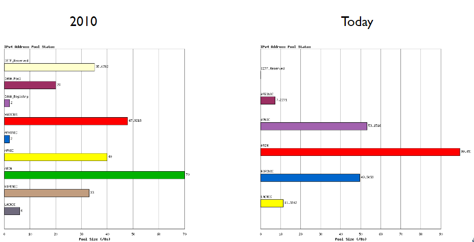{width=400px}

## Notazione

E' stato scelto, attraverso un approccio scientifico e con un focus sull'efficienza, l'utilizzo di indirizzi di lunghezza pari a **128 bit**, con un totale di $2^{128}$ indirizzi.

La notazione utilizzata non è più puntata, ma utilizza gruppi di **2 byte** (4 cifre esadecimali) separati dal carattere `:`.

Tale notazione può essere resa più compatta nei seguenti modi:

- è possibile rimuovere i gruppi pari a `0000` comprimendoli in `0` (o gruppi aventi degli zeri all'inizio). Esempio: da `1080:0000:0000:0007:0200:A00C:3423:A089` a `1080:0:0:0:7:200:A00C:3423:A089`.
- e' possibile omettere un gruppo di soli zeri inserendo `::` (`1080::7:200:A00C:3423:A089`), ma **solo una volta**. Questo perché in caso contrario non sarebbe possibile sapere il numero di zeri omessi.

:::danger
Se mettessimo `FEDC::0876:45FA:0562::3DAF:BB01` avremmo raffigurati 12 dei 18 byte, ma non saremmo in grado di dedurre in che modo sono distribuiti i 6 byte mancanti tra i due `::`.
:::

## Routing

Il routing IPv6 è stato pensato in modo da **non modificare** la struttura adoperata in IPv4, a eccezione della lunghezza degli indirizzi.

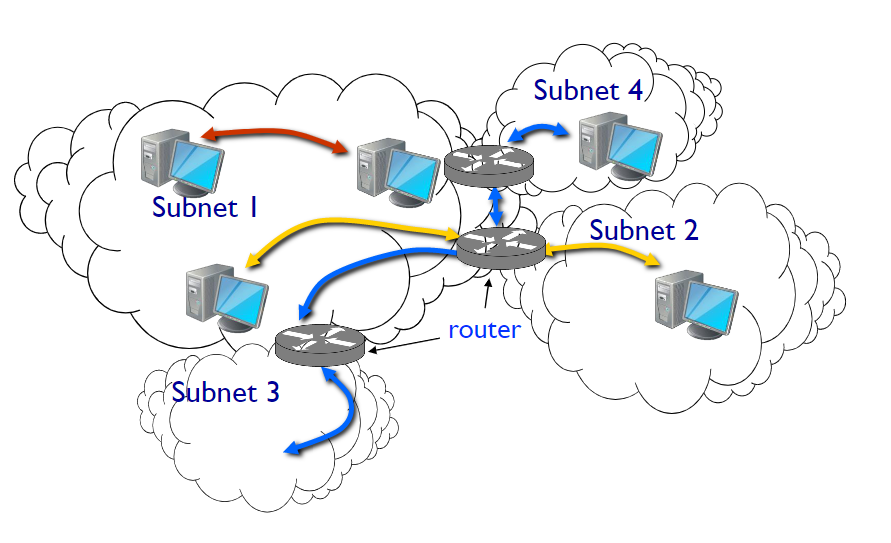{width=400px}

Per dividere la parte del prefisso di rete e la parte dell'interfaccia si è deciso, per il momento, di applicare una separazione a metà con un prefisso di rete pari ad `n=64`, ma è previsto che in futuro potremmo aver bisogno di un prefisso di rete più lungo.

Il concetto di aggregazione rimane il medesimo, è infatti possibile utilizzare il prefix length come già visto, ad esempio: `FEDC:0123:8700::100/40`. Non è più necessario l'utilizzo di classi.

:::note
**Nota**: il prefix length non sarà, per quanto detto precedentemente, superiore a 64. Per quanto attualmente sia fisso a 64 è comunque pensato per essere **flessibile**.
:::

{width=200px}

I principi di assegnamento sono i medesimi dell' IPv4, con alcune differenze in quanto a terminologia:

- **Link**: physical network.
- **Subnetwork**: Link, set di host con lo stesso prefisso.

Dividiamo le comunicazioni in:

- **On-link**: gli host hanno lo _stesso prefisso_, comunicano direttamente tra loro all'interno della stessa sottorete.
- **Off-link**: gli host hanno un _prefisso diverso_, comunicano attraverso un router.

A loro volta è possibile ulteriormente suddividere gli indirizzi di rete:

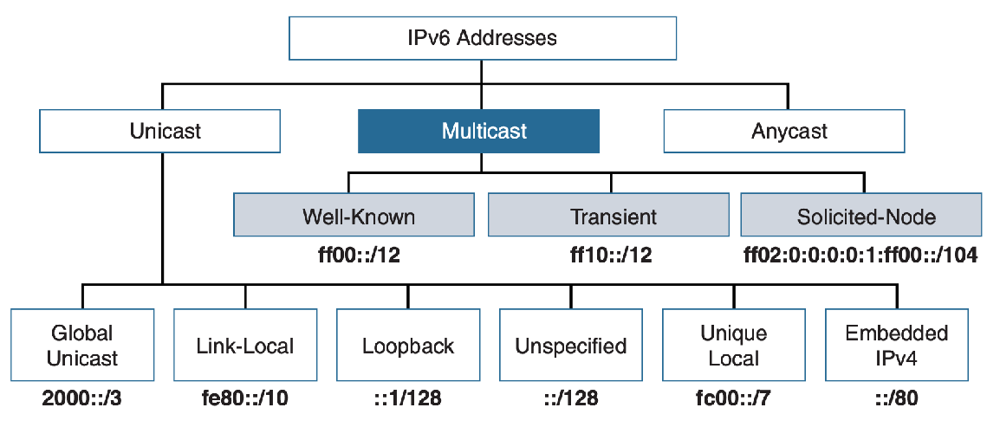{width=400px}

## Multicast

L'equivalente dell'indirizzo multicast IPv4 `224.0.0.0/4` è `FF00::/8`, che si suddivide in:

- **Well-know Multicast**: `FF00::/12`, utilizzato per comunicazioni di servizio e vengono assegnati a gruppi di dispositivi, sono riservati. Un esempio è l'indirizzo di _google_ (`8.8.8.8`).
- **Transient**: `FF10::/12`, indirizzi transitori, assegnati dinamicamente da applicativi multicast _(corrispettivo della vecchia modalità multicast in IPv4)_.
- **Solicited-node Multicast**: `FF02:0:0:0:0:1:FF00::/104`, simile a un indirizzo IP broadcast in _ARP_.

Una caratteristica importante è la **scomparsa in IPv6 l'utilizzo del broadcast**, che in seguito alle evoluzioni ha dimostrato essere un rischio per la sicurezza.

L'indirizzo si scompone in:

- **8 bit** iniziali, identificano che è un indirizzo multicast (tutti i bit sono posti a `1`).
- **4 bit** per il **T flag**, dice se è well known (permanente o non permanente), viene assegnato da IANA.
- **4 bit** per lo scope, consente ai dispositivi di definire il range dei pacchetti multicast.
- **112 bit** per il group ID.

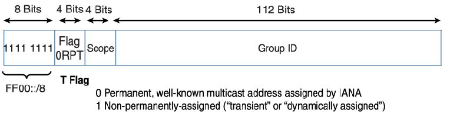{width=300px}

## Unicast

Gli indirizzi **unicast**, anche denominati _aggregatable global unicast addresses_, continuano a essere disponibili In IPv6, si suddividono in:

- `2000::/3`, **Global Unicast**
- `FE80::/10`, **Link-Local**
- `::1/128`, Loopback (in IPv4 era `127.0.0.1`)
- `::/128`, Unspecified
- `FC00::/7`, Unique Local
- `::80`, Embedded IPv4

Sono indirizzi di tipo aggregato, utilizzati in modo equivalente agli indirizzi pubblici in IPv4. Hanno la caratteristica di essere raggiungibili e indirizzabili globalmente, oltre a essere plug and play. Attualmente sono disponibili in un range definito tra `3FFF::` e `2000::`. Questi indirizzi hanno i primi 3 bit (più significativi) posti a `001`.

Hanno la caratteristica di essere distribuiti geograficamente in modo gerarchico.

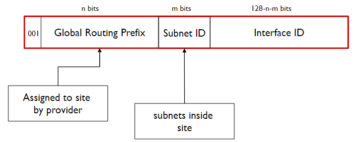{width=400px}

I prefissi per il Global Routing sono formalmente assegnati da multi-level authorities:

- **3 bit**, tipologia (`001`).
- **13 bit**, TLA ID _(Top Level Authority, grandi ISP)_
- **32 bit**, NLA ID _(Next-level Authority, organizzazioni)_
- **16 bit**, SLA ID
- **64 bit**, Interface ID

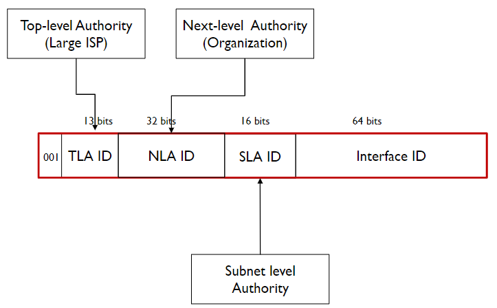{width=400px}

### Link local/site local Addresses

I **link local/site local** sono un gruppo di indirizzi compresi tra `FE80` ed `FEBF` e vengono assegnati in automatico ai link quando viene acceso un router.

Gli indirizzi **Link local**, identificati nella rete `FE80::/64`, vengono assegnati quando più router devono parlare tra di loro oppure devono annunciarsi a un router vicino, oltre a consentire una configurazione automatica o quando un router non è presente. Sono normalmente assegnati automaticamente dalla stazione a partire dall'indirizzo MAC della scheda di rete, a cui si pre-pende un prefisso predefinito.

Gli indirizzi **site local** sono nella rete `FEC0::/10` e sono ormai ritenuti **deprecati** perché pensati come vecchi indirizzi privati riconfigurabili, possono avere assegnati i router nelle comunicazioni (tipo stella, mesh _ecc..._). Utilizzano comunicazioni dirette e possono essere assegnati sono a indirizzi di rete.

:::tip
Quando il dispositivo si accende, dunque, prenderà in automatico un indirizzo link local dipendente dal MAC della propria scheda di rete.
:::

### Unique Local Addresses

Gli **Unique Local Addresses** (ULA) possono essere utilizzati in modo simile agli indirizzi globali unicast, ma sono per un utilizzo privato e non per l'indirizzamento sull'internet. Sono identificati da `FFC00::/7` e vengono utilizzati dai dispositivi che non hanno mai necessità di connettersi all'internet o di essere raggiungibili dall'esterno. Sono indirizzi privati che possono comunicare su internet grazie ad operazioni di tunneling.

L'**ottavo** bit è il **Local (L) Flag**, che divide in:

- `FC00::/8`, se L flag è `0`, potrebbe essere assegnato in futuro
- `FD00::/8`, se L flag è `1`, l'indirizzo è assegnato localmente

Attualmente gli indirizzi `FD00::/8` sono gli unici indirizzi ULA validi. Sono dunque privati e non utilizzati da altri dispositivi.

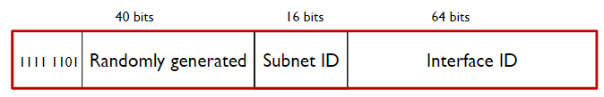{width=300px}

Dopo i primi 8 bit, sono presenti 40 bit generati casualmente in modo da non avere collisioni con altri indirizzi.

### IPv4 Embedded Addresses

Gli **IPv4 embedded addresses** sono utilizzati per rappresentare indirizzi IPv4 all'interno di un indirizzo IPv6. Vengono utilizzati per facilitare la transizione tra i due protocolli. L'indirizzo IPv4 è inserito negli ultimi 32 bit (low order) mentre i primi 80 devono necessariamente essere pari a `0`, a cui seguono 16 bit dal valore di `FFFF` (sedici bit posti a `1`).

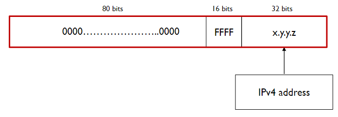{width=300px}

### Loopback Addresses

L'indirizzo di loopback viene utilizzato per finalità di test e consiste nel inviare un pacchetto IPv6 a se stesso. E' identificato da `::1` (equivalente di `127.0.0.1` di IPv4) ed è subordinato alle medesime regole di IPv4:

- Non può essere assegnato a un'interfaccia fisica.
- Pacchetti con un indirizzo di loopback non dovrebbero mai essere trasmessi oltre il dispositivo.
- I router non devono mai fare il forwarding di un pacchetto contenente un indirizzo di loopback.
- Il dispositivo deve fare il drop di pacchetti ricevuti da un'interfaccia se il destinatario è un indirizzo di loopback.

### Unspecified Addresses

Un indirizzo unicast non specificato è tale da contenere solo `0`. Tale indirizzo viene utilizzato come sorgente per indicare l'assenza di un indirizzo. Non può essere assegnato a un'interfaccia e viene utilizzato per il duplicate address detection in _ICMPv6_.

<!-- lezione6: 2022-10-22 -->

## Anycast Addresses

Gli indirizzi anycast possono essere assegnati a più di un'interfaccia (tipicamente su dispositivi differenti), dando dunque la possibilità di avere su dispositivi differenti lo stesso indirizzo anycast. Un pacchetto che viene inviato a un indirizzo anycast viene reindirizzato all'interfaccia più vicina avente quel indirizzo. Questo permette di avere un indirizzo unico per un servizio, ma che può essere raggiunto da più dispositivi. Inizialmente venne realizzato per il DNS, ma è ancora in uno stato sperimentale.

:::note
**Nota**: molto utile, ma non è ancora utilizzato.
:::

## Architettura del protocollo

L'architettura del protocollo IPv6 è molto simile a quella di IPv4, ma presenta alcune differenze:

- **IP**: utilizzato, salvo alcune modifiche
- **ICMP**: viene utilizzato _ICMPv6_
- **ARP**: non più utilizzato, inglobato in _ICMPv6_
- **IGMP**: non più utilizzato, inglobato in _ICMPv6_.

Sono invece stati aggiornati senza modifiche essenziali:

- DNS (type AAAA record)
- RIP e OSPF
- BGP e IDRP
- TCP e UDP
- Socket interface

:::warning
**Attenzione**: non è più possibile utilizzare _ARP_ E _IGMP_ per risolvere gli indirizzi IPv6.
:::

:::warning
Il protocollo **IGMP**, non più presente in IPv6, permette ad un router _IPv4_ di scoprire quali gruppi multicast sono presenti in una rete ad esso direttamente connessa.
:::

## Packet Header Format

L'header è stato modificato in modo sostanziale in seguito all'introduzione di IPv6. Ciò è stato fatto al fine di avere un header il più snello possibile, ottenendo una lunghezza di **40 byte**.

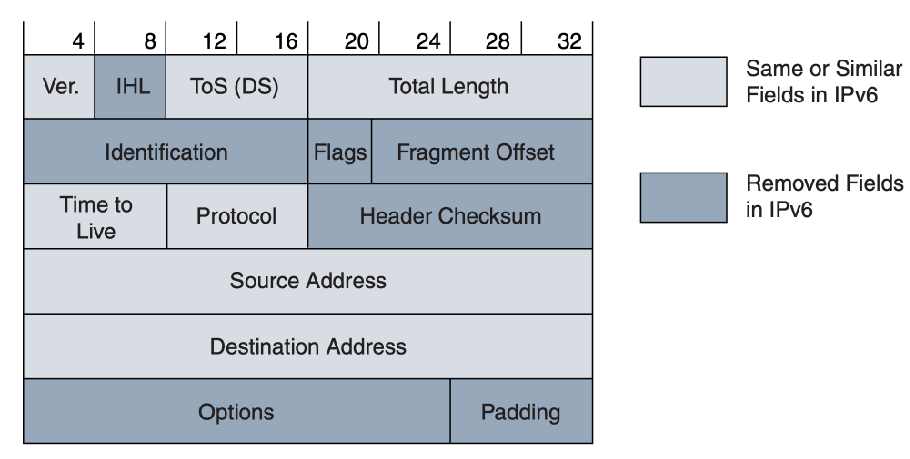{width=400px}

L'header utilizzato in IPv6 è invece il seguente:

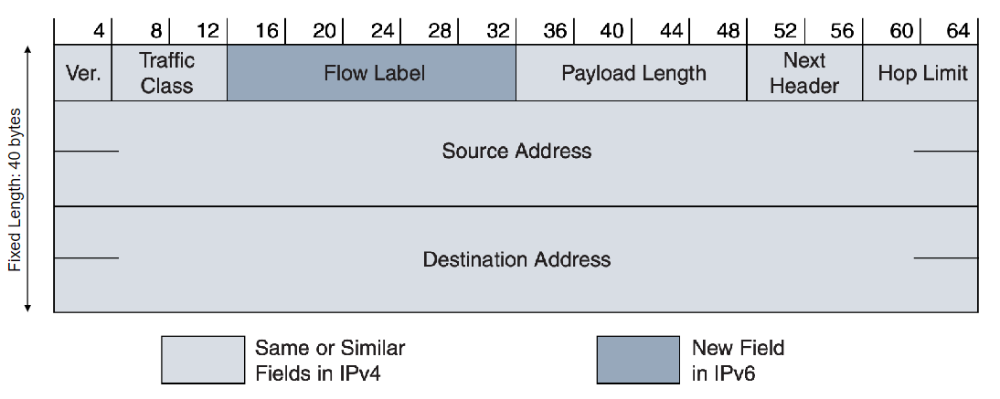{width=400px}

Osservando le immagini si può notare come alcune informazioni siano state rimosse:

- **Header Checksum**: viene utilizzato per verificare se il dato trasmesso è corrotto, non è più necessario in IPv6.
  - **Ridondante**: le tecnologie di data link al livello due hanno i propri meccanismi di checksum.
  - I protocolli di livello superiore come UDP e TCP hanno i propri meccanismi di checksum.
- Frammentazione
  - I router IPv6 non frammentano i pacchetti a meno che non siano loro la sorgente dello stesso.
  - I pacchetti più grandi di MTU vengono droppati e viene restituito alla sorgente un messaggio di errore `ICMPv6 Packet Too big`.

:::note
**Nota**: Il checksum su UDP diventa opzionale in IPv6.
:::

L'header può essere ulteriormente esteso attraverso il campo **next header**, che consente di puntare a un altro header contenente ulteriori informazioni creando una catena di header. Funzionano in modo simile al campo "protocol" di IPv4.

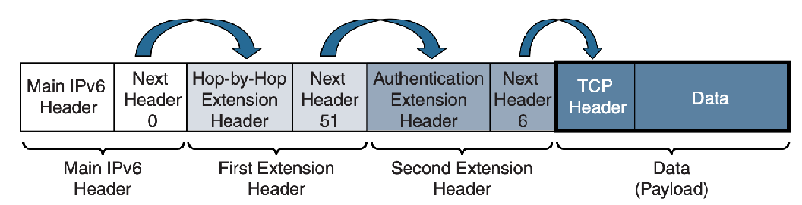{width=400px}

Inoltre, sono presenti:

- **version**: versione del protocollo.
- **traffic class**: permette di indicare la priorità del traffico (quality of service).
- **flow label**: permette di indicare il flusso di dati (nuovo campo), permette di associare un'etichetta a un certo tipo di traffico (label routing). Ad esempio: se non mi fido dei miei dipendenti e voglio che tutto il loro traffico passi per un dispositivo di sicurezza che lo analizzi.
- **payload length**: lunghezza del payload.
- **hop limit**: numero di router che possono essere attraversati prima che il pacchetto venga scartato. Se il valore è 0, il pacchetto viene scartato. Se il valore è 1, il pacchetto viene inviato al destinatario senza essere inoltrato. Se il valore è 255, il pacchetto non viene scartato mai.

Il formato del campo **next header** è il seguente:

- **next header**: indica il tipo di header successivo.
- **length**: lunghezza del header successivo.
- **extension header**: header successivo.
- **extension data**: dati dell'header successivo.

:::note
**Nota**: Header length non serve più! Viene eseguita la frammentazione attraverso il next header.
:::

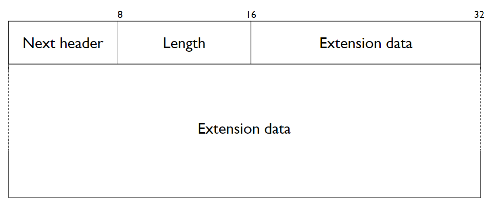{width=400px}

### Hop-by-Hop Extension Header

L'**Hop-by-Hop Extension Header** è utilizzato per andare a inserire dei campi/vincoli che servono all'hop per capire se il pacchetto deve essere scartato o meno (strumento di analisi). Se è presente, è indicato immediatamente dopo l'header IPv6. Questo header viene utilizzato per inserire dei campi opzionali. Ogni opzione ha un set di:

- **option type**: indica il tipo di opzione.
- **option length**: lunghezza dell'opzione.
- **option value**: valore dell'opzione.

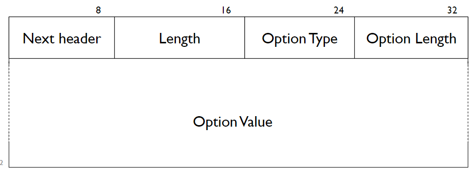{width=400px}

:::note
**Nota**: si ottiene una tripletta **TLV** (**t**ype-**l**ength-**v**alue).
:::

### Routing Extension Header

Il **Routing Extension Header** permette alla sorgente di un pacchetto di specificare il percorso di destinazione, indicando uno o più router intermedi. Viene utilizzato per il supporto alla mobilità in IPv6.

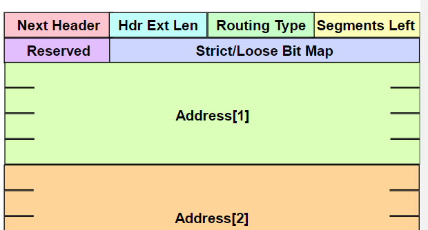{width=350px}

### Altre estensioni

Sono possibili altri due tipi di estensioni a seconda delle necessità:

- **Fragment Extension Header**
- **Authentication and Encapsulating Security Payload Extension Headers**: utilizzato da IPsec (una suite di protocolli per la sicurezza).

#### fragmentation header

Il **Fragmentation header** viene utilizzato per la frammentazione dei pacchetti ognuno dei quali ha un proprio header IPv6 e un frammento di extension header. Il ricevente del pacchetto deve riunire i frammenti in un unico pacchetto. A differenza di IPv4, il protocollo IPv6 non frammenta un pacchetto a meno che non sia la sorgente del pacchetto.

#### Authentication and Encapsulation Header

Gli header **Authentication and Encapsulation Header** vengono utilizzati per la sicurezza, sono usati da IPsec: una suite di protocolli per l'invio in sicurezza dei pacchetti in una rete IP. _Authentication Header_ (AH) è utilizzato per l'autenticità e la integrità dei pacchetti mentre _Encapsulating Security Payload_ (ESP) è utilizzato per la cifratura, autenticazione e integrità  dei pacchetti.

## Interfacciarsi con i livelli più bassi

### Incapsulamento

La prima cosa che risulta evidente appena si approccia IPv6 è che lo stack ISO/OSI prevede un campo in cui viene specificato il contenuto del livello superiore. Questo approccio è detto **dual stack**: creando uno nuovo stack è possibile far funzionare sia i dispositivi in IPv4 che in IPv6 (lo trattiamo come un nuovo protocollo), senza alterare il funzionamento nel protocollo precedente.

I pacchetti IPv6 sono incapsulati nel frame di livello 2, ad esempio per ethernet il tipo è `86DD`.

### Address mapping

Un indirizzo di un pacchetto IPv6 viene associato a un MAC di destinazione attraverso:

- **IP unicast address**: discovery procedurale (protocol based).
- **IP multicast address**: algorithm mapping.

### IPv6 Multicast transmission

La trasmissione **Multicast** si basa sul **ethernet multicast**, e a differenza del _ethernet broadcast_ può essere filtrato dalla scheda di rete _(NIC)_.

Gli indirizzi multicast IPv6 vengono associati ad indirizzi MAC, in particolare è riservato l'indirizzo MAC Ethernet `33-33-xx-xx-xx-xx` per il trasporto di pacchetti multicast IPv6. Questo viene fatto ponendo i **4 byte** (32 bit) meno significativi dell'indirizzo IPv6 in un indirizzo MAC Ethernet multicast `33-33`.

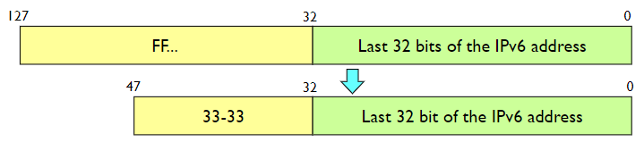{width=400px}

Un esempio può essere il seguente: quando viene inviato un pacchetto all'indirizzo IP multicast `FFOC::89:AABB:CCDD`, questo viene incapsulato in un MAC frame con indirizzo `33:33:AA:BB:CC:DD`, o ancora `FE80::0201:06FF:FEA5:3A4C` potrebbe avere come mac associato `00:01:06:A5:3A:4C`

:::note
**Nota**: abbiamo `FF` all'inizio dell'indirizzo proprio perché è multicast.
:::

## Neighbor Discovery and Address Resolution

**ICMPv6** adesso sostituisce completamente il protocollo **ARP**. E' basato su multicast e sfrutta il **Solicited-Node Multicast Address**. A causa di come il multicast solicited address è realizzato, per lo più solo un nodo viene coinvolto.

Il **solicited-node Multicast Address** viene utilizzato come indirizzo di destinazione in un pacchetto di _Neighbor Solicitation_.

:::danger
**Attenzione**: l'inoltre dei pacchetti _IPv6_ su una _LAN_ non utilizza meccanismi di _neighbor discovery_ in quanto esiste una regola per mappare gli indirizzi _IPv6_ in indirizzi _MAC_ (4 byte meno significativi).
:::

### Solicited-Node Multicast Address

Mediante il _Solicited-Node Multicast Address_, gli indirizzi vengono automaticamente creati per ogni indirizzo unicast dell'interfaccia. Tutti gli host si iscrivono e vengono mappati nel seguente modo: `FF:02::1:FF/104 | 24 ip meno significativi` (per lo più un host per gruppo).

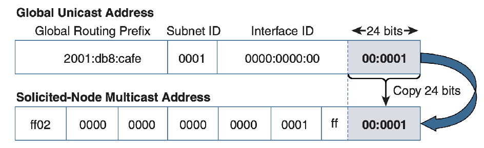{width=400px}

### Risoluzione di un indirizzo

 La risoluzione di un indirizzo avviene attraverso **ICMP Neighbor Solicitation**: Il richiedente invia un frame al _Solicited Node Multicast Address_ contenente l'indirizzo _IPv6_ del _target_.

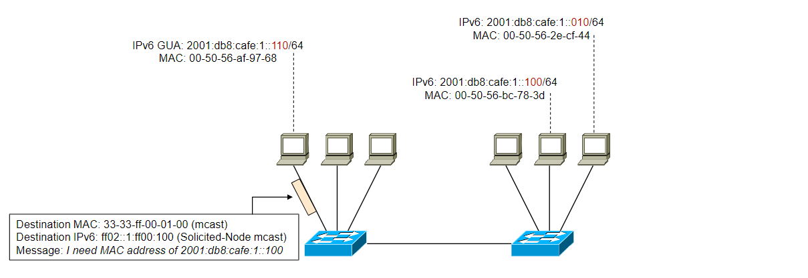{width=400px}

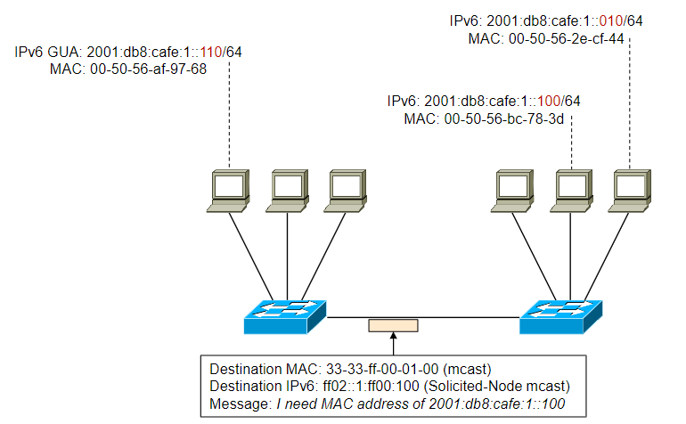{width=400px}

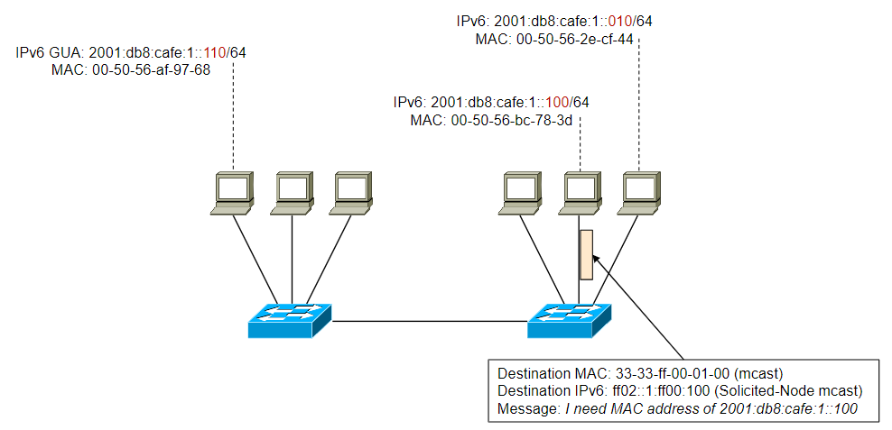{width=400px}

:::tip
**Per ricordarlo**: non lo chiedo a tutti, ma soltanto a chi mi potrebbe rispondere.
:::

Avviene in seguito la risposta **ICMP Neighbor Advertisement**, attraverso la quale viene inviata indietro all'indirizzo unicast del richiedente la risposta. La mappatura tra _IPv6_ e _MAC_ address viene memorizzata nella cache dell'host (in modo equivalente alla cache _ARP_).

Di fatto il numero di MAC aumenta molto, a causa della mancanza degli indirizzi broadcast. Per questo motivo è necessario che il router sia in grado di rispondere alle richieste di risoluzione indirizzo.

## La transizione tra IPv4 e IPv6

La transizione da _IPv4_ a _IPv6_ sta venendo in modo **incrementale**, non è stato stabilito un limite entro cui eseguire il passaggio ma bensì sarà stabilito automaticamente quando sarà, nel pratico, il più utilizzato. Questo approccio trasparente e graduale ha consentito che prima di far prendere piede IPv6 nel corso di molto tempo ma in modo **seamless** (ovvero senza cambiamenti). Inoltre, come già accennato, è possibile generare e ricevere pacchetti per entrambi i protocolli senza problemi grazie all'approccio **dual stack**.

Questo risultato viene ottenuto attraverso tre meccanismi:

- Address Mapping
- Tunneling
- Translation mechanisms

Quando è nato IPv6 erano presenti poche reti **dual stack**, quindi era presente una parte di backbone su ipv4.

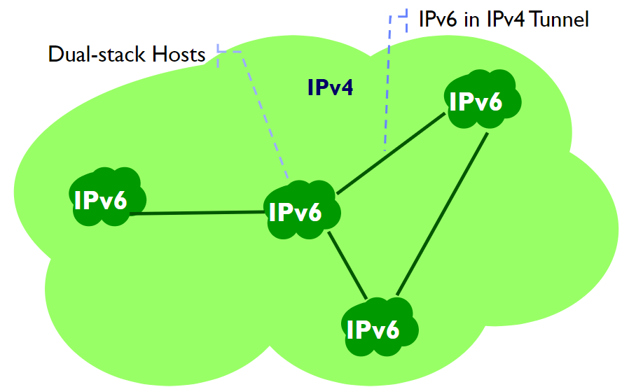{width=350px}

Nel corso del tempo le infrastrutture si sono adeguate al passaggio, aumentando il numero di host con comunicazioni on-link.

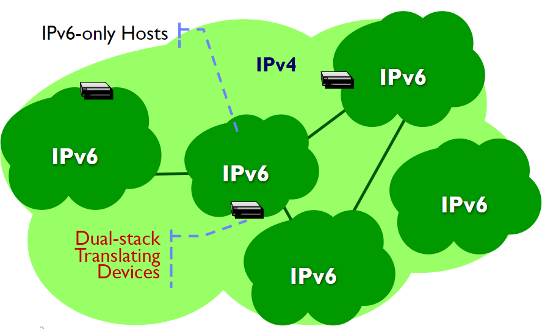{width=350px}

L'obbiettivo è quello di riuscire a creare una rete maggioritaria su IPv4 con solo poche connessioni IPv4. In realtà abbiamo già le infrastrutture per eseguire il passaggio completo.

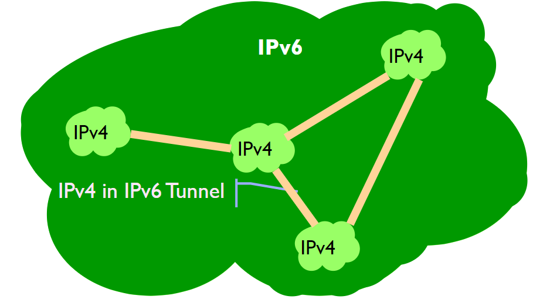{width=350px}

## ICMPv6

<!-- lezione6: 2022-10-12 -->

Il protocollo **ICMPv6** permette di eseguire operazioni di:

- diagnostica
- _neighbor discovery_
- _Multicast group management_
- _issue notification_

Inoltre, include alcune funzioni che in IPv4 erano delegate ad **ARP** _(Address Resolution Protocol)_ e **IGMP** _(Internet Group Membership Protocol)_.

### Formato del messaggio

Il messaggio è incapsulato nei pacchetti IPv6 con `next header = 58`, che permette di identificare il nuovo header di tipo **ICPMv6**, che avrà al più **576 byte**.

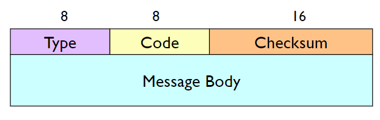{width=400px}

| Code | Spiegazione               | tipo        |
| ---- | ------------------------- | ----------- |
| 1    | Destination Unreachable   | Errore      |
| 2    | Packet too big            | Errore      |
| 3    | Time exceeded             | Errore      |
| 4    | Parameter Problem         | Errore      |
| 128  | Echo Request              | Informativo |
| 129  | Echo Reply                | Informativo |
| 130  | Multicast Listener Query  | Informativo |
| 131  | Multicast Listener Report | Informativo |
| 132  | Multicast Listener Done   | Informativo |
| 133  | Router Solicitation       | Informativo |
| 134  | Router Advertisement      | Informativo |
| 135  | Neighbor Solicitation     | Informativo |
| 136  | Neighbor Advertisement    | Informativo |
| 137  | Redirect                  | Informativo |

#### Messaggi di errore

Analizzando più nel dettaglio i messaggi di errore:

- **Destination unreachable** _(tipo 1)_: solitamente generato dal router o firewall, nel campo "code" viene fornita la motivazione (nessuna route, scope errato, indirizzo/porta non raggiungibile).
- **Packet too big** _(tipo 2)_: IPv6 non fa più la frammentazione dei pacchetti.
- **Time exceeded** _(tipo 3)_: avviene quando il router riceve un pacchetto con `Hop Limit = 0`.
- **Parameter Problem** _(tipo 4)_: generato quando un dispositivo trova un problema con un campo del header IPv6 main o con un extension header. Un esempio è un valore non valido del campo _Next Header_.

#### Messaggi informativi

##### Echo

La richiesta di _echo_ ha tipo `128` mentre la _echo reply_ ha `129`; viene utilizzato, ad esempio, da `ping`.

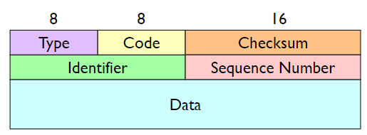{width=350px}

##### Neighbor Solicitation

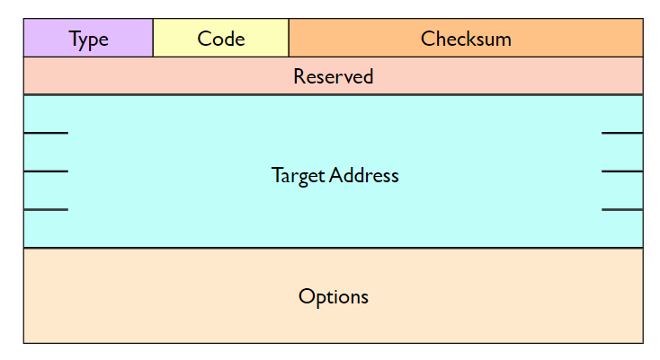{width=350px}

##### Neighbor Advertisement

E' importante evidenziare la presenza di flag aggiuntivi:

- `R` **router flag**, se `true` arriva da un router.
- `S` **solicited flag**, se arriva da un nodo che ha fatto una richiesta di risoluzione.
- `O` **override flag**, se la host cache deve essere aggiornata o meno.

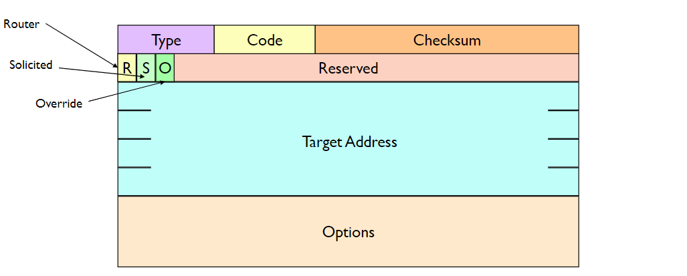  

:::note
**Nota**: non è presente un campo MAC, in quanto è dato per scontato sia presente nelle opzioni. Viene invece specificato l'ip, anche se ridondante, in quanto potrebbe essere sia un nodo che un router.
:::

<!-- lezione7: 2022-10-18 -->

### Multicast Group Management

Quando si ha un collegamento che fa affidamento al _data link layer multicasting services_, è necessario eseguire il _mapping_ di un indirizzo _multicast IPv6_ su un indirizzo _MAC_. Questo deve essere eseguito tra i link e i pacchetti inviati dai router in modo che _ICMPv6_ sappia i membri _on-link_ (ovvero gli host interessati a ricevere i pacchetti).

Inoltre consente ai protocolli di multicast routing di sapere quando sono presenti membri off-link.

### Host Membership Discovery

La **Multicast Listener Query** è una domanda che il router manda ai suoi host per capire se sono interessati a far parte di un gruppo multicast, ponendosi in attesa di una risposta. La risposta con la quale un host comunica al router tale interesse è detto **Multicast Listener Report**.

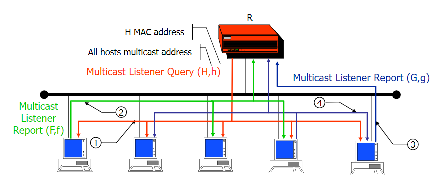{width=400px}

- **Multicast listener query** (`type=130`): il router manda una query per capire se un host è interessato a ricevere i pacchetti multicast.
- **Multicast Listener Report** (`type=131`): il host risponde al router dicendo che è interessato a ricevere i pacchetti multicast.
- **Multicast Listener Done** (`type=132`): il router manda un messaggio di fine per dire che non è più interessato a ricevere i pacchetti multicast.

Il messaggio di `done` è importante, perché se un host esce da un gruppo, il router deve essere informato. Potrebbe succedere che il messaggio non venga inviato. In questo caso il router prevede dei timer, se dopo un intervallo di tempo _(maximum response delay)_ l'host non manda un messaggio di interesse verso un gruppo, allora il router non inoltrerà più i pacchetti multicast.

Adesso la gestione del multicast è viene rappresentato solo a livello 3 (quindi compito del router e non più anche dello switch).

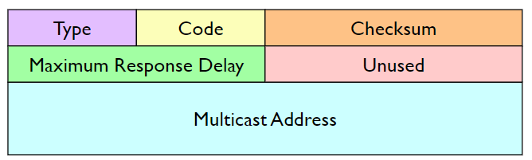{width=400px}

## Device Configuration in IPv6

Le informazioni necessarie per eseguire la configurazione di un dispositivo sono:

- Address prefix
- Interface identifier
- Default gateway
- DNS server
- Hostname
- Domain name
- MTU (Maximum Transmission Unit)
- _..._

Molte di queste informazioni vengono recuperate automaticamente in modo da rendere gli host plug and play.

Le configurazioni possono essere:

- **Manual configuration**: configurazione manuale.
- **Stateful configuration**: tutte le informazioni recuperate mediante _DHCPv6_.
- **Stateless configuration**: generate automaticamente, con il prefisso dell'indirizzo ottenuto dal router.
- **Hybrid** (Stateless DHCP): ulteriori informazioni oltre l'indirizzo recuperate mediante _DHCPv6_.

L'identificatore dell'interfaccia _(64 bit bassi)_ può essere ottenuto in più modi:

- configurazione manuale
- ottenuto tramite _DHCPv6_
- generato automaticamente da _EUI-64 MAC address_ (privacy aware)

:::note
Ci sarà in realtà un ulteriore meccanismo che si assicura che l'indirizzo utilizzato sia unico all'interno della rete.
:::

**EUI-48 to EIU-64** (Extended Unique Identifier) estende l'indirizzo MAC da 48 bit a 64 bit, aggiungendo i bit `11111110` (8 bit) e `10` (2 bit) in posizione 1 e 2.

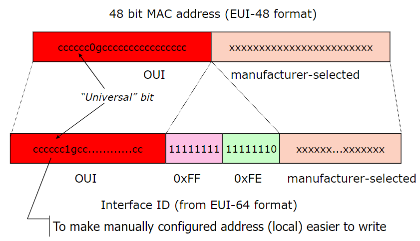{width=400px}

La rete `FE80::/64` dovrebbe essere utilizzata solo per indirizzi di tipo link local (cioè per comunicare sulla stessa rete locale senza uscire sulla rete pubblica), per ottenere i 64 bit bassi di interface ID è necessario prendere il MAC address(48 bit), separare i 24 bit alti dai 24 bassi e al centro inserire 16 bit pari a `FFFE`, inoltre per convenzione il _settimo bit_ deve essere post a `1` nel caso in cui l'indirizzo mac sia stato configurato manualmente.

Dal punto di vista della tracciabilità, i 64 bit meno significativi di un indirizzo IPv6 di un'interfaccia non cambiano mai quando viene utilizzato un MAC address.

### Privacy extension Algorithm

Ormai da qualche anno, non viene più utilizzato MD5. Il **Privacy extension Algorithm** garantisce la privacy al livello 3 (network layer), in quanto non è possibile dai 64 bit ricavare l'indirizzo.

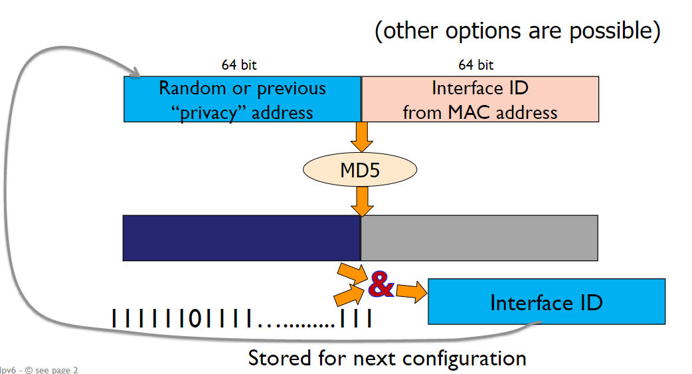{width=400px}

### Indirizzi

Un host pu avere più di un indirizzo IPv6, che possono essere _default_ o _privacy aware_. Questi possono essere utilizzati per accettare o iniziare connessioni. Solo una un numero selezionato di indirizzi potrebbe essere disponibile per un user o una applicazione.

Il prefisso di un indirizzo può essere configurato manualmente, ottenuto tramite DHCPv6, generato automaticamente (link local) oppure ottenuto dal router.

Come faccio a capire quali sono i 64 bit alti che ha comprato il mio amministratore di rete? Dal router. In particolare sono di nostro interesse il **router prefix discovery**, **router solicitation** e il **router advertisement**.

#### Router Prefix Discovery

Attraverso la **Router/Prefix Discovery** è possibile introdurre una _"sincronia"_: se l'host non ha chiesto un messaggio potrebbe essere direttamente il router a mandare l'informazione tempestivamente senza che venga richiesta un _solecitation_.

#### Router Solicitation

Una router solicitation viene viene mandata solamente ai router, dunque non `all node` ma bensì `all routers` (`FF01::2`).

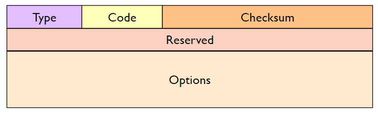{width=400px}

#### Router Advertisement

Nel messaggio di advertisement sono rilevanti alcuni parametri:

- `M` flag _(Managed addres Configuration)_: se è settato a `1` significa che l'indirizzo è stato configurato tramite DHCPv6.
- `O` flag _(other configuration)_: se è settato a `1` sono presenti  altre configurazioni, ad esempio DNS server.
- `reachable time`: tempo in millisecondi che il router impiega per raggiungere un host.
- `retrans timer`: intervallo di tempo per cui ritenere l'indirizzo valido.
- `Option`: sono presenti delle opzioni, in formato generico ovvero type, length (multipli di 8) e value.

tra le opzioni c'è il prefix information option che ha sempre:

- `lifetime`: tempo di vita dell'indirizzo.
- `preferred lifetime`: periodo in cui non dovrei più utilizzarlo.
- `L`: se è utilizzato all'interno di un on-link.
- `A`: il prefisso può essere utilizzato per una configurazione automatica.
- `prefix`: il prefisso.

Link layer address option: indirizzo MAC del mio default gateway. Se il default gateway invia il messaggio perché lo inserisco? per comodità dello stack iso/osi.

### ICMP Redirect

Il **redirect** viene utilizzato per informare, all'interno di una stessa sottorete, un  host `A` che per raggiungere un determinato host `B` è più conveniente utilizzare un altro router. 

Se la comunicazione è a livello globale questo solitamente non avviene.

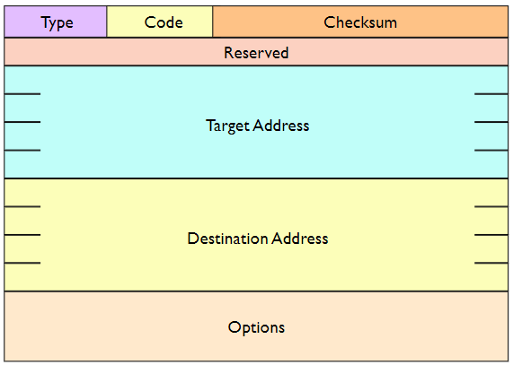{width=400px}

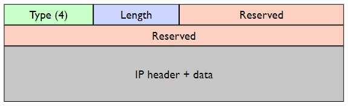{width=400px}

### Duplicate Address Detection (DAD)

Il **Duplicate Address Detection** (DAD) è un meccanismo che permette di verificare che un indirizzo sia unico all'interno della rete.

Il funzionamento è molto semplice: l'host manda un messaggio ICMPv6 a tutti gli host con destinazione `all nodes` e con il payload contenente l'indirizzo che si vuole utilizzare. Se l'indirizzo è unico, nessuno lo conosce e quindi non risponde (timeout, ad esempio un minuto). Se l'indirizzo è già utilizzato, un host risponde con un messaggio ICMPv6 di tipo `DAD` con il payload che contiene l'indirizzo che si vuole utilizzare.

### Fasi di una configurazione Stateless

La configurazione stateless di un nuovo dispositivo avviene nei seguenti passaggi:

- generazione di un indirizzo link local.
- verifica dell'unicità dell'indirizzo (DAD).
- il dispositivo si pone in ascolto di un messaggio di _router advertisement_ o manda una _solicitation_ per scoprire le informazioni sull'indirizzo privato.

Una volta scoperta la parte alta:

- si verifica se anche all'interno della sotto rete che l'indirizzo sia unico (di nuovo).
- iscrizione al corrispondente IPv6 Solicited Node Multicast Address, configurando la ricezione del multicast MAC corrispondente e inviando un ICP MUlticast Listener Report.
- La comunicazione on-link è abilitata.

Un altro vantaggio è quello del **renumbering**, che consente un funzionamento plug and play. Tramite l'advertisement vengono riconfigurati tutti i dispositivi in modo automatico. Questi rimangono in ascolto per il Router Advertisement e quando arriva un messaggio con un nuovo prefisso, cambiano indirizzo. Gli host possono essere riconfigurati in qualsiasi momento. Si identificano così indirizzi _"preferred"_ e _"deprecated"_. In questo modo è possibile cambiare ISP senza dover cambiare tutti gli indirizzi.

## Scoped Addresses

Un dispositivo può avere più interfacce con il medesimo indirizzo, per cui un determinato pacchetto viene mandato su un interfaccia piuttosto che un'altra in base allo **scopo** e al programma che lo ha generato (concetto di scopo). Un indirizzo scoped è composto da un indirizzo IPv6 seguito da `%` e un numero che identifica l'interfaccia.

Ad esempio: `FE80::0237:00FF:FE02:A7FD%19`

:::warning
**Attenzione**: il valore dello scopo è specifico per ogni implementazione.
:::

:::danger
**Attenzione**: Questo byte di scope non viene più utilizzato perché è di interesse solo per il sistema operativo.
:::

## Routing Protocols

Per prima cosa distinguiamo il routing in due tipologie:

- **On the fly routing**: è il forwarding, usa le routing tables e permette, a fronte di un pacchetto entrante in un nodo di rete, di determinare qual è la migliore porta di uscita verso la destinazione.
- **Proactive routing**: processo di creazione di routing tables che mira ad individuare un percorso valido per un pacchetto, dal mittente al destinatario.

La creazione di tali tabelle può essere di tipo manuale, dunque _static routing_, oppure mediante la distribuzione delle informazioni all'interno della rete adoperando protocolli di routing.

Le routing table in _IPv6_ sono basate sul **longest prefix match** (come in IPv4). Nonostante alcune peculiarità, _IPv4_ e _IPv6_ si comportano come due protocolli indipendenti (con routing table separate).

I protocolli di routing possono essere:

- **integrate routing**: viene adoperato un singolo protocollo che informa i destinatari per entrambe le _protocol families_ (sia _IPv4_ che _IPv6_). Ha come vantaggio quello di non avere meccanismi di duplicazione, ma è necessaria l'implementazione di un nuovo protocollo dedicato che potrebbe comportare bug con il funzionamento delle operazioni in IPv4. Inoltre, le topologie di rete tra IPv4 ed IPv6 potrebbero essere diverse e quindi il routing potrebbe non essere ottimale.
- **ships in the night**: ogni _family address_ ha il suo protocollo di routing, con la caratteristica che tutti i protocolli sono indipendenti l'uno dall'altro. In questo modo è possibile utilizzare protocolli di routing differenti (scelti in base alla topologia o scenario). Il vantaggio è una più semplice integrazione e troubleshooting, ma comporta un inevitabile meccanismo di duplicazione.

_Esempi di routing protocol:_

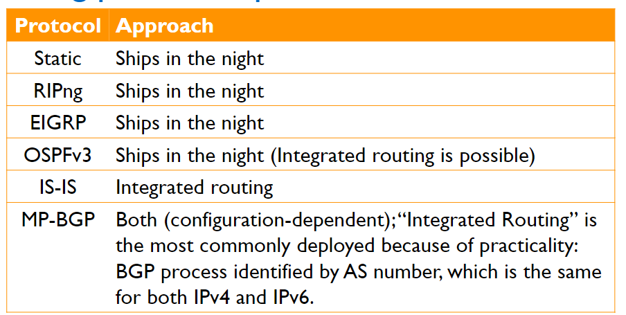{width=400px}

## La transizione da IPv4 a IPv6

La transizione da IPv4 e IPv6, come già detto, è tutt'ora in corso e molto lenta. In prima battuta, quando la maggior parte delle  connessioni erano su IPv4 si andava a utilizzare il tunneling di IPv6, il cui nome deriva dal fatto che IPv6 veniva inserito in un header IPv4 per compatibilità.

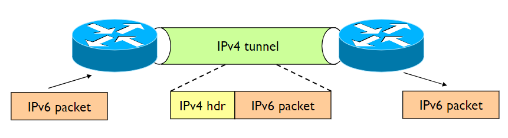{width=400px}

L'approccio inziale è stato quello di tipo dual stack descritto precedentemente, con lo scopo di supportare le funzionalità di entrambi i protocolli, ma con la limitazione di non ridurre l'utilizzo di IPv4 e di dare la responsabilità alle applicazioni di utilizzare IPv6 o IPv4.

Alcuni protocolli che implementano soluzioni di tipo tunneling sono:

- **GRE** (Generic Routing Encapsulation)
- **IPv6 in IPV4** (protocollo di tipo 41)
- setup manuale ed automatico

### Host centered solutions

Una soluzione potrebbe essere di utilizzare un approccio di tipo _dual stack host_, ovvero un host che supporta sia IPv4 che IPv6. In questo modo, il tunneling non è più necessario.

Per fare ciò, degli indirizzi IPv6 devono essere riservati per la compatibilità con IPv4, in particolare quelli con il prefisso `::/96`, in modo da ignorare i bit più significativi e renderlo retrocompatibile.

Le applicazioni mandano pacchetti IPv6 attraverso un indirizzo IPv6, ad esempio `::2.2.2.2` e vengono reindirizzati a `::/96` attraverso una pseudo-interfaccia (che fa tunneling automaticamente). La pseudo interfaccia dunque incapsula i pacchetti IPv6 in pacchetti IPv4 e li invia.

:::note
**Nota**: devono essere riservati `::/96` perché consente di mantenere libero i 32 bit meno significativi per ipv4: $ 128 - 96 = 32 $.
:::

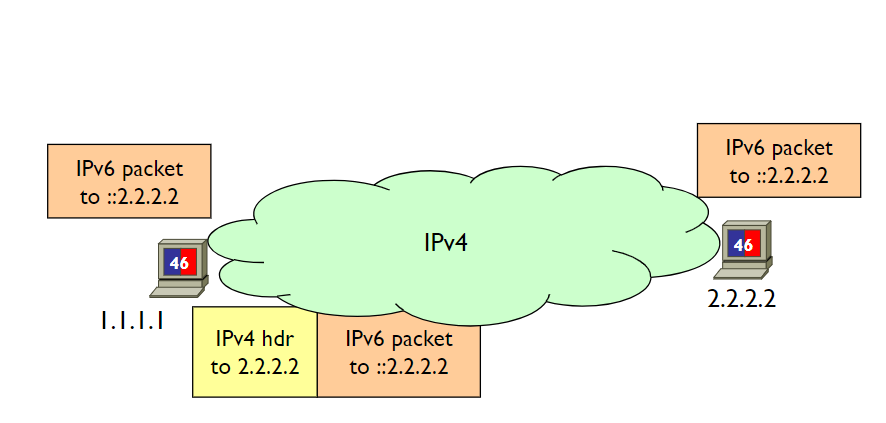{width=400px}

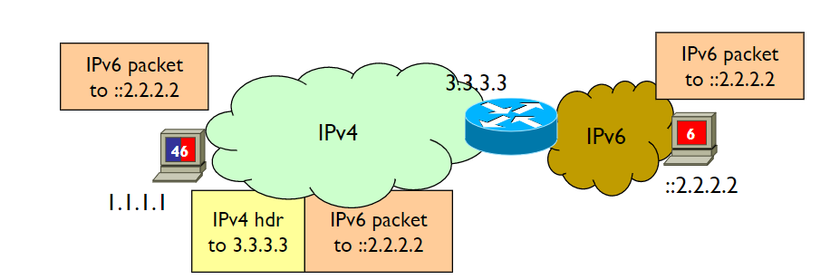{width=400px}

#### 6over4

Il protocollo **6over4** utilizza una rete _IPv4_ per emulare una _virtual LAN_. Utilizza il _broadcast multiple access data link_ e l'_IP multicasting_.

Il _neighbor_ e _router discovery_ è abilitato in modo da consentire l'individuazione di nodi vicini e router.

L'indirizzo IPv4 è utilizzato per la generazione automatica di un interface ID IPv6 dell'indirizzo link local.

:::note
**Nota**: Non è molto utilizzato a causa della poca diffusione del supporto IPv4 multicast.
:::

#### ISATAP: Intra-site Automatic Tunnel Addressing Protocol

Invece di usare il multicast, utilizza una soluzione con un prefisso di rete `0000:5EFE`. La rete IPv4 viene utilizzata come una Non-Broadcast Multiple Access (NBMA) data link, in questo modo non è necessario il supporto per IP multicast.

L'interface ID viene derivata dall'indirizzo IPv4.

#### (Lack of) Neighbor Discovery

Utilizza il protocollo DNS, ma ha come limitazione che ogni indirizzo deve avere associato un hostname. Quindi la richiesta non parte dall'indirizzo di IPv6, ma dal hostname (potrebbe essere un problema in alcuni casi).

Non è necessario eseguire data-link address discovery in quando l'indirizzo IPv4 è incluso nell'indirizzo IPv6, in particolare negli ultimi 4 byte.

Si rende necessario fornire una PRL (Potential Router List) in quanto la router discovery non è possibile. Può essere configurata manualmente oppure acquisita dal DNS.

#### Configurazione automatica

La configurazione automatica è diventata lo standard nel tempo. Vengono utilizzati indirizzi IPv4, indirizzi DNS e il nome del dominio viene ottenuto tramite DHCPv4.

L'indirizzo IPv6 link local viene generato automaticamente, l'interface ID dall'indirizzo IPv4.

Per ottenere il PRL si utilizza una query DNS, se non fornita da DHCPv4.

Periodicamente viene eseguita una router discovery verso tutti i router su link prefixed per l'autoconfigurazione.

<!-- Lezione 8: 2022-19-10 -->

### Network center solution

Si configurano intere reti IPv6 all'interno di una struttura ancora IPv4, dovendo però rinunciare a parte delle funzionalità IPv6, inoltre il range di indirizzi continua a essere ridotto.

{width=400px}

#### 6to4

Attraverso il protocollo **6to4** Gli indirizzi dei relay sono embedded in un prefisso IPv6. Iniziano con `2002` e sono indirizzi pubblici (inizia con `2`).

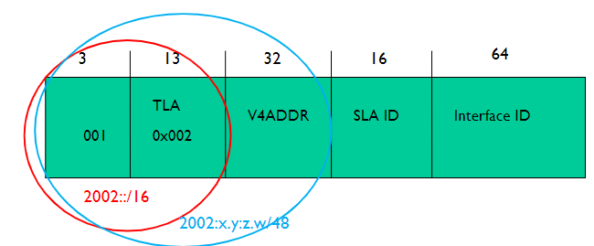{width=400px}

Tale protocollo non è pensato per le comunicazioni da host IPv4 a host IPv6.

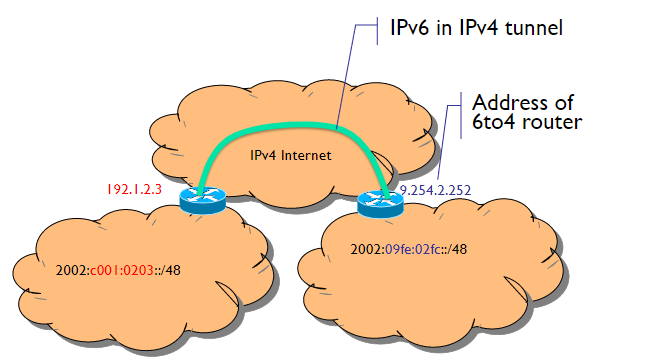{width=400px}

Un relay 6to4 deve essere necessariamente il default gateway per i router 6to4.

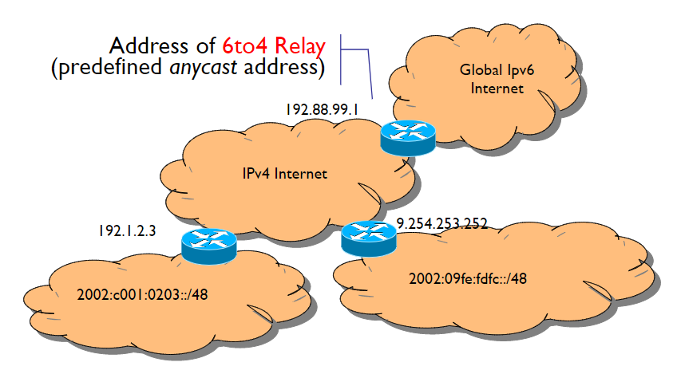{width=400px}

#### Tunnel broker

In questa modalità le comunicazioni avvengono attraverso un tunnel broker server che si occupa di individuare i tunnel server e fa da mediatore tra le configurazioni dei tunnel.

Vengono utilizzati tunnel IPv6 in IPv4 (a.k.a. proto-41).

Per eseguire la configurzione dei tunnel viene utilizzato il Tunnel Setup Protocol (TSP) o il Tunnel Information Control (TIC).

Questo tipo di soluzione è centralizzata.

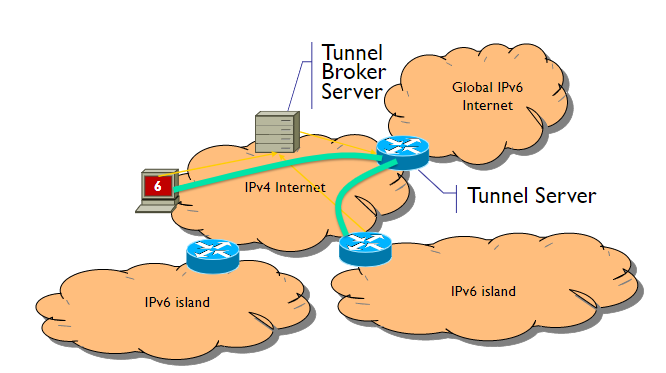{width=400px}

## Scalable, Carrier-grade Solutions

Devono essere presi in considerazione anche soluzioni per grandi provider. Purtroppo ancora è necessario supporto per i server e i client IPv4 in modo che possano comunicare con host IPv6 e host ipv4. Le soluzioni più utilizzate sono:

- **DS-Lite**
- **A+P (evoluzione di DS-Lite)**
- **MAP-T and MAP-E**
- **NAT64**
- **6PE (MPLS-based)**

Tutte queste soluzioni si basano sul concetto di mapping di indirizzo IP, ovvero il NAT, eseguendo un mapping tra ipv4 e ipv4. Quello che viene fatto è associare una porta a un indirizzo privato.

Prende il nome di _**LSN** il **L**arge **S**cale **N**AT_, utile in quanto riesce a gestire una quantità di richieste molto elevate.

:::note
E' possibile avere più livelli di NAT ponendoli in cascata, pratica piuttosto comune.
:::

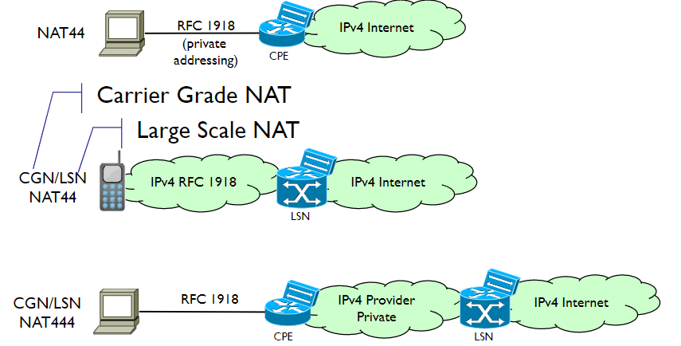{width=300px}

E' necessario tenere a mente che nelle soluzioni proposte, anche se è previsto l'utilizzo del NAT, è comunque presente l'utilizzo di tunnel.

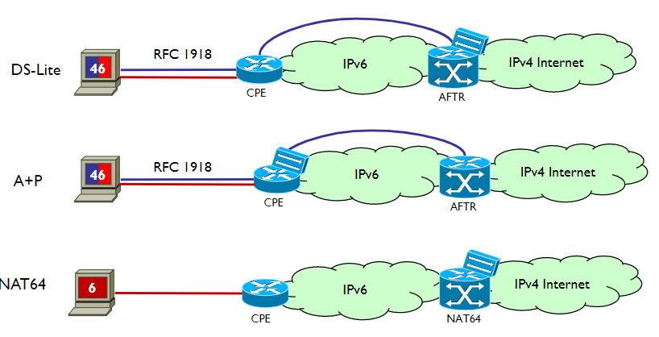{width=400px}

:::warning
**Attenzione**: da notare dove le funzionalità di NAT sono presenti.
:::

### AFTR: Address Family Transition Router

L'utilizzo del **Address Family Transition Router** (AFTR) Abilita gli host ipv4 a comunicare con altri host IPv4 attraverso una rete  (un esempio p la connessione residenziale fornita dagli attuali provider). Ha dunque come conseguenza il poter connettere strutture IPv6 con una struttura nel mezzo ipv4. Ha due tipi di funzionalità:

- sia come nat, gestire richieste di natting.
- parte hardware che consentono le operazioni di tunneling

:::note
**Nota**: Viene utilizzato da DS-Lite e A+P.
:::

### DS-Lite

La soluzione **Dual-Stack Lite** è caratterizzata da internet service provider che utilizzano una backbone (infrastruttura di rete) IPv6. Questo consente di avere solo parti ipv4 o ipv6 con altre sottoreti ipv4 o ipv6. Questa soluzione, rispetto a quelle già viste, sono molto articolate e consentono di coprire tutte le casistiche.

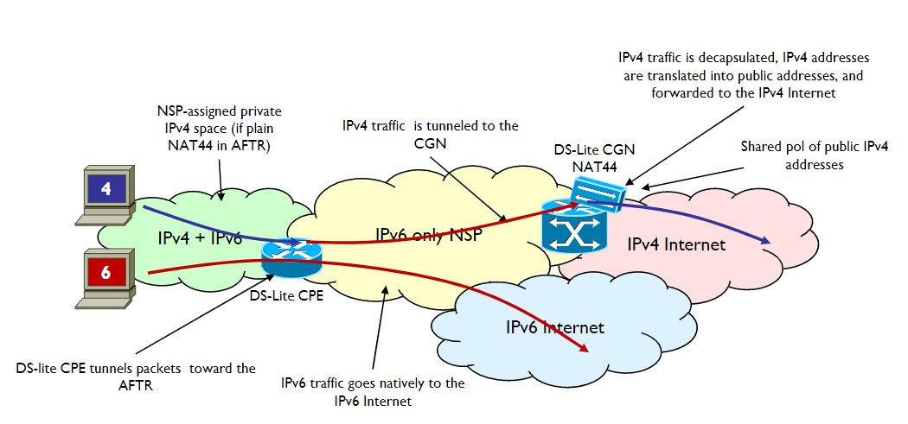{width=400px}

Permette di ridurre il numero di indirizzi IPV4 richiesti rispetto a un approccio dual stack (che aveva bisogno di un indirizzo pubblico per ogni host).

Il NAT esteso consente l'indirizzamento assegnato dal cliente (ovvero sovrapposto).

Le limitazioni sono però le seguenti:

- il customer non ha controllo sul NAT.
- problemi con il server, ad esempio static mapping e port forwarding non possono essere configurati.

### A+P (Address plus Port)

Il vantaggio di **A+P** è che il NAT è sotto il controllo dei customer. Una ulteriore caratteristica è che il range di TCP/UDP è assegnato a ciascun customer (solo le porte sono utilizzate dal nat in uscita).

Le features sono:

- nessun problema con la sovrapposizione degli indirizzi privati nello spazio di indirizzi dei customer.
- Le porte possono essere assegnate automaticamente al CPE utilizzando il Port Control Protocol (PCP), mentre il CPE può negoziare più porte in qualsiasi momento.
- AFTR è solo un tunnel terminator IPv4 in IPv6 (NAT44 non è più necessario in AFTR).

:::tip
**Nota**: Il concetto alla base è di spostare la complessità sulle foglie.
:::

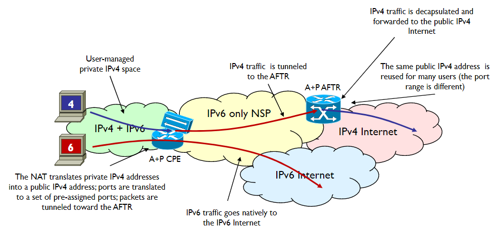{width=400px}

### Mapping Address and Port (MAP)

Il **Mapping Address and Port** (MAP) utilizza un approccio di tipo **stateless**. Questo sfrutta i vantaggi del DHCP e del DNS anche all'interno del sistema, non associando dei range di porte ma bensì dei set: un set si differenzia dal fatto che ci sono più porte che non sono necessariamente contigue. Inoltre, il CPE utilizza la stessa rete pubblica IPv4, così non da non avere limitazioni.

L'indirizzo e la porta del client IPv4 sono mappati in un unico indirizzo IPv6 (prefix routed dal CPE).

L'indirizzo del server pubblico IPv4 è anche questo mappato in un unico indirizzo IPv6 (prefix routed dal Border Relay).

Esistono due tipi di MAP:

- **MAP-E**: MAP with Encapsulation, ovvero i pacchetti IPv4 vengono tunnelizzati.
- **MAP-T**: MAP with Translation, i pacchetti IPv4 sono tradotti in pacchetti IPv6 e poi nuovamente in IPv4.

Quando però avviene la sostituzione di un header IPv6 con un header IPv4 è necessario fare attenzione a non perdere informazioni.

### Port Set

A ogni CPE viene assegnato un unico **PSID** (Port set Identifier) che identifica un set di porte e un indirizzo pubblico IPv4.

Per creare un set di porte si utilizzano 16 bit, composte da:

- A: identifica il dominio (ad esempio si assegna a un _CPE_ le porte con i bit che iniziano con 1100).
- PSID: identifica il set di porte (lunghezza variabile).
- j: insieme delle porte.

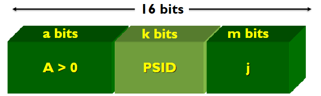{width=350px}

:::danger
**attenzione**: non porre i primi a bit a zero perché sennò diventa una well known port.
:::

L'embedded Address (EA) contiene i bit di PSID e parzialmente l'indirizzo IPv4 (che identifica univocamente il CPE).

### Mapping Rules

Le regole per il mapping sono:

- IPv6 prefix rule
- IPv4 prefix rule: prefisso IPv4 di un indirizzo IPv4 utilizzato da un determinato CPE.
- EA bits length

Inoltre, un offset PSID (valore di a) viene settato per l'intero dominio di mappatura.

Tramite queste informazioni il CPE si calcola l’indirizzo IPv6 da utilizzare nell’interfaccia esterna.

### Border Relay

L'indirizzo del border relay deve essere conosciuto da tutti i CPE, anche se più BR possono avere lo stesso indirizzo (anycasting).

Mentre nel MAP-E il BR termina il tunnel, nel MAP-T il BR è responsabile della traduzione degli indirizzi IPv4 verso l'esterno (sostituisco l'header IPv4 con un header IPv6). Il BR prefix viene advertised sul backbone (e potrebbe essere advertised da più BR).

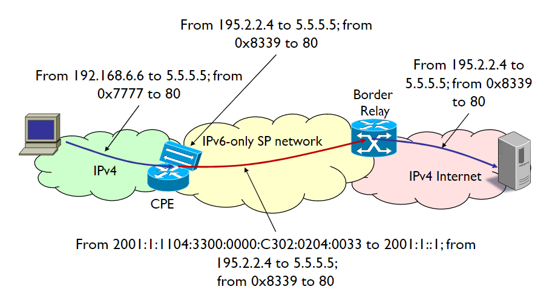{width=400px}

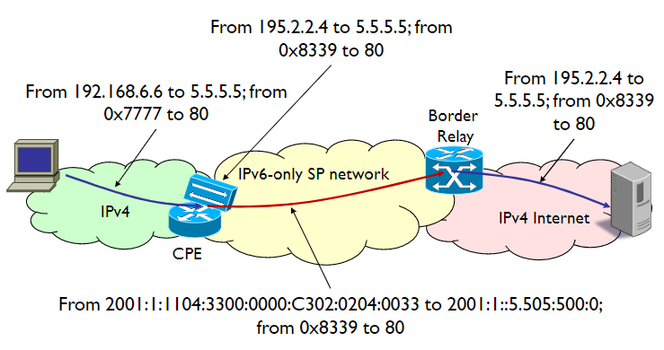{width=400px}

## NAT64 + DNS64

Il NAT64 è un meccanismo di transizione a IPv6 che facilità la comunicazione tra IPv4 ed IPv6 utilizzando il _Network Address Translation_ (NAT), che traduce indirizzi e pacchetti _IPv6_ in _IPv4_, prendendo un indirizzo/porta _Ipv4_ liberi dal pool e realizzando un NAT session entry.

Questa  tecnica  risolve  il  problema  della  **rete  IPv6  con  host  IPv6**  che  deve  comunicare  con  la  rete  pubblica IPv4. In questo caso, la soluzione è il NAT64 che rimuove l’header IPv6 per inserire l’header IPv4 ma per farlo viene utilizzato il DNS64.

Il vantaggio del MAP risiede nella possibilità di avere più CPE e maggiormente distribuite. Questa modalità rappresenta una forma semplificata, che può vedere il suo utilizzo su rete più piccole.

Un prefisso IPv4 è dedicato per mappare indirizzi IPv4, comprensivi di well-known che di network specific. Il DNS64 mappa un a record in AAAA utilizzando un prefix NAT64, entrambi vengono poi forniti al client. Il router NAT64 fa il advertise del prefix in una rete IPv5 per attirare il traffico verso gli host IPv4.

Il processo si divide nei seguenti passi:

1. Un host esegue una query DNS di tipo IPv6 AAAA.
2. DNS64 inoltra la query dal DNS autoritativo verso il dominio della richiesta.
3. Il DNS autoritativo (che si trova in una rete IPv4) non può ricevere la richiesta, per questo motivo viene ripetuta per un indirizzo IPv4 (necessaria rete IPv4+IPv6 intermedia).
4. DNS64 riceve poi l'indirizzo IPv4 che risolve il dominio, ne esegue l'embedding in un indirizzo IPv6 con un prefix di default `64:FF9B`.
5. L'indirizzo IPv6 viene restituito al host che ha fatto la richiesta.

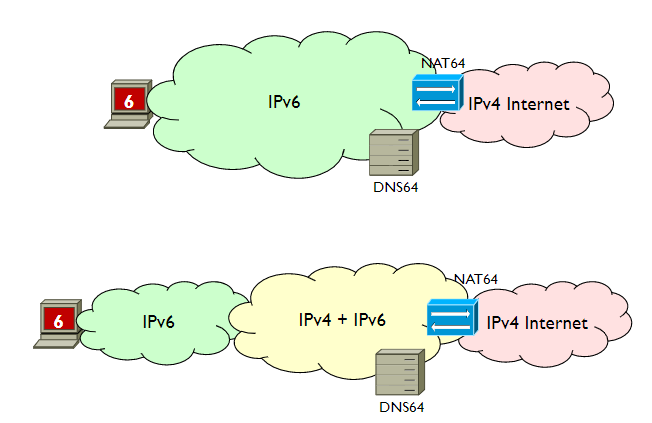{width=400px}

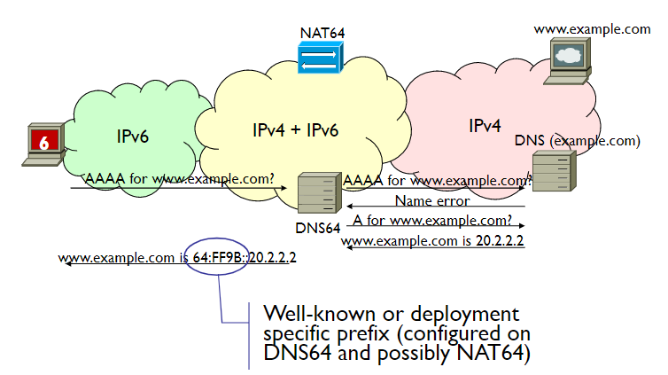{width=400px}

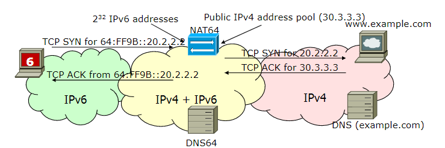{width=400px}

Le limitazioni dovute al NAT64 + DNS64 sono:

- Coinvolgimento del DNS (hostname)
- Non è possibile abilitare _DNSSEC_ (cioè la firma della risposta a un record DNS) perchè DNS64 modifica i record.
 
In particolare è possibile risolvere indirizzi soltanto quando a questi sono associati dei nomi, dunque funzionerebbe con `www.example.com` ma non con `1.2.3.4`.
