# Reti wireless e cellulari
<!-- lezione10: 25-10-2022 -->

## Introduzione

Le reti **wireless** permettono la comunicazione tra dispositivi senza la necessità di un cavo fisico. Queste sono molto comuni oggigiorno, e sono presenti in molti dispositivi come cellulari, tablet, computer portatili, router, dispositivi di rete e molti altri. Un aspetto molto importante che ne deriva è la **mobilità**, anche se una parte rilevante di ogni rete wireless è in realtà la sua componente wired (oltre al wireless link).

I componenti principali delle reti wireless sono:

- **Wireless host**: dispositivi che possono trasmettere e ricevere dati, possono essere stazionari o mobili.
- **Base station**: responsabili di inviare pacchetti tra la rete cablata e quella wireless nella propria aria. Tipicamente sono connessi alla rete via cavo (esempio torri di telefonia mobile e access point).
- **Wireless link**: collegamento tra host e base station, tipicamente utilizzato per connettere un wireless host a una base station oppure come _backbone link_. L'accesso è controllato da protocolli ad accesso coordinato multiplo.

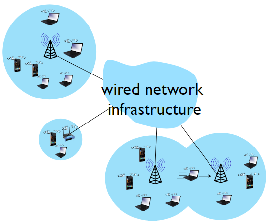{width=350px}

La rete cellulare può essere gestita mediante una infrastruttura attraverso cui le base stations connettono i wireless host alla rete cablata, con l'uso del **handoff** i wireless host cambiano la base station che fornisce una connessione alla rete cablata, oppure **ad hoc** in cui i wireless host si connettono direttamente tra di loro senza l'utilizzo di base station e organizzandosi autonomamente in una rete (i nodi trasmettono agli altri con un link coverage).

Nonostante i grandi vantaggi, iI link wireless comportano alcuni svantaggi rispetto a un link cablato:

- Maggiore **degrado** del segnale dovuto all'attenuazione del segnale.
- **Interferenza** tra i dispositivi a causa dell'utilizzo delle stesse frequenze.
- **Multipath propagation** (fading): effetto dovuto ai rimbalzi del segnale sugli ostacoli.
- le **comunicazioni** tra punti diventa più **complicata**.

Un'altra importante caratteristica è il **Signal to Noise Ratio** (SNR), che esprime la relazione tra il segnale ricevuto e il rumore ed indica la qualità del segnale, più è alto più è semplice estrarre il segnale dal rumore. Dato un livello fisico, aumentarne l'alimentazione comporta un aumento di SNR e una riduzione del _Bit Error Ratio_ (BER), mentre dato un SNR è necessario scegliere un livello fisico che rispetta i requisiti di BER in modo da ottenere il massimo throughput. Il valore di SNR può cambiare a causa della mobilità, adattandosi dinamicamente al livello fisico.

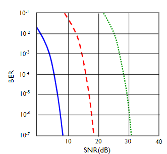{width=200px}

La modulazione è il processo attraverso cui viene inviato un bit. Vi sono varie tipologie come:

- quam256
- quam16
- bpsk

Un problema che ritroviamo all'interno delle reti wireless è inerente al problema del **nodo (o terminale) nascosto**: dati 3 nodi `a`, `b`, `c` se `b` comunica con entrambi i rimanenti, questi potrebbero però non essere a conoscenza della reciproca presenza e generare interferenze.

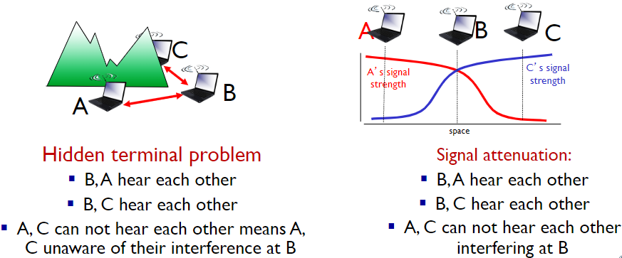{width=400px}

Inoltre le reti possono essere suddivise gerarchicamente, in particolare Una rete di primo livello (_Tier 1_ network in inglese) è una rete IP (tipicamente ma non necessariamente un _Internet Service Provider_) che si connette all'intera Internet soltanto attraverso un'interconnessione **non** regolata da contratto, conosciuta anche come peering (dunque non a pagamento).

## Wireless LAN

Nel corso degli anni lo standard 802.11 si è evoluto dando origine a vari standard, i quali utilizzano il protocollo _Carrier Sense Multiple Access_, **CSMA/CA**.

IEEE 802.11 standard | Year | Max data rate | Range | Frequency
---------------------|------|---------------|-------|-----------------------------
802.11b              | 1999 | 11 Mbps       | 30m   | 2.4 Ghz
802.11g              | 2003 | 54 Mbps       | 30m   | 2.4 Ghz
802.11n (WiFi 4)     | 2009 | 600           | 70m   | 2.4, 5 Ghz
802.11ac (WiFi 5)    | 2013 | 3.47Gpbs      | 70m   | 5 Ghz
802.11ax (WiFi 6)    | 2021 | 14 Gbps       | 70m   | 2.4, 5 Ghz
802.11af             | 2014 | 35 – 560 Mbps | 1 Km  | unused TV bands (54-790 MHz)
802.11ah             | 2017 | 347Mbps       | 1 Km  | 900 Mhz

Nelle reti wireless un wireless host comunica con una base station, ovvero un _access point_ (AP).

Un **BSS** _(Basic Service Set)_, ovvero una cella, se in modalità infrastruttura contiene un host wireless e una base station, mentre in modalità ad hoc solamente l'host.

Ogni rete wifi lavora su un canale differente ed è in grado di gestire fino a 16 frequenze (di cui utilizza solo una alla volta) per la trasmissione dei dati, con la possibilità che ci sia interferenza se il canale viene scelto male. La configurazione può essere automatica o manuale.

Ogni host che vuole connettersi esegue prima una scansione delle reti e rimane poi in attesa di un **beacon frame**: un frame speciale inviato dagli access point per effettuare la connessione contenente il nome dell'access point (SSID) e il MAC address. Il dispositivo si connetterà al beacon frame più forte in modo da aumentare la qualità della connessione. Per poter iniziare a dialogare con la rete wifi potrebbe essere richiesta una autenticazione, a cui segue tipicamente una richiesta DHCP per recuperare l'indirizzo IP nella subnet del AP.

Esistono due tipologie di scanning eseguite da un host che si connette a una rete:

- **Passive scanning**:
  1. il beacon frame viene inviato dagli access point all'host.
  2. l'host manda una richiesta di associazione all'access point scelto.
  3. l'access point conferma l'associazione mediante un _association response_ verso l'host.
- **Active scanning**: l'host richiede il beacon frame all'access point, in 4 fasi che si dividono in:
  1. **probe request** dal host.
  2. **probe response** dagli APs.
  3. **association request** dal host verso l'access point scelto.
  4. **association response** dal APs in questione.

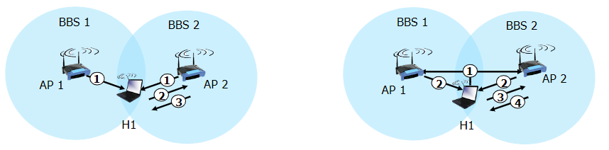{width=400px}

### CSMA/CA

L'accesso di multipli dispositivi su un canale wireless è un problema molto complesso, che prevede l'utilizzo di **CSMA** per l'eliminazione delle collisioni tra due o più nodi che trasmettono contemporaneamente.

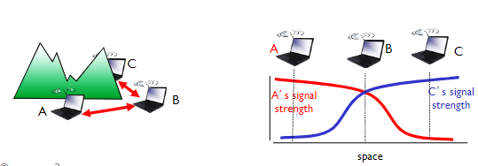{width=400px}

Mentre in ethernet viene utilizzato _CSMA/CD_ (collision detection), in wireless viene utilizzato **CSMA/CA** (collision avoidance) con lo scopo di eseguire _sense before trasmitting_, in modo di evitare le collisioni con la trasmissione già in corso di altri nodi.

Il funzionamento è il seguente:

- Il dispositivo che invia:
  1. Se il canale è in idle per **DIFS** tempo, allora il dispositivo inizia a trasmettere (no CD).
  2. Se il canale è occupato, viene avviato un _random backoff time_ che lo pone in attesa prima del nuovo tentativo. Se anche al nuovo tentativo il canale è occupato, il dispositivo ripete il processo aumentando il _random backoff interval_.

- Il dispositivo che riceve:
  1. Se il frame è ricevuto correttamente, viene inviato un ACK frame dopo **SIFS** tempo (necessario per evitare il problema del terminale nascosto).

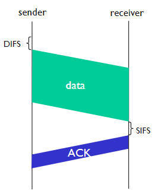{width=200px}

Il _Collision Avoidance_ mostrato sopra non è però deterministico, per riuscire a renderlo tale è possibile utilizzare un sistema di "prenotazione" che riserva il canale per i data frame usando dei pacchetti di "prenotazione" (RTS/CTS) caratterizzati da trame piccole. Questi possono ancora collidere, ma sono molto più piccoli e quindi meno dannosi. Il pacchetto **RTS** _(ready to send) viene inviato dal dispositivo che vuole trasmettere, mentre **CTS** (clear to send) viene inviato dal dispositivo che ha ricevuto il pacchetto RTS verso tutti i dispositivi in ascolto in modo da far partire la trasmissione da chi deve trasmettere e porre in attesa i rimanenti.

{width=300px}

#### Frame addressing

Il frame contiene:

- frame control
- duration
- address 1: mac address del host wireless o Access Point che deve ricevere il frame
- address 2: MAC address del host wireless o Access Point che deve trasmettere il frame
- address 3: MAC address dell'interfaccia del router a cui l'access point è connesso
- seq control: necessari per gli ack
- address 4: usato solo in modalità ad hoc
- payload
- crc: controllo di errore

Dentro frame control troviamo ulteriori campi, tra cui ad esempio:

- protocol version
- tipo (RTS, CTS, ACK, data)
- sottotipo
- bit per il power management

#### Mobilità nella stessa sottorete

Solitamente per le reti wireless l'host rimane all'interno della stessa _subnet IP_, motivo per cui è possibile riutilizzare lo stesso indirizzo.

Spesso gli switch sono _self learning_, ovvero quando vedono un frame transitare verso un host ne memorizzano la porta a cui è stato inviato.

Dal punto di vista energetico, esiste il **node-to-AP** attraverso il quale l'Access Point viene a conoscenza del fatto che non deve inoltrare i frame al nodo, il quale si sveglierà prima del prossimo beacon frame (ha al suo interno la lista dei dispositive con gli AP-to-mobile frames in attesa di essere inviati).

## Reti cellulari

Le **reti cellulari** sono reti wireless che coprono aree geografiche molto vaste attraverso la definizione di zone adiacenti denominate **celle**. A differenza di altre reti, gli host si muovono anche attraverso lunghe distanza e diventa importante non far disconnettere l'utente attraverso la gestione della mobilità denominata **handover**.

La copertura cellulare è garantita mediante reti _isotopiche_ e antenne direzionali da 120 gradi e posizionate a un estremo della cella. La forma non è esattamente esagonale e l'emissione non è _omni direzionale_ a causa della presenza di ostacoli (montagne, edifici), altezza, il guadagno dell'antenna, la morfologia del territorio, la potenza dell'antenna e infine le condizioni di propagazione (atmosferici _ecc..._).

{width=300px}

Le celle si dividono in **macrocelle** e **microcelle** in base alle loro dimensioni e di conseguenza alla copertura.

Come nelle reti wireless, è nuovamente presente il problema di accesso multiplo condiviso sul canale, che viene risolto attraverso varie tecniche:

- **FDMA**: viene scelto una frequenza in cui trasmettere.
- **TDMA**: viene scelto uno slot temporale in cui trasmettere.
- **CDMA**: viene assegnato a ogni stazione un codice _ortogonale_ agli altri, ovvero un gruppo di segnali da cui è possibile recuperare ogni singolo segnale.
- **SDMA**: ogni frequenza viene riutilizzata, a condizione che i luoghi siano fisicamente molto distanti tra loro.

Verrano riutilizzate le stesse frequenze in posti diversi in modo da non causare interferenze. Questo viene fatto a causa del ridotto numero di risorse, nel tentativo di coprire un'area più ampia e servire un maggior numero di utenti.

:::definition
**Definizione**: Si definisce **handover** la gestione della mobilità di un dispositivo su una rete cellulare e il conseguente funzionamento di sgancio e riaggancio tra le celle. E' valido **se e solo se** la comunicazione è **attiva**.
:::

### Cluster

Un gruppo di celle viene definito **cluster**, come nell'esempio in figura.

{width=300px}

Le celle _verdi_, _rosa_ e _blu_ usano un set differente di canali. Le celle dello stesso colore sono chiamate **"co-channel" cells**.

Con la variazione della dimensione delle celle _R_ cambia la capacità, ovvero il numero di utenti che questa è in grado di soddisfare. Il numero di celle _G_ impatta invece sul costo, in quanto un numero maggiore di celle ha dei costi maggiori. Aumentando il cluster aumento la qualità, aumentando anche _G_ aumenta la qualità ma diminuisce la capacità.

Fissando _G_, se si diminuisce il  raggio  _R_  delle  celle  si  guadagna  in  capacità  ma aumentano  anche  i  costi.  Se si diminuisce  il  raggio,  oltre  che  i  costi  possono  aumentare  anche  le interferenze perché le _co-channel cells_ saranno molto più vicine.

Fissando _R_ e facendo variare _G_ si nota che, aumentando il numero G del cluster diminuisce il numero di canali per cella e dunque la capacità decresce ma aumenta la distanza tra le co-channel cells e dunque le interferenze sono minori comportando un aumento di qualità.

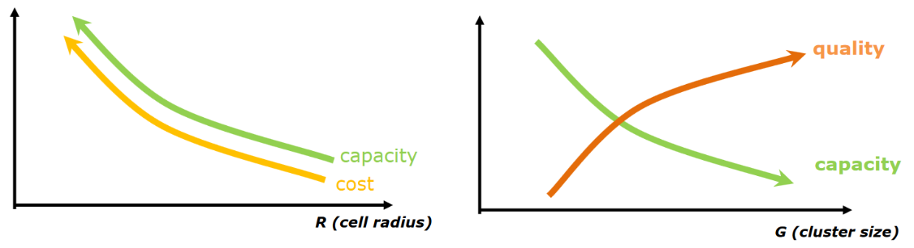{width=400px}

Non esiste una legge assoluta per definire i due parametri, ma è possibile sfruttare alcune tecniche per diminuire le interferenze ed aumentare la capacità:

- **splitting**: non utilizzare celle delle stesse dimensioni, ma basarsi sulle necessità specifiche.
- **sectoring**: utilizzare delle antenne non omnidirezionali per ridurre le interferenze e ridurre solo nelle direzioni in cui non è necessario.
- **tilting**: non usare un angolo a 90 gradi per la trasmissione 8cercando di variare l'angolo).
- **Creazione di femptocelle**: possiamo creare delle celle non fisse in base alle necessità (esempio stadio o concerti).

{width=250px}

Inoltre è possibile utilizzare antenne direzionali per avere celle con dimensioni e forme ad-hoc, oppure adoperare una copertura multi livello (umbrella coverage) o infine utilizzare microcelle che seguano l'utente dove si muove.

{width=250px}

Altri esempi sono possibile tenendo conto di strade oppure ferrovie, dove le celle cercano di seguire la forma della strada.

{width=250px}

### Power Control

Il **Power Control** mira al gestire al meglio le capacità delle batterie con l'obbiettivo è di ridurre l'utilizzo di potenza in base alle necessità e in relazione alla qualità di trasmissione e alla distanza tra cellulare e antenna. Per effettuare la regolazione della potenza necessaria si utilizzano strategie di due tipi:

- **a catena aperta** _(open loop)_: sistema senza reazione
- **a catena chiusa** _(closed loop)_: sistema con reazione _(feedback)_

In particolare in _uplink_ (da terminale a ripetitore) si utilizzano le seguenti strategie:

- _closed loop power control_
- _open loop power control_
- _outer loop power control_

Mentre in _downlink_ (da ripetitore a terminale) si utilizza:

- Downlink power control

#### Open loop

Nella strategia **open loop** per l'_uplink_ il sistema, non avendo a disposizione un feedback, analizza e misura la qualità del segnale ricevuto (da ripetitore a terminale, downlink) per valutare se aumentare o diminuire la potenza di trasmissione. Questo adattamento non è preciso e non è detto che ciò che succede su una frequenza sia uguale a un'altra. Non è molto accurato in quanto solitamente uplink e downlink trasmettono su canali differenti, dunque la qualità potrebbe essere differente.

Solitamente si divide in due fasi:

- l'utente misura la qualità del segnale che riceve dalla base station.
- l'utente utilizza poi un algoritmo per impostare la potenza di trasmissione in modo che la SINR _(Signal-to-interference-plus-noise ratio)_ sia sopra una certa soglia.

In questa modalità il terminale _"si regola autonomamente"_ sulla potenza di trasmissione.

### Allocazione della frequenza

L'allocazione delle frequenze possono avvenire nei seguenti modi:

- **Fixed Channel Allocation** _(FCA)_: Basato sul concetto di cluster, le frequenze sono assegnate staticamente e vengono modificate raramente per aumentare performance e adattare piccole variazioni sull'utilizzo del traffico dell'utente.
- **Dynamic Channel Allocation** _(DCA)_: Le risorse sono assegnate da un controller centrale, quando necessarie. Il frequency plan varia nel tempo in modo da adattarsi allo stato del sistema.
- **Hybrid Channel allocation Scheme** _(HCS)_: Una porzione è allocata staticamente (FCA) mentre una dinamicamente (DCA)

### Architettura di rete

Le reti sono costituite da _mobile terminal_ (MT) che si connettono a delle _base station_ (BS) radio che a loro volta si connettono a dei core network attraverso Switch Router (commutatori a pacchetto o circuito). I core network sono costituiti da un set di server che si occupano di gestire le connessioni e le risorse, in modalità cablata _(wired)_. Il _database_ viene utilizzato per memorizzare le informazioni degli utenti.

{width=400px}

Il processo di **registrazione** permette a un terminale mobile di connettersi alla rete attraverso una registrazione che lo identifica e autentica. La procedura avviene periodicamente ogni volta che si deve accedere al servizio, oppure quando il terminale si accende e deve associarsi alla rete.

Un altra procedura è quella del **Mobility Management**, utilizzata per gestire la mobilità e che a sua volta utilizza le seguenti procedure:

- Roaming
- Location updating
- Paging
- Handover

#### Roaming

Il **roaming** è la capacità di un terminale di essere tracciabile quando si sposta nella rete. Il sistema deve memorizzare la posizione in un database e localizzare l'utente quando necessario. Per salvare tali informazioni, la rete viene divisa in location areas (LAs), ovvero gruppi di celle adiacenti ciascuna con un identificativo univoco.

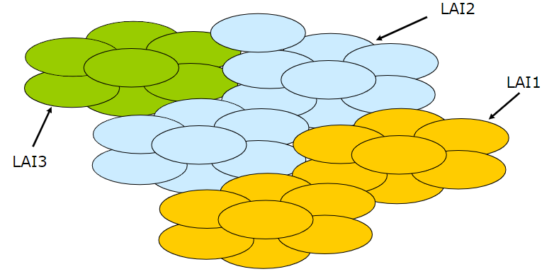{width=300px}

#### Location updating

Il location updating è la procedura che avviene ogni volta che un utente si sposta verso un'altra location area.

Periodicamente l'utente deve comunicare la sua posizione alla rete, in modo da essere tracciato. Questa procedura è necessaria per mantenere aggiornate le informazioni sul database.

#### Paging

Il **Paging** è la procedura attraverso la quale il sistema notifica un terminale mobile di una chiamata o data delivery.

Il sistema manda la richiesta in broadcast a tutti i terminali della location area, e il terminale che riceve la richiesta risponde con un messaggio di conferma.

#### Handover

La procedura di **Handover** abilita il trasferimento di una **connessione attiva** da una cella verso un'altra, mentre il terminale mobile si sposta nella rete. Questa procedura è molto complessa e richiede una rete ben architettata, con protocolli e segnali adeguati.

Si classifica nei seguenti tipi:

- **Intra vs. Inter Cell**: Indica se l'handover avviene tra frequenze all'interno della stessa cella o di celle diverse.
- **Soft vs. Hard**: Indica se durante l'handover sono attivi entrambi i canali radio (soft) o solo uno alla volta è attivo (hard).
- **MT vs. BS initiated**: Indica se il primo messaggio di controllo per l'avvio di un handover è inviato dal terminale mobile (MT initiated) o dalla BS (BS initiated), ovvero quale entità esegue le misure per capire dove e quando deve essere eseguito un handover.
- **Backward vs. Forward**: Indica se la segnalazione di handover avviene tramite la BS di origine (backward) o la BS di destinazione (forwarding).

:::danger
La connessione **deve essere attiva**!
:::

## Evoluzione della rete cellulare
<!-- lezione11: 26-10-2022 -->

Nel corso degli ultimi anni la rete cellulare ha subito una serie di evoluzioni che hanno portato ad una maggiore capacità di trasmissione e ad una maggiore efficienza energetica.

La prima generazione **GSM** era di tipo analogico, con ampio utilizzo di _FDMA_ e trasportava traffico esclusivamente voce. La qualità del segnale era bassa e l'efficienza nel riutilizzo della frequenza era scarsa.

La seconda generazione ha comportato il passaggio al digitale, con il vantaggio in termini di servizi (sms), crittografia e voice coding avanzato per ridurre la banda necessaria. La seconda generazione estesa, **2.5G**, caratterizzata da **GPRS/EDGE** in europa e IS-95B in USA, vede l'introduzione del servizio dati con packet switched, 170kb/s in GPRS e 384kb/s in EDGE. Si ha il passaggio a tariffe basate sul traffico e non più sul tempo.

La terza generazione, **3G**, ha comportato dei miglioramenti in termini di data service (multimedia service), l'introduzione di  CDMA e l'avvento di UMTS e CDMA2000. Il rate dati ha raggiunto i 2Mb/s ed possibile l'handover tra reti differenti oltre alla exploit spatial diversity. La generazione **3.5G** ha comportato una evoluzione di **UMTS** soprattutto sul livello fisico, con miglioramenti del trasferimento dati fino a 56Mb/s in download e 22Mb/s in upload.

La quarta generazione, conosciuta come **LTE**, ha raggiunto un rate di 250Mb/s. Utilizza MIMO (multiple input multiple output) che consentono performance di modulazione più elevate. Per la prima volta abbiamo una rete completamente IP con l'introduzione di VoLTE per consentire il passaggio della voce sulla rete dati.

La quinta generazione, il **5G**, ha lo scopo di unificare le tecnologie di accesso wireless rimuovendo la differenza tra rete wireless e cellulare, attraverso mmWave che consentono trasmissioni ad alto throughput. Introduce il **NFV** (network function virtualization) che permette di virtualizzare le funzioni di rete, come il routing, il firewall, il load balancing, il caching, il DPI (deep packet inspection) e il DDoS (distributed denial of service) protection. Inoltre, anche il **SDN** (software defined networking) permette di virtualizzare il controllo della rete consentendo di utilizzare un hardware general purpose.

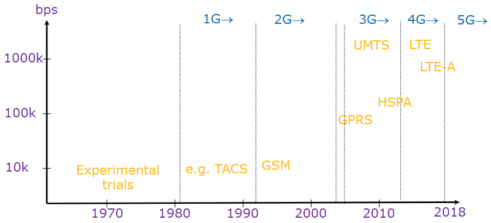{width=350px}

### GSM - Seconda generazione

Il GSM è una rete con full rate di 13 kbit/s e half rate di 6.5Kbit/s. Consente l'invio di SMS e servizi supplementari come call forward, recall, e busy tone.

{width=400px}

I **Mobile Station** (MS), ovvero i dispositivi, sono quelli in grado di connettersi alla rete GSM (come telefoni, antenne dei veicoli) ed hanno differenti potenze di trasmissione all'antenna:

- fino a 2W per i telefoni
- fino a 8W per dispositivi mobili
- fino a 20W per le antenne dei veicoli

La MS è però unicamente hardware, per connettersi alla rete è necessaria una SIM, ovvero una smart card con un processore e una memoria in grado di memorizzare, crittografate, le informazioni dell'utente come il numero di telefono, i servizi accessibili, parametri di sicurezza _ecc_. L'identificativo univoco della SIM si chiama **MSI**.

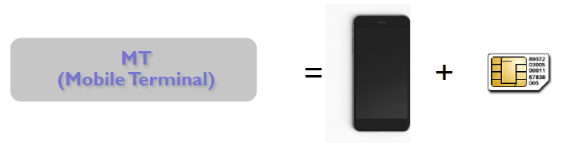{width=400px}

#### Base Station Subsystem

La **Base Station Subsystem** (BSS) comprende:

- **Base Transceiver Station** (BTS): interfaccia fisica con il compito di trasmettere e ricevere. Rappresenta il _punto d'accesso_ per i dispositivi e a differenza di altri sorgenti di segnale (ad esempio radio e TV) trasmette segnale solo verso gli utenti attivi. Arriva fino a 32 canali FDM per BTS.
- **Base station controller** (BSC): gestisce il controllo delle risorse sull'interfaccia radio

I BSC e i BTS comunicano mediante un collegamento cablato. Un _BSC_ **controlla un alto numero** di _BTS_ _(da decine a centinaia)_. Tipicamente, i _BSC_ sono collocati con un MSC (Mobile Switching Center, ovvero switch a circuito per la creazione di un circuito _end-to-end_), invece di essere allocate vicino ai BTS.

Le funzionalità principali dei BSC comprendono:

- Eseguire il transcoding vocale a 13 kb/s / 64 kb/s
- Eseguire il paging
- Misurazione della qualità del segnale
- Gestione dell'handover tra BTS controllati dallo stesso BSC

#### Network and Switching Subsystem

Il **network and switching subsystem** _(NSS)_ ha il compito di gestire le chiamate, il service support, mobility support e l'autenticazione.

{width=400px}

E' composto da:

- **MSC**: _mobile switching center_, ha il compito di gestire la mobility support, call routing tra _MT_ e _GSMC_ _(ovvero l'interfaccia tra GSM e le altre reti)_.
- **HLR**: _home location register_, si occupa di salvare le informazioni degli utenti nel database (anche permanenti come id, servizi abilitati, parametri di sicurezza) e dati dinamici per la gestione della user mobility (VLE identifier).
- **VLR**: _visitor location register_, salva nel database le informazioni relative a dove si trova il dispositivo (MT) attualmente nell'area controllata dal MSC _(come id, stato on/of, LAI, informazioni di routing e sicurezza)_.
- **AUC**: authentication center, si occupa della autenticazione basata su un protocollo di tipo _challenge & response_ con generazione di chiave crittografiche per comunicazioni _over-the-air_.
- **EIR**: _Equipment Identity Register_, memorizza le informazioni dei dispositivi rubati.

#### Canali fisici

Le frequenze utilizzate per il GSM sono: 859, 900 1800, 1900 MHz, variano in base allo scopo (ricezione o trasmissione) e funzionano attraverso il sistema **FDD** _(frequency division duplex)_.

I canali GSM sono composti da una frequenza e uno slot, che identificano un canale fisico. Le trasmissioni sono organizzate in **burst** (da non confondere con pacchetti), ovvero blocchi di dati trasmessi su canali fisici. Sono simili ai pacchetti, ma funzionano su switching a circuito. La velocità di trasmissione è di 272 kbit/s. I canali possono essere acceduti con FDMA o TDMA mentre le frequenze sono divise in **FDM channels** (ciascuno largo 200kHz), che a loro volta sono divisi in **TDM frames** composti da 8 slot _(ciascuno dalla durata di 0.577ms per un totale di 4.615ms)_.

:::note
**Nota**: Data una frequenza è uno time slot è possibile identificare un canale fisico, dunque $\text{frequenza} + \text{slot di tempo} = \text{canale fisico}$
:::

{width=400px}

Il _GSM_ non prevede una trasmissione simultanea (non è full duplex), per limitare i costi è presente un unico transceiver che consente la sola ricezione o trasmissione. Ogni _MT_ trasmette per un _time slot_ un _burst di dati_ e rimane silenzioso per i rimanenti 7 slot. I frame su UL e DL  sono sincronizzati in base ai time slot e shiftati di 3 slot.

{width=400px}

I tempi di propagazioni però non sono nulli, per cui possono nascere problemi nella struttura degli slot in quanto i burst trasmessi dai MT potrebbero arrivare al BTS quando lo slot è già finito, causando anche la possibilità di collisioni. La soluzione utilizzata è la **timing advance**: la trasmissione del MT comincia prima del reale inizio del timeslot. a inizio e fine burst sono presenti dei "bit di guardia" che permettono di sincronizzare i burst.

{width=350px}

Analizzando più nel dettaglio la struttura di un burst, notiamo come questo è caratterizzato dai bit di guardia, il coded data e infine lo stealing bit, il quale viene utilizzato per comunicare all'utente informazioni importanti.

{width=400px}

I canali fisici del GSM sono composti da 8 canali, con timeslot da 0 a 7, mentre i canali logici mantengono le informazioni e specificano "cosa" è trasmesso. Sono mappati nel livello fisico in accordo a determinati criteri. I canali logici si dividono in **control channels**, i quali trasportano le informazioni di controllo (relative all'utente o alla rete), e traffic channels che trasportano le informazioni dell'utente.

### 4G/LTE - quarta generazione

Una delle caratteristiche di **LTE** è l'utilizzo del **FDMA** al posto del _CDMA_, che era stato pensato per gestire in modo efficiente il _fading_ e sembrava essere una tecnologia migliore per il trasferimento dei dati. Il _CDMA_ è però difficile da mantenere in termini tecnologici a causa del rapporto costi/benefici, oltre a essersi rivelato non sufficientemente buono. _FDMA_ è un _FDM_ con frequenze portanti più vicine e ortogonali (è possibile sovrapporre lo spettro) in modo da non generale interferenze.

Abbiamo una diffusione dei MIMO e il livello fisico è stato migliorato per arrivare ad downlink di 300Mb/s e uplink da 50Mb/s.

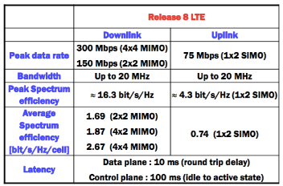{width=250px}

In LTE  _WCDMA_ è stato sostituito con **OFDMA** in downlink e **SC-FDM** uplink.

Le frequenze utilizzate sono differenti al variare della distanza:

- **2600MHz** utilizzata per massimizzare la capacità in aree urbane.
- **1800MHz** alta capacita ma limitata interferenza.
- **800MHz** alta coperture e alta interferenza, per esempio nelle aree rurali.

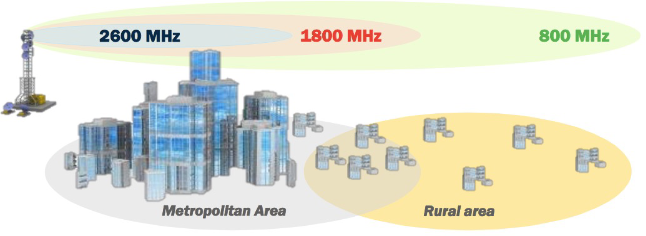{width=300px}

Prende il nome di downlink (DL) la parte della rete che trasmette dati dal BTS al MT, mentre uplink (UL) è la parte che trasmette dati dal MT al BTS.

In LTE è presente una separazione tra il piano controllo e il piano utente:

- **user plane**: comprende tutte le operazioni legate al trasporto dei dati degli utenti in DL o UL _(access stratum)_.
- **control plane**: comprende tutte le operazioni legate al setup, controllo e mantenimento delle comunicazioni tra utente e la rete _(non access stratum)_.

La **Radio Access Network** (RAN), la quale include tutti i dispositivi che interagiscono con i dispositivi utente, prende il nome di **E-UTRAN** mentre il **Core Network**, che include tutti i dispositivi responsabili del trasporto da/a internet verso gli utenti, viene denominato **EPC**.

:::note
Le _Base Station_ prendono il nome di **eNodeB**.
:::

#### Architettura di LTE

A differenza del GSM che utilizzava i _burst_, in LTE vengono utilizzati veri e propri pacchetti. La connessione alla rete avviene attraverso un **MME setup**, ovvero la configurazione di un _home tunnel_ dalla rete di casa a quella dell'operatore.

Come mostrato nella figura di seguito, la rete si divide in **Long Term Evolution** (Access Network), ovvero E-UTRAN, ed **Evolved Packet Core** (core network) con l'acronimo di **EPC**, che rappresenta il cuore della rete e comprende tutti i nodi che forniscono funzioni di gestione della mobilità, autenticazione, session management, QoS e bearers configuration.

{width=400px}

##### EPC

L'approccio adottato per **EPC** è di tipo _clean state design_, ovvero ripensato completamente da zero.

Adopera il **packet switching transport** per il traffico appartenente a tutte le classi QoS comprendente di conversazione, streaming, dirette, non in tempo reale e in background.

Viene utilizzato il **Radio resource management** per: end-to-end QoS, trasporto verso i livelli più alti, load sharing/balancing, policy management/enforcement tra differenti accessi a tecnologie radio.

Sono presenti integrazioni con le reti già esistenti 3GPP, 2G e 3G.

Le funzioni principali di EPC sono:

- **Network access control**: include network selection, authentication, authorization, admission control, policy e charge enforcement e infine lawful interception.
- **Routing** e **trasferimento** di pacchetti.
- **Sicurezza**: include cifratura, integrity protection e network interface physical link protection.
- **Gestione della mobilità** per tenere traccia della posizione corrente all'interno del User Equipment (UE).
- **Radio resource management** per assegnare, riassegnare e rilasciare le risorse radio prese dalle singole o multiple celle.
- **Gestione della rete** per operazioni di manutenzione.
- Funzionalità di **networking IP** per le connessioni di eNodeB, condivisione di E-UTRAN, supporto in condizioni di emergenza e altre.

Le principali componenti sono:

- **Mobility Management Entity** _(MME)_: si trova all'interno del control plane, supporta equipment context, identity, authentication e authorization. Perlopiù esegue procedure di tipo _Non Access Stratum_ che si dividono prevalentemente in funzioni relative al bearer management e funzioni relative alla connessione e alla gestione della mobilità.
- **Serving Gateway** _(SGW)_: si trova all'interno del User Plane, riceve e invia i pacchetti tra gli eNodeB e la core network. Esegue il packet routing e forwarding tra gli EPC, oltre al lawful intercept. E' uno dei punti chiave per la _intra LTE-mobility_.
- **Packet Data Network Gateway** _(PGW)_: si trova all'interno del _user plane_, connette l'EPC con le reti esterne/internet ed esegue operazioni di assegnamento UE IP, user packet filtering e servizi di NAT. E' uno dei punti chiave per l'accesso di reti _non 3GPP_.
- **Home Subscriber Server** _(HSS)_: database di informazioni relative all'utente  e agli iscritti. Viene utilizzato, insieme al _MME_, per l'autorizzazione. Funziona in modo simile al _HLR_ dell'architettura _GSM_.

:::danger
Nelle reti LTE, i pacchetti vengono indirizzati da/verso la access network dal _Serving Gateway_ (SGW).
:::

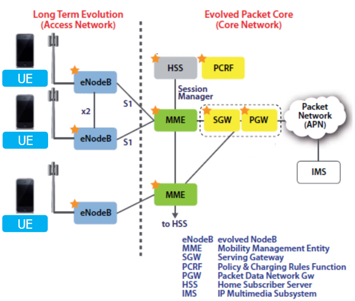{width=300px}

##### Bearers

Tutte le comunicazioni sono gestite attraverso dei "tunnel" denominati **bearers**, situati tra il _PGW_ e _SGW_ che e a loro volta sono connessi a un ulteriore tunnel che parte dal _SGW_ e arriva alla base station, e ancora tra user agent ed eNodeB. All'interno della rete i tunnel possono essere creati per soddisfare dei requisiti in termini di qualità del servizio, creando bearer dedicati a servizi specifici. E' presente un bearer default che stabilisce una connessione con il _PGW_ quando un UE è attivato.

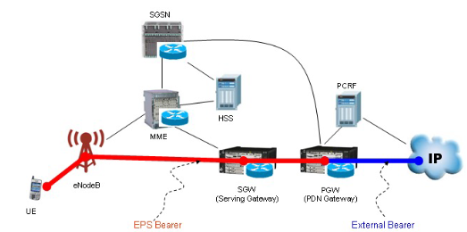{width=300px}

Esistono tre differenti tipologie di bearer:

- **S5 bearer**, connette SGW con PGW _(può estendersi da P-GW al Internet)_.
- **S1 bearer**, connette eNodeB con SGW. Il meccanismo di handover stabilisce un nuovo S1 bearer per le connessioni end-to-end.
- **Radio bearer**, connette UE e eNodeB. Questa tipologie segue l'utente in movimento in direzione del MME in quanto la radio esegue degli handover quando l'utente si muova da una cella all'altra.

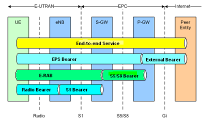{width=300px}

#### E-UTRAN

La E-UTRAN consiste principalmente di eNodeB con un interfaccia X2 per connettere gli eNodeB (due tipologie: X2 control e X2 user).

Le funzioni principali sono:

- **Gestione delle risorse radio** come radio bearer control, radio mobility control, scheduling ed allocazione dinamica delle risorse radio per uplink e downlink.
- **Compressione** (senza perdita) **degli header**.
- Sicurezza.
- **connettività** verso EPC.

#### Data Plane e Control Plane

In LTE avviene una separazione netta tra il **Control Plane** e il **Data Plane**.

Il **Control Plane** introduce nuovi protocolli per la gestione della mobilità, sicurezza e autenticazione.

Il **Data Plane**, analogamente, vede l'introduzione di nuovi protocolli al livello di data link (2) e fisico (1). Inoltre, è presente un uso esteso di tunnel per facilitare la mobilità.

{width=400px}

A livello 3 è utilizzato IP mentre a quello _data link_ (2) sono presenti tre sottolivelli:

- **medium access**: equivalente del sottolivello mac, si occupa dell'accesso al canale
- **Radio Link Control** _(RLC)_: si occupa della frammentazione e assemblaggio dei dati. Offre un _reliable data transfer_, ovvero si assicura che la comunicazione avvenga con successo.
- **Packet data convergence**: compressione dell'header e della cifratura.

Il livello fisico è gestito attraverso **OFDM** _(Orthogonal Frequency Division Multiplexing)_, ovvero tante frequenze ortogonali che minimizzano l'interferenza tra i canali. Inoltre, sono definiti degli slot TDM (non diversamente dalla gestione del canale link wireless su GSM).

Il **downstream channel** (canale di scaricamento) utilizza **FDM**, TDM within frequency channel (OFDM - orthogonal frequency division multiplexing).

Per **upstream** si utilizza FDM, TDM similar to OFDM. Ciascun dispositivo attivo alloca uno o più slot di 0,5 ms su 12 frequenze. L'algoritmo di scheduling non è standardizzato, ma è lasciato all'operatore. E' possibile raggiungere fino a 100 Mbps per dispositivo.

Qui abbiamo tanti piccoli slot che devono essere assegnati dalla rete in modo dinamico, in modo da adattarsi a quello che deve essere inviato in modo efficiente.

I bit trasmessi sono inseriti all'interno di un frame che ha una struttura suddivisa in modo predefinito denominata _Physical channels_. Ciascun channel ha informazioni specifiche relative a user data, tx/rx parameters, eNB identity, network control e molto altro, oltre al format del canale stesso. Ciascun canale fisico è mappato in una porzione di un subframe LTE. I canali fisici sono divisi in downlink e uplink channels, ciascun u/d channel è ulteriormente diviso in data e control.

<!-- slide 113/114/115 volate -->

In uplink è possibile utilizzare gruppi di 3 TTIs per aumentare la performance e ridurre l'overhead dei livelli superiori..

La tecnologia tunneling utilizzata per le reti cellulari si chiama **GPRS Tunneling Protocol**, ovvero tunnel realizzati su UDP.

#### Step di associazione

Un nodo per associarsi a una base station deve eseguire vari step:

1. Ogni 5ms la _base station_ invia su tutte le frequenze un _broadcast primary synch signal_.
2. Il dispositivo riceve il _primary sync signal_ e manda un secondo _synch signal_ alla medesima frequenza. In questo modo si trovano le informazioni dalla base station come la bandwith del canale, la configurazione, cellular carrier info etc.
3. Il dispositivo sceglie il BS a cui associarsi.
4. inizia il processo di autenticazione e set up data plane.

## Modalità di sleep

I terminali possono andare in _sleep mode_ in modo da risparmiare energia. Le modalità di sleep sono:

- **light sleep**: ogni 100ms il dispositivo si sveglia per controllare se ci sono messaggi da inviare o ricevere, se non ci sono messaggi torna a _dormire_.
- **deep sleep**: dopo 5 o 10 secondi di inattività, il dispositivo si mette in deep sleep. In questo modo si risparmia molto più energia. Si da per scontato che l'utente debba ripartire da zero in quanto  anche la cella potrebbe essere cambiata.

### 5G - quinta generazione

L'obbiettivo del **5G** è **superare la differenza tra rete cellulare e wifi**, in modo di raggiungere un'alta mobilità sui dispositivi. Per riuscire a fornire i nuovi servizi saranno necessari, oltre al miglioramento della rete, una integrazione di risorse di rete, potenza di calcolo e archiviazione. Per ottenere ciò è necessario dislocare le varie risorse e di effettuare _"networks slices"_, porzioni di risorse riservate a una certa comunicazione che consentano di emulare ciò che faceva il "circuito" (ovvero qualità). Per fare ciò è richiesto l'utilizzo del **SDN** (virtualizzazione della rete).

Per gestire tutte le risorse in modo flessibile e dinamico viene utilizzato un _"orchestratore di rete"_ denominato **orchestrator function** (o network) che si occupa di allocare in modo appropriato le risorse di calcolo e di rete. Verrà inoltre supportato il **cross-domain orchestration** (orchestrazione tra domini), ovvero la possibilità di gestire più domini di rete (ad esempio, rete cellulare e wifi) in modo da poter offrire servizi di rete più flessibili. Questo richiederà un interworking tra gli operatori dei network function layer.

Alcuni utilizzi del 5G sono:

- **eMBB**: _enhanced Mobile Broadband_, servizi ad alta qualità per utenti mobili.
- **mMTC**: _massive Machine Type Communication_, comunicazione industriale a bassa latenza.
- **URLLC**: _Ultra-Reliable Low-Latency Communication_, connessioni in grado di garantire latenze fino a 1ms in modo da mettere in comunicazione la rete cellulare con, ad esempio, il robot.

Le tecnologie utilizzate per raggiungere tali prestazioni sono:

- **forme d'onda avanzate**, alternative al puro _OFDM_ come _RBF-OFDM_, _FBMC_, _GFDM_ e _UFMC_.
- **MIMO avanzate** (antenne), che superano l'efficienza delle MIMO di LTE.
- **Millimeter Wave**, utilizzo di uno spettro ad altissime frequenze, chunk fino a 2Ghz, banda continua, altissimo throughput e bassa latenza.
- **Software define networking**, SDN è un approccio al networking il controllo del centralizzato e disaccoppiato dall'infrastruttura fisica (data plane), la quale è distribuita.
- **Network Function Virtualization**, sposta i servizi di rete dall'hardware al software, creando una virtual building blocks capace di connettersi semplicemente.
- **SDN/NFV Orchestration**, la gestione di tutte le risorse in modo dinamico e flessibile.

L'architettura di rete si divide in:

- **Radio access Network** (RAN), basata sugli gNodeB (evoluzione degli eNodeB).
- **Edge Network** (MEC), si occupa del hosting di potenza di calcolo e archiviazione per i servizi locali.
- **Core Network** (CN), include tutti i dispositivi responsabili del trasporto dei dati da e verso internet attraverso i dispositivi utenti.

Le principali differenze tra le reti 4G e 5G si suddividono in:

- Nomenclatura: La radio Interface E-UTRA prende il nome di New Radio (NR), il radio access network E-UTRAN prende il nome di 5G-RAN mentre il Core Network (EPC) prende il nome di 5GC.
- Il 5G introduce una distinzione netta tra il _data plane_ e il _control plane_ (ancora leggermente mischiato in LTE).
- Nuove funzionalità: il network slicing implementa configurazioni differenti di RAN,è presente un nuovo framework per il QoS mediante flussi invece di end-to-end bearears e infine è previsto un nuovo approccio al 5GC che utilizza il concetto di service based architecture (SBA).

In particolare, la service based architecture vece l'utlizzo di:

- AMF: Access & mobility Function, evoluzione del MME.
- SMF: Session Management Function, evoluzione del control plane con SGW e PGW.
- UPF: User Plane Function, evoluzione del data plane.

{width=400px}

#### Edge Network

L'infrastruttura edge network fornisce servizi di IT e cloud computing ai dispositivi mobili, in prossimità dei mobile subscribers. La standardizzazione è cominciata nel 2014 e pubblicata nel 2017. I Vantaggi sono:

- ultra low latency
- alta bandwidth
- accesso real time alla radio network
- contextual information
- location awareness
- flexible and extendable framework for services

{width=400px}

{width=400px}

#### Radio Access Network

Il 5G introduce un framework flessibile basato slot, che consente l'utilizzo di un numero variabile di slot per subframe in cui la trasmissione può iniziare in un punto qualsiasi dello slot. Supporta lo slot aggregation per trasmissioni con dati molto pesanti. Different subcarrier spacing (“numerology”): slot più corti consentono uno spacing più elevato.

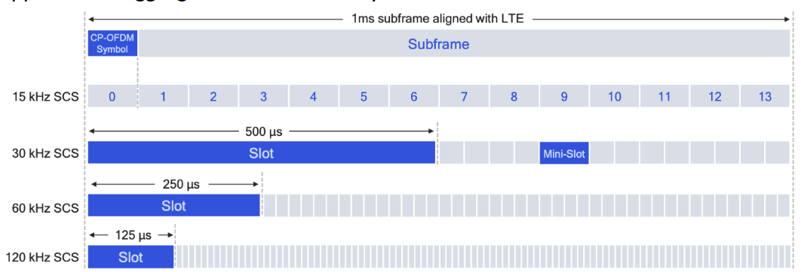{width=400px}

<!-- slide 140-141 volate -->

## Mobilità nel 4G/5G

Nelle reti cellulari la mobilità è gestita chiedendo alla rete di riferimento dove l'utente si trovi (stesso approccio di trovare una persona di cui non si conosce la persona, come chiamare a casa per chiedere ai genitori dove sia). E' presente una home network e una visited network dove faccio roaming. Quando accedo alla visiting network la nuova rete mi assegna un indirizzo (spesso privato). Devo dunque dialogare con mms di quella rete in modo che possa indicare al hss che mi trovo attualmente nella sua rete. Quando un utente si sposta devo gestire _4 fasi_:

- **associazione** alla nuova base station
- **configurare** la **control plane** informando la rete dove si trova il dispositivo
- **configurazione** della **data plane** per la creazione dei tunnel
- **mobile handover**, se la cella dovesse cambiare (ad esempio durante la chiamata) dovrebbe essere eseguito l'handover

La configurazione della data plane tunnel per i dispositivi avviene:

- **S-GW a BS tunnel**: quando il dispositivo cambia base station, semplicemente cambia l'endopoint ip address del tunnel
- **S-GW a home P-GW tunnel**: implementazione del routing indiretto
- tunneling via GPT (GPRS tunneling protocol): i datagrammi del dispositivo vengono inviati allo streaming server incapuslati utilizzando GTP inside UDP, all'interno del datagramma

{width=450px}

L'handover attraverso le base station all'interno della stessa rete cellulare avviene in quattro step:

1. il source BS seleziona il target BS, invia un Handover Request message al traget BS
2. Il target BS prealloca un radio time slots, risponde con HR ACK con le informazioni del dispositivo
3. Il source BS informa il dispositivo del nuovo BS (ora il dispositivo può inviare e ricevere attraverso la nuova BS) e l'handover risulta completato agli occhi del dispositivo
4. Il source BS smette di inviare i datagrammi al dispositivo, invece li inoltra alla nuova base station (che li inoltrerà al dispositivo attraverso il radio channel)
5. Il target Bs informa MME che del nuovo BS per il dispositivo (MME istruisce S-GW di cambiare l'endopooint del tunnel al nuovo BS)
6. La base station target inoltra un ack alla base station sorgente informando che l'handover è completato e la bs sorgente può rilasciare le sue risorse.
7. I datagrammi del dispositivo possono ora utilizzare il nuovo tunnel dal target BS al S-GW
