# Reti Wireless e cellulari
<!-- lezione10: 25-10-2022 -->

## Introduzione

Le reti wireless sono reti che permettono la comunicazione tra dispositivi senza la necessità di un cavo fisico. Questo tipo di reti è molto comune nei nostri giorni, e sono presenti in molti dispositivi, come ad esempio i cellulari, i tablet, i computer portatili, i router, i dispositivi di rete, e molti altri. Un altro aspetto molto importante è la mobilità (che con il cavo non si poneva).

Una parte importante di ogni rete wireless è in realtà la sua componente wired, oltre al wireless link.

I link wireless comportano però alcuni svantaggi rispetto a un link cablato:

- Un degrado maggiore del segnale.
- Interferenza tra i dispositivi.
- Multipath propagation (fading): effetto dovuto ai rimbalzi sugli ostacoli.

Con SNR si identifica il _Signal to Noise Ratio_, ovvero la relazione tra il segnale ricevuto e il rumore. Questo valore è molto importante per la qualità del segnale.

La modulazione è il processo attraverso cui viene inviato un bit. Vi sono varie tipologie come:

- quam256
- quam16
- bpsk

Un ulteriore problema che ritroviamo all'interno delle reti wireless è inerente al problema del nodo (o terminale) nascosto: dati 3 nodi `a`, `b`, `c` se `b` comunica con entrambi i rimanenti, questi potrebbero però non essere a conoscenza della reciproca presenza e generare interferenze.

## Wireless LAN

Nel corso degli anni lo standard 802.11 si è evoluto dando origine a vari standard. Tutti quanti utilizzano il protocollo csma/ca.

Un BSS (Basic Service Set) contiene:

- host wireless
- yb access point (base station)
- ad hock mode

Ogni rete wifi lavora su un canale differente, è dunque in grado di gestire fino a 16 frequenze (di cui utilizza solo una) per la trasmissione dei dati. La configurazione può essere automatica o manuale.

Ogni host rimane in attesa di un `beacon frame`: un frame particolare inviato dagli access point per effettuare la connessione. Il dispositivo si connetterà al beacon frame più forte in modo da aumentare la qualità della connessione. Per poter iniziare a dialogare con la rete wifi sarà inoltre necessaria una autenticazione.

Esistono due tipologie di scanning eseguite da un host che si connette a una rete:

- passive scanning: il beacon frame viene inviato dall'access point e ricevuto dall'host
- active scanning: è l'host a richiedere il beacon frame all'access point, in 4 fasi contraddistinte da un `probe request` dal host, un `probe response` dagli APs, un `association request` dall'host verso l'access point scelto e un `association response` dal APs in questione.

## IEEE 802.11: multiple access (CSMA)

L'accesso multiplo su un canale wireless è un problema molto complesso, che prevede l'utilizzo di CSMA per l'eliminazione di collisioni tra due o più nodi che trasmettono contemporaneamente.

Mentre in ethernet viene utilizzato csma/cd (collision detection), in wireless viene utilizzato csma/ca (collision avoidance).

### CSMA/CA

Il dispositivo che invia:

1. Se il canale è riconosciuto in idle per DIFS time, allora il dispositivo inizia a trasmettere.
2. Se il canale è riconosciuto occupato, viene avviato un random backoff time che lo pone in attesa prima del nuovo tentativo. Se anche al nuovo tentativo il canale è occupato, il dispositivo ripete il processo aumentatdo il random backoff interval.

Il dispositivo che riceve:

- Se il frame è ricuvato correttamente, viene inviato un ACK frame dopo **SIFS** tempo.

Il collision avoidance mostrato sopra non è però deterministico, per riuscire ad ottenerlo è possibile utilizzare un sistema di "prenotazione" che riserva il canale per i data frame usando dei pacchetti di "prenotazione" (RTS/CTS) caratterizzati da trame piccole. Questi possono ancora collidere, ma sono molto più piccoli e quindi meno dannosi. RTS (ready to send) viene inviato dal dispositivo che vuole trasmettere, CTS (clear to send) viene inviato dal dispositivo che ha ricevuto il RTS verso tutti i dispositivi in ascolto in modo da far partire chi deve trasmettere e porre in attesa i rimanenti.

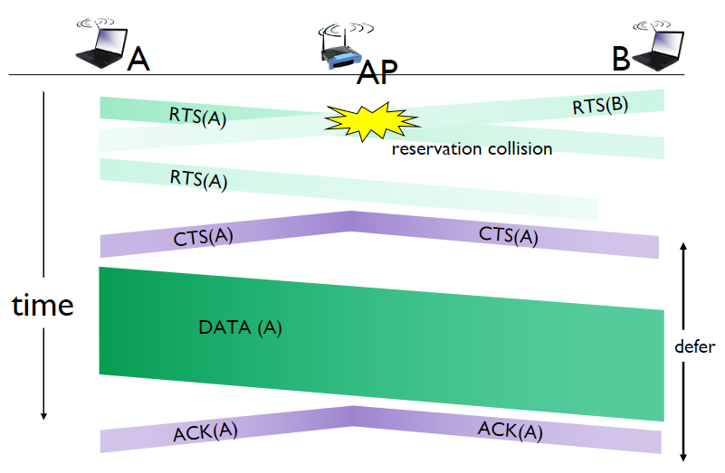{width=450px}

### Frame addressing

Il frame contiene:

- frame control
- duration
- address 1: mac address del host wireless o Access Point che deve ricevere il frame
- address 2: MAC address del host wireless o Access Point che deve trasmettere il frame
- address 3: MAC address dell'interfaccia del router a cui l'access point è connesso
- seq control: necessari per gli ack
- address 4: usato solo in modalità ad hoc
- payload
- crc: controllo di errore

Dentro frame control troviamo ulteriori campi, tra cui ad esempio:

- protocol verison
- tipo (RTS, CTS, ACK, data)
- sottotipo
- bit per il powe management

### Mobilità

Solitamente per le reti wirless l'host rimane all'interno della stessa subnet IP, motivo per cui è possibile riutilizzare lo stesso indirizzo.

nswitch: which AP is associated with H1?
nself-learning; switch will see frame from H1
and “remember” which switch port can be used to reach H1
H1 BBS 2BBS 1
Wireless and Cellular Networks © see page 2 26

Dal punto di vista energetico, esiste il `node-to-AP` attraverso il quale l'Access Point viene a conoscenza del fatto che non deve inoltrare i frame al nodo, il quale si sveglierà prima del prossimo beacon frame (contains list of mobiles with AP-to-mobile frames waiting to be sent).

## Reti Cellulari

Le reti cellulari sono reti wireless che coprono aree geografiche molto vaste attraverso la definizione di zone adiacenti denominate celle. A differenza di altre reti, gli host si muovono anche attraverso lunghe distanza e diventa importante non far disconnettere l'utente attraverso la gestione della mobilità denominata `handover`.

La copertura cellulare è garantita da reti isotopiche o con antenne direzionali da 120 gradi. L'emissione non è pero omni direzionale a causa della presenza di ostacoli (montagne, edifici), l'altezza, il guadagno dell'antenna, la morfologia del territorio, la potenza dell'antenna e infine le condizioni di propagazione (neve ecc).

Le celle si dividono in macrocelle e microcelle in base alle loro dimensioni.  Le prime coprono un'area ragionevolmente estesa.

Abbiamo nuovamente un problema di accesso multiplo condiviso sul canale, risoolti attraverso varie tecniche:

- **FDMA**: scelgo una frequenza in cui trasmettere.
- **TDMA**: scelgo uno slot temporale in cui trasmettere.
- **CDMA**: assegno a ogni stazione un codice ortogonale agli altri, ovvero un gruppo di segnali da cui è possibile recuperare ogni singolo segnale.
- **SDMA**: riutilizzo di frequenze a patto che siano luoghi sufficientemente distanti tra loro.

Andremo quindi a riutilizzare le stesse frequenze in posti diversi in modo da non causare interferenze. Questo viene fatto a ccausa del numero ridotto di risorse, e allo scopo di coprire un'area più ampia e servire un alto numero di utenti.

Un gruppo di celle viene definito cluster, come nell'esempio in figura.

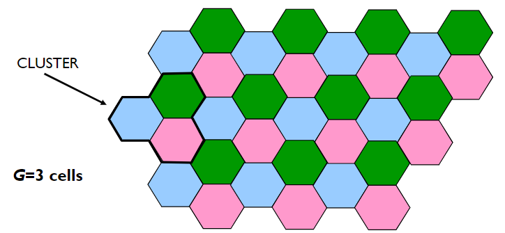{width=450px}

Le celle verdi, rosa e blu usano un set differente di canali. Le celle dello stesso colore sono chiamate **"co-channel" cells**.

Se io vario la dimensione delle celle _R_ cambio la capacità, ovvero il numero di utenti che posso soddisfare. Il numero di celle _G_ impatta invece sul costo, in quanto un numero maggiore di celle ha dei costi maggiori. Aumentando il cluster aumento la qualità, aumentando anche G aumento la qualità ma diminuisco la capacità. Non esiste una legge assoluta per definire il valore di R e di G, sono però presenti alcune tecniche per diminuire le interferenze ed aumentare la capacità come:

- **splitting**: non utilizzare celle delle stesse dimensioni, ma basarsi sulle necessità.
- **sectoring**: utilizzare delle antenne non omnidirezionali per ridurre le interferenze e ridurre solo nelle direzioni in cui non è necessario.
- **tilting**: non usare un angolo a 90 gradi per la trasmissione.
- **creating femtocells**: possiamo creare delle celle non fisse in base alle necessità (esempio stadio o concerti).

### Splitting

Utilizzare celle di dimensioni scelte in base alle necessità delle zone, e non quindi tutte uguali.

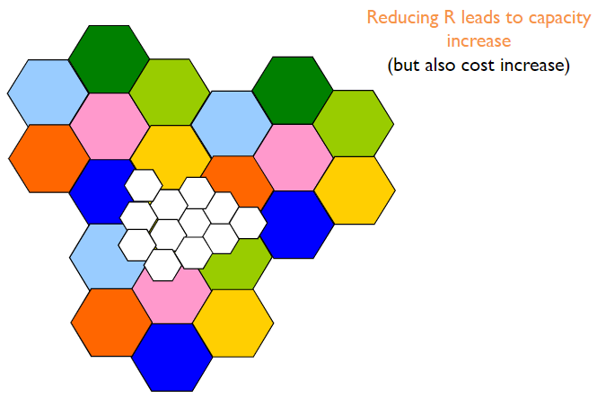{width=450px}

### Cell shaping

Utilizzo di antenne direzionali per avere celle con dimensioni e forme ad-hoc. E' possibile utilizzare una copertura multi livello (umbrella coverage). Le microcelle seguono l'utente dove si muove.

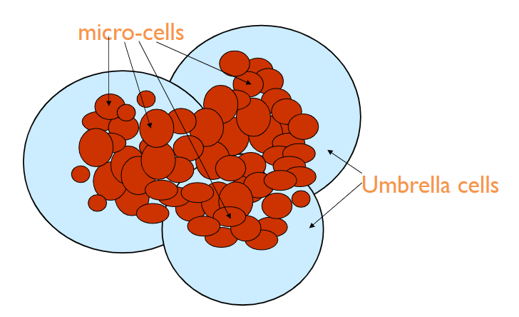{width=450px}

Altri esempi sono possibile tenendo conto di strade oppure ferrovie, dove le celle cercano di seguire la forma della strada.

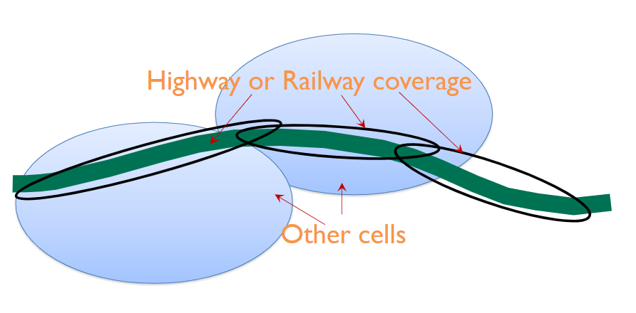{width=450px}

### Power Control

Metodo attraverso cui si gestiscono al meglio le capacità delle batterie a disposizione. Si cerca di ridurre l'utilizzo di potenza in base alle necessità. Per sapere la potenza necessaria da utilizzare si utilizzano strategie di due tipi:

- a catena aperta: sistema senza reazione
- a catena chiusa: sistema con feedback

#### Open loop

Il sistema, non avendo a disposizione un feedback, analizza e misura la qualità del segnale ricevuto per decidere se aumentare o diminuire la potenza in trasmissione. Questo adattamento non è preciso e non è detto che ciòò che succede su una frequenza sia uguale a un'altra. Not very accurate as uplink and downlink transmissions typically occur on different channels.

### Frequency allocation

L'allocazione dele frequenze possono avvenire nei seguenti modi:

- Fixed Channel Allocation (FCA), Based on the concept of cluster, Frequencies are assigned in a static way, Frequency plan is changed only rarely to improve performance and adapt to slow variations in user traffic
- Dynamic Channel Allocation (DCA)
  - Resources assigned to cells by a central controller when needed
  - Frequency plan changes over time to adapt to the system status
- Hybrid Channel allocation Scheme (HCS)
  - One portion is statically allocated (FCA)
  - One portion is dynamically allocated (DCA)

### Architettura di rete

Le reti sono costituite da mobile terminal che si connettono a dei BS (base station) radio che a loro volta si connettono a dei core network attraverso Switch Router (commutatori a pacchetto o circuito). I core network sono costituiti da un set di server che si occupano di gestire le connessioni e le risorse, in modo wired. Il database è molto importante ed è dove vengono memorizzate le informazioni degli utenti.

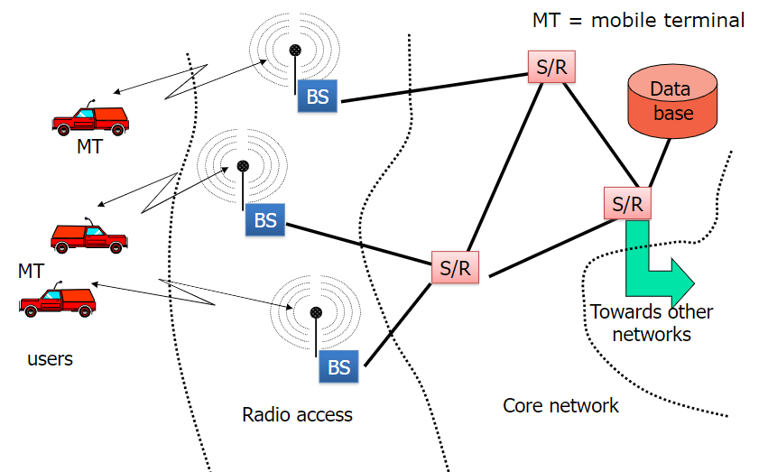{width=450px}

### Registrazione

Permette a un terminale mobile di connettersi alla rete attraverso una registrazione che lo identifica e autentica. La procedura avviene peridiocamente ogni volta che si deve accedere al servizio.

### Mobility Management

Per gestire la mobilità sono necessarie più procedure legate alla gestione:

- Roaming
- Location updating
- Paging
- Handover

#### Roaming

Il roaming è la capacità di un terminale di essere tracciabile quando si sposta nella rete. Il sistema deve memorizzare la posizione in un database e localizzare l'utente quando necessario. Per salvere tali informazioni, la rete viene divisa in location areas (LAs), gruppi di celle adiacenti. Ogni LA ha un identificativo univoco.

#### Location updating

La procedura che avviene ogni volta che un utente si sposta verso un'altra location area. Periodicamente l'utente deve comunicare la sua posizione alla rete, in modo da essere tracciato. Questa procedura è necessaria per mantenere aggiornate le informazioni sul database.

#### Paging

Procedure through which the system notifies a mobile terminal about an incoming
call/data delivery
The system broadcasts a paging message within the LA where the user is

#### Handover

Procedure that enables the transfer of an active connection from one cell to another,
while the mobile terminal moves over the network area
Complex procedure that poses constraints on the network architecture, protocols and
signaling

- Intra vs. Inter Cell: It indicates whether the handover is between frequencies within the same cell or different cells
- Soft vs. Hard It indicates whether during handover both radio channels are active (soft) or only one at the time is active (hard)
- MT vs. BS initiated It indicates whether the first control message to start a handover is sent by the mobile terminal (MT initiated) or by the BS (BS initiated), i.e., which entity performs measurements to understand where and when a handover has to be executed
- Backward vs. Forward It indicates whether handover signaling occurs via the origin BS (backward) or the destination BS (forward)

## Evoluzione della rete cellulare
<!-- lezione11: 26-10-2022 -->

Nel corso degli ultimi anni la rete cellulare ha subito una serie di evoluzioni che hanno portato ad una maggiore capacità di trasmissione e ad una maggiore efficienza energetica.

La prima generazione GSM era di tipo analogico, con ampio utilizzo di FDMA  e traffico esclusivamente voce. La qualità del segnale era bassa e l'efficienza nel riutilizzo della frequenza era basso.

La seconda generazione comporta il passaggio al digitale, con il vantaggi in termini di servizi (sms) crittografia e e voice coding avanzato per ridurre la banda necessaria. La seconda generazione estesa, 2.5G, caratterizzata da GPRS/EDGE in europa e IS-95B in USA, viene introdotto il servizio dati con packet switched, 170kb/s in GPRS e 384kb/s in EDGE. Si passa a tariffe basate sul traffico e non più sul tempo.

La terza generazione, 3G, ha comportato dei miglioramenti in termini di data service (multimedia service), l'introduzione di  CDMA e l'avvento di UMTS e CDMA2000. Il rate dati ha raggiunto i 2Mb/s ed possibile l'handover tra reti differenti oltre alla exploit spatial diversity. La generazione 3.5G ha comportato una evoluzione di UMTS soprattutto sul livello fisico, con miglioramenti del trasferimento dati fino a 56Mb/s in download e 22Mb/s in upload.

La quarta generazione, conosciuta come LTE, ha raggiunto un rate di 250Mb/s. Utilizza MIMO (multiple input multiple output) che consentono performance di modulazione più elevate. Per la prima volta abbiamo una rete completamente IP con l'introduzione di VoLTE per consentire il passaggio della voce sulla rete dati.

La quinta generazione, il 5G, ha lo scopo di unificare le tecnologie di accesso wireless rimuovendo la differenza tra rete wireless e cellulare, attraverso mmWave che consentono trasmissioni ad alto throughput. Introduce il NFV (network function virtualization) che permette di virtualizzare le funzioni di rete, come il routing, il firewall, il load balancing, il caching, il DPI (deep packet inspection) e il DDoS (distributed denial of service) protection. Inoltre, anche il SDN (software defined networking) permette di virtualizzare il controllo della rete consentendo di utilizzare un hardware general purpose.

### GSM

Rete con full rate di 13 kbit/s e half rate di 6.5Kbit/s. Consente l'invio di SMS e servizi supplementari come call forward, recall, e busy tone.

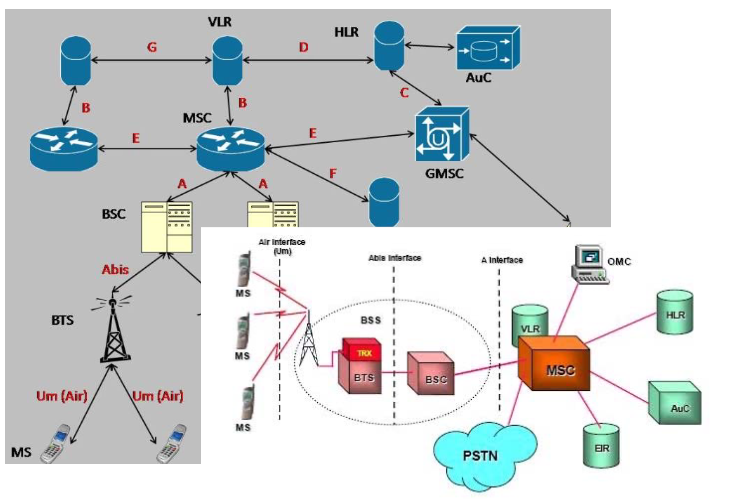{width=450px}

La Mobile Station (MS), ovvero il dispositivo, sono quelli in grado di connettersi alla rete GSM (come telefoni, antenne dei veicoli). Hanno differenti potenze di trasmissione all'antenaa:

- fino a 2W per i telefoni
- fino a 8W per dispositivi mobili
- fino a 20W per le antenne dei veicoli

La MS p però unicamente hardware, per connetteri alla rete è necessaria una SIM, ovvero una smart card con un processore e una memoria in grado di memorizzare, crittografato, le informazioni dell'utente come il numero di telefono, i servizi accessibili, parametri di sicurezza etc. MSI è l'identificativo univoche della SIM.

La Base Station Subsystem (BSS) comprende:

- BTS (base transceiver station): interfaccia fisica con il compito di trasmettere e ricevere.
- BSC (base station controller): gestisce il controllo delle risorse sull'interfaccia radio. BSC e BTS comuniciano con un link cablto. Un BSC controlla un alto unmero di BTS (da decine a centinaia). Tipicamente, BSC sono collocate con un MSC, invece di essere allocate vicino ai BTS. Il suo ruolo principale è quello di eseguire il transcodig vocale a 13 kb/s / 64 kb/s, eseguire il paging, radio resource control (assegnamento dinamico delle frequenze ai BTS), misurazione della qualità del segnale e controllo dell'handover tra BTS controllato dallo stesso BSC.

Il network and switching subsystem (NSS) ha il compito di gestire le chiamate, il service support, mobility support e autenticazione. E' composto da:

- **MSC**: mobile switching center, ha il compito di gestire la mobility support, call routing tra MT, GSMC ovvero l'interfaccia tra GSM e le altre reti
- **HLR**: home location register, si occupa di salvare le informazioni nel database come le informazioni permanenti dell'utente (id, servizi abilitati, parametri di sicurezza) e dati dinamici per la gestione della user mobilità (VLE identifier).
- **VLR**: visitor location register, salva nel dtatabase le informazioni relative a dove si trova il MT attualmente nell'area controllata dal MSC come id, stato on/of, LAI, informazioni di routing e sicurezza.
- AUC: authetication center, autenticazione basata su un protocollo challenge & response con generazione di chiave di crittograzia per comunicazioni over-the-air.
- EIR: equipment identity register, memorizza le informazioni dei dispositivi rubati.

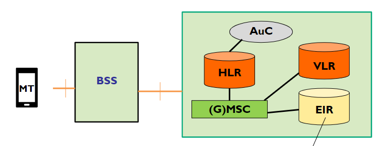  {width=450px}

Le frequenze allocate sono 859, 900 1800, 1900 MHz. Le frequenze sono differenti in base alla ricezione e alla trasmissione e funzionano attraverso FDD (frequency division duplex) system.

I canali GSM sono composti da una frequenza e uno slot, che identificano un canale fisico. Le trasmissioni sono organizzate in burst (da non confondere con pacchetti),  blocchi di dati trasmessi su canali fisici. Sono simili ai pacchetti, ma funzionano su switching a circuito. La velocità di trasmissione è di 272 kbit/s. I cnali possono essere acceduti con FDMA o TDM, e le frequenze sono divise in FDM channels, ciascuno largo 200kHz. Ognuno è diviso in TDM frames, che a loro volta sono divisi in 8 slot.

Lo slot time dura 0.577 ms, e ogni time slot porta 1 trasmission burst. Gli slot sono raggruppati in TDM frames, ciascuno di 8 slot.

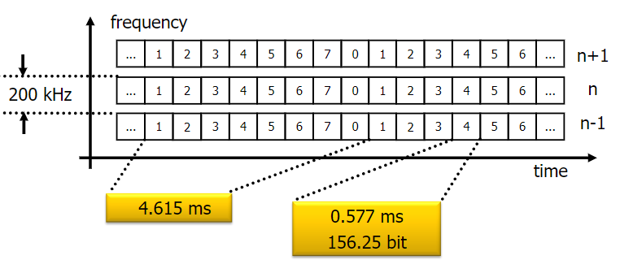{width=450px}

Il GSM non prevede una trasmissione simultanea (non è dunque full duplex), per limitare costi abbiamo un unico transceiver per cui è possibile o solo trasmettere o solo ricevere. Ogni MT trasmette per un time slot un burst di dati e rimane silezioso per gli altri 7 slot. I frame su UL e DL  sono sincronizzati in base ai time slot e shiftati di 3 slot.

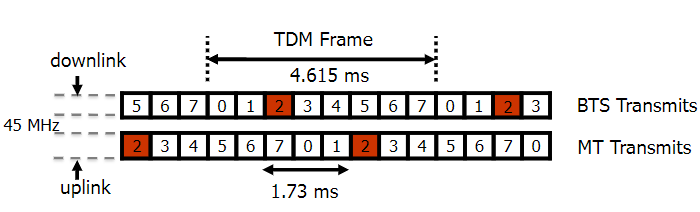{width=450px}

I tempi di propagazioni però non sono nulli, per cui possono nascere problemi nella struttura di questi slot. I burst trasmessi da MT potrebbero arrivare al BTS quando lo slot è già finito. Inoltre è possibile ci siano collisioni. La soluzione è utilizzare la timing advance, ovvero la trasmissione del MT comincia prima del reale inizio del timeslot. a inizio e fine birst sono presenti dei "bit di guardia" che permettono di sincronizzare i burst.

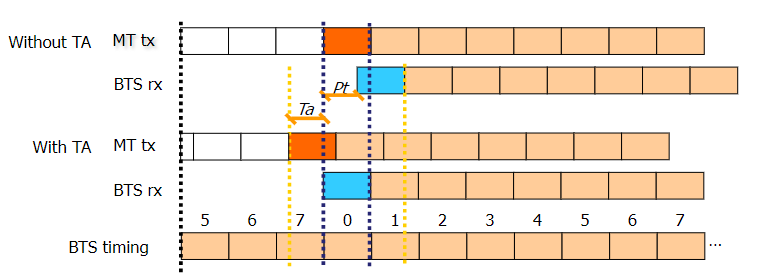{width=450px}

La struttura di un burst è caratterizzato dai bit di guardia, il coded data, stealing bit viene utilizzato per comunicare all'utente informazioni importanti.

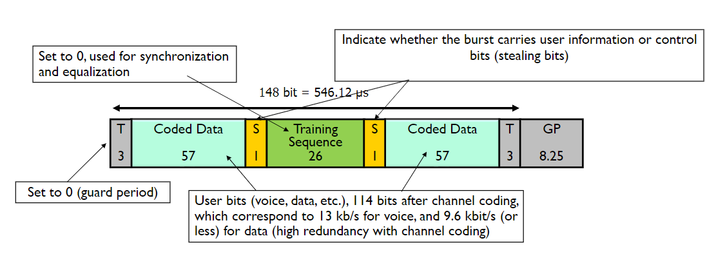{width=450px}

I canali fisici del GSM soon composti da 8 canali, con timeslots da 0 a 7, mentre i canali logici mantengono le informazioni e specificano "cosa" è trasmesso. Sono mappati nel livello fisico in accordo a determinati criteri. I canali logici si dividono in control channels che trasportano le informazioni di controllo, e traffic channels che trasportano le informazioni.

### 4G/LTE

Una delle caratteristiche è l'utilizzo del FDMA che va a soppiantare il CDMA, che era stato pensato per gestire in efficienza il fading e sembrava una tecnologia migliore per il trasferimento dei dati. Il CDMA è però difficile da mantenere in termini tecnologici e i rapporti costi/benevici non era sufficientemente buono, per questo motivo per LTE è stato pensato FDMA, ovvero un FDM dove le frequenze portanti sono più vicine e ortogonali (posso sovrapporre lo spettro) in modo da non generale interferenze.

Abbiamo una diffusione dei MIMO e il livello fisico è statp migliorato per arrivare ad downlink di 300Mb/s e uplink da 50Mb/s.

Le frequenze utilizzate dipende dalla distanza:

- 2600 MHz utilizzata per massimizzare la capacità in aree urbane
- 1800 MHz alta capacita ma limitata interferenza
- 800 MHz alta coperture e alta interferenza, per esempio nelle aree rurali.

Nella terminologia compaiono inoltre i termini:

- user plane: tutte le operazioni legate al trasporto di dato utente in dl o ul (access stratum)
- control plane: tutte le operazioni legate al setup, controllo e mantenimento delle comunicazioni tra utente e la rete (non access stratum)

La radio access network prende il nome di E-UTRAN, mentre il core network, che include tutti i dispositivi responsabili al trasporto da/a internet verso gli utenti, viene deniminato EPC.

Le BS vengono denominate eNodeB.

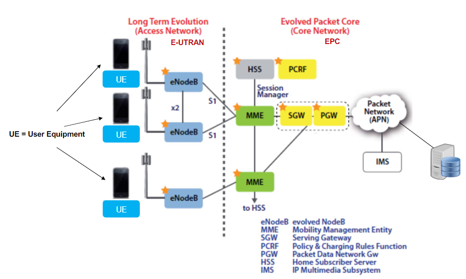{width=450px}

MME setup di un home tunnel da rete di casa a rete di un operatore, si occupa della mobilità. Attenzione: si riparla di pacchetti a differenza del gsm.

L'approccio utilizzato per EPC di tipo clean state design, di fatto ripensandolo completamente da zero. Utilizzo del packet switching transport per il traffico appartenente a tutte le classi QoS inclusi conversazione, streaming, tempo reale, non in tempo reale e in background.

- Radio resource management for: end-to-end QoS, transport for higher layers, load sharing/balancing, policy management/enforcement across different radio access technologies
- Integration with existing 3GPP 2G and 3G networks

<!-- todo ha saltato un po' le slide -->

#### Beares

Tutte le comunicazioni sono gestite attraverso dei "tunnel" denominati Bear. Tra il pwg e swg si crea un tunnel, e a sua volta dal svg e la base station si crea un altro tunnel, o ancora tra user agent e eNodeB. All'interno della rete i tunnel possono essere creati per soddisfare dei requisiti in termini di qualità del servizio. Possono essere creati dei bearer dedicati per dei servizi specifici.  E' presente un bearer default che stabilisce una connessione con il PGW quando UE è attivato. the UE can establish other dedicated bearers to other networks, based on
quality-of-service (QoS) requirements.

Sono presenti in particolare tre differenti beares:

- The S5 bearer: connects the Serving Gateway (S-GW) to the P-GW. (The tunnel can extend from P-GW to the Internet).
- The S1 bearer: connects the eNodeB with the S-GW. Handover establishes a new S1 bearer for end-to-end connectivity.
- The radio bearer: connects the UE to the eNodeB. This bearer follows the mobile user under the direction of the MME as the radio network performs handovers when the user moves from one cell to another.

#### E-UTRAN

Principalmente sono dei eNodeB con un interfaccia X2 connetere eNodeB. Le funzioni principali sono di management delle risorsse audio come radio bearer control, radio mobility control, schedulinc ed allocazione dinamica delle risorse radio per uplink e downliik. Gestiscono la compressione (senza perdita) degli header, la sicurezza e la connettività verso EPC.

#### Data Plane e Control Plane

control plane è new protocols for mobility management , security, authentication (later)

Nel data plane abbiamo un estensivo uso dei tunnel che a livello datalink e fisico ha causato la creazione di nuovi protocolli per giustire gli accessi, oltre a nuovi standard di compressione per migliorare l'utilizzo del canale.

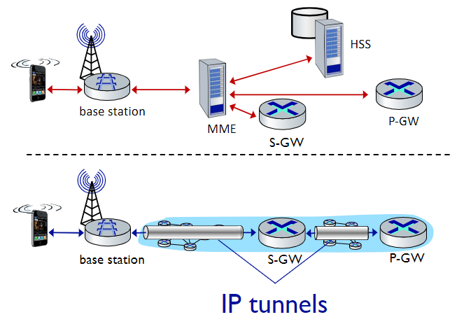{width=450px}

A livello 3 abbiamo IP, a livello data link abbiamo tre sottolivelli:

- **medium access**: equivalente del sottolivello mac, si occupa dell'accesso al canale
- **radio link**: si occupa della frammentazione e assemblaggio dei dati. Offre un reliable data transfer, ovvero si assicura che la comunicazione avvenga con successo.
- **Packet data convergence**: si occupa della compressione dell'header e dell'encryption.

Il livello fisico è gestito attraverso OFDM (tante frequenze ortogonali che minimizzano l'interferenza tra i canali) e definisce degli slot TDM (non diversamente dalla gestione del canale link wireless su GSM).

- downstream channel: FDM, TDM within frequency channel (OFDM - orthogonal frequency division multiplexing)
  - “orthogonal”: minimal interference between channels
- upstream: FDM, TDM similar to OFDM
- each active mobile device allocated two or more 0.5 ms time slots over 12 frequencies
  - scheduling algorithm not standardized – up to operator
  - 100’s Mbps per device possible

Qui abbiamo tanto slot piccolini e la rete può assegnare più o meno slot in modo dinamico, in modo da adattarsi a quello che deve essere inviato in modo efficiente.

I bit trasmessi sono inseriti all'interno di un frame che ha una struttura suddivisa in modo predefinito denominata Physical channels. Ciascun channel ha informazioni specifiche relative a user data, tx/rx parameters, eNB identity, network control etc come il format del canale stesso. iascun canale fisico è mappato in una porzione del LTE subframe. I canali fisici sono divisi in downlink e uplink channels, ciascun u/d channel è ulteriormente diviso in data e control.

<!-- slide 113/114/115 volate -->

In uplink è possibile utilizzare gruppi di 3 TTIs per aumentare la performance e ridurrre l'overhead dei livelli superiori..

La tecnologia tunneling utilizzata per le reti cellulari si chiama **GPRS Tunneling Protocol**, ovvero tunnel realizzati su UDP.

Un nodo per associarsi a una base station deve eseguire vari step. Periodicamente la base station invia su tutte le frequenze un broadcast primary synch signal ogni 5ms. Il dispositivo troa il primary sync signal e a quel punto attende il second synch signal alla medesima frequenza. In questo modo si trovano le informazioni dalla base station come la bandwith del canale, la configurazion, cellular carrier info etc. Il dispositivo sceglie il BS a cui associarsi e inizia il processo di autenticazione e set up data plane.

I terminali possono andare in una delle due fasi di sleep, che consente un risparmio del consumo energetico. Le fasi di sleep sono:

- light sleep: ogni 100ms il dispositivo si sveglia per controllare se ci sono messaggi da inviare o ricevere. Se non ci sono messaggi il dispositivo torna a dormire.
- deep sleep: dopo 5 o 10 secondi di innatività, il dispositivo si mette in deep sleep. In questo modo si risparmia molto energia. Si da per scontato che l'utente debba ripartire da zero in quanto  anche la cella potrebbe essere cambiata.

### 5G

L'obbiettivo del 5G è superare la differenza tra rete cellulare e wifi, e raggiungere un alta mobilità e connettere la società. Per riuscire a fornire i nuovi servizi saranno necessari, oltre al miglioramento della rete, di una integrazione di risorse di rete, di computing e storage. Per ottenere ciò è necessario dislocare le varie risorse e di "networks slices", porzioni di risorse riservate a una certa comunicazione che consentano di emulare ciò che faceva il "circuito" ovvero qualità. Per fare ciò è richiesto l'utilizzo del SDN. Abbiamo bisogno di gestire tutte queste risorse e la relativa creazione in modo flessibile e dinamico, attraverso quello che è un "orchestratore di rete" denominato orchestrator function (o network).

Alcuni utilizzi potrebbero essere:

- **eMBB**: enanched mobile broadband, come in una rete 5G sia possibile usare servizi ad alta qualità per utenti mobili
- **mMTC**: massive machine type communication, comunicazione industriale a bassa latenza.
- **URLLC**: Ultra-Reliable Low-Latency Communication, in grado di garantire latenze fino a 1ms in modo da mettere in comunicazione la rete cellulare con, ad esempio, il robot.

Le tecnologie che si usano, e che si useranno, saranno:

- forme d'onda avanzate
- MIMO avanzate (antenne), che superano l'efficienza delle MIMO di LTE
- Millimeter Wave, ovvero uno spettro ad altissime sequenze con chunk fino a 2Ghz
- software define networking, SDN is an approach to networking in which routing control is centralized and decoupled from the physical infrastructure (data plane), which is distributed
- Network Function virtualization, muove i servizi di rete dall'hardware al software, creando una virtual building blocks capace di connettersi semplicemente.
- SDN/NFV Orchestration, ovvero la gestione di tutte queste risorse in modo dinamico e flessibile.

La Radio access Network è basata sui gNodeB, evoluzione dei eNodeB. E sono presenti gli Edge Network (MEC) che ha computing e storage elements per i servizi locali, mentre il Core Network include tutti i dispositivi responsabili per il trasporto dei dati da e verso internet attraverso i dispositivi utenti.

Abbiamo una distinzione netta tra il data plane e il control plane.

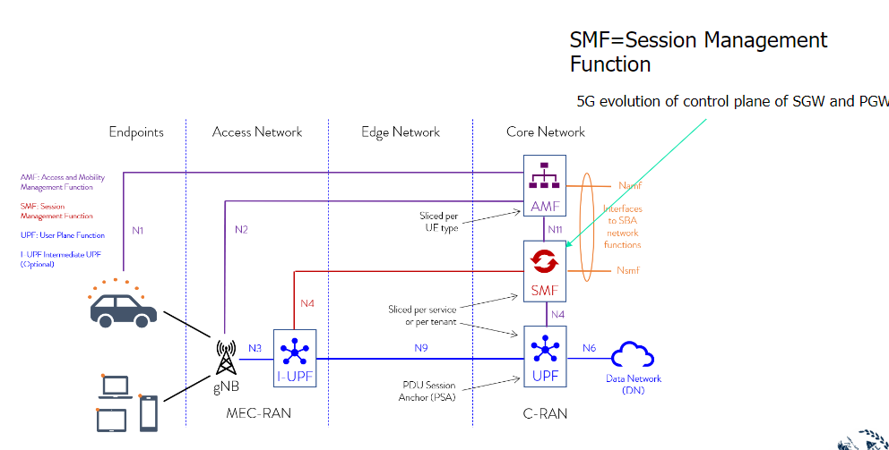{width=450px}

#### Edge Network

L'infrastruttura edge network fornisce servizi IT e cloud computing ai dispositivi mobili, in prossimità dei mobile subscribers. La standardizzazione è cominciata nel 2014 e pubblicata nel 2017. I benefi attesi sono:

- ultra low latency
- alta bandwitch
- accesso real time alla radio network
- contextual information
- location awareness
- flexible and exendable framework for services

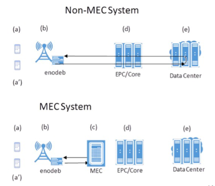{width=450px}

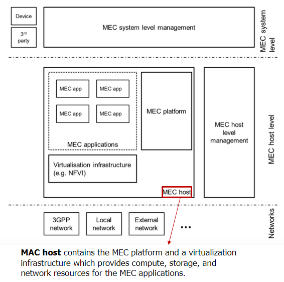{width=450px}

#### Radio Access Network

Introduzione di un framework flessibile basato slot, che consenta l'utilizzo di un numero variabile di slot per subframe. La trasmissione può iniziare in un punto qualsiasi dello slot. Supporta lo slot aggregation per trassmissioni con dati molto pesanti. Different subcarrier spacing (“numerology”): shorter slots for higher spacing.

<!-- slide 140-141 volate -->

## Mobilità nel 4G/5G

Nelle reti cellulari la mobilità è gestita chiedendo alla rete di riferimento dove l'utente si trovi (stesso approccio di trovare una persona di cui non si conosce la persona, come chiamare a casa per chiedere ai genitori dove sia). E' presente una home network e una visited network dove faccio roaming. Quando accedo alla visiting network la nuova rete mi assegna un indirizzo (spesso privato). Devo dunque dialogare con mms di quella rete in modo che possa indicare al hss che mi trovo attualmente nella sua rete. Quando un utente si sposta devo gestire _4 fasi_:

- **associazione** alla nuova base station
- **configurare** la **control plane** informando la rete dove si trova il dispositivo
- **configurazione** della **data plane** per la creazione dei tunnel
- **mobile handover**, se la cella dovesse cambiare (ad esempio durante la chiamata) dovrebbe essere eseguito l'handover

La configurazione della data plane tunnel per i dispositivi avviene:

- **S-GW a BS tunnel**: quando il dispositivo cambia base station, semplicemnte cambia l'endopoint ip address del tunnel
- **S-GW a home P-GW tunnel**: implementazione del routing indiretto
- tunneling via GPT (GPRS tunneling protocol): i datagrammi del dispositivo vengono inviati allo streaming server incapuslati utilizzando GTP inside UDP, all'interno del datagramma

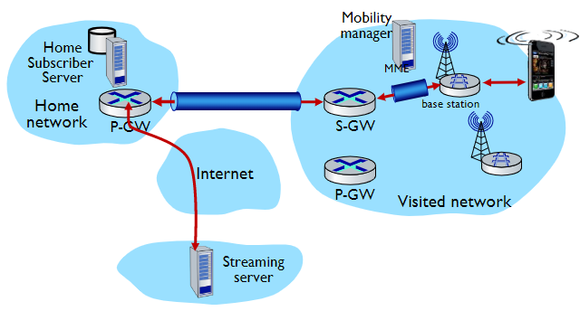{width=450px}

L'handover attraverso le base station all'interno della stessa rete cellulare avviene in quattro step:

1. il source BS seleziona il target BS, invia un Handover Request message al traget BS
2. Il target BS prealloca un radio time slots, risponde con HR ACK con le informazioni del dispositivo
3. Il source BS informa il dispositivo del nuovo BS (ora il dispositivo può inviare e ricevere attraverso la nuova BS) e l'handover risulta completato agli occhi del dispositivo
4. Il source BS smette di inviare i datagrammi al dispositivo, invece li inoltra alla nuova base station (che li inoltrerà al dispositivo attraverso il radio channel)
5. Il target Bs informa MME che del nuovo BS per il dispositivo (MME istruisce S-GW di cambiare l'endopooint del tunnel al nuovo BS)
6. La base station target inoltra un ack alla base station sorgente informando che l'handover è completato e la bs sorgente può rilasciare le sue risorse.
7. I datagrammi del dispositivo possono ora utilizzare il nuovo tunnel dal target BS al S-GW

