# Principi del modern Lan Design
<!-- lezione12: 27-10-2022 -->

Le **Wide Area Network** (WAN) appaiono negli anni 60, sfruttavano alcuni mainframes per la potenza di calcolo e i dispositivi si connettevano da remoto (per ridurre tra più autorità i costi). Soltanto alla fine degli anni 70 compaiono le **Local Area Networks** in seguito alla comparsa dei primi minicomputer e alla successiva riduzione costi che hanno reso meno utile l'utilizzo di mainframes _(ancora usati per motivi differenti come la ricerca)_.

Inizialmente _WAN_ e _LAN_ si sono evolute indipendentemente in quanto dovevano sopperire a esigenze differenti e, per tale motivo, erano utilizzati protocolli diversi. Soltanto successivamente LAN e WAN sono state collegate ed è stato decretato come unico vincitore il protocollo IP.

Sul livello fisico ha vinto lo standard **IEEE 802**, in particolare **802.3** ovvero **ethernet** e **802.11** ovvero **WIFI**. Dal punto di vista cablato invece: EIA/TIA 568, ISO/IEC 11801.

I dispositivi LAN si dividono in:

- **ripetitori** _(livello 1)_: hub, stesso _dominio di collisione_ ma separato _dominio fisico_.
- **bridge** _(livello 2)_: switch, _dominio di collisione_ separato ma stesso _dominio di broadcast_.
- **router** _(livello 3)_: L3 switch, _dominio di broadcast_ separato, non specifico per le LAN _(e non trattato in questa dispensa)_.

## Ripetitori

I **ripetitori** sono dispositivi di _livello 1_ che consentono di interconnettere il livello fisico ricevendo e propagando una sequenza di bit. E' utilizzato per interconnettere le reti aventi lo stesso MAC (Medium Access Control) address e ripristinare la degradazione del segnale (su lunghi cavi) in modo da raggiungere maggiori distanze.

Con l'avvento del cavo in rame compaiono gli HUB che utilizzano una struttura a stella.  Tutti i dispositivi connessi a un hub appartengono allo stesso dominio di collisione.

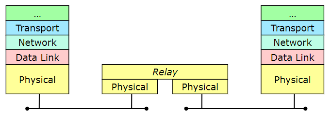{width=300px}

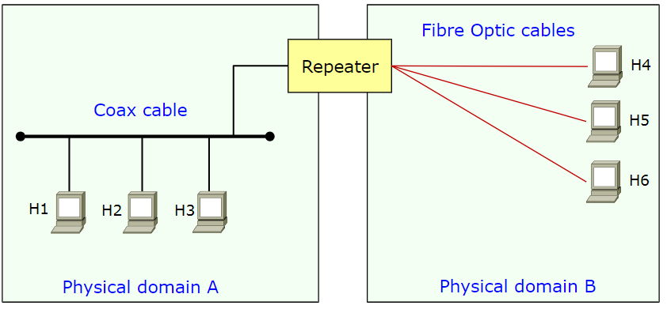{width=300px}

I ripetitore con più di due porte prendono il nome di **hub**, sono necessari per il twisted pairs e il fiber cabling (nella topologia hub-and-spoke).

{width=200px}

## Bridge

Il **bridge** è un dispositivo di _livello 2_ e pertanto è in grado di comprendere una trama ethernet. Sono implementati completamente in software e composti da due porte (per questioni economiche). Interconnettono al livello di data link (da ethernet a wifi) e hanno differenti MAC _(medium access mechanism, framing)_.

:::tip
**Nota**: Lo switch è un bridge a più porte.
:::

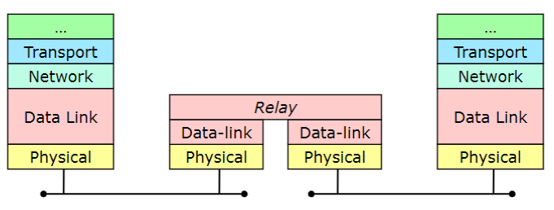{width=350px}

Adotta una modalità store and forward, ovvero è in grado di ricevere tutta la trama, "ragionarci" e poi inoltrarla verso la porta corretta che ha individuato grazie al MAC e la tabella di inoltro.

Non necessariamente interconnette link layer uguali (anche se per lo più è così), ma è pensato per supportarne anche di tipi differenti. Inoltre riesce a gestire le collisioni ed evitarle, ottenendo una **divisione del collision domain** ma mantenendo un **unico broadcast domain** (quindi il broadcast continua a funzionare correttamente).

Viene utilizzato per estendere le reti LAN (specialmente per FastEthernet), ma vi sono problemi di collisione.

Il funzionamento consiste nel ricevere e ritrasmettere (dopo) un frame, il quale viene salvato, modificato e rinviato.

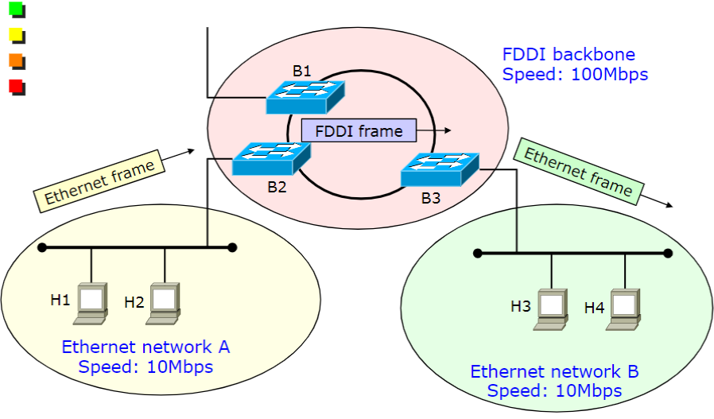{width=300px}

Il meccanismo **store and forward** permette un invio più intelligente dei dati nelle interfacce di output, riuscendo a disaccoppiare le collisioni sul dominio di broadcast (dunque il collision domain non è più un problema).

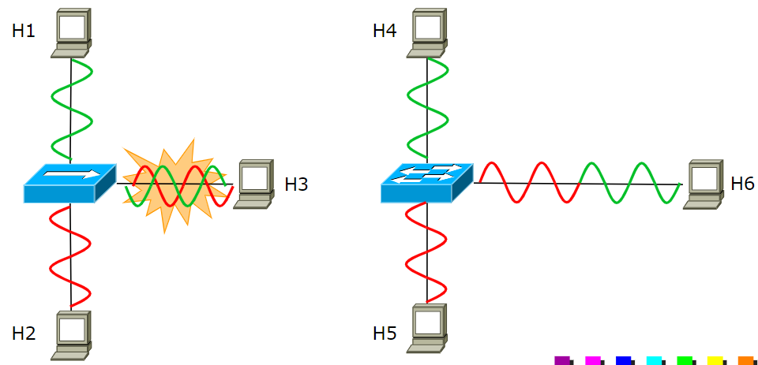{width=300px}

Bisogna però fare attenzione al fatto che sui singoli segmenti di rete possono ancora esserci collisioni, che vengono risolte attraverso la modalità _full duplex_ (funzionante tra host e switch, switch e switch e host e host).


La trasmissione **half-duplex** avviene in un solo verso, è lo standard nelle interfacce di rete. Non è possibile ottenere contemporaneamente la trasmissione e la ricezione di dati. Per sopperire a tale mancanza è stato successivamente introdotto il **full-duplex** con il Fast Ethernet. In questo modo la bandwidth aumenta in favore di un throughput raddoppiato (almeno teoricamente) che è in realtà un vantaggio limitato in quanto i client tendono a saturare i downlink mentre i server gli uplink. Risulta invece più utile nei bridge delle backbone dove il bandwidth è più simmetrico. _CSMA/CD_ non è più necessario in quanto con la modalità _full duplex_ non sono più presenti collisioni.

:::tip
Il **dominio di collisione** si può riassumere come l'area in cui un singolo _access control algorithm_, ad esempio quella coperta da un singolo cavo fisico.
:::

:::tip
Il **dominio di broadcast** si può riassumere come l'area in cui un frame può essere propagato (ad esempio quella in cui opera una LAN). Può includere molti collision domains.
:::

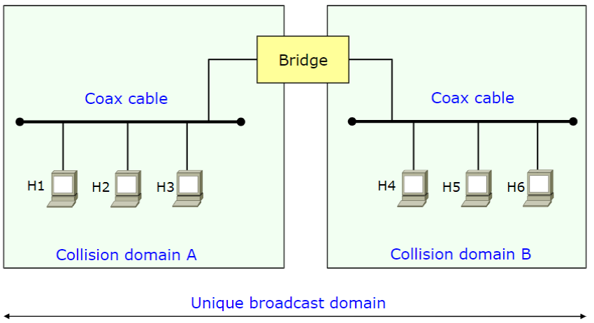{width=300px}

## LAN Moderne

Le reti LAN moderne sono basate su **full-duplex**, switch e ethernet. Oggi le porte ethernet possono raggiungere i gigabit e anche se quando ci riferiamo a switch facciamo in realtà riferimento a switch ethernet. Non è più necessario utilizzare _CSMA/CD_ (non definito per portate sopra 1GE).

Viene utilizzata la topologia Hub-and-spoke, ovvero connessioni punto punto tra gli host e il bridge in modo da non avere domini di collisione.

:::caution
**Attenzione**: Le wireless LAN funzionano in modo completamente diverso (utilizzo di _CSMA/CA_) e sono  ancora presenti gli hub.
:::

### Transparent bridges

I _bridge_ e gli _switch_ in ethernet prendono il nome di **transparent bridge**, che si contrappongono a quelli non trasparenti ma che non vengono più utilizzati. Il nome sottolinea il comportamento _plug & play_, senza richiedere una configurazione manuale.

Per l'utente finale non devono essere percepite differenze rispetto agli hub e devono avere il medesimo funzionamento con o senza _bridges_, con al massimo una leggera differenza di performance rispetto alla rete originale. In particolare non devono essere presenti cambiamenti sui frame inviati dagli end systems (stesso frame, stesso MAC address, _ecc_), potrebbero invece esserci variazioni nel come questi vengono ricevuti ma non a livello di formato.

:::note
**Nota**: per l'utente gli switch non hanno indirizzi MAC, ma non è così.
:::

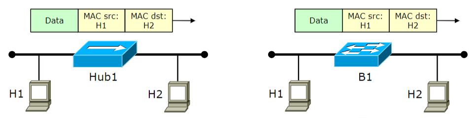{width=400px}

Ciascuna porta di un bridge ha un indirizzo MAC (e dunque un MAC level) che non viene utilizzato per eseguire il forwarding dei data frames ma per consentire l'indirizzamento del traffico attraverso i management frames.

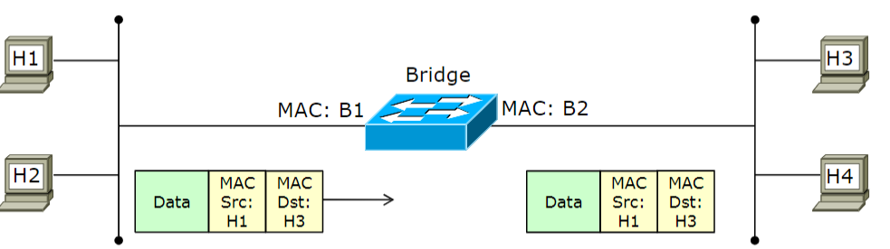{width=400px}

E' possibile eseguire il forwarding attraverso delle strategie più convenienti come quella unicast in cui l'inoltro avviene solamente verso la destinazione mediante il MAC-based forwarding, oppure in multicast/broadcast attraverso il flooding inviando il pacchetto su tutte le porte eccetto quella da cui il frame è stato ricevuto.

Localmente deve essere disponibile una sorta di "routing table" che prende il nome di **filtering database** contenente gli indirizzi MAC delle destinazioni. Per far ciò è necessaria una _forwarding table locale_ (filtering database), stazioni _auto-learning_ (backward learning) e _loop detection_ (spanning tree algorithm).

### Filtering database

Un **filtering database** è una tabella contenente la _"posizione"_ di ciascun _MAC address_ trovato nella rete, ovvero la _destination port_ ed _ageing time_ (default 300s). Lo scopo della tabella è quello di filtrare "fuori" il traffico non voluto da un link.

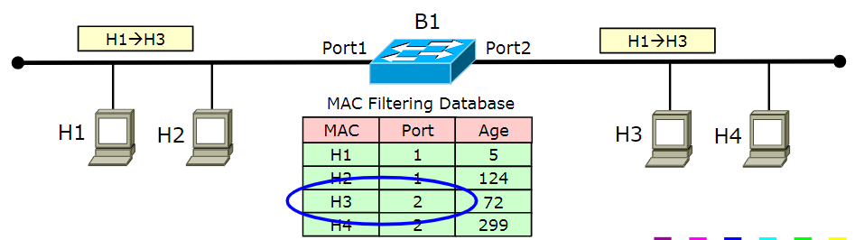{width=400px}

La _filter table_ può essere popolata manualmente (poco comodo) oppure mediante appositi algoritmi come il **backward learning**: quando uno switch riceve una trama riceve anche il mac sorgente e, grazie a questo, capisce quale porta utilizzare per raggiungere il dispositivo. Per tale motivo la tabella ha due tipi di entry:

- **statiche**: non aggiornate dal processo di _learning_, solitamente minori di 1000.
- **dinamiche**: popolate e aggiornate dal _backward learning process_. Il massimo numero di entry è pari a $2 / 64000$. Vengono eliminate quando le stazioni non esistono più o dopo un lasso di tempo _(default 300 secondi)_.

Un esempio reale è il seguente:

```text
Cisco-switch-1> show cam dynamic

* = Static Entry. + = Permanent Entry.
# = System Entry X = Port Security Entry

Dest MAC Address   Ports Age
------------------ ----- ---
00-00-86-1a-a6-44   1/1   1
00-00-c9-10-b3-0f   1/1   0
00-00-f8-31-1c-3b   1/2   4
00-00-f8-31-f7-a0   1/1   2
00-01-e7-00-e3-80   2/2   0
00-02-a5-84-a7-a6   2/1   1
00-02-b3-1e-b4-aa   2/1   5
00-02-b3-1e-da-da   2/5   1
00-02-b3-1e-dc-fd   2/4   2
```

Quando uno switch non sa dove si trova un nodo (aging terminato) viene operato il _flooding_, ma non è una strategia molto efficiente in quanto comporta l'invio del messaggio su tutte le porte. In realtà è un falso problema in quanto i nodi informano di loro semplicemente col traffico, per cui tutti i nodi riceveranno il pacchetto e immediatamente tutti gli switch riescono ad aggiornare i propri database. Quando l'utente si muove non smette di trasmettere il traffico e per tale motivo al prossimo pacchetto le informazioni verranno aggiornate.

:::caution
Un end-system il cui _MAC address_ non è presente nel database è sempre raggiungibile, in quanto un frame inviato su un host non esistente viene sempre inoltrato verso tutte le porte. Al contrario, un end-system il cui _MAC address_ p nel db potrebbe non essere raggiungibile (perlopiù per motivi di aging)
:::

Una filtering table può subire degli attacchi di tipo **MAC Flooding Attack**: vengono generati dei frame con sorgenti MAC casuali in modo da saturare la filtering table e far si che i bridge eseguano per lo più operazioni di flooding. L'obbiettivo di questo attacco è dunque costringere i bridge ad operare come fossero degli hub, in modo da poter intercettare il traffico generato da altre stazioni e rallentare la connessione. Per ridurre tale fenomeno, alcuni vendor danno la possibilità di limitare il numero di MAC address che possono essere memorizzati su ciascuna porta.

Nel caso si utilizzi una topologia a maglia si possono generare dei cicli che rendono impossibile operare il backward learning. Solitamente ciò è dovuto a pacchetti multicast/broadcast, oltre a frame inviati a stazioni non esistenti (non presenti nel DB). in particolare se viene inviato un pacchetto broadcast si può verificare il **broadcast storm**: il pacchetto viene mandato a tutti e reinoltrato generando un loop che non termina fino a quando non vengono riavviati gli switch. In questi casi non vi è soluzione se non disabilitando fisicamente il cavo, ciò è dovuto alla mancanza di un campo _time to live_ nei frame di livello 2.

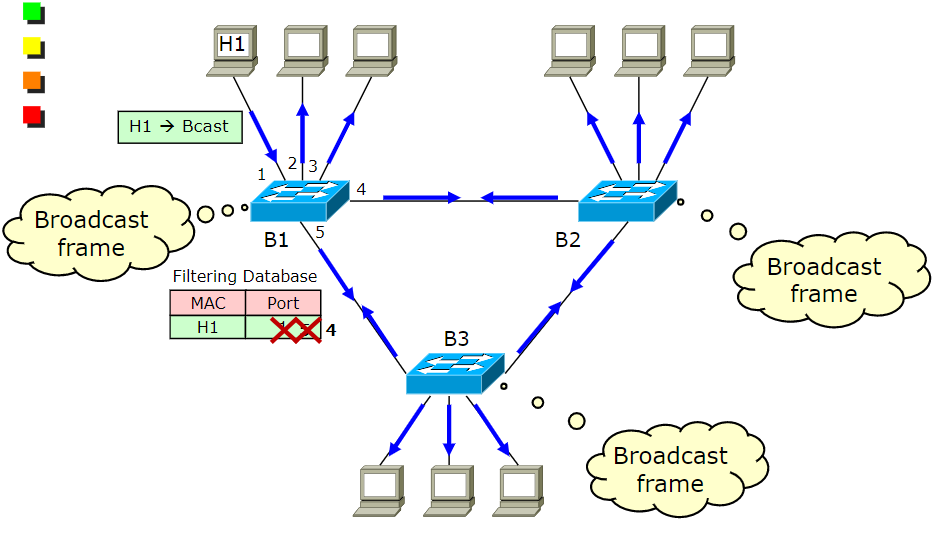{width=400px}

Per risolvere tali problemi è possibile utilizzare lo _Spanning Tree_, in modo da eliminare i cicli nella rete fisica mediante algoritmi che disabilitano temporaneamente i cicli (quando vengono individuate delle maglie vengono disabilitate, in modo da far diventare la rete un albero con un unico percorso da sorgente a destinatario). Altre soluzioni potrebbero essere creare delle reti _looping free_, ma non sono soluzioni sconsigliate in quanto non robuste.

<!-- riguarda bene le slide intorno alla 47, le ha date per scontato -->

## Routers

I **router** sono dei dispositivi di livello 3, non trasparenti, in grado di separare il _dominio di broadcast_.

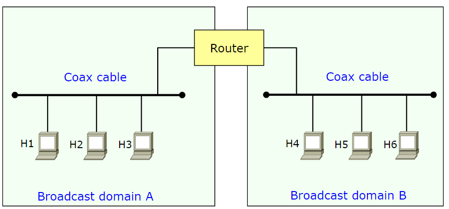{width=400px}

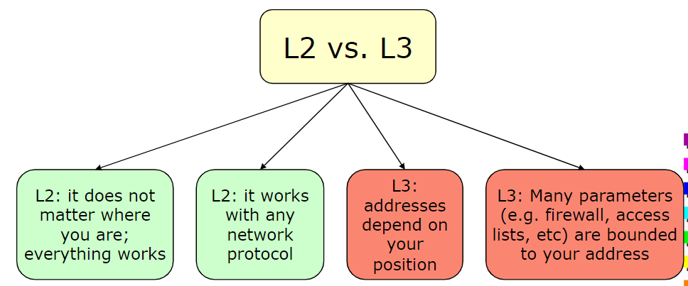{width=400px}

## VLAN

Sarebbe legittimo chiedersi se sia più conveniente utilizzare una singola grande LAN oppure multiple LAN più piccole:

- _Performance_: una singola LAN ha molto più traffico broadcast oppure _flooded_ (ad esempio STP reconfiguration).
- _Privacy e sicurezza_: una singola LAN è più vulnerabile a intrusioni e attacchi.
- _Gestione_: reti più piccole sono più facili da gestire.

Risulta evidente che la scelta migliore sia utilizzare LAN differenti di dimensione minore.

Per ragioni di sicurezza o semplice preferenza, è possibile dividere una rete in più parti generando reti distinte. Se dovessimo fare ciò manualmente cablando separatamente le reti, comporterebbe il dover gestire ciascun edificio con una propria rete che poi, attraverso dei cavi, connettono gli switch dei vari edifici.

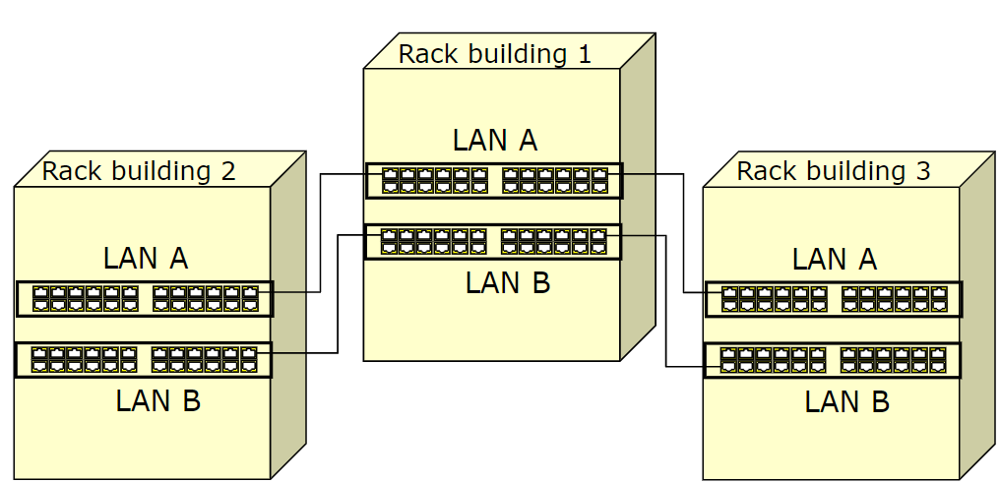{width=350px}

Questo è però indubbiamente molto costoso, perciò sono state realizzate le **Virtual LANs** _(VLAN)_ che consentono a un set di porte specifiche di uno switch di simulare che facciano parte di un **dominio di broadcast differente**, utilizzando un unica infrastruttura di rete. Per far parlare le _VLANs_ è necessario un router con tutte le sottoreti connesse, permettendo la comunicazione in modo tradizionale anche se la rete di origine è in realtà la medesima.

:::danger
**Attenzione**: il traffico di livello 2 non può attraversare le VLANs.
:::

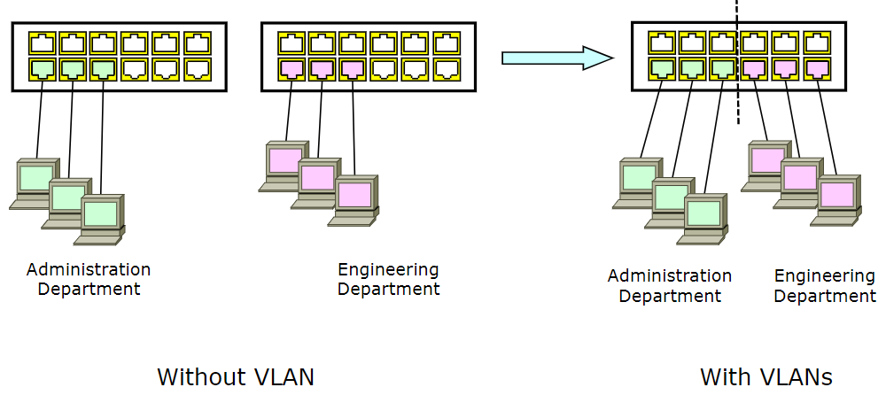{width=400px}

Un altro modo è connettere il router a un unica interfaccia che lavora per entrambe le sottoreti, ottenendo il **one arm router**.

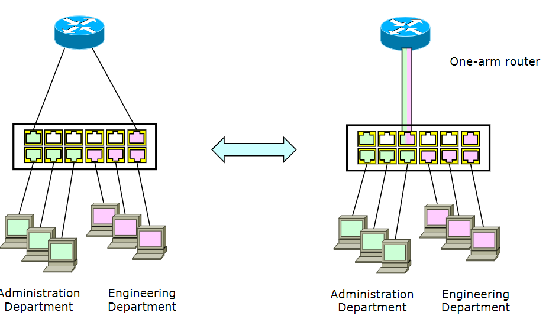{width=400px}

Per connettere più VLAN è necessario un router _(livello 3)_ per eseguire il lookup, l'header di livello 2 viene scartato (non può viaggiare tra VLAN) in favore di uno nuovo creato con un **differente indirizzo MAC**.

Il _broadcast_ non può attraversare _VLAN_ differenti, per questo non è possibile utilizzare _ARP_ per individuare gli indirizzi MAC di un'altra _VLAN_. Gli host di _Virtual LANs_ differenti devono fare riferimento a reti IP differenti.

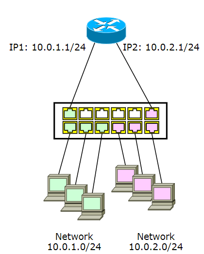{width=400px}

Il modo più semplice per associare un frame a una _VLAN_ è marcarlo all'arrivo in base alla porta attraversata. Se però non si altera la trama, l'informazione sarà evidenziata solo all'interno dello switch locale che ha attraversato ma non agli altri switch. Per superare questo problema è stato introdotto il **tagging**, ovvero un campo aggiuntivo di 4 byte nella trama ethernet contenente il vlanID, in modo da poterlo identificare anche negli switch rimanenti.

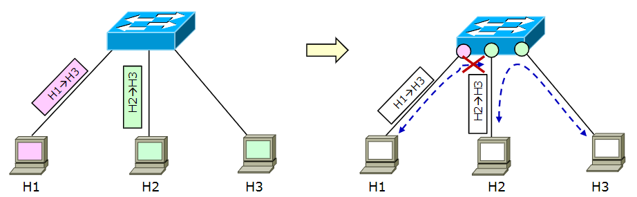{width=300px}

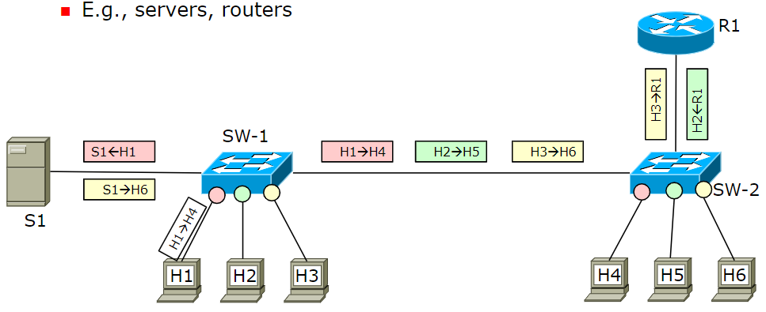{width=300px}

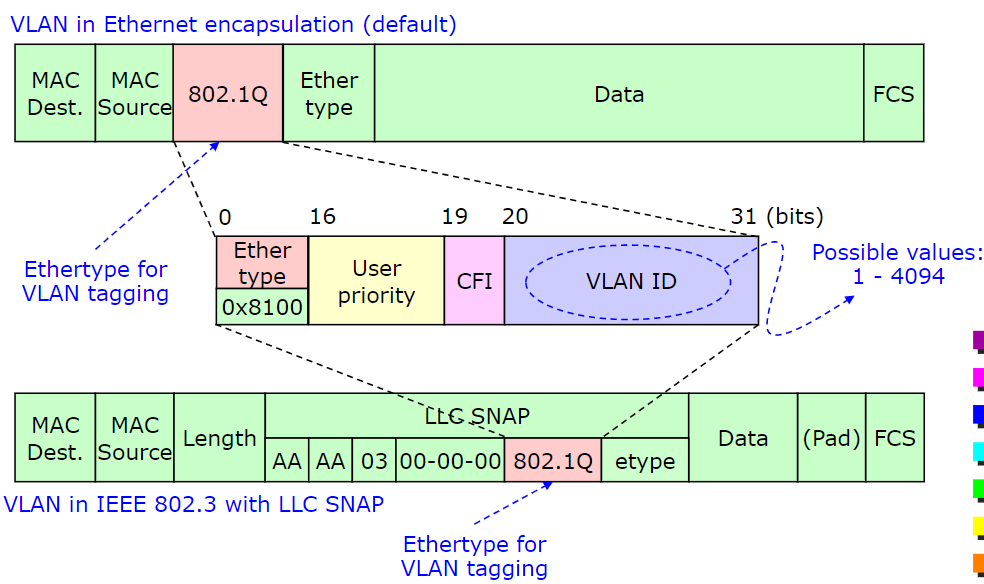{width=300px}

Per fare ciò è necessario apportare delle piccole modifiche al protocollo MAC già esistente, in particolare un nuovo framing (per il tagging) indipendente dall'indirizzo MAC e la lunghezza massima dei frame deve essere estesa di 4 byte.

Le porte si dividono in:

- **access**: inviano e ricevono trame **non taggate** (default sugli end systems come host, switches, servers, routers _ecc_), vengono solitamente utilizzato per connettere end-stations alla rete. Il formato del frame non deve essere cambiato dagli host (che non sa dell'esistenza della VLAN).
- **trunk**: inviano e ricevono trame taggate, dovono essere configurate esplicitamente. Spesso viene utilizzato nelle connessioni switch-to-switch e per connettere server/router.

Nell'immagine che segue, in cui tutte le porte sono di tipo access, l'host `H1` è in grado di comunicare con l'host `H4` in quanto i valori configurati su porte access non sono propagate al di fuori dallo switch.

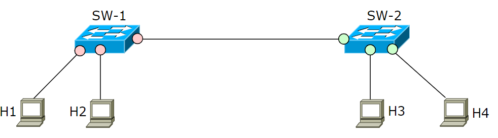{width=300px}

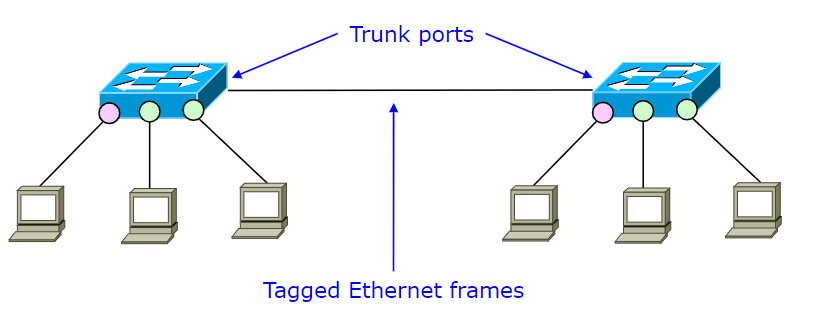{width=300px}

<!-- le slide da 73 compresa in poi non fanno parte dell'esame -->