# Routing

## Introduzione

Con il termine **routing** si fa riferimento al percorso che i pacchetti devono compiere nella rete, mentre **forwarding** il processo di inviare pacchetti nella rete, includendo decisioni di routing.

Distinguiamo il concetto di:

- **routing** _(proactive)_
- **forwarding** _(on the fly routing)_

### Proactive routing

Il **proactive routing** è indipendente dal traffico attuale, definisce quale percorso è migliore rispetto a un altro (in base a una metrica scelta). Determina inoltre quali siano le destinazioni raggiungibili.

:::tip
**Nota**: è solitamente chiamato semplicemente _routing_.
:::

### On the fly routing

Comunemente definito **forwarding**, il **On the fly routing** si occupa di gestire i pacchetti mediante informazioni locali come _routing/forwarding table_. E' il risultato del proactive routing o signaling.

La scelta dipende dal tipo di indirizzamento che si vuole stabilire:

- **routing by network address**: routing in base alla destinazione
- **label swapping** (es. MPLS)
- **source routing**

Si ha una operazione di switching, ovvero trasferire verso una porta di output, oltre che di trasmissione. Ogni protocollo può adoperare una o più di queste strategie.

:::tip
**Nota**: è solitamente chiamato semplicemente _forwarding_.
:::

## Proactive routing algorithms

Gli algoritmi di _proactive routing_ si dividono in:

- **non-adaptive algorithms**: statici
- **adaptive algorithms**: dinamici

### Non adaptive algorithms

I **non adaptive algorithms** si dividono a loro volta in **Fixed Directory routing**, il quale compie _static routing_ ed è configurato manualmente, e il **flooding and derivates** (selective), anche questo con approccio statico che non cambia in base alla rete.

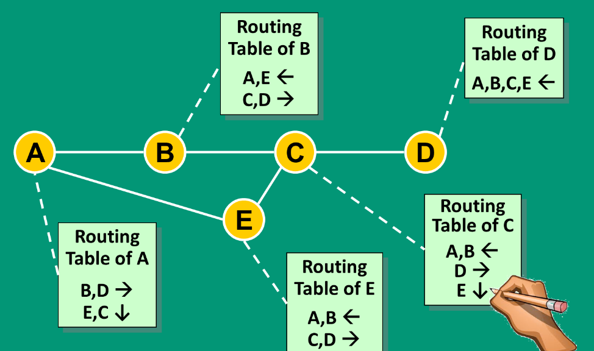{width=350px}

Il vantaggio principale è il pieno controllo della rete da parte dell'amministratore, ma al costo di essere più soggetti ad eventuali errori e di un architettura che non si adatta al cambio di topologia.

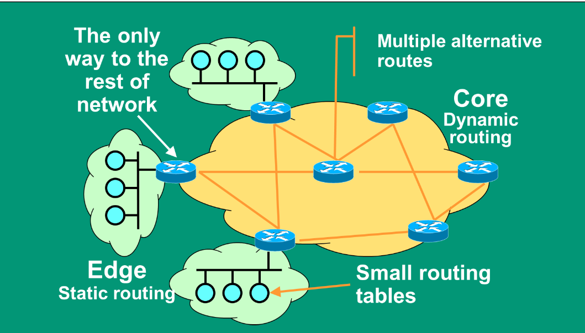{width=350px}

### Adaptive algorithms

Gli algoritmi dinamici si dividono in:

- **centralized routing**
- **isolated routing**
- **distributed routing**, distance vector e link state

In riferimento al **centralized routing**, un unico nodo si occupa di gestire la rete denominata **Routing Control Center** (RCC). Ha bisogno di sapere le informazioni di tutti i nodi per prendere le strategie di routing migliori e ottimizzare le performance. Inoltre, effettua il calcolo e la distribuzione delle routing table. Il vantaggio è che semplifica il troubleshooting anche se è presente un carico di rete significativo in prossimità del RCC. Lo svantaggio è però il rischio che RCC diventi un bottleneck o un single point of failure, per tale motivo non è adatto per reti dinamiche di grandi dimensioni.

Nella **isolated routing** ogni nodo si comporta in modo indipendente senza alcun scambio di informazione. Non si ha dunque garanzia che il pacchetto venga effettivamente trasmesso. Uno scenario plausibile è in una rete lineare.

Nell'approccio **distributed routing** i router collaborano nello scambiare le informazioni sulla connettività. Ciascun router decide indipendentemente, ma in modo coerente. Combina i vantaggi e svantaggi rispetto ai due approcci precedenti.

## Distance vector (Bellman-Ford)

Nel algoritmo **Distance Vector** (DV), facente parte dei _distributed routing_ _(adaptive algorithms)_, ogni nodo invia e riceve informazioni inerenti alla distanza con gli altri router ai nodi vicini. E' un algoritmo distribuito in cui ogni nodo ha la lista completa dei destinatari (tutti). Sono inoltre necessari i transitori (router che non sono destinatari ma che sono necessari per raggiungere la destinazione). Visto che ogni nodo comunica con i vicini, è importante tenere conto della distanza dal announcing routing.

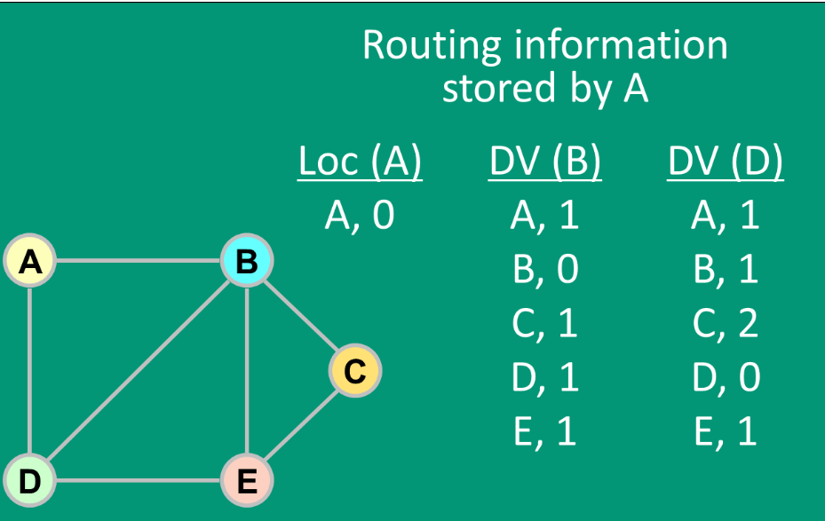{width=300px}

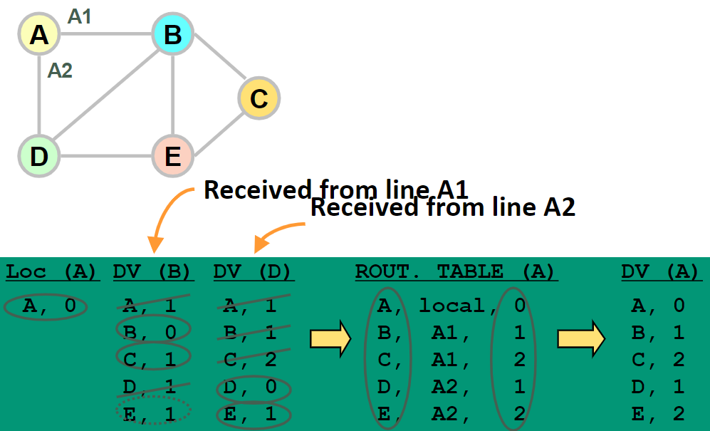{width=300px}

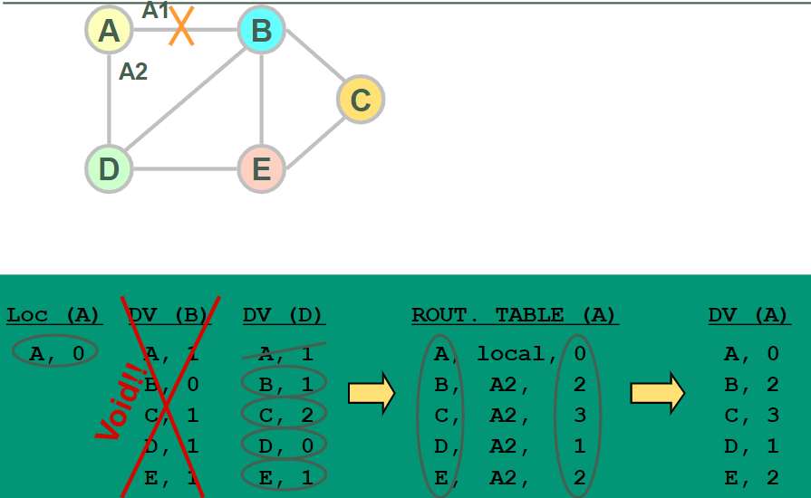{width=300px}

L'algoritmo cerca ogni volta la distanza minore per raggiungere un determinato nodo, tenendo conto dei percorsi alternativi in caso di guasto.

All'inizio ogni router ha solo le informazioni in locale, deve dunque mandare le proprie informazioni ai vicini in modo che si possa propagare nella rete la possibilità di poter raggiungere il nuovo nodo, ad esempio `a`. Il routing avviene a livello 3.

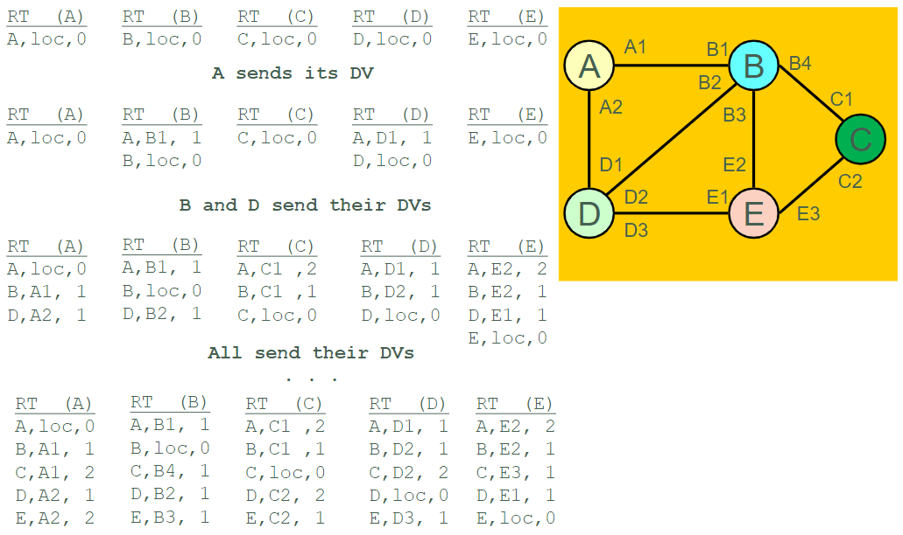{width=350px}

I problemi che si possono riscontrare sono:

- **Black hole**: un nodo non risponde ai messaggi di routing, quindi non si ha più informazioni sulla rete.
- **Count to infinity**: scenario di loop, le informazioni sono propagate all'infinito.
- **Balancing effect**: se un nodo è più vicino ad un altro, ma il percorso è più lungo, allora il nodo più vicino non sarà scelto.

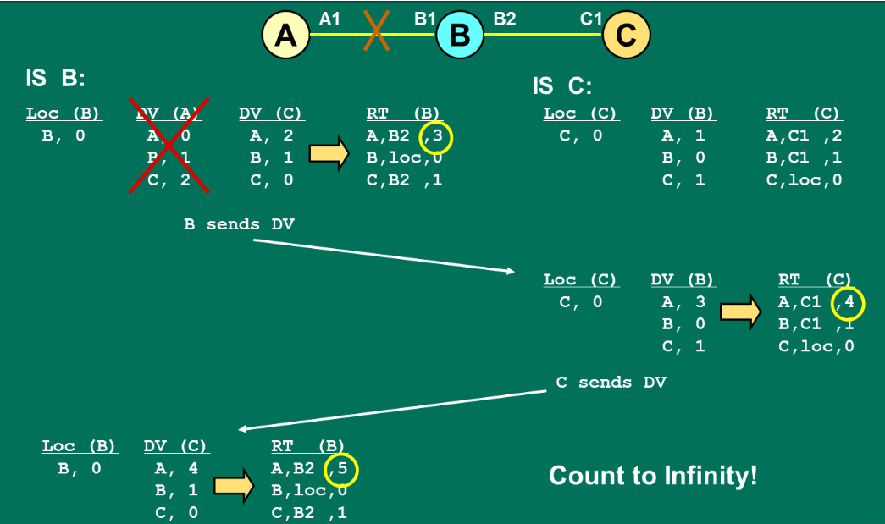{width=350px}

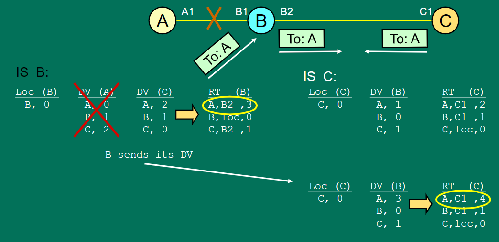{width=350px}

<!-- Lezione16: 23-11-2022 -->

Alcune soluzioni a tali problematiche sono:

- **Split horizon**: se `C` raggiunge `A` mediante `B`, è inutile per `B` provare a raggiungere `A` tramite `C`. Previene cicli tra due nodi, velocizza la convergenza e consente di _"personalizzare"_ le DV per i vicini. Non risolve tutti i problemi quando abbiamo delle maglie chiuse _(mesh)_. Nelle attuali implementazioni la route deve _"scadere"_ dopo un po' di tempo.
- **Path hold down**: se un link `L` fallisce, le destinazioni raggiungibili da `L` vengono considerate non raggiungibili per un certo periodo di tempo _(in quarantena)_. Ha un tempo di copertura elevato e i router che hanno notato l'errore potrebbero non partecipare a un loop fino a quando non è scaduto un _Hold Down timer_.
- **Route poisoning**: le _route_ scorrette sono inoltrate, al posto di essere omesse, ad un costo e distanza infinito in modo da scoprire prima cosa succede nella rete, alla ricerca di guasti. Quando il link fallisce il costo è incrementato, fino a quanto non si raggiunge il costo massimo (denominato infinito) e si ricerca un altro percorso. Il tempo di convergenza è più rapido e può sostituire o essere complementare al _path hold down_ e _split horizon_.

Più varianti sono possibili contemporaneamente, in base al protocollo utilizzato.

{width=400px}

I vantaggi complessivi sono dunque la semplicità di implementazione è la semplicità di deploy per i protocolli, senza necessitare particolare configurazione.

I _routing loops_ si verificano quando le _routes_ hanno un incremento di costo, per questo motivo non vengono utilizzate (sono identificate da due advertisements successivi). E' possibile che succeda con il path hold down, potrebbero essere bloccate route con un incremento legittimo dei costi.

Un esempio di utilizzo può essere _Split Horizon with Poisonous Reverse_, che risulta essere più aggressivo e consente di non aspettare per la _expiration_ di una _route_.

Il caso più estremo ci consente di fare in modo che i router non siano a conoscenza della topologia della quale fanno parte.

La complessità nel caso peggiore relativo al tempo di convergenza va da `O(n^2)` a `O(n^3)`, risulta inoltre limitata dai router più lenti e il set space dei router. Anche il numero di link presenti risulta essere un fattore limitante in termini di prestazioni.

## Path Vector

L'algoritmo **Path Vector** elimina i loop inviando, in aggiunta alle informazioni sulla distanza, le informazioni sui nodi attraversati per raggiungere una determinata destinazione. In questo modo si evitano i loop all'interno dei transitori, ma nonostante ciò è molto utilizzato in quanto è un compromesso con gli svantaggi di entrambi.

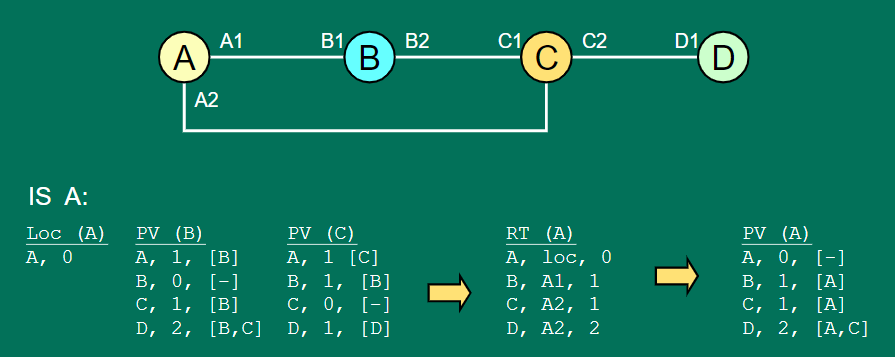{width=350px}

## Link State Routing Algorithm

Nel **Link State Routing Algorithm** vengono inoltrate le informazioni relative a tutta la rete, contenente lo stato di ogni nodo (e non solo di quelli attraversati). In questo modo ogni nodo è in grado di realizzare una mappa locale, inviando le informazioni attraverso un _selective flooding_.

In questo modo La convergenza è rapida e i _link state_ sono piccoli. Il traffico di rete e lo storage sono limitati, in quanto il _neighbor greeting_ è veloce ed efficiente. Raramente genera loop ed è semplice da comprendere e "riparare", ma è più complesso da implementare e configurare.

I lati negativi vedo una implementazione complessa che consegue una difficile configurazione dei protocolli utilizzati.

I _link state_ vengono generati quando avvengono cambiamenti topologici. Nei protocolli attuali i link state sono generati periodicamente in modo da aumentare l'affidabilità.

Per calcolare le informazioni della rete è possibile utilizzare un qualsiasi algoritmo per l'albero di instradamento, come ad esempio l'algoritmo di Dijkstra.

:::note
Per reti piccole potrebbe non essere conveniente utilizzare link state.
:::

:::danger
**Raramente genera loop**, non significa che non lo genera! Potrebbero generarsi in casi di guasti multipli e scenari molto grandi.
:::

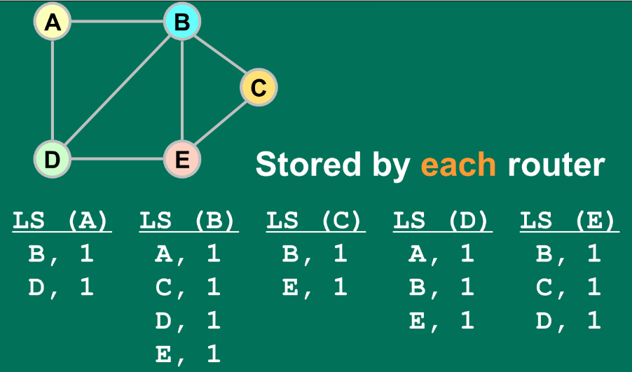{width=350px}

### Algoritmo di Dijkstra

L'**algoritmo di Dijkstra** viene utilizzato per calcolare l'albero di copertura minimo di un grafo (albero di instradamento). Ha una bassa complessità pari ad $O(L\log n)$, con $L$ numero di link ed $n$ numero di nodi. Utilizza un meccanismo di **shortest path first** (ricerca del percorso più breve), dove il prossimo nodo è il più vicino alla sorgente e il _next hop_ è inserito all'interno della _routing table_.

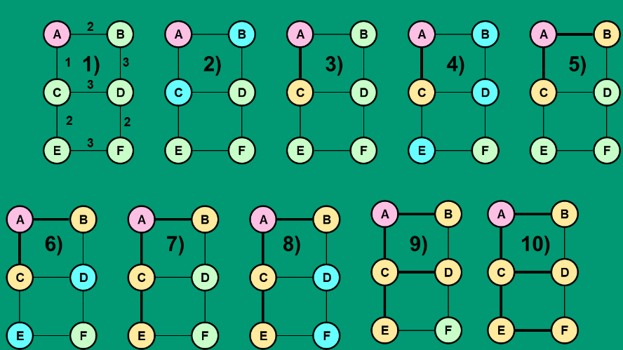{width=350px}

## Internet Routing Architecture

I protocolli di routing viaggiano tra il livello IP e il livello TCP. Un protocollo di routing è il modo con cui si determina le rotte per lo scambio di informazioni attraverso una rete, basandosi su un algoritmo di routing di partenza.

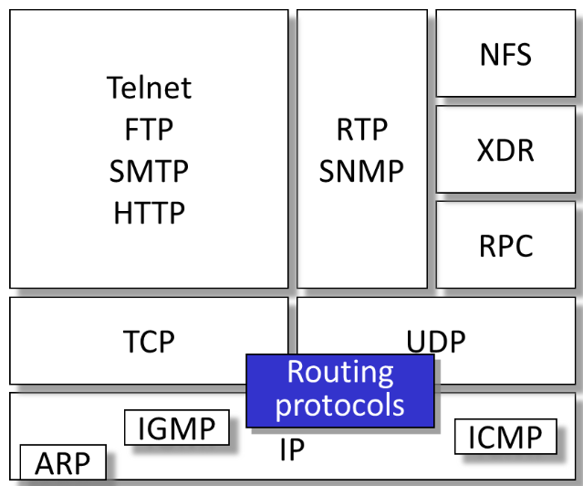{width=350px}

Per i routing protocol è necessario definire delle metriche, il meccanismo di encoding per il pacchetto, i parametri configurabili e lo specifico timing.

Il **dominio di routing** è un insieme di router che utilizzano lo stesso protocollo di routing, che sono connessi a una porzione della rete. Un router potrebbe far parte di più routing domains (utilizzando più protocolli di routing) e può **ridistribuire** le informazioni imparate con un protocollo mediante uno differente. Questo processo è possibile attraverso una conversione delle metriche, utilizzo di filtri di advertisement e _information source priority_ tramite una configurazione dell'amministratore.

### Autonomous System

Un **Autonomous System** (AS) è un set di sottoreti raggruppate in base alla topologia o un criterio organizzativo (ad esempio una subnet di un grande _ISP_). L'indirizzamento e l'instradamento sono strettamente coordinati e l'interfaccia _AS_ è controllata (data, informazioni di routing). Dal punto di vista amministrativo è possibile indicare delle scelte di routing interno autonome e negoziare scelte di routing esterno. E' scalabile, in quanto nessuna delle informazioni è propagata _"ovunque"_ ma è il singolo _AS_ a decidere dove far passare i propri dati.

E' identificato da **due byte** numerici assegnati dalla _IANA (Internet Assigned Numbers Authority)_. Il range di numeri privati va da 64512 a 65534, lo scambio di informazioni di routing è controllato.

All'interno di un AS sono presenti dei dispositivi detti **border gateway**, posizionati al confine tra differenti _AS_. Questi dovranno comunicare tra loro e con i dispositivi interni alla rete, per tale motivo distinguiamo i protocolli in **iBGP** _(intra Border Gateway Protocol)_ per la comunicazione all'interno della rete e **eBGP** _(Exterior Border Gateway Protocol)_ per le comunicazioni tra gli _AS_.

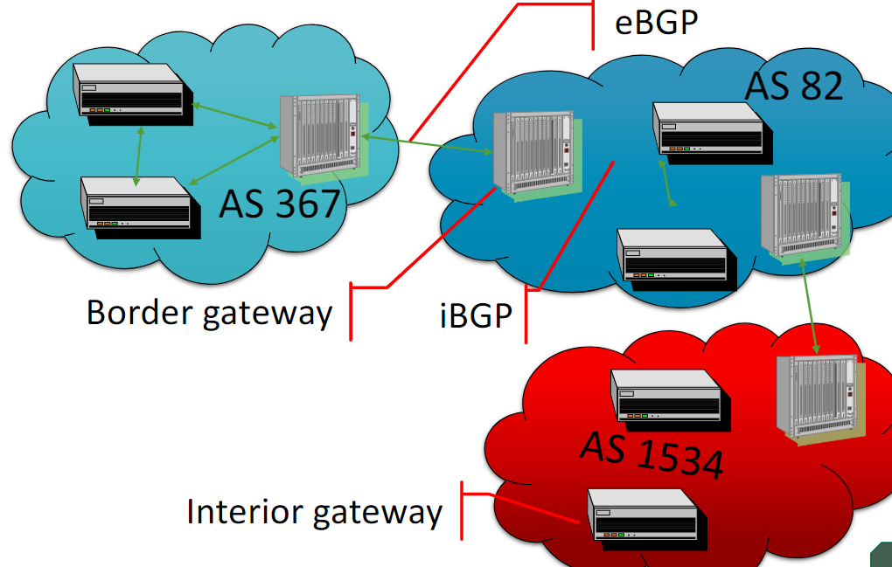{width=400px}

Si definisce **exterior routing** il routing tra _AS_. Questo non deve necessariamente seguire lo _shortest path_ in quanto la scelta viene effettuato in funzioni di alcune _policy_, per tale motivo non si parla più di percorso più _breve_ ma bensì di percorso _migliore_.

Le destinazioni possono essere aggregate (`195.1.2.0/24` e `195.1.3.0/24` in `192.1.2.0/23`) secondo un routing _gerarchico_.

**Neutral Access Point** (NAP) è un punto di accesso neutrale, che permette di collegare più AS tra loro, mentre un Internet eXchange Point (IXP) è un punto di scambio di traffico tra più AS. Sono realizzabili mediante BGP.

In queste reti viene inserito un elemento detto **NAP/IXP** _(Neutral Access Point/Internet eXchange Point)_, ovvero entità terze che mettono a disposizione degli spazi (infrastrutture) dove è possibile che _ISP_ diversi creino delle comunicazioni tra loro. Tramite questi elementi è possibile connettere porzioni di rete senza dover “creare” nuovi canali, ma semplicemente portando tutte le connessioni verso un unico punto.

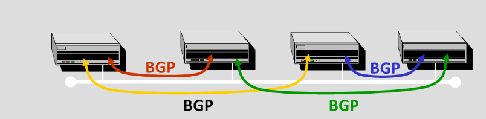{width=400px}

Si definisce _private peering_ la comunicazione che avviene tra due ISP dello stesso tier.

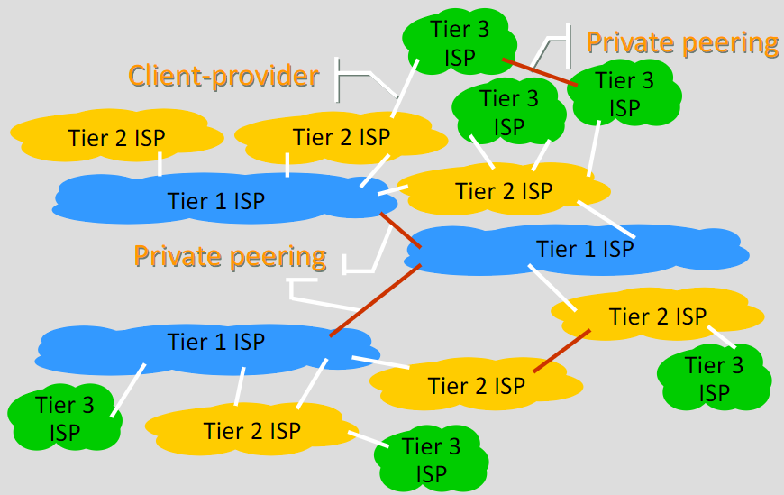{width=400px}

## Protocolli di routing

I protocolli di routing si distinguono in **iGP** (Interior Gateway Protocol) e **EGP** (Exterior Gateway Protocol).

Le _feature_ di **IGP** sono:

- Informazioni distribuite nella topologia
- Le route sono scelte in base alle informazioni della topologia

Le _feature_ di **EGP**:

- informazioni degli _Autonomous System_ distribuite
- Costi amministrativi distribuiti
- Decisioni prese in base alle _policies_ (trova la route _"preferita"_, non necessariamente la migliore)

### Algoritmi IGP

Gli algoritmi di tipo _Interior Gateway Protocol_ si distinguono in:

- **Distance Vector**: comprende **RIP** (Routing Information Protocol) e **IGRP** (Interior Gateway Routing Protocol).
- **Link State**: comprende **OSPF** e Integrated **IS-IS**.

Tali algoritmi consentono di utilizzare differenti metriche rispetto all'hop count, come: delay, bandwidth, reliability, load, maximum packet length. Inoltre, consentono il **multipath routing**, ovvero la possibilità di utilizzare più percorsi per raggiungere una destinazione.

#### RIP (Distance Vector)

**Rip** è stato il primo protocollo di routing proposto, di tipo distance vector, nel 1988. Veniva supportato da macchine Unix e Linux. Come metrica utilizza _Hop Count_, con un tempo di convergenza di 3 minuti e un massimo di distanza di 15 hop.

#### IGRP (Distance Vector)

E' un sistema proprietario di Cisco, ch supera alcuni dei problemi di RIP, diventandone l'unica alternativa nel primo periodo.

#### OSPF (Link State)

**OSPF** fa parte degli algoritmi di _link state_, utilizza un routing di tipo gerarchico. Il routing domain è diviso in aree, in ciascuna delle quali avviene una aggregazione delle informazioni. I router sanno tutti i dettagli delle zone/domain/area, ma non sanno nulla o hanno informazioni limitate relative all'esterno. Può essere iterato.

Nello _strictly hierarchical routing_ non si hanno informazioni sull'esterno. Quando il destinatario del pacchetto non è nella stessa area, viene eseguito il forwarding mediante un edge router. Il routing è limitato in termini di efficacia, ma è altamente scalabile. I path sono _sub-ottimali_, ma si ha perdita di connettività in caso di errori.

Nel _loosely hierarchical routing_ si ha minore scalabilità in quanto i router devono mantenere e scambiare più informazioni, ma non è richiede _strictly hierarchical addressing_. Tutti gli host nel _dominio B_ non hanno bisogno di un identificatore comune, bensì vengono utilizzati dei prefissi. E' possibile implementarlo in IPv4.

Ogni area avrà una visione completa della propria topologia interna, ma verso l'esterno soltanto i collegamenti per parlare con le altre aree, avendone una visione aggregata conoscendone i router di _frontiera_.

Per $N$ router si hanno $N^2$ adiacenze (dunque link). La complessità di Dijkstra è lineare nel numero di link.

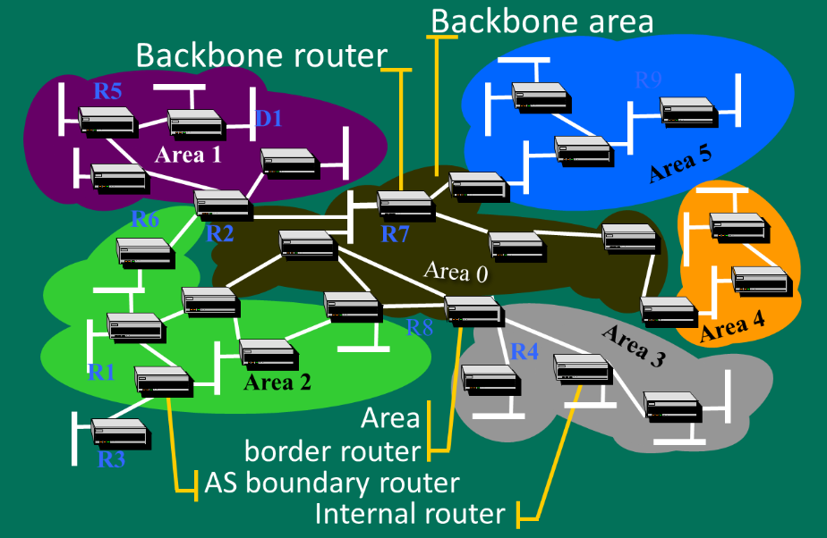{width=350px}

#### IS-IS (Link State)

L'algoritmo **IS-IS** è una variante del protocollo **OSPF**, oltre a essere una estensione del protocollo _OSI_. Utilizza routing di tipo gerarchico con diversi livelli. Viene ancora utilizzato, ma non è più diffuso nelle nuove strutture (soppiantato da _OSPF_). Ha avuto utilizzo in grandi reti e _ISP_.

<!-- rivedi le slide intorno a 91 -->

### Algoritmi EGP

Gli algoritmi di tipo _Exterior Gateway Protocol_ sono **BGP** (Border Gateway Protocol) e **IDRP** _(Inter Domain Routing Protocol)_. Anche il routing statico è una opzione possibile. Questi non sono ne completamente _distance vector_ ne _link state_.

#### BGP

**BGP** è attualmente alla versione 4. Utilizza _Path Vector_ dove le destinazioni sono una sequenza di _Autonomous System_ attraversati. E' ricco di attributi ed è possibile configurare la _route computation policy_.

Il _vector exchange_ avviene su _TCP_ (per maggiore affidabilità) solo a seguito di un cambiamento. Vengono create delle sessioni tra _vicini_ per lo scambio di informazioni mediante una configurazione specifica, senza la necessità per la connettività diretta.

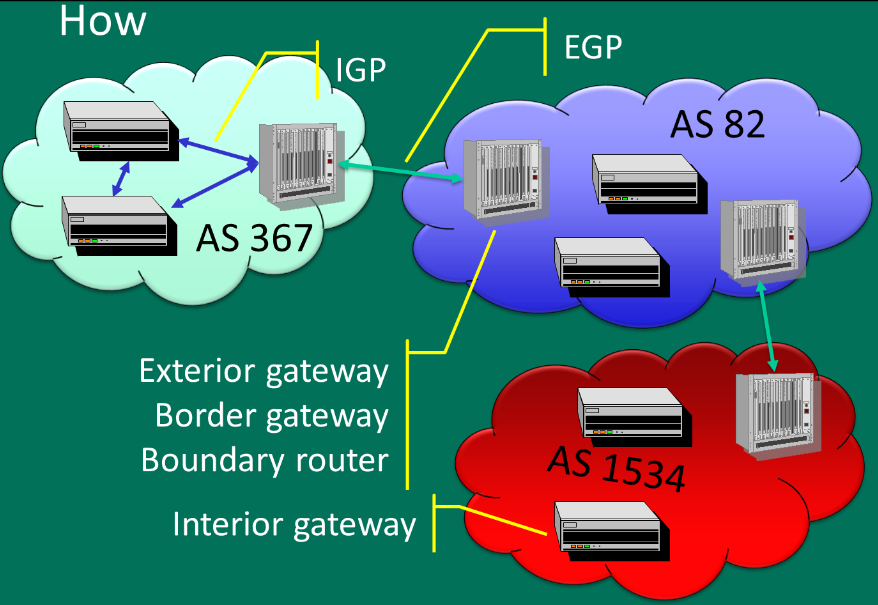{width=350px}

#### Inter Domain Routing Protocol (IDRP)

L'algoritmo **IDRP**, _Inter Domain Routing Protocol_, utilizza TCP/IP e rappresenta un evoluzione di _BGP_ per OSI. Doveva essere _"la"_ soluzione per IPv6, ma nel concreto non è molto utilizzato.
