# MPLS
<!-- lezione17: 29-11-2022 -->

**MPLS** è una tecnologia importante in quanto permette la realizzazione di un nuovo tipo di rete pubblica basata su IP, dove con rete pubblica si intende una rete con traffico di diversi utenti e aziende su cui è possibile vendere dei servizi.

Una struttura utilizzata molto in passato era a _"cipolla"_, con vari strati di livelli protocollari che comunicano tra di loro per implementare varie funzionalità. Ciò comportava però una conoscenza orizzontale da parte dei tecnici su più tecnologie che dovevano comunicare tra di loro.

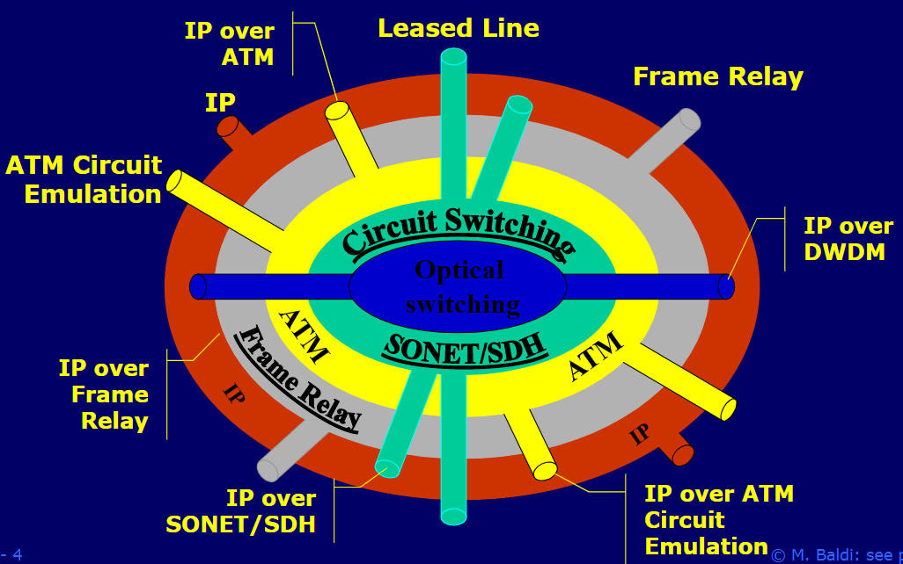{width=400px}

MPLS consente di eliminare questa struttura utilizzando un solo livello protocollare, abbattendo i costi degli operatori.

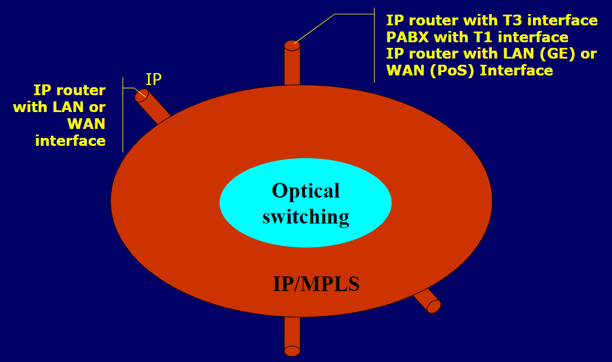{width=400px}

L'inoltro dei pacchetti avviene attraverso l'aggiunta di una **etichetta**, in base alla quale il routing effettua il forwarding invece di guardare l'indirizzo IP di destinazione e consentendo l'invio verso multiple destinazioni usando le etichette come indice. Il motivo di questo approccio risiede nella **maggiore rapidità**: se utilizzassimo l'indirizzo di destinazione bisognerebbe eseguire il _longest prefix matching_ cercando il prefisso più lungo nel quale l'indirizzo IP di destinazione è contenuto (su tabelle molto grandi).

Oggi è ancora molto utilizzata per il _traffic engineering_, ovvero la distribuzione del traffico nella rete.

{width=400px}

Quello che fa MPLS è dunque far diventare IP _connection oriented_. Lo svantaggio di tale approccio è la necessità di creare una connessione per la comunicazione per poi eliminarla, ma aver implementato IP in modo connection-less ha però generato dei problemi più grandi. La rete continua ad essere a _commutazione di pacchetto_, ma semplicemente esiste un concetto di circuito virtuale che non occupa risorse quando non utilizzato.

## Architettura di rete

_MPLS_ non utilizza gli _end system_ e può essere utilizzato in una porzione di una rete, denominata **MPLS Cloud** (non ha correlazione con il cloud computing).

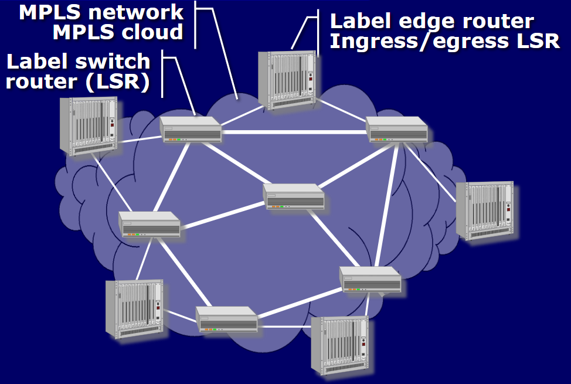{width=400px}

Osservando l'immagine si può vedere:

- **LSR**: _Label Switching Router_,  eseguono la _commutazione a pacchetto_ basata su etichetta.
- **Label Edge Router**: router che non ha altri router MPLS collegati, posti al bordo della rete. Compiono l'aggiunta dell'etichetta quando un nodo entra nella rete e la rimuovono prima che esca.
- **LSP**: _Label Switch Path_, percorso di comunicazione attraverso cui viaggiano i pacchetti, in modo che più stazioni possano comunicare tra di loro.

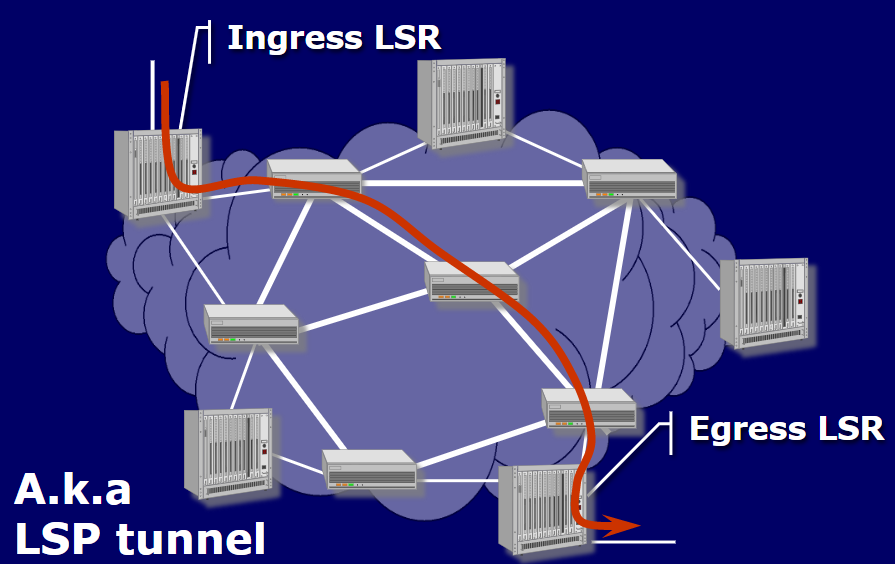{width=400px}

L'etichetta viene cambiata a ogni nodo, in modo da mantenere una etichetta più corta e poterla riutilizzare senza dover mettere d'accordo i nodi (in quanto in caso contrario dovrebbero essere uniche nella rete, in questo modo uniche nel nodo). Questa tecnica prende il nome di **label switching** e consente di ottenere scalabilità.

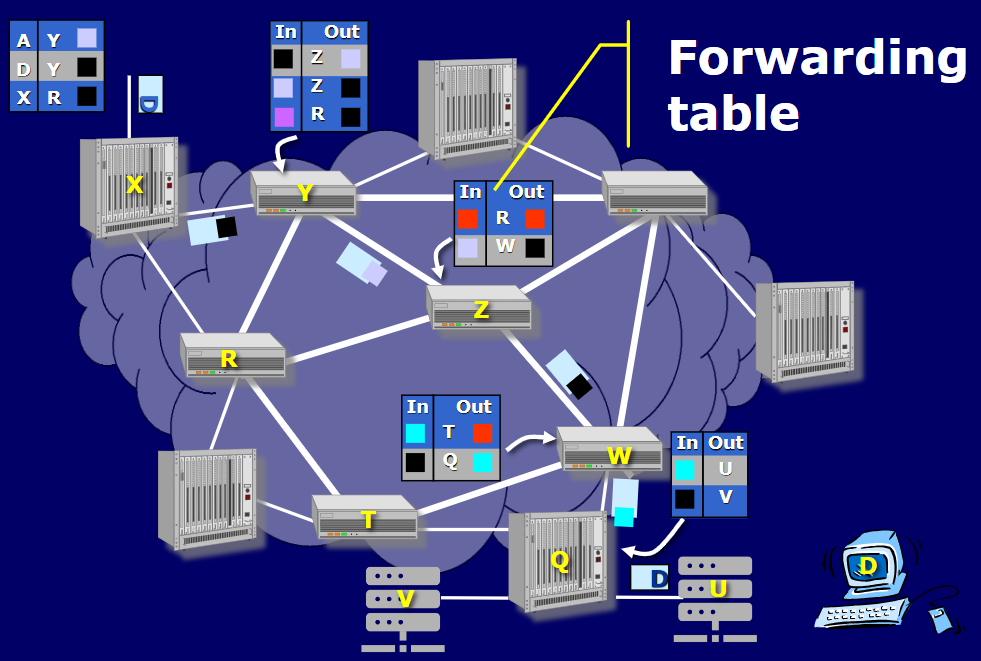{width=400px}

Gli elementi chiave di MPLS sono:

- **header MPLS**, contiene l'etichetta.
- **protocolli** per la **distribuzione** delle etichette
- **protocolli** di **routing** migliorati e modificati

:::tip
**Riassumendo**: Il vantaggio è quello di utilizzare un solo protocollo per la gestione delle comunicazioni tra i nodi e anche verso l'esterno.
:::

## Storia di MPLS

A differenza di _IPv6_, **MPLS** è stato utilizzato da subito in produzione riuscendo a risolvere problemi di attori molto differenti.

Inizialmente venne implementato il _tag switching_ da parte di Cisco nei propri sistemi per sostituire il _longest prefix matching_.

Fino a qualche anno fa si ipotizzava che lo standard di trasmissione **ATM** _(Asynchronous Transfer Mode)_ avrebbe soppiantato internet in quanto molto superiore, ma ha come problematica il costo troppo elevato per la struttura (nessun problema di risoluzione indirizzi, signaling semplificato e un solo piano di controllo). Una prima soluzione fu quello di utilizzare ATM con IP, riutilizzando l'hardware del _ATM switching_. Venne successivamente introdotto **MPλS** _(lambda!)_, acronimo di _Multi-Protocol Lambda Switching_.

Ha seguito **G-MPLS** _(Generalized MPLS)_, il quale ha introdotto:

- Packet switching
- Cell switching
- Circuit switching (SONET/SDH)
- Lambda switching
- Anything switching
- Unifying control plane

## Header MPLS

L'header **MPLS** è di livello 2 ed è composta da più moduli uniti che per tale motivo viene chiamato anche _shim header_. Ogni modulo è composto da:

- **label**: _20 bit_, l'etichetta da trasmettere. La lunghezza consente il passaggio fino a un milione di flussi sullo stesso link.
- **exp**: experimental bits, 3 bit. Utilizzati per il _Class Of Service_, ovvero per dividere in classi di servizio.
- **S**: _bottom of stack_, 1 bit, è posto a `1` se è l'ultimo modulo dello stack, `0` altrimenti. I
moduli vengono gestiti come uno stack e l’aggiunta/rimozione avviene sempre dalla testa.
- **TTL**: _time to live_, 8 bit.

Nel caso di _ATM_ e _frame relay_ veniva utilizzato il _label switch_, dunque negli header di livello 2 erano già presenti dei campi per contenere l'etichetta. Per tale motivo si è scelto di riutilizzare tali campi invece di aggiungerne di nuovi:

- _VIC/VPI_ in ATM
- _DLCI_ in frame relay

In questi casi non si guarderà il modulo MPLS ma i suddetti campi dei moduli già presenti. In questo modo il costruttore di apparati ATM non deve cambiare l'hardware ma bensì solamente il software, contribuendo a migliorare lo standard. Questo fa in modo che degli switch ATM/Frame Relay diventino degli switch MPLS.

## LSP setup - selezione del path e delle etichette

Una **FEC**, _Forwarding Equivalence Class_, è un insieme di pacchetti che hanno lo **stesso destinatario**, dunque un _LSP_ è un percorso di comunicazione che viene utilizzato per trasportare un _FEC_. Tali pacchetti sono trattati nello stesso modo da ciascun LSR e seguono la stessa strada in una rete MPLS, ricevendo la medesima label.

Quando viene creato un LSP, sono necessarie tre operazioni da parte degli _LSR_:

- **label binding**: associazione dell'etichetta.
- **label mapping**: creazione della riga nella tabella di forwarding, tra ingresso e uscita.
- **label distribution**: l'etichetta scelta deve essere comunicata a uno o più nodi vicini.

### Label Binding

Nel **Label Binding** un _LSR_ determina l'etichetta che deve essere utilizzata per i pacchetti di una determinata _FEC_. Il _binding_ viene effettuato in modalità **downstream**, ovvero tra due nodi che si trovano ai capi di un link il _binding_ è eseguito da quello a valle.

Per sapere di dover usare tale etichetta, l’_LSR_ deve essere notificato, e può farlo in due modi:

- **unsolicited**: senza una richiesta diretta.
- **on-demand**: in seguito a una richiesta.

### Label Mapping

Il label mapping esegue l'associazione tra una etichetta di ingresso, scelta dal _LSR_ considerato, e una etichetta di uscita, scelta dal _downstream LSR_, per riuscire a raggiungere il next hop in base al routing.

### Label Distribution

Quando un router ha effettuato il binding di una etichetta, deve comunicare tale etichetta ai nodi vicini, in modo che questi possano fare il _mapping_ (almeno al nodo di upstream). Tale operazione è detta **label distribution** e serve a notificare l'etichetta scelta per una data _FEC_, in seguito al _label binding_.

### Label Binding statico (e mapping)

Il **label binding statico** avviene attraverso un gestore di rete (in modo equivalente al _PVC_ in _ATM_) che stabilisce e impone l'etichetta ai nodi della rete. Non è scalabile e non è c'è interoperabilità tra i sistemi di controllo. Inoltre, è impossibile avere un _LSP_ che attraversa più operatori.

### Label Binding dinamico
<!-- lezione 18: 30-11-2022 -->

Il **label binding dinamico** può essere scatenato in due modi:

- **data/traffic driven**: innescato dall'arrivo di un pacchetto.
- **control driven**: ovvero innescato dai messaggi di controllo che può essere di segnalazione o di routing.

#### Control Driven Label Binding

La creazione degli **LSP control driven** da origine a due tipi di LSP diversi:

- **topology based**: il router scopre che esiste una destinazione, in base alla topologia della rete, dei percorsi e delle destinazioni dunque gli _LSR_ (_Label Switching Router_) creano degli _LSP_ (_Label Switch Path_) per le destinazioni.
- **creazione esplicita degli LSP**: avviene una segnalazione esplicita, inizializzata dai _LER_ _(Label Edge router)_. Avviene _on-demand_.

### Protocolli per la Label Distribution

La distribuzione delle etichette avviene attraverso dei protocolli, in particolare ne esistono 3 (non compatibili tra di loro):

- **BGP**: utilizzo di un protocollo di routing, solo topology based (quando vengono segnalate le destinazioni vengono mandate anche le etichette).
- **LDP**: _Label Distribution Protocol_, è un'evoluzione del _Tag Labelling_ di Cisco, attualmente deprecato. Poco utilizzato perché, essendo un sistema proprietario, si aveva paura di avvantaggiare Cisco.
- **RSVP**: _**R**esource re**S**er**V**ation **P**rotocol_, utilizzato per l'allocazione di servizi integrati all'interno delle reti.

## Protocolli di routing

I **protocolli di routing** servono per determinare il percorso che sarà compiuto da un _LSP_, attraverso i quali verranno realizzate le tabelle per il _label mapping_ e verrà deciso il next hop mediante il _packet routing_.

I protocolli di routing utilizzati sono in realtà quelli già esistenti:

- _OSPF_
- _IS-IS_
- _BGP-4_

:::note
RIP non viene utilizzato perché non funziona bene su reti di grandi dimensioni.
:::

Tali protocolli vengono modificati per trasportare informazioni riguardo alle scelte di routing, oltre a quelle topologiche, e porre dei vincoli come:

- capacità dei link
- utilizzo dei link
- dipendenze tra i link (utilizzato per il recupero dei guasti)

Le versioni modificate per il _Traffic Engineering_ prendono il nome di _OSPF-TE_ ed _IS-IS-TE_, dove _TE_ è un acronimo per _Traffic Engineering_.  _BGP_ non viene usato per fare _constraint based routing_.

### Modalità di Routing

Le **modalità di routing** sono due:

- _hop by hop routing_: soluzione classica.
- _explicit routing_: utilizzo di informazioni che variano in modo dinamico.

#### Hop by hop routing

Nel **Hop by hop routing** ciascun _LSR_ decide il prossimo _hop_, dunque un _LSR_, del percorso _LSP_. Il principio è lo stesso del _IP routing_ tradizionale.

La procedura avviene nei seguenti passi:

- viene scelta una label per l'upstream link (label binding)
- la label viene mappata all'indirizzo della interfaccia del prossimo LSR (next hop)
- la label viene annunciata dal LSR che segue

#### Explicit constraint based routing

Nel **Explicit constraint based routing** un singolo switch sceglie il percorso per l'intera _LSP_, oltre al _FEC_. Il percorso potrebbe non essere ottimale, ma almeno si evita il rischio di fare percorsi circolari (il nodo deve avere le informazioni su tutta la rete). Viene poi condiviso il percorso esplicito da compiere.

La scelta del percorso avviene mediante **Constraint Based Routing** (mediante vincoli), ma la distribuzione delle operazioni tra nodi è impossibile in quanto non c'è un unico criterio per scegliere il percorso e possono esserci vincoli in conflitto. Inoltre potrebbe essere difficoltoso mantenere i vincoli e le informazioni sincronizzate, in quanto variano più velocemente delle informazioni relative alla topologia.
<!-- da rivedere meglio -->

Per tale motivo i protocolli per la distribuzione delle etichette sono modificati in modo da supportare informazioni su quale è il percorso scelto.

In particolare sono utilizzati:

- **CR-LDP**: _**C**onstraint based **R**outing **L**abel **D**istribution **P**rotocol_
- **RSVP-TE**: _Resource Reservation Protocol Traffic Engineering_

Questi vengono utilizzati con _OSPF-TE_ e _IS-IS-TE_.

Le modifiche adoperate permettono:

- **Traffic Engineering**
- garantire la **qualità del servizio** _(QoS)_
- _per-class traffic engineering_ (in sinergia con DiffServ)
- recupero dai guasti rapido, meno di 50 ms

## Traffic Engineering

I pacchetti, quando spediti mediante _IP_, vengono inviati verso le destinazioni realizzando quello che è un fenomeno a _"imbuto"_ , comportando aggregazione che sfocia in una riduzione delle prestazioni. Una soluzione potrebbe essere comprare nuovi router, ma questi diverrebbero inutili al termine dell'intasamento.

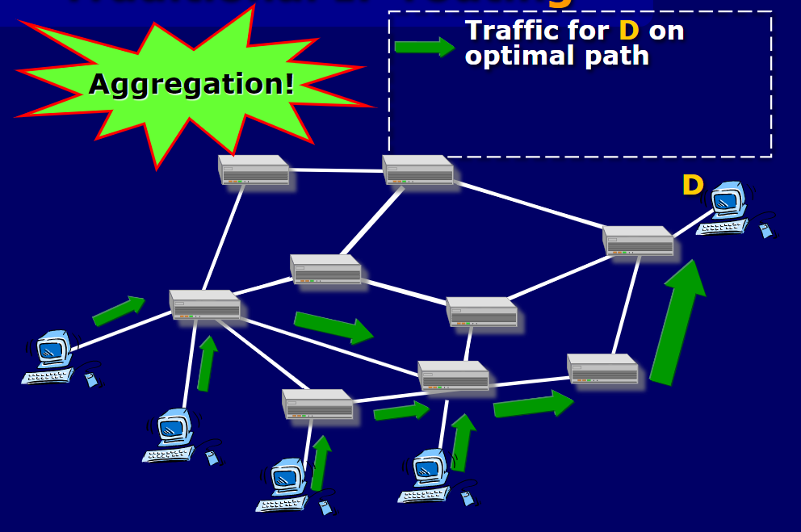{width=350px}

Il traffic engineering si pone come soluzione per consentire la ridistribuzione del traffico **non in base alla destinazione**, ma in modo **omogeneo** evitando la congestione.

Se si scegliesse di inviare pacchetti in modo tradizionale mediante IP in accordo al carico di ogni link, ogni volta che il router ricalcola i percorsi e i next-hop sono cambiati viene aggiornata la tabella con i nuovi percorsi di rete. Questo causa un inversione di tendenza tra i carichi che iniziano a cambiare molto velocemente causando **instabilità**.

In _MPLS_ la situazione è diversa perché l’inoltro basato sulle etichette permette di separare il _piano di controllo_ dal _piano dati_. Nel _piano di controllo_ i router raccolgono le informazioni di routing e calcolano le _routing table_. I pacchetti, però, non vengono inoltrati in base al contenuto delle _routing table_, ma in base alle _forwarding table_ che si sono create facendo il mapping (realizzate durante la distribuzione delle etichette nel setup del _LSP_). Anche se la routing table viene aggiornata, la forwarding table non cambia. Perciò il traffico inviato inizialmente, anche se la routing table viene aggiornata, continua ad andare sul percorso creato in precedenza. Il nuovo traffico, invece, seguirà il percorso aggiornato. Ciò è possibile perché il piano di controllo lavora sugli indirizzi IP, mentre il piano dati lavora sulle etichette.

In _MPLS_ non c'è un aggiornamento costante tra piano di controllo e piano dati, a differenza di IP, consentendo il _traffic engineering_. Senza _MPLS_ l'alternativa era _ATM_ con due _control plans_ (i router sono ATM-unware), comportando però una ridotta scalabilità e un alto numero di adiacenze.

MPLS è IP-aware, è presente solo un _control plan_ operativo su una topologia fisica, rendendo il tutto più scalabile e semplice.

MPLS vede alcune estensioni come:

- **MPλS**, ovvero _MPLS control plans_ su rete ottica.
- **GMPLS**, ovvero _Generalized MPLS_, estensione di MPLS per supportare più tipi di rete (pacchetti, circuito, optics, etc).

## CoS e QoS

Le risorse e le modalità di servizio potrebbero essere associate a un _FEC_ alla creazione di un _LSP_. E' richiesto un supporto esplicito nel data plan e control plan del LSR.

### Class of Service (CoS)

La **CoS** _(Class of Service)_ è un insieme di parametri che descrivono il servizio richiesto. Consente una priorità relativa tra _FEC_ differenti ed è in grado di fornire un garanzia assoluta.

Supporta il modello _DiffServ_ con un comportamento _per-hop_, _EF_ (expedite forwarding) e _AF_ (assured forwarding), oltre al _class traffic engineering_ (ds-aware traffic engineering).

### Quality of Service (QoS)

La **QoS** _(Quality of Service)_ garantisce specificatamente:

- bandwitdh
- Delay
- burst size

I vantaggi di _QoS_ in _MPLS_ sono vari, tra questi vi è la possibilità di avere una rete unificata in grado di supportare tutti i tipi di servizi (messaggio di marketing).

Il supporto per QoS e i servizi real time su IP non è ancora pronto.

Molte reti multi servizio utilizzano ora un paradigma "ships in the night", dove i protocolli ATM sono per servizi tipici di ATM ed MPLS control plan è utilizzato per i servizi IP.

## Fast fault recovery

In _MPLS_ è garantito il recupero rapido dai guasti mediante link re-routing e edge-to-edge re-routing.

Una volta creato un _LSP_, se un link si rompe il protocollo di routing se ne accorge e ricalcola la _route_, ma il piano dati continua a inviare pacchetti in base alla tabella di forwarding che non cambia. Per risolvere a tale problema, si può allora creare un ulteriore _LSP_ che funge da **backup** del link, fatto non quando il link si rompe ma a priori (e utilizzato al momento della rottura).

Quando due nodi si scoprono, si crea un _LSP_ lungo la rete che permettano a questi due nodi di inviarsi pacchetti. Se il link diretto si rompe, sarà presente un LSP che permetterà di andare verso Y.

Quando il link si rompe, verrà aggiunta un’ulteriore etichetta a quella già presente. Y saprà che quando arrivano con una certa etichetta (cioè sono per Y) dovrà rimuovere l’etichetta più esterna e procedere normalmente. Tale processo è molto veloce ed è detto _link re-routing_.

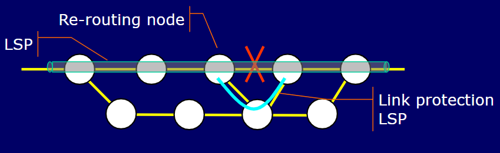{width=300px}

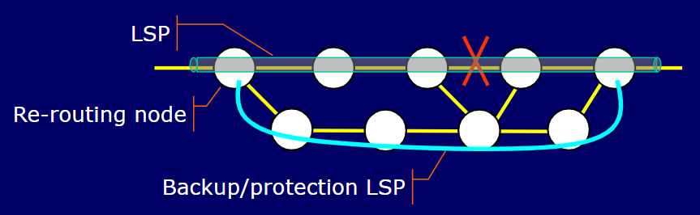{width=300px}

<<!-- slide73? -->

## Gerarchia e scalabilità

Utilizzare più etichette aiuta a generare una gerarchia tra reti _MPLS_ diverse che contribuisce alla scalabilità della rete. Utile soprattutto per instradare pacchetti in punti geografici molto lontani, quando un ISP non ha connettività diretta verso tale destinazione. Ciò comporta una riduzione delle routing table e delle forwarding table.

Le etichette _MPLS_ introducono gerarchie su più livelli, a seconda di quanto richiesto per la scalabilità. Le tabelle di routing dei router di transito non devono essere necessariamente complete, in quanto LSP è gestito tra gli _edge router_.

In questo modo è più semplice e veloce gestire il match delle etichette piuttosto che il _longest prefix matching_.

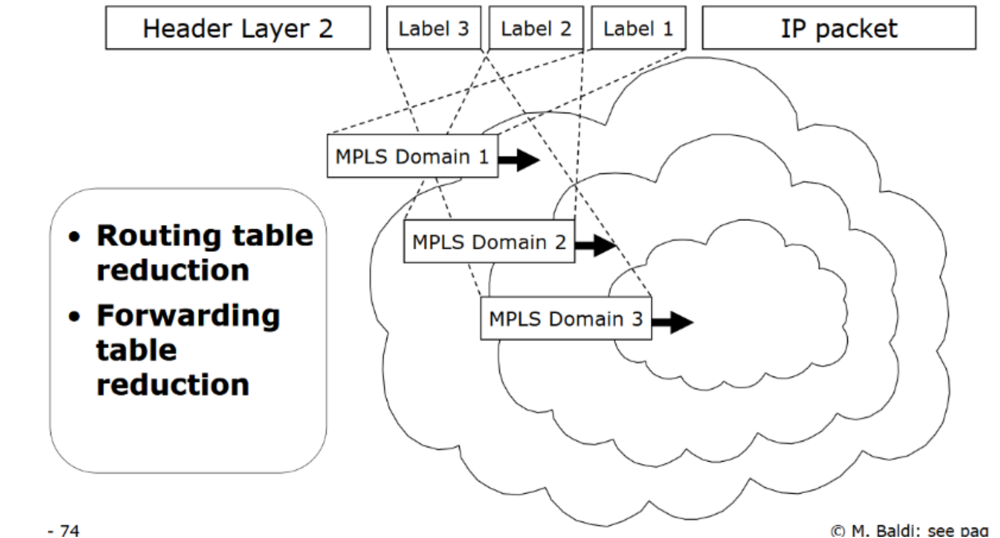{width=350px}

## Penultimate Hop Popping (PHP)

Nel **Penultimate Hop Popping** _(PHP)_, il penultimo nodo esegue il pop della label dal _LSP_, in modo da non doverlo fare il nodo di destinazione. Il **Label Edge Router** _(LER)_ indirizza il pacchetto in base all'indirizzo IP (o la prossima label nello stack).

La distribuzione di label 3 indica un implicito PHP, in quanto l'_edge router_ vede che il _next hop_ è all'esterno.

Per qualsiasi router sull'ultimo hop avviene lo swap sull'etichetta 0.

Il PHP si divide in:

- **PHP implicito**: l’etichetta più esterna viene rimossa
- **PHP esplicito**: l’etichetta non viene rimossa, ma ci si scrive “0” all’interno

## MPLS VPN

E' un tipo di VPN che utilizza il backbone MPLS e permette di collegare tra loro molteplici reti **private/aziendali** anche molto grandi che utilizzano lo stesso range di indirizzi privati.
Come le altre soluzioni VPN permettono di instradare pacchetti verso la destinazione corretta anche se l'indirizzo ip è lo stesso andando in questo caso a creare un TUNNEL _LSP_.
Questi tunnel _LSP_ non guardano più l'indirizzo di destinazione ma l'etichetta che è stata aggiunta in entrata della rete MPLS.

### Componenti

Le componenti principali di un _MPLS VPN_ sono:

- **P routers**: detti Provider Router e sono i router interni ad una rete VPN MPLS che si occupano di eseguire il setup degli _LSP_ per collegare tra loro tutte le coppie di _LER/PE routers_.
- **PE routers**: detti Provider Edge sono i LER della rete VPN MPLS e si occupano di scambiare le informazioni di routing. Utilizzano _I-BGP_ (Interior-Border Gateway Protocol) in soluzioni basate su BGP, oppure IGP in soluzioni VR. I PE hanno diverse tabelle denominate _VRF_ _(VPN Routing and Forwarding Table)_ che consentono di creare delle tabelle di routing separate. Viene effettuato il forwarding delle informazioni utilizzate per il traffico ricevuto mediante la porta.
- **CE router**: sono i Costumer Edge e sono gli apparati collegati con i _PE routers_ che possono essere switch ethernet dei provider o router dei provider. Fa _advertise_ verso le destinazioni e riceve gli _advertise_ da altre destinazioni VPN. Utilizza _static routing_ o _IGP_ (Interior Gateway Protocol).

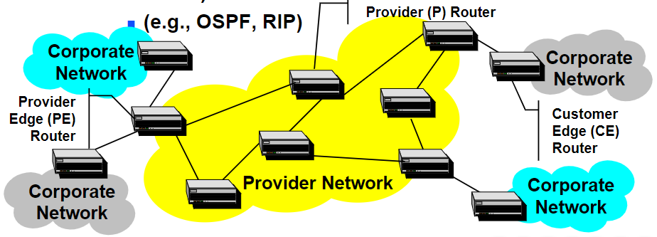{width=400px}

### PWE3

**PWE3**, ovvero **Pseudo Wire Emulation End-to-End**, è una soluzione VPN di **livello 2** che crea un circuito fisico virtuale tra 2 LER/PE che vengono configurati a priori (non c'è routing, è come un cavo generato utilizzando un _LSP_) per gestire il traffico che deve passare tra 2 CE. 
Deve essere configurato manualmente perchè non si può automaticamente sapere verso quale CE deve andare il traffico in entrata.
Questo metodo permette di collegare come un CE anche degli switch di rete o centralini telefonici.

Esistono molti servizi nella stessa rete come IP, leased lines, frame relay, ATM ed ethernet.

Per il funzionamento vengono utilizzate due etichette:

- **esterne**: per il routing nella rete, identificazione dell'access point alla rete (per far arrivare il pacchetto tramite _LSP_ al PE di destinazione corretto)
- **interne**: per il multiplexing di molti utenti/servizi sullo stesso access point (permette al PE di destinazione di capire cosa fare con quel pacchetto)

### MPLS-based Layer 3 VPNs

Esistono alternative di **livello 3**, ovvero le **MPLS-based Layer 3 VPNs**, che è una soluzione di livello PEER e non un overlay, dove i _PE_ della rete MPLS scambiano informazioni con le reti aziendali per determinare le destinazioni e fare automaticamente il binding delle etichette utilizzando gli _LSP_ messi a disposizione dai _P_ routers rendendo il tutto automatico.

L'unica configurazione iniziale da fare è quella di spiegare a ciascun interfaccia dei _PE_ a che rete (dei _CE_) è collegata.

I _CE_ (customer edge router)(veri router e non switch ethernet) scambiano informazioni con i router edge _PE_ comunicando a loro le reti di destinazione a cui vogliono arrivare, successivamente i _PE_, che sono a conoscenza dell’esistenza di altri _PE_ per via degli _LSP_ creati tra loro dai router _P_ interni (ad esempio con la _topology-based label binding_) si scambiano informazioni di routing sulle varie reti aziendali a cui sono collegati utilizzando ad esempio il _BGP_.

A questo punto ciascun _PE_ ha una serie di tabelle di routing chiamate _VRF_ che sono specifiche per le reti aziendali a cui sono collegati quindi la richiesta che arriva da una certa rete aziendale viene risolta andando a guardare la tabella _VRF_ relativa a quella rete aziendale. 
In ciascuna riga della tabella _VRF_ viene indicato il _PE_ di destinazione a cui è collegata la rete di destinazione e l'etichetta utilizzata internamente per identificare _LSP_ relativo. ???

:::note
I _PE_ non dicono ai _P_ dove si trovano le reti aziendali, i router _P_ si occupano solo di creare i LSP monodirezionali e i _PE_ vedono solo loro stessi perché sono connessi tramite _P_ con _LSP_.
Questa soluzione funziona solo per il trasporto di pacchetti _IP_ ma può coesistere con soluzioni di livello 2.
Il pacchetto anche qui viaggia con 2 etichette: quella più esterna permette di raggiungere il pe a cui è collegata la rete aziendale (serve ai _P_), quella piu' interna permette di raggiungere il router aziendale della rete del tipo corretto (senza la piu' interna non sarebbe possibile andare alla rete giusta perché potrebbe avere lo stesso indirizzo ip di un altra)
:::

Queste soluzioni sono di tipo Provider Provisioned, in quanto le policies sono implementate dal Service Provider, ma con il vantaggio di non richiedere alcun tipo di esperienza da parte dell'utente. Sono molto scalabili e distribuibili.

Le soluzioni su cui si basa il VPN MPLS di livello 3 sono:

- **BGP**: inizialmente supportato da Cisco, attualmente il sistema più utilizzato, ciascun _PE_ annuncia agli altri con IBGP che tramite lui con una determinata etichetta possono raggiungere determinate reti aziendali a cui è collegato (se riceve un annuncio di una rete a cui non è collegato lo scarta)(ha un _VRF_ per ciascun tipo di rete a cui è collegato)
- **Virtual Router**: inizialmente su pportato da _Nortel_ e _Lucent_.

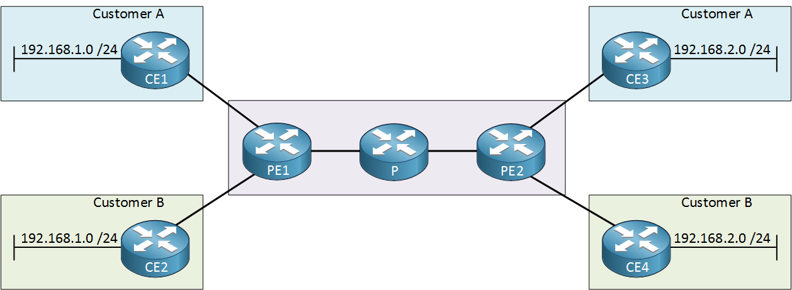{width=400px}

### Benefici

Un beneficio è la non necessità della cifratura, in quanto il traffico va sulla rete del service provider (di cui ti fidi) e dunque non passa da router di terze parti non affidabili.
 
- **Non ci sono vincoli sugli indirizzi** (si possono usare gli indirizzi privati) poiché non viene visto l’indirizzo sul backbone. Oltre all’indirizzo si specifica la VPN a cui appartengono (ed è il motivo per cui si usa BGP), vedi prossimo paragrafo.
- I _CE_ non scambiano direttamente informazioni tra loro.
- I customer non gestiscono l'infrastruttura (backbone).
- Il provider non ha un backbone virtuale per cliente.
- La VPN può passare tra provider diversi.
- La sicurezza si basa sulla fiducia verso il service provider.

### MPLS VPN basate su BGP

Le implementazioni di _MPLS VPN_ che utilizzano **BGP** hanno lo scambio di informazioni di routing tra gli edge. 

Compiono _Router FIltering_ ovvero ciascun PE determina quali route installare nella VRF.
Oltre all’indirizzo si specifica la VPN a cui appartengono (ed è il motivo per cui si usa BGP) tramite un estensione chiamata MP-BGP (Multi-Protocol GBP) poiché permette di trasportare informazioni su indirizzi che non sono solo indirizzi IP attraverso un campo address family (in un messaggio di annuncio GBP un router può annunciare destinazioni ipv4, ipv6 e perfino indirizzi mac, tutti questi tipi vengono chiamate address family).
Un esempio di tipo di address family è la VPN-IPv4 che oltre ad avere gli indirizzi IP da 32 bit vengono definiti anche i Route Distinguisher che permettono di distinguere annunci diversi anche se sono per lo stesso ip.

{width=300px}

### MPLS Virtual Router VPNS

Esiste un’altra soluzione senza l’uso di BGP per scambiare le informazioni di routing. 
I PE funzionano non come singolo router ma come tanti router diversi costruiti come macchine virtuali sui router originali PE.
Ogni router virtuale eseguirà indipendentemente le sue funzioni, come se fosse fisicamente un unico router utilizzando un protocollo di routing qualunque come ISIS. 
I router virtuali della stessa rete privata creano degli LSP tra loro e poi gli useranno per scambiarsi le informazioni. 

:::note
Vengono usate sempre 2 etichette, la differenza è che sui PE usiamo il protocollo che si vuole (non più BGP) ma abbiamo bisogno su ciascuno di un router virtuale per ciascuna rete collegata utilizzando molta memoria e cpu.
Le informazioni verranno comunicate solo ai router della stessa rete privata e non più a tutti.
:::

## IPv6 Over MPLS

Esistono una serie di soluzioni basate sulla VPN MPLS che vengono utilizzate per connettere non più reti aziendali ma reti IPv6 tra loro.
Questo permette di mantenere l'architettura dei router _P_ che continuano a basarsi su IPv4 per la creazione dei _LSP_.
Prima i nodi interni non potevano instaurare la connessione perchè le destinazioni non avevano ip duplicati, adesso invece il motivo è che non supportano direttamente IPv6.
Possibili soluzioni alla connessione di reti IPv6 sono:

### Soluzione con PWE3

Simile al PWE3 andando a creare tra i router _PE_ degli _LSP_ e poi usarli per far passare i dati come un filo virtuale configurandolo manualmente.

## 6PE

Soluzione automatica di livello 3 basata su VPN MPLS aggiungendo con un metodo dual stack il protocollo IPv6 ai router _PE_ per permettere la comunicazione con la rete IPv6 esterna.
Visto che i _PE_ sono dual stack IPv6 possono comunicare e scambiare informazioni di rooting con i router IPv6 esterni, apprendere dove sono le destinazioni, e instradare il traffico senza far capire ai rooter interni dove sono le destinazioni esterne alla rete MPLS.

:::note
RIASSUNTO
1- I router _P_ scambiano informazioni di routing sulla rete _MPLS_ usando IPv4 e facendo il binding di un'etichetta con ad esempio un meccanismo topology based ai vari _PE_
2- A questo punto tramite etichetta tutti i _PE_ sono collegati tra loro (l'etichetta viene usata dai _P_)
2- I _PE_ apprendono l'esistenza delle destinazioni iPv6 collegate e le condividono con gli altri _PE_ attraverso un messaggio BGP di tipo IPv4 
3- BGP è un pacchetto IPv4  
:::

//devo configurare anche i peer con il bgp
//lezione 6/12/2022