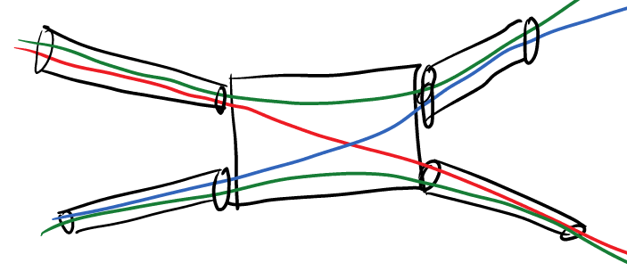
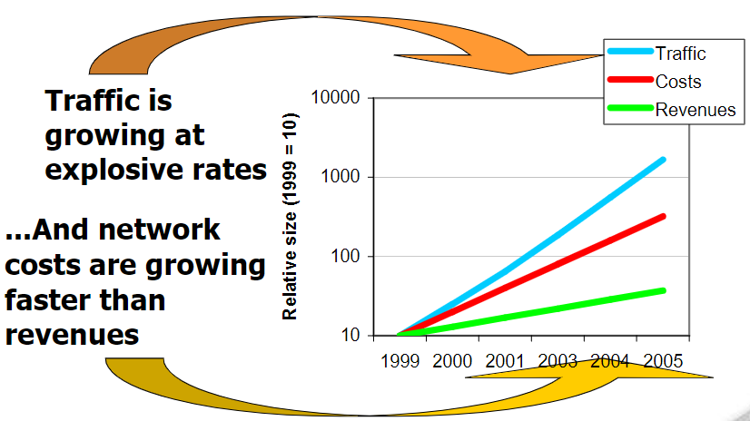
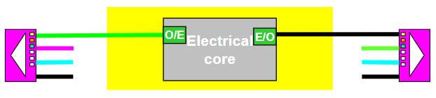
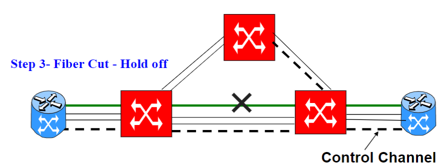
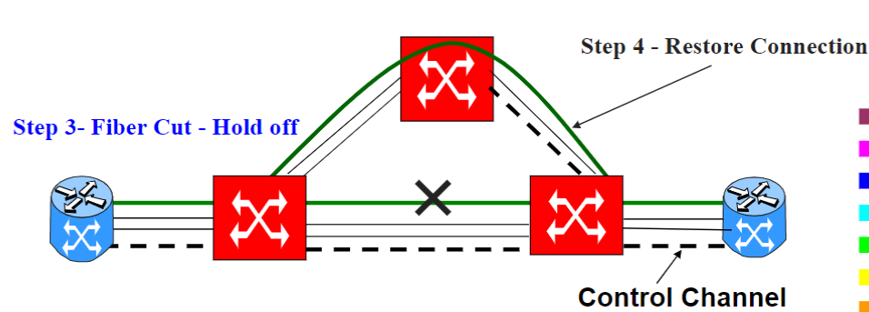

# Rete Ottica

Con rete ottica non si fa riferimento al trasferimento su un cavo di fibra ottica, ma bensì alla **comunicazione ottica**.

Il concetto principale dietro alle reti ottiche è il **Wavelength Division Multiplexing** _(WDM)_, ovvero la possibilità di trasmissione di frequenze diverse sullo stesso mezzo. Si divide in due tipi:

- **DWDM**: _Dense WDM_, consente la trasmissione di decine o centinaia di segnali sulla stessa fibra, consentendo l'aumento della capacità sui cavi esistenti.
- **CWDM**: _Coarse WDM_, usa più finestre (frequenza diverse) per la trasmissione. Ha un minor numero di lunghezze d'onda, ma è più economico.

Inizialmente la ragione per cui è stato realizzato _WDM_ era per poter riutilizzare la stessa fibra. Solo successivamente  si  è  notato  che  avendo  tanti  segnali  ottici è possibile costruire un  commutatore  che riconosce  i  vari  canali  e  li  inoltra  su  diverse  fibre, ovvero un **wavelength switch** (commutatore ottico). L’idea alla base delle reti ottiche è di fare reti in cui i nodi sono collegati da fibre e sono in grado di **commutare canali ottici da una fibra di ingresso a una fibra di uscita**.

{width=400px}

Le  reti  ottiche  si  utilizzano  al  centro  delle  reti  in quanto consentono di  commutare  un  canale  ottico.  Inoltre, il commutatore ottico ha le potenzialità di essere **molto semplice**, infatti la tecnologia del DWDM ha permesso di abbassare i costi e di aumentare tanto le prestazioni.

{width=400px}

E' possibile aggiungere o rimuovere multiplexing, in particolare nelle topologie ad anello. In questo caso prendono il nome di _Optical Add-Drop Multiplexer_ (OADM), consentendo di inerire wavelengths nell'anello e di estrarle. Perlopiù sono configurazioni statiche o semipermanenti che  interconnettono le configurazioni _(Reconfigurable OADM)_.

<!-- 
## Storia

Nelle reti odierne il traffico sta crescendo rapidamente, ma è interesse dell'utente che il prezzo non aumenti nel tempo. DWDM è riuscito a soddisfare questo requisito e grazie alla commutazione ottica è stato possibile ottenere risultati ancora migliori.

{width=400px}
-->

## Switching Core

Esistono differenti tipologie di _Optical Switch_, che consentono differenti livelli di complessità e di flessibilità, che si differenziano in:

- ottici o elettronici
- cross connect o switch
- wavelength conversion

### Optical Core

Un **Optical Core** utilizza le proprietà fisiche di alcuni materiali per deflettere la luce da una fibra di ingresso verso una fibra di uscita.

Esistono più tipologie:

- **Tilting mirrors**: _Micro-Electro-Mechanical System_ (MEMS), sono apparati meccanici sensibili agli eventi esterni (ad esempio un treno in corsa che genera vibrazioni).
- **Superfici riflettenti olografiche**:  funzionano attraverso il voltaggio.
- **Materiali che cambiano le proprietà riflettenti** in base a calore, pressione e voltaggio/corrente.

Le proprietà dei componenti ottici sono le seguenti:

- _potenzialmente_ **poco costosi**, ma non ancora economici.
- **Bit rate e segnale indipendenti**, consentendo alta scalabilità e multi standard.
- **Basso consumo di energia**.

Gli aspetti invece negativi sono **alti prezzi** di produzione (attualmente) e un **alta attenuazione** in quanto non vi è rigenerazione del segnale.

:::note
I _MEMS_ sono quelli che hanno ottenuto più successo.
:::

### Electronic Core

Gli **Electronic Core** consentono dei prezzi più bassi rispetto ai _MEMS_. Converte un segnale ottico in uno elettrico verso un circuito elettronico. Quello che compie è ricevere dei bit ed effettuarne uno switch.

Purtroppo, si perde tutte le proprietà dei componenti ottici, in quanto **non si ha indipendenza** del bit rate rispetto al segnale, il consumo non è basso ed i costi sono più sostenuti (anche se, attualmente, più economici). Un grande vantaggio è un migliore rapporto complessità/costi rispetto al packet switching.

## Switching Dynamics

### Cross Connect

Solitamente vengono adoperati core ottici. Le configurazioni sono _fixed/statiche_, mediante un sistema/interfaccia di configurazione.

### Fiber Cross Connect

Nel **Fiber Cross Connect** tutti i segnali da una fibra di ingresso vengono mandati su una fibra di uscita. Vengono adoperati dei _micro-electro-mechanical system_ (MEMS) ma che richiedono molto tempo per essere riconfigurati.

A volte viene utilizzata un amplificatore ottico dopo e prima della commutazione (switching).

### Wavelength Cross Connect

Nel **Wavelength Cross Connect** uno o più wavelength vengono mandate da una fibra in input verso una fibra in output. E' presente un WDM de-multiplexer+MEMS a separare le differenti wavelength nello spazio (prism).

La rigenerazione del segnale potrebbe essere utilizzata prima e/o dopo la commutazione (switching), ad esempio la conversione **OEO** _(optical-electrical-optical)_ consente di rigenerare elettronicamente, anche se dipende dal bit rate.

## Wavelength Conversion

La **Wavelength conversion** è complessa, spesso realizzata mediante **EOE**, e richiede un **costo elevato**. Non è trasparente per i dati e non consente di scalare.

Dal punto di vista fisico si comporta come una _cassa di risonanza_ (?) mentre dal punto di vista tecnologico non è molto matura.

Non richiede la stessa _wavelength end-to-end_ e non è presente il _wavelength assignment problem_ ($N^2$).

## Combinazioni comuni

### Wavelength cross-connect con Wavelength Conversion

Nella **Wavelength cross-connect con Wavelength Conversion** si ha una o più lunghezze d'onda da una fibra di ingresso verso una o più uscite di fibra.

Potrebbe essere utilizzato un _electrical core_ in quanto il monitoraggio del segnale è più semplice. Il _forward error correction_ (FEC) del segnale e più semplice e consente di ridurre il rapporto di errore per bit _(BER, da bit error ratio)_.

Altrimenti è possibile utilizzare un _optical core_ con **OEO** _(optical-electrical-optical)_ per la conversione, consentendo anche la rigenerazione del segnale.

{width=400px}

### Dynamic Optical Switching

Nel **Dynamic Optical Switching**  può essere presente conversione di lunghezza d'onda, ed è possibile utilizzare un _optical core_ con _OEO_ per la rigenerazione e wavelength conversion oppure un _electrical core_ con _SONET/SDH_ con la possibilità di inserire multipli _OEO_ per la rigenerazione.

La configurazione dello switch cambia dinamicamente, in base ad alcuni criteri:

- configurazione
- ora del giorno
- segnalazione dell'end system
- per ogni pacchetto, nel optical packet switching e optical burst switching

Se viene utilizzato un core ottico, nel caso di wavelength conversion è presente anche rigenerazione mediante OEO. Invece nel caso in cui venga adoperato un core elettronico, si adopera SONET/SDH.

## Distribuzione

Le reti ottiche consentono di ottenere _provisioning_ e _protezione_ dai guasti per i lightpaths end-to-end, permettendo di trovare un percorso alternativo. Il client equipment (come i routers) eseguono il controllo del _provisioning_ sul piano ottico per i lightpath (signaling).

E' possibile ottenere una Distribuzione conveniente e flessibile delle reti.

{width=400px}

{width=400px}

## Control Plane

Quello di cui hanno bisogno gli _switch ottici_ sono:

- **Resource discovery**: sapere la topologia, quali sono gli access point e poter identificare i nodi, utilizzo delle risorse.
- **Gestione della connessione / signaling**: creazione dei lightpath, _lightpath take down_, _lightpath modification_.
- **Routing distribuito**.
- **Protezione e recupero** per reti magliate o ad anello.
- Stabilire un **servizio di protezione per le classi**.

Ciò che invece è necessario garantire agli utenti è:

- **resource discovery**: gli indirizzi degli utenti devono essere raggiungibili mediante una rete ottica.
- **gestire lightpath**: setup, take down, modification.
- **negoziare protection service classes**: protected, unprotected, best effort lightpath.

In definitiva, l'unica soluzione per l'Optical Network Control Plane è **MPλS**, Multi-Protocol Lambda Switching, mentre:

- OSPF, IS-IS, BG per il resource discovery
- RSVP/LDP per il signaling

:::note
tutti gli aspetti introdotti erano già stati presentati attraverso il protocollo _ATM_, ma il costo per la tecnologia era troppo elevato.
:::

## Routing

Nelle reti ottiche gli utenti sono i router, mediante modelli:

- Overlay: la rete ottica fornisce connettività attraverso i router, che vedono la rete come una _scatola nera_, a volte forniti con una informazione di reperibilità.
- Peer: i router e gli switch partecipano con gli stessi protocolli di routing. I router conoscono la topologia della rete ottica e possono scegliere dei path preferiti rispetto ad altri per raggiungere destinazioni specifiche.

## Data Transport and Protocol Stack

{width=400px}
