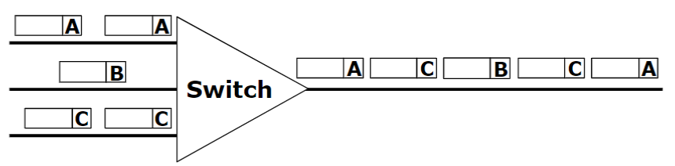
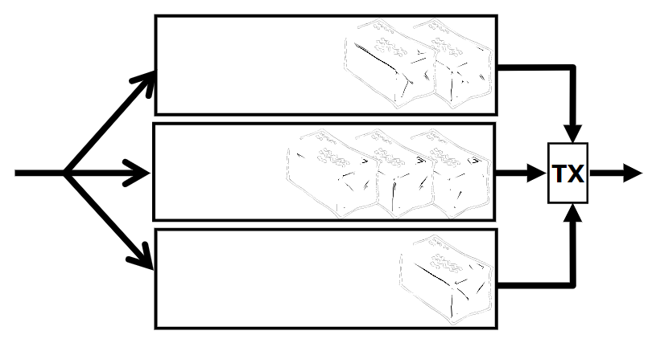
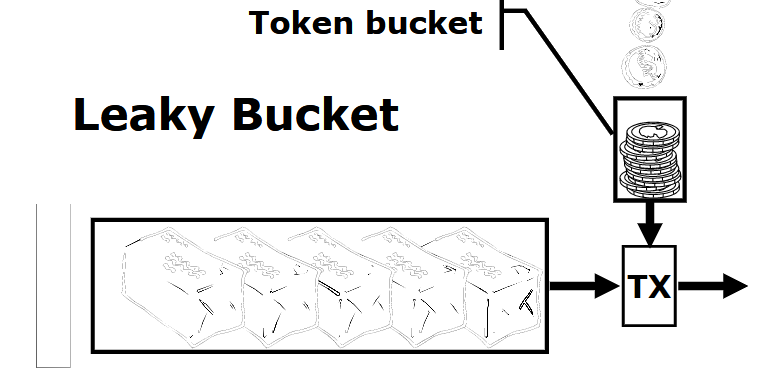

# Quality of Service

Le _applicazioni multimediali_ sono molto diverse da quelle tradizionali in quanto potrebbero necessitare di alcuni requisiti di _qualità del servizio_, come ad esempio la latenza, la banda o la perdita di pacchetti. In tali applicazioni il flusso di dati è continuo e il profilo generato deve essere lo stesso di quello ricevuto, in modo che il ricevitore possa riprodurre le informazioni che riceve e mostrarlo all'utente (senza temporizzazione o memorizzazione).

Per questo tipo di applicativi è dunque necessario parlare di **Quality of Service**, ovvero di un meccanismo in grado di garantire una certa qualità del servizio.

## Requisiti

I requisiti di rete per garantire il _Quality of Service_ sono i seguenti:

- **Streaming**, il flusso di dati deve essere continuo. E' concessa una tolleranza nella perdita del pacchetto, ma è necessario un ritardo che sia al più costante.
- **Interattività**, con una persona o un computer mediante un tempo di risposta basso (sotto i 100 / 150 ms per direzione).
- **Trasmissione su larga banda**: deve essere disponibile una quantità elevata di risorse, capacità elevata e molta memoria nei nodi.
- Comunicazioni di gruppo, ovvero la possibilità di gestire comunicazioni _molti a molti_.

Il vero problema che però deve essere risolto è il **ritardo**. Oltre ai tempi di elaborazione, ai nodi potrebbe esserci congestione, perciò se vi sono molti pacchetti che vogliono uscire tutti dallo stesso link questi non possono uscire  tutti  insieme,  ma  vengono  inseriti  in  un  buffer.  Ciò  comporta  che  i  pacchetti  attendono  e  questo  si trasforma in un ritardo variabile a seconda del carico del nodo.

:::danger
**Importante:** Il ritardo di attraversamento dei nodi dipende dal traffico istantaneo, non solo dalla quantità ma anche dalla tipologia del traffico.
:::

## Contromisure

Per riuscire a garantire la qualità del servizio sono necessarie molte risorse, una alta capacità trasmissiva, buffer più grandi nei nodi e infine capacità di commutazione (switching).

A livello di pacchetto è necessario applicare delle particolari _policy_ o _traffic shaping_ (tecnica di gestione della congestione), mentre a livello di flusso è necessario effettuare delle segnalazioni per riservare le risorse attraverso protocolli come **RSVP** _(**R**esource re**S**er**V**ation **P**rotocol)_ per _IP_ e _UNI_ _(User to Network Interface)_ per _ATM_.

Si vede necessario applicare a priori il _network engineering_, dimensionando la rete in accordo al traffico previsto e limitando il numero di utenti che possono accedere alla rete, e il _traffic engineering_ per controllare la distribuzione del traffico sulla rete. Tali azioni hanno natura preventiva per dimensionare il caso peggiore in base alle statistiche sul traffico degli utenti, dunque viene determinata la matrice del traffico in modo da distribuirlo. Lo stato della rete viene costantemente monitorato e, se necessario, ridimensionato.

Le contromisure che si possono realizzare nella rete sono le seguenti:

- **Classificazione del traffico**: si identificano i pacchetti che necessitano di _QoS_.
- **Algoritmi sofisticati di scheduling**: scegliere quali pacchetti prendere dal buffer per inviarli
all’esterno.
- **Controllare il traffico che entra nella rete**: se i pacchetti in arrivo sono molti, non è possibile fare altrimenti se non scartare dei pacchetti, e in tal caso non si può garantire _QoS_. Ciò può essere fatto a vari livelli, oppure effettuando un routing che tenga conto del _QoS_.

:::tip
**In altre parole**: è necessario limitare la quantità di pacchetti che arrivano ai nodi di rete e gestire in modo appropriato i pacchetti che hanno bisogno specifico di _QoS_.
:::

### Classificazione

Per effettuare la **classificazione** del traffico è necessario individuare univocamente i pacchetti che appartengono a una determinata comunicazione. Per farlo sono necessari i seguenti campi:

- IP sorgente
- IP destinazione
- protocollo di trasporto
- porta destinazione
- porta sorgente

Per riuscire a classificare tali pacchetti è dunque necessario un componente hardware denominato **ASIC** _(Application Specific Integrated Circuit)_ oppure le memorie **CAM** _(Content Addressable Memory)_ dove si può dare un indirizzo e invece di ricevere in risposta il contenuto di una cella si può dare una quintupla per avere indietro il tipo di QoS.

### Scheduling

Per effettuare lo scheduling è possibile in prima approssimazione utilizzare una coda _FIFO_, ma non risolve il problema in quanto l'ultimo pacchetto a uscire sarà sempre l'ultimo a essere entrato, senza imporre alcuna precedenza. Una alternativa è l'utilizzo del **multiplexing statistico**: i pacchetti vengono sequenziati sul link di uscita in modo casuale in base all'ordine di arrivo, ma anche in questo caso non siamo in grado di soddisfare tutte le richieste.

{width=400px}

Per garantire la _QoS_ è necessario analizzare tutti i pacchetti e inserirli in **code multiple** servite in base alla priorità utilizzando degli algoritmi di scheduling, come:

- _Priority Queuing_
- _Round Robing_
- _Class Based Queuing_ (CBQ)
- _Weighted Fair Queuing_ (WFQ): sapendo il tipo di traffico di ogni applicazione è possibile configurare i nodi in modo da rispettare i requisiti.
- _Deadline queuing_: è possibile impostare un deadline per ogni pacchetto, in modo da garantire che il pacchetto venga inviato entro un certo tempo.

{width=400px}

## Controllo del traffico

Al fine di garantire un _QoS_, è possibile definire un azione di _policy_ e _shaping_ per stabilire se il traffico in ingresso nella rete ha il profilo adatto per entrare. In particolare si può adottare la tecnica del **leaky bucket** che permette di controllare il flusso di ingresso.

{width=400px}

I pacchetti non conformi vengono rinviati, diminuiti di priorità (best effort) oppure scartati.

### Call Admission Control

La **Call Admission Control** _(CAC)_ consente di eseguire _signalling_ mediante la descrizione del traffico generare e del servizio richiesto ed effettua reservation.

## Routing

Le scelte di routing sono prese in base alla disponibilità delle risorse, dunque non solo sulle informazioni inerenti alla topologia.

E' presente instabilità in caso di trasferimento dati _connectionless_.

## Frameworks

Esistono due standard per supportare il QoS:

- **IntServ**
- **DiffServ**

### IntServ

**IntServ** garantisce il _QoS_, effettua la prenotazione delle risorse (RSVP) riuscendo a garantire QoS a ogni singolo flusso.

Ha come criticità la complessità e la bassa scalabilità (non utilizzabile su scala elevata). Per quanto lo standard sia pronto e implementato nei router, non viene utilizzato.

La soluzione è stata standardizzata in modo da consentire alle applicazioni di richiedere e ricevere dalla rete una qualità del servizio in accordo alle proprie esigenze.

### DiffServ

**DiffServ** non garantisce il QoS e non consente di riservare le risorse.

Distingue il traffico in classi diverse identificate dal campo _DS Field_.  Combinando  questa  differenziazione,  insieme  al  _network/traffic  engineering_  e  all’accesso controllato, è possibile limitare i pacchetti presenti nel buffer.

Purtroppo soffre di bassa efficienza (best effort), ma consente semplicità e scalabilità.

:::note
Nell'ultimo periodo è sempre più utilizzato.
:::
